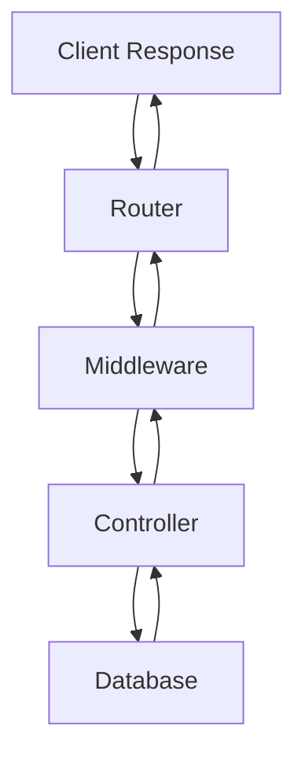

## 20.9 Server-Side Swift with Vapor Framework

Server-side Swift development is gaining traction, and the Vapor framework is at the forefront, offering a powerful toolset for building RESTful APIs and web applications. In this section, we will delve into the intricacies of using Vapor, from setting up routes and controllers to handling databases, authentication, and deploying applications. Let's embark on this journey to master server-side Swift with Vapor.

### Introduction to Vapor Framework

Vapor is a popular web framework for Swift, designed to be simple and expressive. It leverages Swift's performance and safety features, making it an excellent choice for server-side development. Vapor provides a comprehensive suite of tools to build web applications, including routing, middleware, templating, and database integration.

#### Why Choose Vapor?

- **Performance**: Swift's speed and efficiency make Vapor applications fast and responsive.
- **Safety**: Swift's strong type system and error handling enhance the reliability of Vapor applications.
- **Expressiveness**: Vapor's syntax is clean and intuitive, reducing boilerplate code.
- **Community**: A vibrant community supports Vapor, providing plugins, tutorials, and resources.

### Setting Up a Vapor Project

To get started with Vapor, ensure you have Swift installed on your system. You can create a new Vapor project using the Vapor toolbox, a command-line utility that simplifies project management.

```bash
brew install vapor
vapor new MyVaporApp
cd MyVaporApp
vapor build
vapor run
```

This sequence of commands installs Vapor, creates a new project, builds it, and runs the server. The default setup includes a basic directory structure with pre-configured routes and controllers.

### Building RESTful APIs

RESTful APIs are a cornerstone of modern web applications, enabling communication between clients and servers. Vapor simplifies the creation of RESTful endpoints with its routing system.

#### Setting Up Routes

Routes in Vapor define how HTTP requests are handled. You can create routes for different HTTP methods (GET, POST, PUT, DELETE) and bind them to specific paths.

```swift
import Vapor

func routes(_ app: Application) throws {
    app.get("hello") { req in
        return "Hello, world!"
    }

    app.post("user") { req -> String in
        let user = try req.content.decode(User.self)
        return "User \\(user.name) created!"
    }
}
```

In this example, we define a GET route that returns a simple string and a POST route that decodes a `User` object from the request body.

#### Controllers and Models

Controllers in Vapor organize route logic, making your codebase more maintainable. Models represent data structures, often corresponding to database tables.

```swift
import Vapor

final class UserController: RouteCollection {
    func boot(routes: RoutesBuilder) throws {
        let users = routes.grouped("users")
        users.get(use: index)
        users.post(use: create)
    }

    func index(req: Request) throws -> EventLoopFuture<[User]> {
        return User.query(on: req.db).all()
    }

    func create(req: Request) throws -> EventLoopFuture<User> {
        let user = try req.content.decode(User.self)
        return user.save(on: req.db).map { user }
    }
}

struct User: Model, Content {
    static let schema = "users"
    @ID(key: .id) var id: UUID?
    @Field(key: "name") var name: String
}
```

This code defines a `UserController` with routes for listing and creating users. The `User` model conforms to Vapor's `Model` and `Content` protocols, facilitating database interactions and JSON encoding/decoding.

### Working with Databases and ORM

Vapor supports various databases through Fluent, its ORM (Object-Relational Mapping) system. Fluent provides a Swift-friendly API for database operations, abstracting away SQL details.

#### Database Configuration

To configure a database, update your `configure.swift` file with the appropriate settings.

```swift
app.databases.use(.postgres(
    hostname: "localhost",
    username: "vapor",
    password: "password",
    database: "vapor_database"
), as: .psql)
```

This example configures a PostgreSQL database connection. Vapor also supports MySQL, SQLite, and other databases.

#### Migrations

Migrations in Vapor manage database schema changes, ensuring consistency across environments.

```swift
struct CreateUser: Migration {
    func prepare(on database: Database) -> EventLoopFuture<Void> {
        return database.schema("users")
            .id()
            .field("name", .string, .required)
            .create()
    }

    func revert(on database: Database) -> EventLoopFuture<Void> {
        return database.schema("users").delete()
    }
}

app.migrations.add(CreateUser())
```

Run migrations using the command:

```bash
vapor run migrate
```

This command applies pending migrations, updating the database schema.

### Handling Authentication and Middleware

Security is paramount in web applications. Vapor provides robust tools for authentication and middleware to protect your endpoints.

#### Authentication

Vapor supports various authentication methods, including basic, bearer, and JWT (JSON Web Tokens).

```swift
import Vapor
import Fluent

final class User: Model, Content {
    static let schema = "users"
    @ID(key: .id) var id: UUID?
    @Field(key: "name") var name: String
    @Field(key: "passwordHash") var passwordHash: String

    init() {}

    init(id: UUID? = nil, name: String, passwordHash: String) {
        self.id = id
        self.name = name
        self.passwordHash = passwordHash
    }
}

extension User: ModelAuthenticatable {
    static let usernameKey = \User.$name
    static let passwordHashKey = \User.$passwordHash

    func verify(password: String) throws -> Bool {
        return try Bcrypt.verify(password, created: self.passwordHash)
    }
}
```

In this example, we define a `User` model that conforms to `ModelAuthenticatable`, enabling password-based authentication.

#### Middleware

Middleware in Vapor allows you to process requests and responses, adding functionality such as logging, error handling, and security.

```swift
final class AuthMiddleware: Middleware {
    func respond(to request: Request, chainingTo next: Responder) -> EventLoopFuture<Response> {
        guard request.headers.bearerAuthorization != nil else {
            return request.eventLoop.makeFailedFuture(Abort(.unauthorized))
        }
        return next.respond(to: request)
    }
}

app.middleware.use(AuthMiddleware())
```

This `AuthMiddleware` checks for a bearer token in the request headers, denying access if it's missing.

### Deploying Server-Side Swift Applications

Deploying Vapor applications involves configuring a production environment and ensuring scalability and reliability. Common deployment platforms include Heroku, AWS, and DigitalOcean.

#### Deployment Steps

1. **Build for Production**: Compile your Vapor application with optimizations.
   ```bash
   swift build -c release
   ```

2. **Configure Environment Variables**: Set environment variables for database connections, API keys, etc.

3. **Select a Hosting Provider**: Choose a platform that supports Swift and configure your server.

4. **Deploy the Application**: Upload your compiled binary and start the server.

5. **Monitor and Scale**: Use monitoring tools to track performance and scale resources as needed.

### Visualizing the Vapor Architecture

Below is a diagram illustrating the high-level architecture of a Vapor application, showcasing the flow of requests through routes, controllers, middleware, and database interactions.



This diagram highlights how Vapor processes a client request, passing it through middleware and controllers before interacting with the database and returning a response.

### Try It Yourself

Experiment with the provided code examples by:

- Adding new routes and controllers to handle different types of requests.
- Integrating a new database and implementing migrations.
- Creating custom middleware for logging or error handling.
- Deploying your application to a cloud platform and testing its performance.

### Knowledge Check

- **What are the key components of a Vapor application?**
- **How do you configure a database in Vapor?**
- **What is the purpose of middleware in Vapor?**
- **Describe the process of deploying a Vapor application.**

### Conclusion

Mastering server-side Swift with the Vapor framework opens up new possibilities for building efficient, scalable web applications. By understanding routes, controllers, models, authentication, and deployment, you can create robust applications that leverage the power of Swift. Remember, this is just the beginning. As you progress, you'll build more complex and interactive applications. Keep experimenting, stay curious, and enjoy the journey!

## Quiz Time!



### What is Vapor primarily used for in Swift development?

- [x] Building server-side applications and RESTful APIs
- [ ] Creating iOS applications
- [ ] Designing user interfaces
- [ ] Developing machine learning models

> **Explanation:** Vapor is a framework for building server-side applications and RESTful APIs in Swift.

### Which command is used to create a new Vapor project?

- [x] vapor new MyVaporApp
- [ ] swift create MyVaporApp
- [ ] vapor init MyVaporApp
- [ ] swift new MyVaporApp

> **Explanation:** The `vapor new MyVaporApp` command initializes a new Vapor project.

### What is the role of middleware in a Vapor application?

- [x] To process requests and responses, adding functionality like logging and security
- [ ] To handle database migrations
- [ ] To manage user authentication
- [ ] To define routes for the application

> **Explanation:** Middleware processes requests and responses, adding functionality such as logging, error handling, and security.

### How do you configure a PostgreSQL database in a Vapor application?

- [x] By using `app.databases.use(.postgres(...), as: .psql)`
- [ ] By editing the `DatabaseConfig.swift` file
- [ ] By setting environment variables
- [ ] By using `app.database.configure(...)`

> **Explanation:** You configure a PostgreSQL database in Vapor using `app.databases.use(.postgres(...), as: .psql)`.

### Which protocol must a model conform to for database interactions in Vapor?

- [x] Model
- [ ] Codable
- [ ] Content
- [ ] Authenticatable

> **Explanation:** A model must conform to the `Model` protocol for database interactions in Vapor.

### What is the purpose of the `vapor run migrate` command?

- [x] To apply pending migrations and update the database schema
- [ ] To compile the Vapor application
- [ ] To start the Vapor server
- [ ] To create a new Vapor project

> **Explanation:** The `vapor run migrate` command applies pending migrations, updating the database schema.

### What does the `ModelAuthenticatable` protocol enable in Vapor?

- [x] Password-based authentication
- [ ] JSON encoding and decoding
- [ ] Route handling
- [ ] Middleware processing

> **Explanation:** The `ModelAuthenticatable` protocol enables password-based authentication in Vapor.

### Which of the following is a common deployment platform for Vapor applications?

- [x] Heroku
- [ ] Xcode
- [ ] Swift Playgrounds
- [ ] Firebase

> **Explanation:** Heroku is a common platform for deploying Vapor applications.

### What is the primary benefit of using Fluent in Vapor?

- [x] It provides a Swift-friendly API for database operations
- [ ] It simplifies user authentication
- [ ] It enhances the performance of the application
- [ ] It manages server configurations

> **Explanation:** Fluent provides a Swift-friendly API for database operations, abstracting away SQL details.

### True or False: Vapor supports only PostgreSQL as a database.

- [ ] True
- [x] False

> **Explanation:** False. Vapor supports multiple databases, including PostgreSQL, MySQL, and SQLite.




