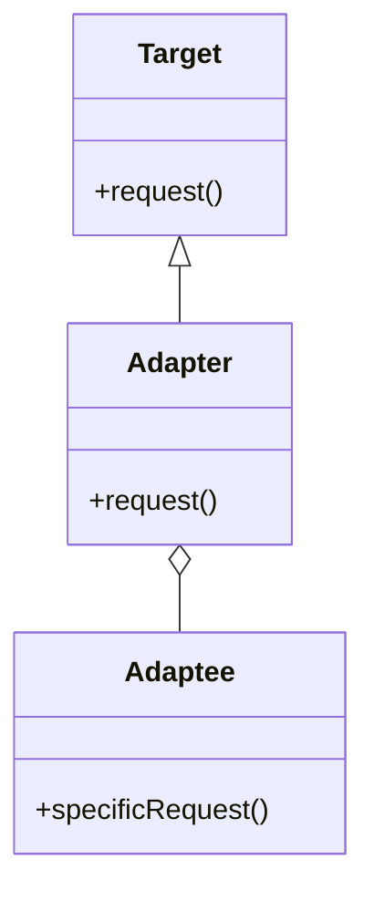

## 21.1 Recap of Key Concepts and Patterns

In this section, we will revisit the key concepts and design patterns that have been discussed throughout this guide. Design patterns are essential tools in the software development process, providing tried-and-tested solutions to common problems. By understanding and applying these patterns, developers can create more efficient, scalable, and maintainable applications in Swift. Let's delve into the core principles and patterns that form the backbone of robust Swift development.

### Understanding Design Patterns in Swift

Design patterns are reusable solutions to common software design problems. They provide a template for how to solve a problem in various contexts, allowing developers to leverage proven strategies rather than reinventing the wheel. In Swift, design patterns help manage complexity, enhance code readability, and facilitate collaboration among development teams.

#### Types of Design Patterns

Design patterns are generally categorized into three main types:

1. **Creational Patterns**: Focus on object creation mechanisms, optimizing the instantiation process.
2. **Structural Patterns**: Concerned with object composition, defining how classes and objects can be combined to form larger structures.
3. **Behavioral Patterns**: Address communication between objects, focusing on the interaction and responsibility distribution.

### Creational Design Patterns

Creational patterns in Swift help manage the complexity of object creation. They provide various ways to instantiate objects, ensuring that the system remains flexible and scalable.

#### Singleton Pattern

**Intent**: Ensure a class has only one instance and provide a global point of access to it.

**Applicability**: Use when exactly one instance of a class is needed, such as managing shared resources like a database connection.

**Swift Example**:

```swift
class Logger {
    static let shared = Logger()
    
    private init() {}
    
    func log(message: String) {
        print("Log: \\(message)")
    }
}

// Usage
Logger.shared.log(message: "Singleton pattern in action!")
```

**Design Considerations**: Be cautious of overusing singletons as they can lead to hidden dependencies and testing difficulties.

#### Factory Method Pattern

**Intent**: Define an interface for creating an object but let subclasses alter the type of objects that will be created.

**Applicability**: Use when a class cannot anticipate the class of objects it must create.

**Swift Example**:

```swift
protocol Product {
    func use()
}

class ConcreteProductA: Product {
    func use() {
        print("Using Product A")
    }
}

class ConcreteProductB: Product {
    func use() {
        print("Using Product B")
    }
}

class Factory {
    static func createProduct(type: String) -> Product {
        switch type {
        case "A":
            return ConcreteProductA()
        case "B":
            return ConcreteProductB()
        default:
            fatalError("Unknown product type")
        }
    }
}

// Usage
let product = Factory.createProduct(type: "A")
product.use()
```

**Design Considerations**: The factory method pattern promotes loose coupling by eliminating the need to bind application-specific classes into your code.

### Structural Design Patterns

Structural patterns facilitate the design of flexible and efficient class structures by defining relationships between objects.

#### Adapter Pattern

**Intent**: Convert the interface of a class into another interface clients expect, allowing incompatible interfaces to work together.

**Applicability**: Use when you want to use an existing class, and its interface does not match the one you need.

**Swift Example**:

```swift
protocol Target {
    func request()
}

class Adaptee {
    func specificRequest() {
        print("Specific request")
    }
}

class Adapter: Target {
    private let adaptee: Adaptee
    
    init(adaptee: Adaptee) {
        self.adaptee = adaptee
    }
    
    func request() {
        adaptee.specificRequest()
    }
}

// Usage
let adaptee = Adaptee()
let adapter = Adapter(adaptee: adaptee)
adapter.request()
```

**Design Considerations**: The adapter pattern is particularly useful when integrating new components into an existing system.

#### Composite Pattern

**Intent**: Compose objects into tree structures to represent part-whole hierarchies.

**Applicability**: Use when you want to represent part-whole hierarchies of objects.

**Swift Example**:

```swift
protocol Component {
    func operation()
}

class Leaf: Component {
    func operation() {
        print("Leaf operation")
    }
}

class Composite: Component {
    private var children = [Component]()
    
    func add(component: Component) {
        children.append(component)
    }
    
    func operation() {
        for child in children {
            child.operation()
        }
    }
}

// Usage
let leaf1 = Leaf()
let leaf2 = Leaf()
let composite = Composite()
composite.add(component: leaf1)
composite.add(component: leaf2)
composite.operation()
```

**Design Considerations**: The composite pattern simplifies client code by allowing clients to treat individual objects and compositions uniformly.

### Behavioral Design Patterns

Behavioral patterns focus on communication between objects, defining how they interact and fulfill responsibilities.

#### Observer Pattern

**Intent**: Define a one-to-many dependency between objects so that when one object changes state, all its dependents are notified and updated automatically.

**Applicability**: Use when a change to one object requires changing others, and you don't know how many objects need to be changed.

**Swift Example**:

```swift
protocol Observer: AnyObject {
    func update(subject: Subject)
}

class Subject {
    private var observers = [Observer]()
    
    func attach(observer: Observer) {
        observers.append(observer)
    }
    
    func notify() {
        for observer in observers {
            observer.update(subject: self)
        }
    }
    
    func changeState() {
        // Change state logic
        notify()
    }
}

class ConcreteObserver: Observer {
    func update(subject: Subject) {
        print("Observer notified of change")
    }
}

// Usage
let subject = Subject()
let observer = ConcreteObserver()
subject.attach(observer: observer)
subject.changeState()
```

**Design Considerations**: The observer pattern is useful for implementing distributed event-handling systems.

#### Strategy Pattern

**Intent**: Define a family of algorithms, encapsulate each one, and make them interchangeable.

**Applicability**: Use when you need to use different variants of an algorithm within an object.

**Swift Example**:

```swift
protocol Strategy {
    func execute()
}

class ConcreteStrategyA: Strategy {
    func execute() {
        print("Executing strategy A")
    }
}

class ConcreteStrategyB: Strategy {
    func execute() {
        print("Executing strategy B")
    }
}

class Context {
    private var strategy: Strategy
    
    init(strategy: Strategy) {
        self.strategy = strategy
    }
    
    func executeStrategy() {
        strategy.execute()
    }
}

// Usage
let strategyA = ConcreteStrategyA()
let context = Context(strategy: strategyA)
context.executeStrategy()
```

**Design Considerations**: The strategy pattern is beneficial when you want to define a class that will have one behavior that is similar to other behaviors in a list.

### Architectural Patterns

Architectural patterns provide solutions for organizing the structure of an entire software system.

#### MVC (Model-View-Controller)

**Intent**: Separate an application into three main components: Model, View, and Controller.

**Applicability**: Use when you want to separate internal representations of information from the ways that information is presented and accepted by the user.

**Swift Example**:

```swift
class Model {
    var data: String = "Model data"
}

class View {
    func display(data: String) {
        print("Displaying: \\(data)")
    }
}

class Controller {
    private var model: Model
    private var view: View
    
    init(model: Model, view: View) {
        self.model = model
        self.view = view
    }
    
    func updateView() {
        view.display(data: model.data)
    }
}

// Usage
let model = Model()
let view = View()
let controller = Controller(model: model, view: view)
controller.updateView()
```

**Design Considerations**: MVC is widely used in iOS development to separate concerns and improve code maintainability.

### Swift-Specific Features and Best Practices

Swift offers unique features that enhance the implementation of design patterns. Understanding these features is crucial for mastering Swift development.

#### Protocol-Oriented Programming

Swift's emphasis on protocol-oriented programming (POP) allows developers to define blueprints for methods, properties, and other requirements. POP encourages the use of protocols and protocol extensions, promoting code reuse and flexibility.

**Swift Example**:

```swift
protocol Describable {
    func describe() -> String
}

extension Describable {
    func describe() -> String {
        return "This is a describable object."
    }
}

struct Item: Describable {}

let item = Item()
print(item.describe())
```

**Design Considerations**: POP is ideal for defining shared behavior across different types without the constraints of class inheritance.

#### Value Types vs. Reference Types

Swift differentiates between value types (structs, enums) and reference types (classes). Value types are copied when assigned to a new variable, while reference types are shared.

**Swift Example**:

```swift
struct Point {
    var x: Int
    var y: Int
}

var pointA = Point(x: 0, y: 0)
var pointB = pointA
pointB.x = 10

print(pointA.x) // Output: 0
print(pointB.x) // Output: 10
```

**Design Considerations**: Use value types for simple data structures that do not require inheritance, and reference types when identity and shared state are important.

### Reflecting on the Application of Patterns

Design patterns are not one-size-fits-all solutions. Their effectiveness depends on the context in which they are applied. It's essential to understand the problem at hand and choose the appropriate pattern that aligns with the application's architecture and goals.

#### Common Development Challenges Solved by Patterns

- **Scalability**: Patterns like Singleton and Factory Method help manage resource allocation and object creation, making applications more scalable.
- **Maintainability**: Structural patterns such as Composite and Decorator enhance code organization, making it easier to maintain and extend.
- **Flexibility**: Behavioral patterns like Strategy and Observer provide flexibility in handling algorithm variations and event-driven systems.

### Emphasizing Context in Applying Patterns

The key to successful design pattern application lies in understanding the specific needs and constraints of your project. Patterns should be used judiciously, considering factors such as performance, complexity, and future scalability.

### Visualizing Design Patterns

To better understand the relationships and interactions between different components in design patterns, let's use a class diagram to illustrate the Adapter Pattern:



**Diagram Explanation**: The diagram shows how the `Adapter` class implements the `Target` interface and uses an instance of `Adaptee` to fulfill the `request()` method.

### Try It Yourself

Experiment with the provided code examples by modifying them to suit different scenarios. For instance, try creating additional strategies in the Strategy Pattern example or extend the Observer Pattern to handle more complex state changes.

### Knowledge Check

Reflect on your understanding of the design patterns covered:

- Can you identify the appropriate pattern for a given problem?
- How do different patterns interact within a larger system architecture?
- What are the trade-offs involved in using a particular pattern?

### Conclusion

Mastering design patterns in Swift is a journey that enhances your ability to build robust, scalable, and maintainable applications. Remember, the goal is not to use every pattern but to understand when and how to apply them effectively. Keep experimenting, stay curious, and enjoy the journey of becoming a more proficient Swift developer.

## Quiz Time!



### Which design pattern ensures a class has only one instance and provides a global point of access?

- [x] Singleton
- [ ] Factory Method
- [ ] Observer
- [ ] Adapter

> **Explanation:** The Singleton pattern ensures a class has only one instance and provides a global point of access to it.

### What type of design pattern focuses on object creation mechanisms?

- [x] Creational
- [ ] Structural
- [ ] Behavioral
- [ ] Architectural

> **Explanation:** Creational patterns focus on object creation mechanisms, optimizing the instantiation process.

### Which pattern is used to convert the interface of a class into another interface clients expect?

- [ ] Singleton
- [ ] Factory Method
- [ ] Observer
- [x] Adapter

> **Explanation:** The Adapter pattern converts the interface of a class into another interface clients expect, allowing incompatible interfaces to work together.

### In the context of Swift, what is the emphasis of protocol-oriented programming?

- [ ] Class inheritance
- [x] Protocols and protocol extensions
- [ ] Object-oriented design
- [ ] Functional programming

> **Explanation:** Protocol-oriented programming in Swift emphasizes the use of protocols and protocol extensions, promoting code reuse and flexibility.

### Which pattern is beneficial when you want to define a class with one behavior similar to other behaviors in a list?

- [ ] Observer
- [x] Strategy
- [ ] Composite
- [ ] Factory Method

> **Explanation:** The Strategy pattern is beneficial when you want to define a class that will have one behavior that is similar to other behaviors in a list.

### What is the main advantage of using the Composite pattern?

- [ ] Simplifies object creation
- [x] Simplifies client code by allowing clients to treat individual objects and compositions uniformly
- [ ] Enhances communication between objects
- [ ] Provides a global point of access to an object

> **Explanation:** The Composite pattern simplifies client code by allowing clients to treat individual objects and compositions uniformly.

### Which pattern is useful for implementing distributed event-handling systems?

- [ ] Singleton
- [ ] Factory Method
- [x] Observer
- [ ] Adapter

> **Explanation:** The Observer pattern is useful for implementing distributed event-handling systems.

### What does the Factory Method pattern promote by eliminating the need to bind application-specific classes into your code?

- [ ] Tight coupling
- [x] Loose coupling
- [ ] High cohesion
- [ ] Code redundancy

> **Explanation:** The Factory Method pattern promotes loose coupling by eliminating the need to bind application-specific classes into your code.

### True or False: Value types in Swift are shared when assigned to a new variable.

- [ ] True
- [x] False

> **Explanation:** False. In Swift, value types are copied when assigned to a new variable, whereas reference types are shared.

### Which architectural pattern separates an application into Model, View, and Controller components?

- [x] MVC
- [ ] MVVM
- [ ] VIPER
- [ ] Singleton

> **Explanation:** The MVC (Model-View-Controller) pattern separates an application into Model, View, and Controller components, enhancing separation of concerns.




