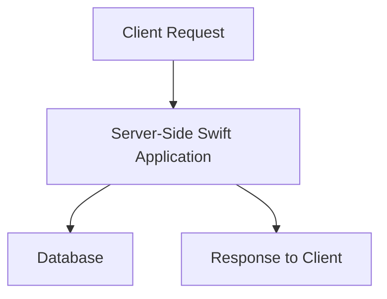
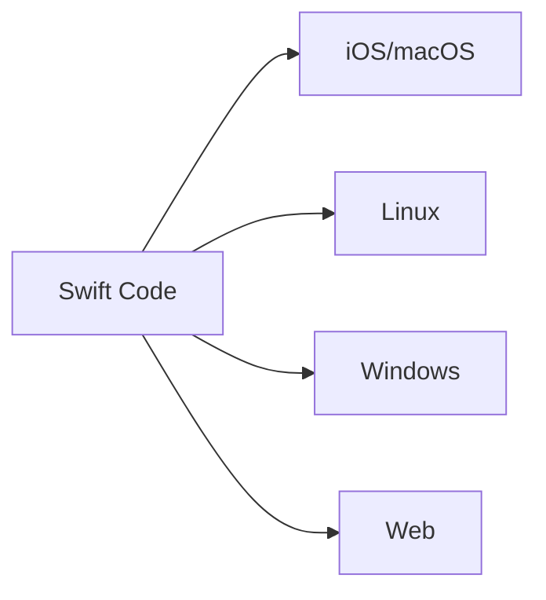
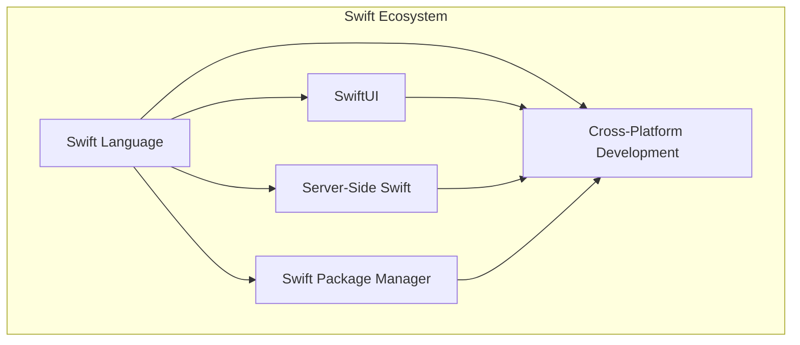

## 21.2 The Future of Swift: Emerging Trends and Innovations

As we look towards the future of Swift, it's evident that this powerful language continues to evolve, shaping the landscape of software development. Swift's journey, from its inception to becoming a dominant force in iOS and macOS development, is marked by constant innovation and adaptation. In this section, we'll explore anticipated features in upcoming Swift versions, examine trends such as server-side Swift and SwiftUI, and discuss the impact of Swift on cross-platform development. 

### Anticipated Features in Upcoming Swift Versions

Swift is renowned for its rapid evolution, with each new version bringing enhancements that empower developers to write more efficient and expressive code. Let's delve into some of the anticipated features that are expected to shape the future of Swift.

#### 1. Enhanced Concurrency Model

Concurrency has been a focal point in recent Swift updates, with the introduction of async/await and actors. The future promises further refinements, making concurrency even more intuitive and powerful. By enhancing the concurrency model, Swift aims to simplify the development of responsive and efficient applications.

**Code Example:**

```swift
// Example of using async/await in Swift
func fetchData() async throws -> Data {
    let url = URL(string: "https://example.com/data")!
    let (data, _) = try await URLSession.shared.data(from: url)
    return data
}

Task {
    do {
        let data = try await fetchData()
        print("Data fetched successfully: \\(data)")
    } catch {
        print("Error fetching data: \\(error)")
    }
}
```

This code snippet demonstrates the use of async/await for handling asynchronous tasks, showcasing Swift's commitment to simplifying concurrency.

#### 2. Improved Swift Package Manager

The Swift Package Manager (SPM) is set to receive enhancements that will streamline dependency management and project configuration. Expect more robust support for binary dependencies, improved integration with Xcode, and better tooling for managing complex projects.

#### 3. Advanced Pattern Matching

Pattern matching is a powerful feature in Swift, and future versions are likely to expand its capabilities. This includes more expressive syntax for matching complex data structures and conditions, allowing developers to write cleaner and more concise code.

**Code Example:**

```swift
// Advanced pattern matching in Swift
enum Vehicle {
    case car(make: String, model: String)
    case bike(brand: String)
}

let myVehicle = Vehicle.car(make: "Tesla", model: "Model S")

switch myVehicle {
case .car(let make, let model) where make == "Tesla":
    print("It's a Tesla Model \\(model)!")
case .bike(let brand):
    print("It's a bike from \\(brand).")
default:
    print("Unknown vehicle.")
}
```

This example highlights the potential for more nuanced pattern matching, allowing for specific conditions within case statements.

#### 4. Enhanced Type System

Swift's type system is already robust, but future iterations are expected to introduce more sophisticated type inference and checking. This will enable developers to write safer code with even fewer explicit type annotations, reducing boilerplate and improving readability.

### Trends in Swift Development

Swift's ecosystem is expanding beyond its traditional domains, with several trends gaining momentum. Let's explore some of the key trends in Swift development.

#### 1. Server-Side Swift

Server-side Swift is gaining traction as developers recognize its potential for building high-performance, scalable web applications. Frameworks like Vapor and Kitura are leading the charge, providing robust tools for server-side development.

**Mermaid Diagram:**



*Diagram: A typical server-side Swift application workflow.*

Server-side Swift offers several advantages, including seamless integration with existing Swift codebases, high performance due to Swift's speed, and a growing community of developers contributing to its ecosystem.

#### 2. SwiftUI: The Future of UI Development

SwiftUI represents a paradigm shift in how developers build user interfaces. Its declarative syntax and seamless integration with Swift make it a powerful tool for creating dynamic, responsive UIs.

**Code Example:**

```swift
import SwiftUI

struct ContentView: View {
    @State private var isOn = false

    var body: some View {
        VStack {
            Toggle("Enable Feature", isOn: $isOn)
                .padding()
            if isOn {
                Text("Feature Enabled")
                    .font(.headline)
                    .foregroundColor(.green)
            } else {
                Text("Feature Disabled")
                    .font(.headline)
                    .foregroundColor(.red)
            }
        }
    }
}

struct ContentView_Previews: PreviewProvider {
    static var previews: some View {
        ContentView()
    }
}
```

This SwiftUI example illustrates how easy it is to create interactive UIs with minimal code, leveraging Swift's powerful features.

#### 3. Cross-Platform Development with Swift

Swift's potential for cross-platform development is being realized through initiatives like Swift for TensorFlow and Swift on Windows. These efforts aim to make Swift a versatile language that can be used across diverse platforms.

**Mermaid Diagram:**



*Diagram: Swift's cross-platform capabilities.*

By enabling Swift to run on various platforms, developers can leverage a single codebase to target multiple environments, reducing development time and effort.

### The Impact of Swift on Cross-Platform Development

Swift's influence extends beyond its traditional domains, impacting cross-platform development in significant ways.

#### 1. Unified Codebase

Swift's cross-platform capabilities allow developers to maintain a unified codebase, reducing duplication and ensuring consistency across different platforms. This is particularly beneficial for teams working on large-scale projects with diverse target environments.

#### 2. Performance and Efficiency

Swift's performance is a key advantage in cross-platform development. Its speed and efficiency make it an ideal choice for high-performance applications, whether on mobile, desktop, or server environments.

#### 3. Community and Ecosystem

The Swift community is vibrant and growing, contributing to a rich ecosystem of libraries, tools, and frameworks. This collaborative environment fosters innovation and ensures that Swift remains at the forefront of modern development practices.

### Visualizing Swift's Future

To better understand Swift's trajectory, let's visualize some of the key components and interactions within its ecosystem.

**Mermaid Diagram:**



*Diagram: The interconnected components of the Swift ecosystem.*

This diagram illustrates how different aspects of Swift development are interconnected, highlighting the language's versatility and potential for future growth.

### Conclusion: Embracing the Future of Swift

As we look to the future, it's clear that Swift is poised to continue its evolution, driven by innovation and a passionate community. By embracing emerging trends and anticipated features, developers can harness Swift's full potential, creating robust, scalable applications across diverse platforms.

Remember, this is just the beginning. As you continue your journey with Swift, stay curious, keep experimenting, and engage with the community. The future of Swift is bright, and your contributions will help shape its path.

## Quiz Time!



### What is a key advantage of Swift's enhanced concurrency model?

- [x] Simplifies the development of responsive applications
- [ ] Increases the complexity of code
- [ ] Reduces performance
- [ ] Limits the use of async/await

> **Explanation:** Swift's enhanced concurrency model aims to simplify the development of responsive and efficient applications by providing intuitive constructs like async/await.

### Which framework is leading the charge in server-side Swift development?

- [x] Vapor
- [ ] UIKit
- [ ] SwiftUI
- [ ] CoreData

> **Explanation:** Vapor is one of the leading frameworks for server-side Swift development, providing robust tools for building web applications.

### What is a benefit of using SwiftUI for UI development?

- [x] Declarative syntax for creating dynamic UIs
- [ ] Requires more code than UIKit
- [ ] Incompatible with Swift
- [ ] Limited to macOS only

> **Explanation:** SwiftUI offers a declarative syntax that simplifies the creation of dynamic and responsive user interfaces, making it a powerful tool for UI development.

### How does Swift impact cross-platform development?

- [x] Allows for a unified codebase across platforms
- [ ] Increases development time
- [ ] Restricts to iOS only
- [ ] Reduces performance on non-Apple platforms

> **Explanation:** Swift's cross-platform capabilities enable developers to maintain a unified codebase, reducing duplication and ensuring consistency across platforms.

### What is the role of the Swift Package Manager?

- [x] Manages dependencies and project configuration
- [ ] Compiles Swift code
- [ ] Provides a UI framework
- [ ] Handles network requests

> **Explanation:** The Swift Package Manager (SPM) is a tool for managing dependencies and project configuration, streamlining the development process.

### What is a trend in Swift development?

- [x] Server-side Swift
- [ ] Decreasing use of SwiftUI
- [ ] Elimination of async/await
- [ ] Limited to iOS development

> **Explanation:** Server-side Swift is a growing trend, with frameworks like Vapor enabling the development of high-performance web applications.

### What does advanced pattern matching in Swift allow?

- [x] More expressive syntax for matching complex data structures
- [ ] Simplified error handling
- [ ] Limited to integer types
- [ ] Reduces code readability

> **Explanation:** Advanced pattern matching in Swift allows for more expressive syntax, enabling developers to match complex data structures and conditions.

### What is an anticipated feature in upcoming Swift versions?

- [x] Enhanced type system
- [ ] Removal of generics
- [ ] Limited concurrency support
- [ ] Deprecated SwiftUI

> **Explanation:** Future Swift versions are expected to introduce enhancements to the type system, improving type inference and checking.

### What is a benefit of Swift's performance in cross-platform development?

- [x] Ideal for high-performance applications
- [ ] Slows down mobile applications
- [ ] Requires more memory
- [ ] Limited to server-side applications

> **Explanation:** Swift's performance and efficiency make it ideal for high-performance applications across various platforms, including mobile, desktop, and server environments.

### True or False: Swift's community is stagnant and not growing.

- [ ] True
- [x] False

> **Explanation:** The Swift community is vibrant and growing, contributing to a rich ecosystem of libraries, tools, and frameworks.




