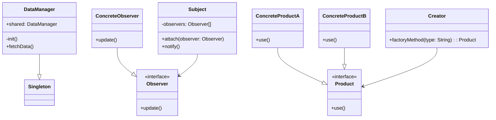

## 21.3 Continuing Education and Community Resources

As a Swift developer, mastering design patterns is an ongoing journey that requires continuous learning and active engagement with the community. In this section, we will explore a variety of resources and strategies to enhance your skills and stay updated with the latest trends in Swift development. From books and courses to forums and conferences, there are numerous opportunities to deepen your understanding and connect with fellow developers.

### Books and Online Courses

#### Must-Read Books

1. **"Design Patterns: Elements of Reusable Object-Oriented Software" by Erich Gamma, Richard Helm, Ralph Johnson, and John Vlissides (Gang of Four)**
   - Often referred to as the "bible" of design patterns, this book provides foundational knowledge and insights into object-oriented design principles. Although not Swift-specific, the concepts are universally applicable.

2. **"Swift Design Patterns" by Paul Hudson**
   - This book focuses specifically on implementing design patterns in Swift, offering practical examples and code snippets to help you apply these patterns in your projects.

3. **"Clean Code: A Handbook of Agile Software Craftsmanship" by Robert C. Martin**
   - While not exclusively about design patterns, this book emphasizes writing clean, maintainable code, which is crucial when implementing design patterns effectively.

4. **"iOS Design Patterns" by Jesse Feiler**
   - This book explores design patterns in the context of iOS development, providing insights into how patterns can be used to solve common problems in app development.

#### Online Courses

1. **Udemy: "Swift Design Patterns"**
   - A comprehensive course that covers a wide range of design patterns in Swift, complete with video lectures, quizzes, and hands-on exercises.

2. **Coursera: "iOS App Development with Swift"**
   - Offered by the University of Toronto, this course includes modules on design patterns and best practices for building robust iOS applications.

3. **Ray Wenderlich: "Design Patterns in Swift"**
   - This online tutorial series provides in-depth coverage of design patterns, with practical examples and exercises to reinforce learning.

4. **Pluralsight: "Design Patterns in Swift"**
   - A course that explores various design patterns with a focus on real-world application and problem-solving.

### Engaging with the Swift Community

#### Forums and Discussion Platforms

1. **Swift Forums**
   - The official Swift forums (https://forums.swift.org) are a great place to engage with the Swift community, ask questions, and participate in discussions about the Swift language and its evolution.

2. **Stack Overflow**
   - A popular platform for developers to ask and answer questions related to Swift programming. It's an excellent resource for troubleshooting and finding solutions to specific problems.

3. **Reddit: r/swift**
   - A community-driven subreddit where Swift developers share news, tutorials, and discussions related to Swift development.

4. **Hacker News**
   - While not Swift-specific, Hacker News is a great place to discover articles, discussions, and news related to software development and technology trends.

#### Conferences and Meetups

1. **WWDC (Apple Worldwide Developers Conference)**
   - Apple's annual conference is a must-attend event for Swift developers, offering sessions, workshops, and networking opportunities with Apple engineers and fellow developers.

2. **Swift Summit**
   - A conference dedicated to Swift development, featuring talks from industry experts and opportunities to connect with other Swift enthusiasts.

3. **iOSDevUK**
   - A UK-based conference focused on iOS development, including sessions on Swift and design patterns.

4. **Local Meetups**
   - Platforms like Meetup.com host various Swift and iOS development meetups around the world. These events are a great way to connect with local developers and learn from each other.

### Open-Source Contributions

#### Getting Involved in Open-Source Projects

1. **Contributing to Swift**
   - The Swift language itself is open-source, and contributions are welcome. Participating in the development of Swift can be a rewarding way to deepen your understanding of the language.

2. **GitHub Projects**
   - Explore and contribute to open-source Swift projects on GitHub. This not only enhances your skills but also allows you to collaborate with other developers and gain recognition in the community.

3. **Swift Package Manager**
   - Contributing to or creating Swift packages can help you learn more about modular design and design patterns in practice.

### Staying Updated with Swift Evolution

#### Swift Evolution Proposals

1. **Understanding Swift Evolution**
   - Swift Evolution is the process through which changes and enhancements to the Swift language are proposed, discussed, and implemented. Staying informed about these proposals helps you anticipate and adapt to changes in the language.

2. **Participating in Discussions**
   - Engage in discussions on the Swift Evolution mailing list or forums to share your insights and feedback on proposed changes.

3. **Reviewing Proposals**
   - Regularly review active and accepted proposals to understand the direction in which Swift is heading and how it might impact your development practices.

### Community Resources and Tools

#### Online Communities

1. **Swift.org**
   - The official Swift website provides documentation, resources, and links to community forums and discussions.

2. **Swift Weekly Brief**
   - A newsletter that summarizes the latest news, proposals, and discussions in the Swift community.

3. **Podcasts**
   - Podcasts like "Swift by Sundell" and "The Swift Community Podcast" offer insights, interviews, and discussions on Swift development and design patterns.

#### Tools and Libraries

1. **SwiftLint**
   - A tool to enforce Swift style and conventions, helping you write cleaner and more maintainable code.

2. **CocoaPods and Carthage**
   - Dependency managers that simplify the integration of third-party libraries into your Swift projects.

3. **Xcode Playgrounds**
   - An interactive environment for experimenting with Swift code and testing design patterns in a sandboxed setting.

### Try It Yourself: Experiment with Swift Design Patterns

To solidify your understanding of Swift design patterns, try implementing a simple project using a combination of patterns. For example, create a basic iOS app that utilizes the Singleton, Observer, and Factory Method patterns. Experiment with modifying the patterns to suit your specific needs and observe how they interact within the application.

```swift
// Singleton Pattern Example
class DataManager {
    static let shared = DataManager()
    private init() {}
    
    func fetchData() {
        // Fetch data logic
    }
}

// Observer Pattern Example
protocol Observer {
    func update()
}

class ConcreteObserver: Observer {
    func update() {
        print("Observer notified")
    }
}

class Subject {
    private var observers = [Observer]()
    
    func attach(observer: Observer) {
        observers.append(observer)
    }
    
    func notify() {
        for observer in observers {
            observer.update()
        }
    }
}

// Factory Method Pattern Example
protocol Product {
    func use()
}

class ConcreteProductA: Product {
    func use() {
        print("Using Product A")
    }
}

class ConcreteProductB: Product {
    func use() {
        print("Using Product B")
    }
}

class Creator {
    func factoryMethod(type: String) -> Product {
        switch type {
        case "A":
            return ConcreteProductA()
        case "B":
            return ConcreteProductB()
        default:
            fatalError("Unknown product type")
        }
    }
}

// Usage
let product = Creator().factoryMethod(type: "A")
product.use()
```

### Visualizing Swift Design Patterns

Let's visualize how these patterns can be integrated into a simple iOS app architecture using a class diagram.



### Knowledge Check

- Explain the benefits of engaging with the Swift community.
- Describe how contributing to open-source projects can enhance your skills.
- Identify key resources for staying updated with Swift Evolution proposals.
- Discuss the importance of continuing education in mastering Swift design patterns.

### Embrace the Journey

Remember, mastering Swift design patterns is a continuous journey. Engage with the community, explore new resources, and keep experimenting with different patterns. As you progress, you'll build more robust and scalable applications, contributing to the ever-evolving world of Swift development. Keep learning, stay curious, and enjoy the journey!

## Quiz Time!



### What is the primary benefit of reading "Design Patterns: Elements of Reusable Object-Oriented Software"?

- [x] It provides foundational knowledge and insights into object-oriented design principles.
- [ ] It focuses exclusively on Swift design patterns.
- [ ] It is a beginner's guide to programming.
- [ ] It covers only the Singleton pattern.

> **Explanation:** The book is known for its foundational coverage of object-oriented design principles, applicable across languages.

### Which online platform offers a comprehensive course on Swift Design Patterns?

- [x] Udemy
- [ ] LinkedIn Learning
- [ ] Khan Academy
- [ ] edX

> **Explanation:** Udemy offers a specific course on Swift Design Patterns, complete with video lectures and exercises.

### How can contributing to open-source Swift projects benefit you?

- [x] Enhances skills and provides collaboration opportunities.
- [ ] Limits your exposure to different coding styles.
- [ ] Is only beneficial for beginners.
- [ ] Does not improve coding skills.

> **Explanation:** Contributing to open-source projects allows you to collaborate with other developers and improve your skills.

### What is the Swift Evolution process?

- [x] A process through which changes and enhancements to the Swift language are proposed, discussed, and implemented.
- [ ] A method for debugging Swift applications.
- [ ] A tool for optimizing Swift code.
- [ ] A conference for Swift developers.

> **Explanation:** Swift Evolution is the process for proposing and discussing changes to the Swift language.

### Which tool helps enforce Swift style and conventions?

- [x] SwiftLint
- [ ] Xcode
- [ ] SwiftUI
- [ ] Carthage

> **Explanation:** SwiftLint is a tool specifically designed to enforce style and conventions in Swift code.

### What is the purpose of the Swift Package Manager?

- [x] It helps manage dependencies in Swift projects.
- [ ] It is used for debugging Swift applications.
- [ ] It provides a graphical user interface for Swift development.
- [ ] It is a design pattern.

> **Explanation:** The Swift Package Manager is used for managing dependencies in Swift projects.

### How can engaging in forums benefit Swift developers?

- [x] Provides opportunities to ask questions and participate in discussions.
- [ ] It is only for beginners.
- [ ] It is a waste of time for experienced developers.
- [ ] It offers no real benefits.

> **Explanation:** Engaging in forums allows developers to ask questions, share knowledge, and participate in discussions.

### Which platform is known for hosting the official Swift forums?

- [x] Swift.org
- [ ] Reddit
- [ ] GitHub
- [ ] Stack Overflow

> **Explanation:** Swift.org hosts the official Swift forums where developers can engage with the community.

### What is the benefit of attending conferences like WWDC?

- [x] Networking opportunities and learning from Apple engineers.
- [ ] It is only for marketing purposes.
- [ ] It does not provide any real learning opportunities.
- [ ] It is only for beginners.

> **Explanation:** Conferences like WWDC offer networking opportunities and sessions with Apple engineers.

### True or False: Podcasts like "Swift by Sundell" are useful resources for Swift developers.

- [x] True
- [ ] False

> **Explanation:** Podcasts like "Swift by Sundell" provide insights and discussions on Swift development, making them valuable resources.


