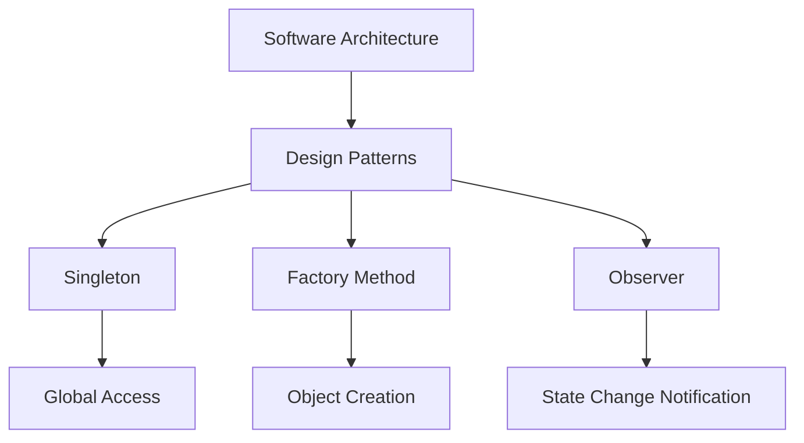

## 21.4 The Role of Design Patterns in Software Architecture

In the realm of software development, design patterns serve as time-tested solutions to common problems, offering a blueprint for crafting robust and maintainable code. They are integral to software architecture, providing a structured approach to solving recurring design challenges. In this section, we delve into the role of design patterns in software architecture, particularly in the context of Swift development, and explore how they contribute to building scalable, efficient, and adaptable systems.

### Understanding Design Patterns in Software Architecture

Design patterns are not just about code reuse; they are about capturing best practices and distilling them into reusable solutions. In software architecture, design patterns play a crucial role in defining the interactions and relationships between components, ensuring that the system is both flexible and scalable.

#### The Essence of Design Patterns

Design patterns encapsulate proven solutions to common design issues, enabling developers to apply these solutions to new problems. They provide a shared language for developers, facilitating communication and collaboration. By understanding and utilizing design patterns, developers can create systems that are easier to understand, modify, and extend.

#### The Intersection of Design Patterns and Architecture

Software architecture defines the high-level structure of a system, including its components and their interactions. Design patterns fit into this structure by offering solutions to specific design challenges within the architecture. They help in organizing code, managing dependencies, and defining clear interfaces between components.

### Balancing Patterns with Simplicity

While design patterns offer numerous benefits, it's essential to balance their use with the need for simplicity. Overusing patterns can lead to unnecessary complexity, making the system harder to understand and maintain.

#### The Principle of Simplicity

Simplicity in software design is about creating solutions that are easy to understand and maintain. It involves avoiding unnecessary complexity and focusing on the core functionality of the system. When applying design patterns, it's crucial to ensure that they add value without introducing undue complexity.

#### Avoiding Over-Engineering

Over-engineering occurs when developers apply patterns unnecessarily, leading to a bloated and complex codebase. It's important to evaluate whether a pattern is truly needed or if a simpler solution would suffice. The key is to use patterns judiciously, applying them only when they provide a clear benefit.

### Evolving Architecture with Patterns

Software architecture is not static; it evolves over time as the system grows and requirements change. Design patterns play a vital role in this evolution, providing a framework for adapting the architecture to new challenges.

#### Adapting to Change

As systems evolve, new requirements and challenges emerge. Design patterns offer a way to adapt to these changes without rewriting large portions of the codebase. By encapsulating specific solutions, patterns allow developers to modify and extend the system in a controlled and predictable manner.

#### Facilitating Scalability

Scalability is a critical aspect of software architecture, and design patterns contribute to scalable solutions by promoting loose coupling and high cohesion. Patterns like the Singleton, Factory, and Observer are particularly useful in managing scalability challenges, ensuring that the system can grow without becoming unwieldy.

### Key Design Patterns in Software Architecture

Let's explore some common design patterns and their role in software architecture, particularly in the context of Swift development.

#### Singleton Pattern

**Intent:** Ensure a class has only one instance and provide a global point of access to it.

**Applicability:** Use the Singleton pattern when you need to control access to shared resources, such as configuration settings or hardware devices.

**Sample Code Snippet:**

```swift
class Singleton {
    static let shared = Singleton()
    
    private init() {
        // Private initialization to ensure just one instance is created.
    }
    
    func doSomething() {
        // Perform some action
    }
}

// Usage
Singleton.shared.doSomething()
```

**Design Considerations:** Be cautious with thread safety when implementing the Singleton pattern, especially in a multithreaded environment.

#### Factory Method Pattern

**Intent:** Define an interface for creating an object, but let subclasses alter the type of objects that will be created.

**Applicability:** Use the Factory Method pattern when a class can't anticipate the class of objects it must create.

**Sample Code Snippet:**

```swift
protocol Product {
    func use()
}

class ConcreteProductA: Product {
    func use() {
        print("Using ConcreteProductA")
    }
}

class ConcreteProductB: Product {
    func use() {
        print("Using ConcreteProductB")
    }
}

class Creator {
    func factoryMethod() -> Product {
        return ConcreteProductA()
    }
}

// Usage
let creator = Creator()
let product = creator.factoryMethod()
product.use()
```

**Design Considerations:** The Factory Method pattern promotes loose coupling by decoupling the creation of objects from their usage.

#### Observer Pattern

**Intent:** Define a one-to-many dependency between objects so that when one object changes state, all its dependents are notified and updated automatically.

**Applicability:** Use the Observer pattern when an abstraction has two aspects, one dependent on the other.

**Sample Code Snippet:**

```swift
protocol Observer: AnyObject {
    func update(subject: Subject)
}

class Subject {
    private var observers = [Observer]()
    
    func attach(observer: Observer) {
        observers.append(observer)
    }
    
    func detach(observer: Observer) {
        observers = observers.filter { $0 !== observer }
    }
    
    func notify() {
        observers.forEach { $0.update(subject: self) }
    }
}

// Usage
class ConcreteObserver: Observer {
    func update(subject: Subject) {
        print("Observer notified by subject")
    }
}

let subject = Subject()
let observer = ConcreteObserver()
subject.attach(observer: observer)
subject.notify()
```

**Design Considerations:** Be mindful of potential memory leaks due to strong references in the Observer pattern. Consider using weak references to avoid retain cycles.

### Swift's Unique Features and Design Patterns

Swift offers unique features that can enhance the implementation of design patterns, such as protocol-oriented programming, value types, and powerful type inference.

#### Protocol-Oriented Programming

Swift's emphasis on protocols over inheritance allows for more flexible and reusable code. Many design patterns can be implemented using protocols, leading to cleaner and more maintainable solutions.

#### Value Types and Immutability

Swift encourages the use of value types (structs and enums) over reference types (classes), promoting immutability and thread safety. This can influence the choice and implementation of design patterns, particularly in concurrent environments.

### Visualizing Design Patterns in Architecture

To better understand the role of design patterns in software architecture, let's visualize the interaction between patterns and architectural components.



**Description:** This diagram illustrates the relationship between software architecture and design patterns, highlighting how patterns like Singleton, Factory Method, and Observer fit into the broader architectural context.

### Knowledge Check

To reinforce your understanding of the role of design patterns in software architecture, consider the following questions:

- How do design patterns contribute to the scalability of a software system?
- What are the potential pitfalls of overusing design patterns?
- How can Swift's unique features enhance the implementation of design patterns?

### Embrace the Journey

Remember, mastering design patterns is a journey, not a destination. As you continue to explore and apply these patterns, you'll gain deeper insights into their role in software architecture. Keep experimenting, stay curious, and enjoy the process of crafting elegant and efficient solutions.

### Conclusion

Design patterns are a powerful tool in the software architect's toolkit, offering solutions to common design challenges and contributing to the scalability, flexibility, and maintainability of systems. By understanding their role in software architecture, particularly in the context of Swift development, you can create systems that are both robust and adaptable.

## Quiz Time!



### How do design patterns contribute to software architecture?

- [x] They provide reusable solutions to common design problems.
- [ ] They replace the need for software architecture.
- [ ] They eliminate the need for documentation.
- [ ] They are only useful for small projects.

> **Explanation:** Design patterns offer reusable solutions to common design problems, enhancing the architecture's scalability and maintainability.

### What is a potential downside of overusing design patterns?

- [x] Increased complexity.
- [ ] Improved performance.
- [ ] Reduced code quality.
- [ ] Simplified architecture.

> **Explanation:** Overusing design patterns can lead to increased complexity, making the system harder to understand and maintain.

### Which Swift feature enhances the implementation of design patterns?

- [x] Protocol-oriented programming.
- [ ] Lack of type safety.
- [ ] Manual memory management.
- [ ] Global variables.

> **Explanation:** Swift's protocol-oriented programming allows for more flexible and reusable code, enhancing design pattern implementation.

### What is the primary intent of the Singleton pattern?

- [x] Ensure a class has only one instance.
- [ ] Create multiple instances of a class.
- [ ] Simplify object creation.
- [ ] Enhance object destruction.

> **Explanation:** The Singleton pattern ensures a class has only one instance and provides a global point of access to it.

### How does the Factory Method pattern promote loose coupling?

- [x] By decoupling object creation from usage.
- [ ] By tightly coupling object creation with usage.
- [ ] By eliminating the need for interfaces.
- [ ] By using global variables.

> **Explanation:** The Factory Method pattern promotes loose coupling by decoupling the creation of objects from their usage.

### What should be considered when implementing the Observer pattern?

- [x] Potential memory leaks due to strong references.
- [ ] The need for global variables.
- [ ] The elimination of interfaces.
- [ ] The use of manual memory management.

> **Explanation:** When implementing the Observer pattern, be mindful of potential memory leaks due to strong references, and consider using weak references to avoid retain cycles.

### How do design patterns facilitate scalability?

- [x] By promoting loose coupling and high cohesion.
- [ ] By tightly coupling all components.
- [ ] By eliminating the need for interfaces.
- [ ] By using global variables.

> **Explanation:** Design patterns facilitate scalability by promoting loose coupling and high cohesion, allowing the system to grow without becoming unwieldy.

### What is the primary focus of simplicity in software design?

- [x] Creating solutions that are easy to understand and maintain.
- [ ] Creating complex and intricate solutions.
- [ ] Eliminating the need for documentation.
- [ ] Using as many design patterns as possible.

> **Explanation:** Simplicity in software design focuses on creating solutions that are easy to understand and maintain, avoiding unnecessary complexity.

### How can Swift's value types influence design pattern implementation?

- [x] By promoting immutability and thread safety.
- [ ] By increasing the use of global variables.
- [ ] By requiring manual memory management.
- [ ] By eliminating the need for interfaces.

> **Explanation:** Swift's value types promote immutability and thread safety, influencing the choice and implementation of design patterns, particularly in concurrent environments.

### True or False: Design patterns are only useful for large-scale projects.

- [ ] True
- [x] False

> **Explanation:** Design patterns are useful for projects of all sizes, providing solutions to common design challenges and enhancing the architecture's scalability and maintainability.


