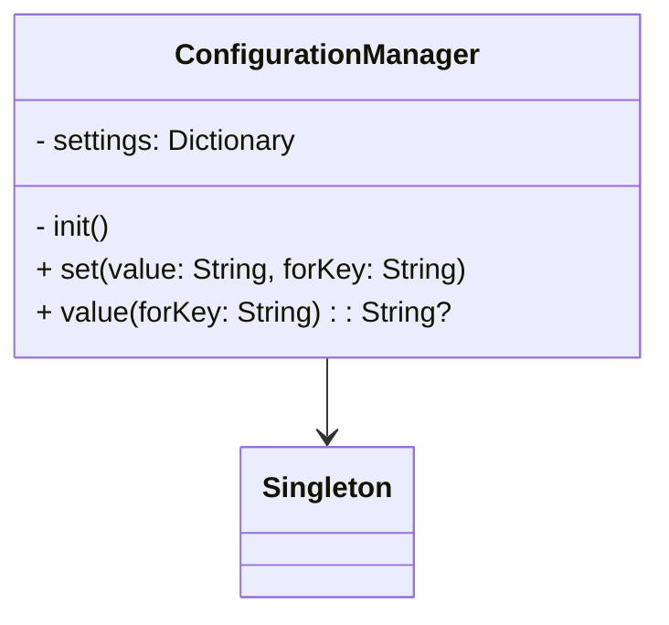

## 21.5 Final Thoughts on Mastery of Swift Design Patterns

As we reach the conclusion of this comprehensive guide on Swift design patterns, it's essential to reflect on the journey we've embarked upon together. Mastering design patterns in Swift is not merely about memorizing concepts or code snippets; it's about developing a deep understanding of when and how to apply these patterns to build robust, scalable, and efficient applications. Let's delve into the key takeaways and encourage continual practice and exploration.

### Building Intuition for Design Patterns

Understanding design patterns is akin to learning a new language. At first, it may seem daunting, but with practice, you begin to think in that language, seamlessly applying it to solve complex problems. The same is true for design patterns in Swift. Here's how you can build intuition:

1. **Recognize Common Problems**: Design patterns are solutions to recurring problems. By identifying these problems in your projects, you can determine which pattern offers the best solution.

2. **Analyze Existing Code**: Study open-source projects or your past work to see how design patterns are applied. This analysis helps you understand the context in which patterns are used.

3. **Practice Regularly**: Implementing patterns in small projects or coding exercises reinforces your understanding and helps you see their practical benefits.

4. **Reflect on Decisions**: After completing a project, review your design choices. Consider whether the patterns you used were effective or if another pattern might have been more suitable.

5. **Stay Updated**: The Swift language evolves, and so do best practices. Keep abreast of new developments and how they might influence design pattern usage.

### The Journey Towards Becoming a Seasoned Swift Developer

Mastering design patterns is a significant milestone on the path to becoming a seasoned Swift developer. Here are some steps to guide you on this journey:

#### Embrace Continuous Learning

Swift is a dynamic language, and the ecosystem around it is constantly evolving. To stay relevant, embrace continuous learning:

- **Engage with the Community**: Participate in forums, attend conferences, and collaborate with peers. Sharing knowledge and experiences accelerates learning.

- **Explore New Patterns**: Beyond the classic design patterns, explore emerging patterns and paradigms, such as reactive programming or protocol-oriented programming.

- **Experiment with New Features**: Swift regularly introduces new features. Experimenting with these can lead to innovative ways of applying design patterns.

#### Develop a Problem-Solving Mindset

Design patterns are tools in a developer's toolkit. Developing a problem-solving mindset involves:

- **Understanding the Problem Domain**: Before applying a pattern, ensure you thoroughly understand the problem you're trying to solve.

- **Evaluating Trade-offs**: Every pattern has its pros and cons. Evaluate these trade-offs in the context of your specific requirements.

- **Adapting Patterns**: Patterns are not one-size-fits-all solutions. Adapt them to fit the unique constraints and goals of your project.

#### Foster a Collaborative Environment

Software development is a collaborative effort. Fostering a collaborative environment enhances the application of design patterns:

- **Code Reviews**: Regular code reviews help ensure patterns are applied correctly and consistently across the codebase.

- **Pair Programming**: Working with another developer can provide new insights and approaches to applying patterns.

- **Mentorship**: Both mentoring others and being mentored can deepen your understanding of design patterns.

### Code Examples and Exercises

Let's reinforce our understanding with a practical example. Consider a scenario where you need to manage a shared resource, such as a configuration file, across multiple parts of an application. The Singleton pattern is a classic solution.

```swift
// Singleton Pattern Example in Swift

final class ConfigurationManager {
    static let shared = ConfigurationManager()
    
    private var settings: [String: String] = [:]
    
    private init() {
        // Private initialization to ensure just one instance is created.
    }
    
    func set(value: String, forKey key: String) {
        settings[key] = value
    }
    
    func value(forKey key: String) -> String? {
        return settings[key]
    }
}

// Usage
ConfigurationManager.shared.set(value: "Dark", forKey: "Theme")
if let theme = ConfigurationManager.shared.value(forKey: "Theme") {
    print("Current theme: \\(theme)")
}
```

#### Try It Yourself

Encourage experimentation by modifying the above example:

- **Add Thread Safety**: Ensure that the `ConfigurationManager` is thread-safe.
- **Implement a Reset Method**: Add a method to reset the configuration settings.
- **Expand Functionality**: Allow the manager to save and load settings from a file.

### Visualizing Design Patterns

Understanding the relationships and interactions between different components of a design pattern can be greatly enhanced through visualization. Below is a class diagram for the Singleton pattern using Mermaid.js:



#### Explanation

- **ConfigurationManager**: Represents the Singleton class that manages configuration settings.
- **Singleton**: Denotes the Singleton design pattern, emphasizing a single instance.

### Encouragement and Final Thoughts

As we conclude this guide, remember that mastering Swift design patterns is a journey, not a destination. Here are some final thoughts to inspire you:

- **Embrace Challenges**: Each new project presents unique challenges. Use these opportunities to apply and refine your understanding of design patterns.

- **Stay Curious**: The world of software development is vast and ever-changing. Stay curious and open to learning new concepts and techniques.

- **Enjoy the Process**: Building software is a creative endeavor. Enjoy the process of crafting solutions and seeing your ideas come to life.

- **Contribute to the Community**: Share your knowledge and experiences with others. Contributing to the community enriches both your understanding and that of others.

- **Reflect on Your Growth**: Periodically reflect on how far you've come. Recognize the skills you've acquired and the progress you've made.

### Knowledge Check

To reinforce your learning, consider these questions:

- How does the Singleton pattern ensure a single instance?
- What are the trade-offs of using the Singleton pattern?
- How can you adapt design patterns to suit specific project needs?

### Conclusion

Mastering Swift design patterns is an ongoing journey that requires dedication, practice, and a willingness to learn. By building intuition, embracing continuous learning, developing a problem-solving mindset, and fostering collaboration, you will become a seasoned Swift developer capable of crafting elegant and efficient solutions. Remember, this is just the beginning. As you progress, you'll build more complex and interactive applications. Keep experimenting, stay curious, and enjoy the journey!

## Quiz Time!



### How does the Singleton pattern ensure a single instance?

- [x] By using a private initializer and a static instance
- [ ] By using a public initializer and multiple instances
- [ ] By using a public property
- [ ] By using a class method

> **Explanation:** The Singleton pattern ensures a single instance by using a private initializer and a static instance, preventing the creation of additional instances.

### What is a key benefit of using design patterns?

- [x] They provide proven solutions to common problems
- [ ] They make code more complex
- [ ] They eliminate the need for testing
- [ ] They are only applicable to large projects

> **Explanation:** Design patterns provide proven solutions to common problems, enhancing code maintainability and scalability.

### Which of the following is a creational design pattern?

- [x] Factory Method
- [ ] Observer
- [ ] Decorator
- [ ] Strategy

> **Explanation:** The Factory Method is a creational design pattern, focusing on object creation.

### What is the primary focus of structural design patterns?

- [x] Organizing classes and objects
- [ ] Managing object creation
- [ ] Defining algorithms
- [ ] Handling concurrency

> **Explanation:** Structural design patterns focus on organizing classes and objects to form larger structures.

### How can you ensure thread safety in a Singleton pattern?

- [x] Use dispatch queues or locks
- [ ] Use multiple instances
- [x] Use atomic properties
- [ ] Use a public initializer

> **Explanation:** Thread safety in a Singleton pattern can be ensured by using dispatch queues, locks, or atomic properties.

### What is the main advantage of the Observer pattern?

- [x] It allows objects to be notified of changes
- [ ] It simplifies code structure
- [ ] It eliminates dependencies
- [ ] It enhances performance

> **Explanation:** The Observer pattern allows objects to be notified of changes, facilitating communication between components.

### Which pattern is used to decouple an abstraction from its implementation?

- [x] Bridge
- [ ] Adapter
- [x] Proxy
- [ ] Composite

> **Explanation:** The Bridge pattern is used to decouple an abstraction from its implementation, allowing them to vary independently.

### What is the primary purpose of the Strategy pattern?

- [x] To define a family of algorithms
- [ ] To manage object creation
- [ ] To handle concurrency
- [ ] To organize classes

> **Explanation:** The Strategy pattern defines a family of algorithms, encapsulating each one and making them interchangeable.

### Which design pattern is often used for implementing undo functionality?

- [x] Memento
- [ ] Singleton
- [ ] Factory Method
- [ ] Observer

> **Explanation:** The Memento pattern is often used for implementing undo functionality by capturing and restoring an object's state.

### True or False: Design patterns are only applicable to object-oriented programming.

- [ ] True
- [x] False

> **Explanation:** False. Design patterns can be applied to various programming paradigms, not just object-oriented programming.




