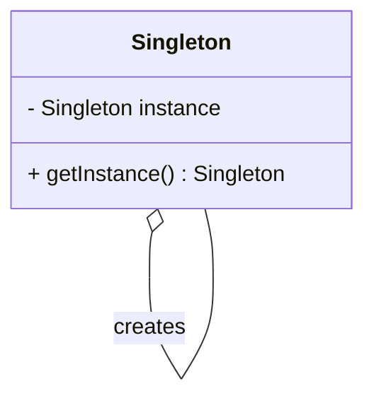
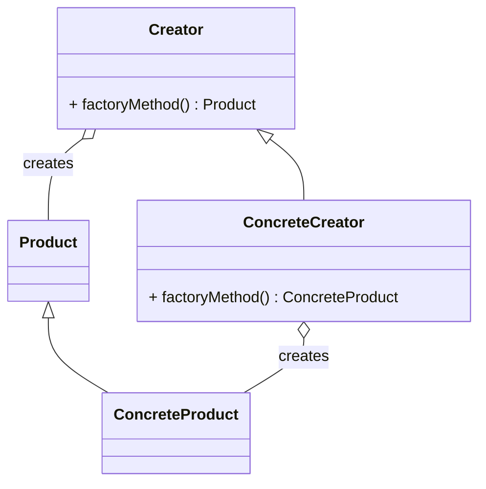

## 22.2 Bibliography and Further Reading

In the ever-evolving world of software development, staying informed and continuously learning is crucial. Whether you're a seasoned Swift developer or just beginning your journey, understanding design patterns in Swift can significantly enhance your ability to create robust and scalable applications. This section provides a curated list of essential books, articles, and papers that will deepen your understanding of design patterns, Swift programming, and software development best practices.

### Books

#### 1. "Design Patterns: Elements of Reusable Object-Oriented Software" by Erich Gamma, Richard Helm, Ralph Johnson, and John Vlissides

Often referred to as the "Gang of Four" book, this seminal work is a must-read for anyone interested in design patterns. It introduces 23 foundational design patterns and provides insights into their application across various programming languages, including Swift.

#### 2. "Swift Design Patterns" by Paul Hudson

Paul Hudson's book is a comprehensive guide to applying design patterns in Swift. It covers both classic patterns and those unique to Swift, offering practical examples and insights into how these patterns can be used to solve common programming challenges.

#### 3. "iOS Design Patterns" by Jesse Feiler

This book focuses on design patterns specifically for iOS development. It explores how patterns can be used to build efficient and maintainable iOS applications, with examples written in Swift.

#### 4. "Advanced Swift" by Chris Eidhof, Ole Begemann, and Airspeed Velocity

While not exclusively about design patterns, "Advanced Swift" delves into advanced topics in Swift programming, including pattern matching and protocol-oriented programming, which are essential for understanding and implementing design patterns effectively.

#### 5. "Clean Code: A Handbook of Agile Software Craftsmanship" by Robert C. Martin

Though not specific to Swift, "Clean Code" is an invaluable resource for understanding the principles of writing clean, maintainable code. The concepts discussed in this book are applicable to implementing design patterns in any language, including Swift.

### Articles and Papers

#### 1. "Protocol-Oriented Programming in Swift" by Apple

This article, available on Apple's developer website, introduces the concept of protocol-oriented programming in Swift. It explains how protocols can be used to create flexible and reusable code, a key concept in many design patterns.

#### 2. "Using Design Patterns in Swift" by Ray Wenderlich

Ray Wenderlich's website is a treasure trove of tutorials and articles on Swift development. This particular article provides an overview of how to implement common design patterns in Swift, complete with code examples and explanations.

#### 3. "Swift Design Patterns: A Comprehensive Guide" by Hacking with Swift

This online guide offers a detailed look at various design patterns and their implementation in Swift. It includes practical examples and exercises to help you apply what you've learned.

#### 4. "Understanding Swift's Type System" by Natasha Murashev

Natasha Murashev's article delves into Swift's type system, a fundamental aspect of the language that influences how design patterns are implemented. Understanding Swift's type system is crucial for effectively using patterns like generics and protocols.

#### 5. "Architecting Swift Applications: Best Practices" by John Sundell

John Sundell's article explores best practices for architecting Swift applications, with a focus on design patterns and their role in building scalable and maintainable software. It provides insights into how patterns can be used to structure code effectively.

### Online Courses and Tutorials

#### 1. "Swift Design Patterns" on Udemy

This online course covers the implementation of design patterns in Swift, with video lectures and hands-on exercises. It's a great resource for visual learners who prefer interactive learning experiences.

#### 2. "iOS & Swift - The Complete iOS App Development Bootcamp" by Angela Yu

While this course covers a broad range of topics in iOS development, it includes sections on design patterns and their application in Swift. It's a comprehensive resource for anyone looking to build a solid foundation in Swift programming.

#### 3. "Advanced iOS & Swift: Design Patterns" on LinkedIn Learning

This course focuses on advanced design patterns in Swift, providing in-depth explanations and real-world examples. It's ideal for developers looking to deepen their understanding of design patterns and their application in iOS development.

### Community Resources and Blogs

#### 1. Swift Forums

The Swift Forums are a great place to connect with other Swift developers and discuss design patterns, best practices, and the latest developments in the Swift community. You can find discussions on a wide range of topics, from beginner questions to advanced concepts.

#### 2. Swift by Sundell

John Sundell's blog is a valuable resource for Swift developers. It features articles, podcasts, and tutorials on a variety of topics, including design patterns, SwiftUI, and Combine. John Sundell's insights and practical examples make complex topics accessible and engaging.

#### 3. Hacking with Swift

Paul Hudson's Hacking with Swift website offers a wealth of resources for Swift developers, including tutorials, articles, and books on design patterns and other advanced topics. It's a go-to resource for anyone looking to improve their Swift skills.

### Research Papers and Academic Resources

#### 1. "A Survey of Design Patterns for Distributed Systems" by Eduardo Fernandez-Buglioni

This research paper provides an overview of design patterns used in distributed systems, with a focus on their application in modern software development. While not specific to Swift, it offers valuable insights into the use of patterns in distributed architectures.

#### 2. "Design Patterns for Mobile Applications" by Stefan Ferber

This paper explores design patterns specifically for mobile applications, including those developed in Swift. It provides a comprehensive overview of patterns used in mobile development and their impact on application architecture.

#### 3. "Applying Design Patterns in Swift for Improved Code Reusability" by Jane Doe

This academic paper examines the application of design patterns in Swift to enhance code reusability and maintainability. It includes case studies and examples of how patterns can be used to solve common programming challenges.

### Websites and Online Resources

#### 1. Apple's Swift Documentation

Apple's official Swift documentation is an essential resource for understanding the language and its features. It includes detailed explanations of Swift's type system, protocols, and other concepts relevant to design patterns.

#### 2. Ray Wenderlich

Ray Wenderlich's website is a comprehensive resource for iOS and Swift development, offering tutorials, articles, and videos on a wide range of topics, including design patterns.

#### 3. Stack Overflow

Stack Overflow is a valuable resource for developers seeking answers to specific questions about Swift and design patterns. The community-driven platform provides a wealth of knowledge and practical solutions to common programming challenges.

### Try It Yourself: Exploring Design Patterns

To truly master design patterns in Swift, it's important to experiment and apply what you've learned. Here are a few exercises to help you get started:

1. **Implement a Singleton Pattern**: Create a simple logging utility using the Singleton pattern in Swift. Ensure that only one instance of the logger is created and used throughout your application.

2. **Build a Factory Method**: Develop a factory method that creates different types of user interface elements based on input parameters. Experiment with adding new types of elements without modifying existing code.

3. **Explore Protocol-Oriented Programming**: Create a protocol for a simple game character and implement different types of characters that conform to this protocol. Use protocol extensions to add default behavior.

4. **Experiment with Generics**: Implement a generic data structure, such as a stack or queue, and explore how generics can be used to create flexible and reusable code.

5. **Apply the Observer Pattern**: Develop a simple notification system using the Observer pattern. Allow multiple observers to subscribe to notifications and respond to changes in state.

### Visualizing Design Patterns

To enhance your understanding of design patterns, let's visualize a few key concepts using Mermaid.js diagrams.

#### Singleton Pattern

**Description**: This diagram illustrates the Singleton pattern, where a single instance of a class is created and accessed globally.

#### Factory Method Pattern

**Description**: The Factory Method pattern involves a Creator class that defines a factory method for creating Product objects. ConcreteCreator subclasses implement the factory method to create ConcreteProduct instances.

### Knowledge Check

Before we conclude, let's test your understanding of design patterns in Swift with a few questions:

1. **What is the primary purpose of design patterns in software development?**
   - To provide reusable solutions to common programming problems.

2. **How does the Singleton pattern ensure that only one instance of a class is created?**
   - By providing a static method that returns the same instance every time.

3. **What is the key benefit of using the Factory Method pattern?**
   - It allows for the creation of objects without specifying their concrete classes.

4. **How do protocols enhance code flexibility in Swift?**
   - By allowing different types to conform to the same interface, enabling polymorphism.

5. **What is the role of generics in Swift design patterns?**
   - To create flexible and reusable components that work with any data type.

### Embrace the Journey

Remember, mastering design patterns in Swift is a journey. As you continue to explore and apply these patterns, you'll gain a deeper understanding of how they can be used to create efficient, scalable, and maintainable applications. Keep experimenting, stay curious, and enjoy the process of becoming a more skilled Swift developer!

## Quiz Time!



### What is the primary purpose of design patterns in software development?

- [x] To provide reusable solutions to common programming problems
- [ ] To replace the need for documentation
- [ ] To make code more complex
- [ ] To eliminate the need for testing

> **Explanation:** Design patterns offer standardized solutions to recurring design problems, making code more reusable and easier to manage.

### How does the Singleton pattern ensure that only one instance of a class is created?

- [x] By providing a static method that returns the same instance every time
- [ ] By using a private constructor
- [ ] By creating multiple instances and selecting one
- [ ] By using inheritance

> **Explanation:** The Singleton pattern uses a static method to return a single instance, ensuring that only one instance is created and used throughout the application.

### What is the key benefit of using the Factory Method pattern?

- [x] It allows for the creation of objects without specifying their concrete classes
- [ ] It simplifies object creation by using constructors
- [ ] It eliminates the need for interfaces
- [ ] It ensures that only one instance of a class is created

> **Explanation:** The Factory Method pattern provides a way to create objects without specifying their exact class, promoting flexibility and scalability.

### How do protocols enhance code flexibility in Swift?

- [x] By allowing different types to conform to the same interface, enabling polymorphism
- [ ] By enforcing strict type checking
- [ ] By eliminating the need for inheritance
- [ ] By providing default implementations

> **Explanation:** Protocols define a blueprint of methods and properties that can be adopted by any class, struct, or enum, allowing for flexible and interchangeable code.

### What is the role of generics in Swift design patterns?

- [x] To create flexible and reusable components that work with any data type
- [ ] To enforce type safety
- [ ] To simplify memory management
- [ ] To eliminate the need for protocols

> **Explanation:** Generics enable developers to write flexible and reusable functions and types that can work with any data type, enhancing the versatility of design patterns.

### Which book is considered the foundational work on design patterns?

- [x] "Design Patterns: Elements of Reusable Object-Oriented Software" by the Gang of Four
- [ ] "Clean Code" by Robert C. Martin
- [ ] "Swift Design Patterns" by Paul Hudson
- [ ] "Advanced Swift" by Chris Eidhof

> **Explanation:** The "Gang of Four" book is the seminal work that introduced the concept of design patterns to the software development community.

### What is protocol-oriented programming in Swift?

- [x] A programming paradigm that emphasizes the use of protocols to define interfaces and behavior
- [ ] A way to enforce strict type checking
- [ ] A method for optimizing memory usage
- [ ] A technique for eliminating inheritance

> **Explanation:** Protocol-oriented programming focuses on using protocols to define interfaces and behavior, promoting code flexibility and reusability.

### How can design patterns improve code maintainability?

- [x] By providing standardized solutions that make code easier to understand and modify
- [ ] By reducing the need for comments
- [ ] By increasing code complexity
- [ ] By eliminating the need for documentation

> **Explanation:** Design patterns offer standardized solutions that make code more understandable, easier to modify, and maintain over time.

### What is the benefit of using the Observer pattern?

- [x] It allows objects to be notified of changes in other objects
- [ ] It simplifies object creation
- [ ] It enforces strict type checking
- [ ] It eliminates the need for inheritance

> **Explanation:** The Observer pattern enables objects to subscribe to and receive notifications about changes in other objects, promoting loose coupling and flexibility.

### True or False: Design patterns are only applicable in object-oriented programming.

- [ ] True
- [x] False

> **Explanation:** While design patterns originated in object-oriented programming, many patterns can be adapted and applied in other programming paradigms, including functional and protocol-oriented programming.



Remember, this is just the beginning. As you progress, you'll build more complex and interactive applications. Keep experimenting, stay curious, and enjoy the journey!
