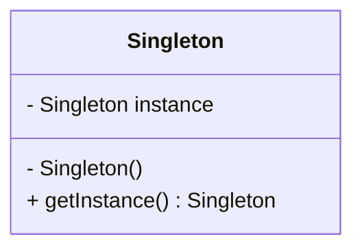
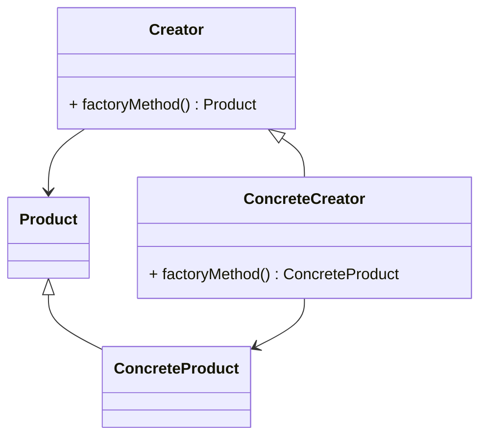
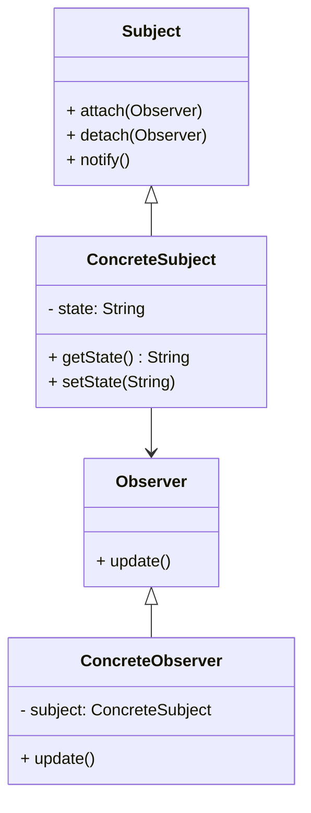
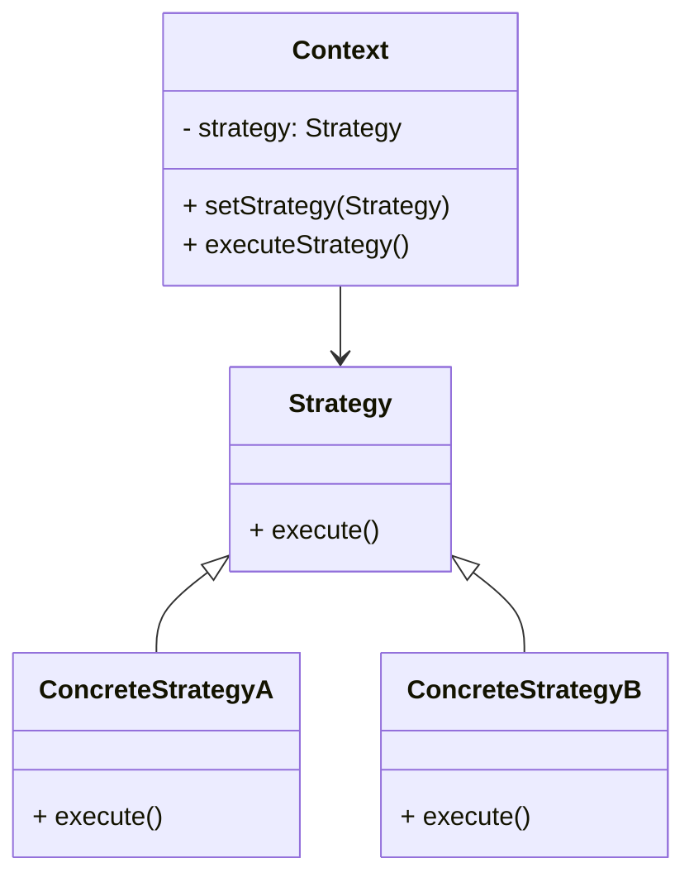
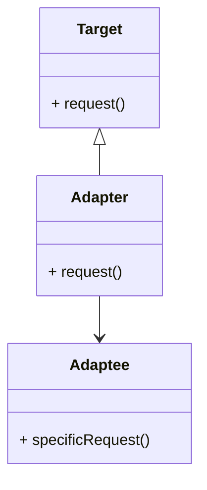
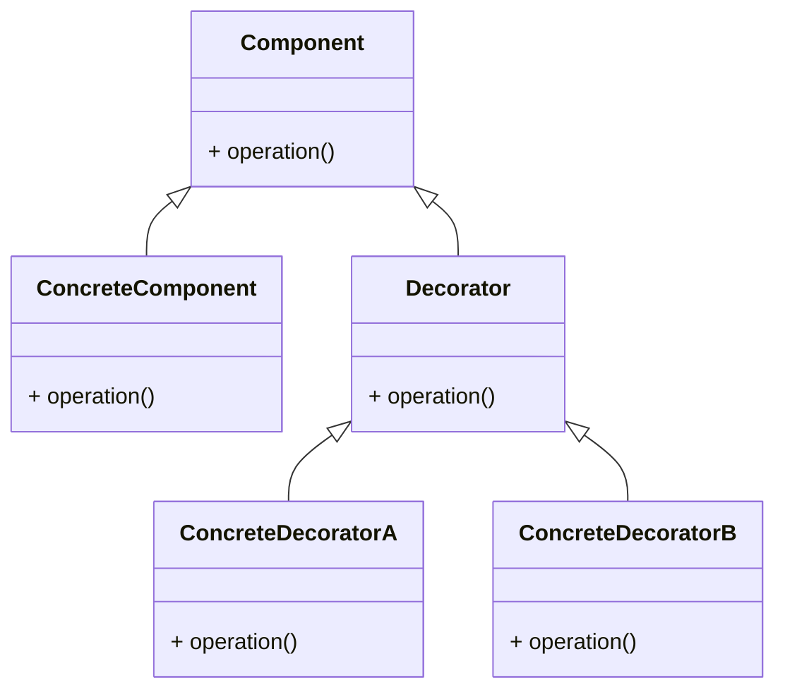
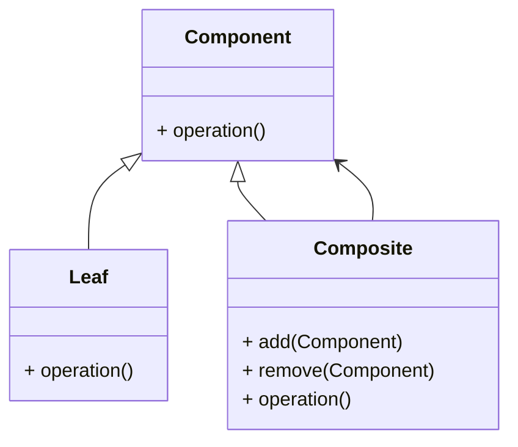

## 22.3 Swift Design Pattern Reference Cheat Sheet

Design patterns are essential tools for developers, providing proven solutions to common problems in software design. This reference cheat sheet offers concise summaries of key design patterns in Swift, complete with diagrams, key characteristics, and code snippets to aid in quick recall and implementation.

---

### Singleton Design Pattern

**Category:** Creational

**Intent:** Ensure a class has only one instance and provide a global point of access to it.

**Diagram:**



**Key Participants:**
- Singleton: The class that contains a static instance of itself and provides a method to access it.

**Applicability:** Use when exactly one instance of a class is needed to coordinate actions across the system.

**Sample Code Snippet:**

```swift
final class Singleton {
    static let shared = Singleton()
    
    private init() {
        // Private initialization to ensure just one instance is created.
    }
    
    func someMethod() {
        print("Singleton method called")
    }
}

// Usage
Singleton.shared.someMethod()
```

**Design Considerations:** Be cautious with global state as it can make testing difficult. Consider thread safety if the singleton is accessed across multiple threads.

**Swift Unique Features:** Swift's `static let` ensures thread-safe lazy initialization of the singleton instance.

---

### Factory Method Design Pattern

**Category:** Creational

**Intent:** Define an interface for creating an object, but let subclasses alter the type of objects that will be created.

**Diagram:**



**Key Participants:**
- Creator: Declares the factory method.
- ConcreteCreator: Implements the factory method to return an instance of a ConcreteProduct.
- Product: Defines the interface of objects the factory method creates.
- ConcreteProduct: Implements the Product interface.

**Applicability:** Use when a class can't anticipate the class of objects it must create.

**Sample Code Snippet:**

```swift
protocol Product {
    func use()
}

class ConcreteProductA: Product {
    func use() {
        print("Using Product A")
    }
}

class ConcreteProductB: Product {
    func use() {
        print("Using Product B")
    }
}

class Creator {
    func factoryMethod() -> Product {
        fatalError("Must override")
    }
}

class ConcreteCreatorA: Creator {
    override func factoryMethod() -> Product {
        return ConcreteProductA()
    }
}

class ConcreteCreatorB: Creator {
    override func factoryMethod() -> Product {
        return ConcreteProductB()
    }
}

// Usage
let creator: Creator = ConcreteCreatorA()
let product = creator.factoryMethod()
product.use()
```

**Design Considerations:** Provides flexibility in terms of object creation. However, it can introduce complexity with many subclasses.

**Swift Unique Features:** Use Swift's protocol extensions to provide default implementations for factory methods.

---

### Observer Design Pattern

**Category:** Behavioral

**Intent:** Define a one-to-many dependency between objects so that when one object changes state, all its dependents are notified and updated automatically.

**Diagram:**



**Key Participants:**
- Subject: Knows its observers and provides an interface for attaching and detaching observers.
- ConcreteSubject: Stores state and notifies observers when the state changes.
- Observer: Defines an updating interface for objects that should be notified of changes in a subject.
- ConcreteObserver: Implements the Observer interface to keep its state consistent with the subject's.

**Applicability:** Use when a change to one object requires changing others, and you don't know how many objects need to be changed.

**Sample Code Snippet:**

```swift
protocol Observer: AnyObject {
    func update(subject: Subject)
}

class Subject {
    private var observers = [Observer]()
    
    func attach(_ observer: Observer) {
        observers.append(observer)
    }
    
    func detach(_ observer: Observer) {
        observers = observers.filter { $0 !== observer }
    }
    
    func notify() {
        observers.forEach { $0.update(subject: self) }
    }
    
    var state: String = "" {
        didSet {
            notify()
        }
    }
}

class ConcreteObserver: Observer {
    func update(subject: Subject) {
        print("Observer notified with state: \\(subject.state)")
    }
}

// Usage
let subject = Subject()
let observer = ConcreteObserver()

subject.attach(observer)
subject.state = "New State"
```

**Design Considerations:** Be mindful of the potential for memory leaks with strong references in observer lists. Use weak references to avoid this.

**Swift Unique Features:** Swift's `didSet` property observer can be used to automatically notify observers when a property changes.

---

### Strategy Design Pattern

**Category:** Behavioral

**Intent:** Define a family of algorithms, encapsulate each one, and make them interchangeable. Strategy lets the algorithm vary independently from clients that use it.

**Diagram:**



**Key Participants:**
- Context: Maintains a reference to a Strategy object.
- Strategy: Declares an interface common to all supported algorithms.
- ConcreteStrategy: Implements the algorithm using the Strategy interface.

**Applicability:** Use when you need to use different variants of an algorithm within an object and want to switch between algorithms at runtime.

**Sample Code Snippet:**

```swift
protocol Strategy {
    func execute() -> String
}

class ConcreteStrategyA: Strategy {
    func execute() -> String {
        return "Strategy A"
    }
}

class ConcreteStrategyB: Strategy {
    func execute() -> String {
        return "Strategy B"
    }
}

class Context {
    private var strategy: Strategy
    
    init(strategy: Strategy) {
        self.strategy = strategy
    }
    
    func setStrategy(_ strategy: Strategy) {
        self.strategy = strategy
    }
    
    func executeStrategy() -> String {
        return strategy.execute()
    }
}

// Usage
let context = Context(strategy: ConcreteStrategyA())
print(context.executeStrategy()) // Output: Strategy A

context.setStrategy(ConcreteStrategyB())
print(context.executeStrategy()) // Output: Strategy B
```

**Design Considerations:** Strategy pattern increases the number of objects but allows for flexible and reusable code.

**Swift Unique Features:** Use Swift's closures to implement strategies inline for simple algorithms.

---

### Adapter Design Pattern

**Category:** Structural

**Intent:** Convert the interface of a class into another interface clients expect. Adapter lets classes work together that couldn't otherwise because of incompatible interfaces.

**Diagram:**



**Key Participants:**
- Target: Defines the domain-specific interface that Client uses.
- Adapter: Adapts the interface of Adaptee to the Target interface.
- Adaptee: Defines an existing interface that needs adapting.

**Applicability:** Use when you want to use an existing class, and its interface does not match the one you need.

**Sample Code Snippet:**

```swift
protocol Target {
    func request()
}

class Adaptee {
    func specificRequest() {
        print("Specific request")
    }
}

class Adapter: Target {
    private var adaptee: Adaptee
    
    init(adaptee: Adaptee) {
        self.adaptee = adaptee
    }
    
    func request() {
        adaptee.specificRequest()
    }
}

// Usage
let adaptee = Adaptee()
let adapter = Adapter(adaptee: adaptee)
adapter.request() // Output: Specific request
```

**Design Considerations:** The adapter pattern can be implemented using inheritance or composition. Choose composition to favor flexibility.

**Swift Unique Features:** Swift's protocol extensions can be used to provide default implementations for adapting interfaces.

---

### Decorator Design Pattern

**Category:** Structural

**Intent:** Attach additional responsibilities to an object dynamically. Decorators provide a flexible alternative to subclassing for extending functionality.

**Diagram:**



**Key Participants:**
- Component: Defines the interface for objects that can have responsibilities added to them dynamically.
- ConcreteComponent: Defines an object to which additional responsibilities can be attached.
- Decorator: Maintains a reference to a Component object and defines an interface that conforms to Component's interface.
- ConcreteDecorator: Adds responsibilities to the component.

**Applicability:** Use to add responsibilities to individual objects dynamically and transparently, without affecting other objects.

**Sample Code Snippet:**

```swift
protocol Component {
    func operation() -> String
}

class ConcreteComponent: Component {
    func operation() -> String {
        return "ConcreteComponent"
    }
}

class Decorator: Component {
    private var component: Component
    
    init(component: Component) {
        self.component = component
    }
    
    func operation() -> String {
        return component.operation()
    }
}

class ConcreteDecoratorA: Decorator {
    override func operation() -> String {
        return "ConcreteDecoratorA(" + super.operation() + ")"
    }
}

class ConcreteDecoratorB: Decorator {
    override func operation() -> String {
        return "ConcreteDecoratorB(" + super.operation() + ")"
    }
}

// Usage
let simple = ConcreteComponent()
print(simple.operation()) // Output: ConcreteComponent

let decorator1 = ConcreteDecoratorA(component: simple)
print(decorator1.operation()) // Output: ConcreteDecoratorA(ConcreteComponent)

let decorator2 = ConcreteDecoratorB(component: decorator1)
print(decorator2.operation()) // Output: ConcreteDecoratorB(ConcreteDecoratorA(ConcreteComponent))
```

**Design Considerations:** Decorators provide a flexible alternative to subclassing, but they can lead to complex code with many small objects.

**Swift Unique Features:** Leverage Swift's protocol-oriented programming to create flexible decorators.

---

### Composite Design Pattern

**Category:** Structural

**Intent:** Compose objects into tree structures to represent part-whole hierarchies. Composite lets clients treat individual objects and compositions of objects uniformly.

**Diagram:**



**Key Participants:**
- Component: Declares the interface for objects in the composition.
- Leaf: Represents leaf objects in the composition.
- Composite: Defines behavior for components having children and stores child components.

**Applicability:** Use to represent part-whole hierarchies of objects.

**Sample Code Snippet:**

```swift
protocol Component {
    func operation() -> String
}

class Leaf: Component {
    func operation() -> String {
        return "Leaf"
    }
}

class Composite: Component {
    private var children = [Component]()
    
    func add(_ component: Component) {
        children.append(component)
    }
    
    func remove(_ component: Component) {
        // Remove component logic
    }
    
    func operation() -> String {
        return "Composite(" + children.map { $0.operation() }.joined(separator: ", ") + ")"
    }
}

// Usage
let leaf = Leaf()
let composite = Composite()
composite.add(leaf)
print(composite.operation()) // Output: Composite(Leaf)
```

**Design Considerations:** The composite pattern simplifies client code, but can make the design overly general.

**Swift Unique Features:** Use Swift's generics to create flexible and reusable components.

---

### Try It Yourself

Experiment with these patterns by modifying the code examples. For instance, try adding new strategies to the Strategy pattern or implement a new type of observer in the Observer pattern. This hands-on approach will deepen your understanding and help you see how these patterns can be adapted to solve real-world problems.

---

## Quiz Time!



### Which pattern ensures a class has only one instance?

- [x] Singleton
- [ ] Factory Method
- [ ] Observer
- [ ] Adapter

> **Explanation:** The Singleton pattern ensures that a class has only one instance and provides a global point of access to it.

### What is the main purpose of the Factory Method pattern?

- [ ] To attach additional responsibilities to an object dynamically
- [x] To define an interface for creating an object, but let subclasses alter the type of objects that will be created
- [ ] To compose objects into tree structures
- [ ] To ensure a class has only one instance

> **Explanation:** The Factory Method pattern defines an interface for creating an object, but lets subclasses alter the type of objects that will be created.

### Which pattern is used to define a one-to-many dependency between objects?

- [ ] Singleton
- [ ] Adapter
- [x] Observer
- [ ] Strategy

> **Explanation:** The Observer pattern is used to define a one-to-many dependency between objects so that when one object changes state, all its dependents are notified and updated automatically.

### In the Strategy pattern, what is the role of the Context?

- [x] Maintains a reference to a Strategy object
- [ ] Declares an interface common to all supported algorithms
- [ ] Implements the algorithm using the Strategy interface
- [ ] Converts the interface of a class into another interface clients expect

> **Explanation:** In the Strategy pattern, the Context maintains a reference to a Strategy object and uses it to perform an operation.

### What is the purpose of the Adapter pattern?

- [ ] To attach additional responsibilities to an object dynamically
- [ ] To define a family of algorithms
- [x] To convert the interface of a class into another interface clients expect
- [ ] To compose objects into tree structures

> **Explanation:** The Adapter pattern is used to convert the interface of a class into another interface clients expect, allowing classes to work together that couldn't otherwise.

### Which pattern allows you to add responsibilities to individual objects dynamically?

- [ ] Singleton
- [ ] Factory Method
- [x] Decorator
- [ ] Composite

> **Explanation:** The Decorator pattern allows you to attach additional responsibilities to an object dynamically.

### In the Composite pattern, what is the role of the Leaf?

- [x] Represents leaf objects in the composition
- [ ] Declares the interface for objects in the composition
- [ ] Defines behavior for components having children
- [ ] Converts the interface of a class into another interface clients expect

> **Explanation:** In the Composite pattern, the Leaf represents leaf objects in the composition, which do not have any children.

### What is a key benefit of using the Strategy pattern?

- [ ] It ensures a class has only one instance.
- [x] It allows the algorithm to vary independently from clients that use it.
- [ ] It provides a global point of access to an object.
- [ ] It converts the interface of a class into another interface clients expect.

> **Explanation:** The Strategy pattern allows the algorithm to vary independently from clients that use it, providing flexibility in terms of algorithm implementation.

### Which pattern is best suited for representing part-whole hierarchies?

- [ ] Singleton
- [ ] Adapter
- [ ] Strategy
- [x] Composite

> **Explanation:** The Composite pattern is best suited for representing part-whole hierarchies of objects.

### True or False: The Adapter pattern can only be implemented using inheritance.

- [ ] True
- [x] False

> **Explanation:** False. The Adapter pattern can be implemented using either inheritance or composition, with composition often being the preferred method for flexibility.



---

Remember, this is just the beginning. As you progress, you'll build more complex and interactive applications. Keep experimenting, stay curious, and enjoy the journey!


