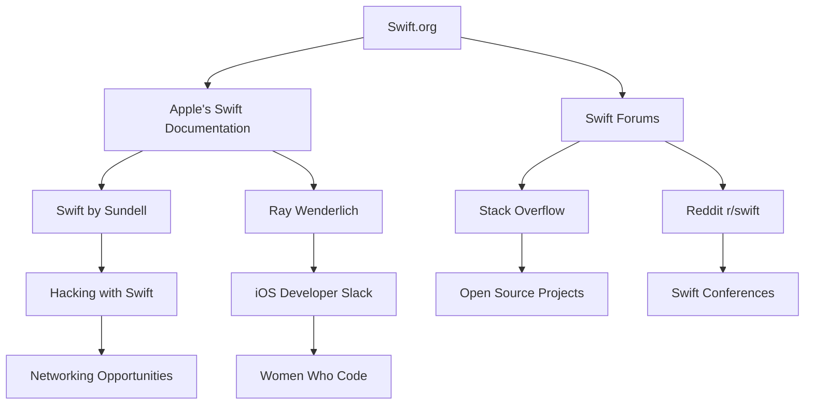

## 22.5 Online Resources and Swift Communities

Navigating the vast landscape of Swift development can be both exciting and overwhelming. With the rapid evolution of Swift and its ecosystem, staying updated and connected is crucial for developers aiming to master design patterns and build robust applications. In this section, we will explore a curated list of online resources, forums, and communities that are invaluable for Swift developers. Additionally, we will delve into opportunities for contributing to open-source Swift projects and networking within the Swift ecosystem.

### 1. Essential Online Resources for Swift Developers

#### 1.1 Apple's Official Swift Documentation

Apple's [Swift Documentation](https://developer.apple.com/documentation/swift) is the definitive source for understanding Swift's syntax, features, and capabilities. It provides comprehensive guides, API references, and sample code to help developers at all levels.

#### 1.2 Swift.org

[Swift.org](https://swift.org) is the official site for the Swift programming language. It offers insights into the language's evolution, access to the Swift source code, and information on how to contribute to its development.

#### 1.3 Swift by Sundell

[Swift by Sundell](https://www.swiftbysundell.com) is a popular blog by John Sundell, featuring articles, podcasts, and videos on Swift development. It covers a wide range of topics, from basic tutorials to advanced design patterns and best practices.

#### 1.4 Ray Wenderlich

[Ray Wenderlich](https://www.raywenderlich.com) is a renowned resource for iOS and Swift tutorials. The site offers a plethora of tutorials, courses, and books authored by industry experts, making it an excellent learning platform for developers.

#### 1.5 Hacking with Swift

[Hacking with Swift](https://www.hackingwithswift.com) by Paul Hudson provides a wealth of resources, including tutorials, books, and challenges. It is particularly known for its practical approach to learning Swift through hands-on projects.

### 2. Forums and Discussion Platforms

#### 2.1 Stack Overflow

[Stack Overflow](https://stackoverflow.com) is a go-to platform for developers seeking solutions to coding problems. The Swift tag on Stack Overflow is highly active, with a vibrant community of developers ready to assist with queries.

#### 2.2 Swift Forums

The [Swift Forums](https://forums.swift.org) are the official discussion boards for the Swift language. They are a great place to engage with the Swift community, discuss language proposals, and stay informed about the latest developments.

#### 2.3 Reddit - r/swift

The [r/swift](https://www.reddit.com/r/swift/) subreddit is a community-driven space where developers share news, tutorials, and discussions related to Swift. It is a valuable resource for staying updated on Swift-related topics.

#### 2.4 iOS Developer Slack

The [iOS Developer Slack](https://ios-developers.io) is a community of iOS and Swift developers who collaborate and share knowledge. Joining this Slack group provides opportunities for networking and learning from peers.

### 3. Contributing to Open-Source Swift Projects

#### 3.1 Getting Started with Open Source

Contributing to open-source projects is an excellent way to enhance your skills and give back to the community. Start by exploring repositories on [GitHub](https://github.com) that interest you. Look for projects labeled with "good first issue" to find beginner-friendly contributions.

#### 3.2 Popular Open-Source Swift Projects

- **Alamofire**: A robust networking library for Swift.
- **Vapor**: A popular server-side Swift framework.
- **SwiftLint**: A tool to enforce Swift style and conventions.
- **RxSwift**: A library for reactive programming in Swift.

#### 3.3 How to Contribute

1. **Identify a Project**: Choose a project that aligns with your interests and skill level.
2. **Understand the Codebase**: Spend time reading the project's documentation and code to understand its structure and functionality.
3. **Engage with the Community**: Join the project's discussion forums or Slack channels to connect with maintainers and other contributors.
4. **Submit Contributions**: Start with small contributions, such as bug fixes or documentation improvements, before tackling more complex tasks.

### 4. Networking Opportunities within the Swift Ecosystem

#### 4.1 Swift Conferences and Meetups

Attending conferences and meetups is a great way to network with other developers and learn from industry experts. Some notable Swift events include:

- **Swift Summit**: An annual conference focused on Swift development.
- **iOSDevUK**: A popular conference for iOS developers in the UK.
- **try! Swift**: A global conference series dedicated to Swift programming.

#### 4.2 Online Communities and Groups

- **Swift Weekly Brief**: A weekly newsletter summarizing the latest Swift news and updates.
- **Swift Users Group**: A global community of Swift enthusiasts who organize meetups and events.
- **Women Who Code**: An inclusive community that supports women in technology, including Swift developers.

### 5. Visualizing Swift's Community Ecosystem

To better understand the interconnectedness of Swift's community, let's visualize the various components that make up this ecosystem.

*Figure 1: Visualizing the Swift Community Ecosystem*

### 6. Key Takeaways

- Utilize official documentation and trusted resources to stay informed about Swift's latest features and best practices.
- Engage with online forums and communities to seek help, share knowledge, and connect with other developers.
- Contribute to open-source projects to improve your skills and give back to the community.
- Attend conferences and meetups to expand your network and learn from industry leaders.

### 7. Embrace the Journey

Remember, the journey of mastering Swift is ongoing. Stay curious, keep experimenting, and leverage the resources and communities available to you. As you progress, you'll find that the Swift ecosystem is not only a place for learning but also a vibrant community that fosters collaboration and innovation.

## Quiz Time!



### Which of the following is the official site for the Swift programming language?

- [x] Swift.org
- [ ] Swift by Sundell
- [ ] Ray Wenderlich
- [ ] Hacking with Swift

> **Explanation:** Swift.org is the official site for the Swift programming language, providing access to the language's source code and evolution information.

### What is a good starting point for contributing to open-source Swift projects?

- [x] GitHub repositories with "good first issue" labels
- [ ] Large, complex projects
- [ ] Proprietary software
- [ ] Closed-source libraries

> **Explanation:** "Good first issue" labels on GitHub repositories indicate beginner-friendly tasks, making them ideal starting points for new contributors.

### Which platform is known for providing a wealth of iOS and Swift tutorials?

- [ ] Stack Overflow
- [ ] Swift Forums
- [x] Ray Wenderlich
- [ ] Reddit r/swift

> **Explanation:** Ray Wenderlich is renowned for offering a wide range of iOS and Swift tutorials, courses, and books.

### What is the main benefit of attending Swift conferences and meetups?

- [x] Networking with other developers
- [ ] Avoiding learning new skills
- [ ] Isolating from the community
- [ ] Focusing solely on online resources

> **Explanation:** Attending conferences and meetups provides opportunities to network with other developers and learn from industry experts.

### Which of the following is a popular server-side Swift framework?

- [ ] Alamofire
- [x] Vapor
- [ ] SwiftLint
- [ ] RxSwift

> **Explanation:** Vapor is a popular framework for server-side Swift development.

### What is the primary focus of the Swift by Sundell blog?

- [x] Swift development articles and podcasts
- [ ] General programming news
- [ ] Hardware reviews
- [ ] Video game development

> **Explanation:** Swift by Sundell focuses on Swift development through articles, podcasts, and videos.

### Which community is known for supporting women in technology, including Swift developers?

- [x] Women Who Code
- [ ] Swift Users Group
- [ ] Swift Weekly Brief
- [ ] iOS Developer Slack

> **Explanation:** Women Who Code is an inclusive community that supports women in technology, including Swift developers.

### What is the primary purpose of the Swift Forums?

- [x] Discussing Swift language proposals and developments
- [ ] Sharing memes and jokes
- [ ] Selling Swift-related merchandise
- [ ] Streaming Swift development tutorials

> **Explanation:** The Swift Forums are intended for discussing Swift language proposals and developments.

### Which newsletter provides a weekly summary of the latest Swift news and updates?

- [x] Swift Weekly Brief
- [ ] Swift by Sundell
- [ ] Ray Wenderlich
- [ ] Hacking with Swift

> **Explanation:** Swift Weekly Brief is a newsletter that provides a weekly summary of the latest Swift news and updates.

### True or False: Contributing to open-source projects is a way to improve your skills and give back to the community.

- [x] True
- [ ] False

> **Explanation:** Contributing to open-source projects allows developers to enhance their skills and contribute to the community.


