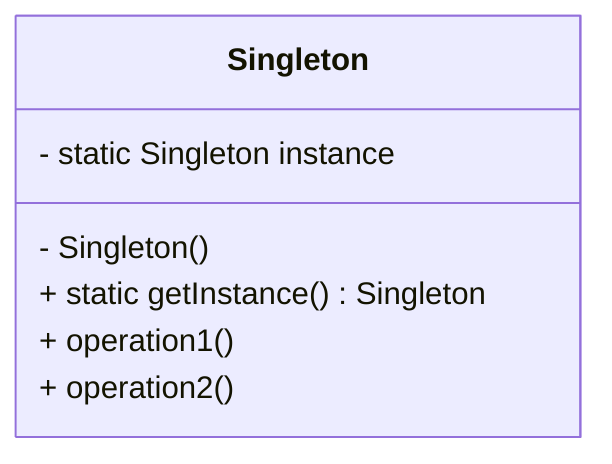
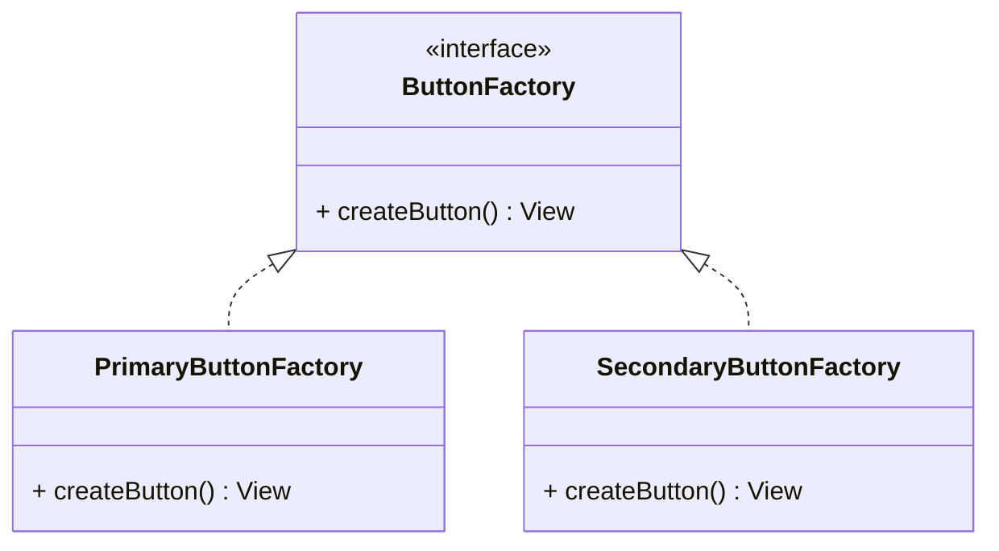

## 22.7 Sample Projects and Code Examples

In this section, we delve into the practical application of design patterns in Swift by providing sample projects and code examples. These examples are designed to enhance your understanding of how design patterns can be implemented in real-world scenarios. We will explore various design patterns, provide detailed explanations, and offer code snippets to illustrate each concept. By the end of this section, you will have a solid foundation to apply these patterns in your own Swift projects.

### Accessing Sample Projects

To get started with the sample projects, you can access our GitHub repository [here](https://github.com/SoftwarePatternsLexicon/SwiftDesignPatterns). The repository contains a collection of projects that demonstrate the implementation of different design patterns in Swift. Each project is accompanied by detailed documentation and instructions to help you understand the code and its purpose.

### Real-World Applications of Patterns

Design patterns are essential in building scalable and maintainable software. Let's explore some real-world applications of design patterns in Swift:

1. **Singleton Pattern in Network Managers**: Learn how to use the Singleton pattern to manage network requests efficiently in your iOS applications.

2. **Factory Pattern in UI Component Creation**: Discover how the Factory pattern can simplify the creation of complex UI components in SwiftUI.

3. **Observer Pattern in Data Binding**: Implement the Observer pattern to facilitate data binding between your models and views in a SwiftUI application.

4. **MVVM Pattern in SwiftUI Projects**: Explore the Model-View-ViewModel (MVVM) pattern to separate concerns and enhance testability in your SwiftUI applications.

5. **Decorator Pattern for Extending Functionality**: Use the Decorator pattern to add new functionality to existing classes without modifying their structure.

### Exercises for Hands-On Learning

To reinforce your understanding, we provide exercises that encourage hands-on learning and experimentation. These exercises are designed to challenge your problem-solving skills and help you apply design patterns in various contexts.

#### Exercise 1: Implementing the Singleton Pattern

**Objective**: Create a Singleton class to manage user settings in an iOS application.

**Instructions**:
- Define a `SettingsManager` class with a private initializer.
- Implement a static `shared` instance to provide a global point of access.
- Add methods to read and write user settings.

**Code Example**:

```swift
class SettingsManager {
    static let shared = SettingsManager()
    
    private init() {}
    
    private var settings: [String: Any] = [:]
    
    func set(value: Any, forKey key: String) {
        settings[key] = value
    }
    
    func get(forKey key: String) -> Any? {
        return settings[key]
    }
}

// Usage
SettingsManager.shared.set(value: "Dark", forKey: "Theme")
if let theme = SettingsManager.shared.get(forKey: "Theme") {
    print("Current theme is \\(theme)")
}
```

**Try It Yourself**: Modify the `SettingsManager` to persist settings using `UserDefaults`.

#### Exercise 2: Creating a Factory for UI Components

**Objective**: Implement a Factory pattern to create different types of buttons in a SwiftUI application.

**Instructions**:
- Define a `ButtonFactory` protocol with a method to create buttons.
- Implement concrete factories for different button styles (e.g., primary, secondary).

**Code Example**:

```swift
protocol ButtonFactory {
    func createButton() -> some View
}

struct PrimaryButtonFactory: ButtonFactory {
    func createButton() -> some View {
        Button(action: {}) {
            Text("Primary Button")
                .padding()
                .background(Color.blue)
                .foregroundColor(.white)
                .cornerRadius(8)
        }
    }
}

struct SecondaryButtonFactory: ButtonFactory {
    func createButton() -> some View {
        Button(action: {}) {
            Text("Secondary Button")
                .padding()
                .background(Color.gray)
                .foregroundColor(.black)
                .cornerRadius(8)
        }
    }
}

// Usage
let primaryButton = PrimaryButtonFactory().createButton()
let secondaryButton = SecondaryButtonFactory().createButton()
```

**Try It Yourself**: Add a new factory for a "danger" button style with a red background.

#### Exercise 3: Implementing the Observer Pattern

**Objective**: Use the Observer pattern to update a SwiftUI view when data changes.

**Instructions**:
- Create an `ObservableObject` class to represent the data model.
- Use `@Published` properties to automatically notify views of changes.

**Code Example**:

```swift
import SwiftUI
import Combine

class UserData: ObservableObject {
    @Published var name: String = "John Doe"
}

struct ContentView: View {
    @ObservedObject var userData = UserData()
    
    var body: some View {
        VStack {
            Text("Hello, \\(userData.name)!")
            Button("Change Name") {
                userData.name = "Jane Doe"
            }
        }
    }
}

// Usage
ContentView()
```

**Try It Yourself**: Extend the `UserData` class to include an age property and update the view accordingly.

### Visualizing Design Patterns

To better understand the relationships and interactions within design patterns, we use diagrams to visualize their structure and flow.

#### Visualizing the Singleton Pattern



**Description**: This diagram illustrates the Singleton pattern, showing a single instance accessed through a static method.

#### Visualizing the Factory Pattern



**Description**: This diagram represents the Factory pattern, highlighting the interface and concrete implementations for creating buttons.

### References and Further Reading

- [Swift.org](https://swift.org): Official Swift language documentation and resources.
- [Apple Developer Documentation](https://developer.apple.com/documentation): Comprehensive guides and API references for iOS and macOS development.
- [Ray Wenderlich](https://www.raywenderlich.com): Tutorials and articles on Swift programming and design patterns.

### Knowledge Check

To solidify your understanding of the concepts covered, try answering the following questions:

1. What is the primary purpose of the Singleton pattern?
2. How does the Factory pattern improve code maintainability?
3. What are the benefits of using the Observer pattern in SwiftUI?
4. How can you extend the functionality of a class using the Decorator pattern?
5. What is the role of the `@Published` property in SwiftUI?

### Embrace the Journey

Remember, mastering design patterns is a journey. As you continue to experiment and apply these patterns, you'll gain deeper insights and become more proficient in Swift development. Stay curious, keep learning, and enjoy the process!

## Quiz Time!



### What is the primary purpose of the Singleton pattern?

- [x] To ensure a class has only one instance
- [ ] To create multiple instances of a class
- [ ] To provide a global variable
- [ ] To manage memory allocation

> **Explanation:** The Singleton pattern ensures a class has only one instance and provides a global point of access to it.

### How does the Factory pattern improve code maintainability?

- [x] By decoupling object creation from the client
- [ ] By increasing the number of classes
- [ ] By simplifying object creation logic
- [ ] By reducing code duplication

> **Explanation:** The Factory pattern improves maintainability by decoupling object creation from the client, allowing for easier changes and extensions.

### What are the benefits of using the Observer pattern in SwiftUI?

- [x] Automatic updates of views when data changes
- [ ] Manual updates of views
- [ ] Reducing the number of views
- [ ] Simplifying data binding

> **Explanation:** The Observer pattern allows views to automatically update when the underlying data changes, enhancing reactivity in SwiftUI.

### How can you extend the functionality of a class using the Decorator pattern?

- [x] By wrapping the class with additional functionality
- [ ] By modifying the class directly
- [ ] By inheriting from the class
- [ ] By creating a new class

> **Explanation:** The Decorator pattern extends functionality by wrapping the class with additional features, without modifying its structure.

### What is the role of the `@Published` property in SwiftUI?

- [x] To notify views of data changes
- [ ] To store static data
- [ ] To manage view state
- [ ] To handle user input

> **Explanation:** The `@Published` property in SwiftUI is used to notify views of changes in data, triggering updates in the UI.

### Which pattern is best suited for managing global application state?

- [x] Singleton
- [ ] Factory
- [ ] Observer
- [ ] Decorator

> **Explanation:** The Singleton pattern is ideal for managing global application state, as it provides a single point of access.

### In the Factory pattern, what is the role of the interface?

- [x] To define a contract for creating objects
- [ ] To store object instances
- [ ] To manage object state
- [ ] To implement object logic

> **Explanation:** The interface in the Factory pattern defines a contract for creating objects, allowing different implementations.

### What is a key advantage of using the MVVM pattern in SwiftUI?

- [x] Separation of concerns
- [ ] Simplified UI code
- [ ] Reduced number of files
- [ ] Enhanced animation capabilities

> **Explanation:** The MVVM pattern separates concerns, making code more modular and testable, especially in SwiftUI applications.

### True or False: The Decorator pattern modifies the original class directly.

- [ ] True
- [x] False

> **Explanation:** False. The Decorator pattern does not modify the original class directly; it wraps it to add new functionality.

### Which property wrapper is used to observe changes in a SwiftUI view model?

- [x] @ObservedObject
- [ ] @State
- [ ] @Binding
- [ ] @EnvironmentObject

> **Explanation:** The `@ObservedObject` property wrapper is used to observe changes in a SwiftUI view model, allowing the view to update accordingly.



By engaging with these sample projects and exercises, you are well on your way to mastering design patterns in Swift. Keep experimenting, stay curious, and enjoy the journey!


