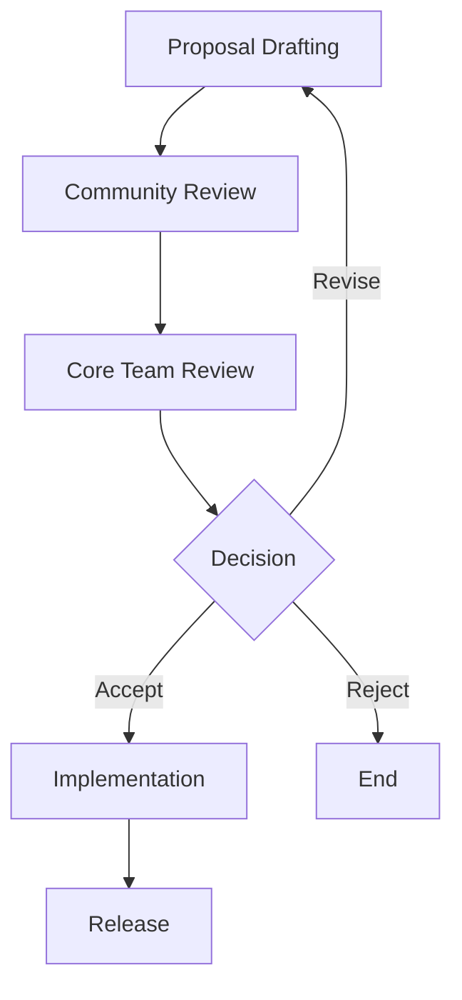

## 22.8 Swift Evolution Proposals

The Swift Evolution process is a critical component of the Swift programming language's ongoing development. It allows the community to propose, discuss, and implement changes to the language, ensuring that Swift remains modern, efficient, and expressive. In this section, we will delve into the Swift Evolution process, explore significant proposals, and examine their impact on design patterns. We will also guide you on how to participate in this dynamic process and adapt to new language features.

### Understanding the Swift Evolution Process

Swift Evolution is an open process that invites the community to contribute to the development of Swift. It is a collaborative effort involving developers from all over the world, including those from Apple, who work together to enhance the language. The process is managed through the Swift Evolution repository on GitHub, where proposals are submitted, discussed, and refined.

#### Key Stages of the Swift Evolution Process

1. **Proposal Drafting**: A proposal begins as an idea, which is then developed into a draft. This draft outlines the problem, the proposed solution, and its implications.

2. **Community Review**: Once a draft is ready, it is submitted for community review. During this stage, developers can provide feedback, suggest improvements, and discuss the proposal's merits and drawbacks.

3. **Core Team Review**: After the community review, the Swift Core Team evaluates the proposal. They consider the community's feedback and decide whether to accept, reject, or request further revisions.

4. **Implementation**: If a proposal is accepted, it moves to the implementation phase. The proposed changes are integrated into the Swift language, and thorough testing ensures they work as intended.

5. **Release**: Once implemented and tested, the new features are included in a future release of Swift.

### Significant Swift Evolution Proposals

Over the years, several proposals have significantly impacted the Swift language and its design patterns. Let's explore some of these key proposals and their implications.

#### 1. **Swift Concurrency (SE-0296)**

One of the most transformative proposals in recent years is the introduction of Swift Concurrency. This proposal brought async/await syntax and actors to Swift, enabling developers to write concurrent code more safely and intuitively.

- **Impact on Design Patterns**: Swift Concurrency has influenced several design patterns, particularly those related to asynchronous programming. Patterns like the Observer and Mediator have been adapted to leverage async/await, simplifying code and reducing boilerplate.

- **Code Example**:

```swift
// Example of async/await in Swift
func fetchData() async throws -> Data {
    let url = URL(string: "https://example.com/data")!
    let (data, _) = try await URLSession.shared.data(from: url)
    return data
}
```

#### 2. **Property Wrappers (SE-0258)**

Property wrappers provide a mechanism to define reusable code that can be applied to properties. This proposal has enabled developers to encapsulate property logic, leading to cleaner and more maintainable code.

- **Impact on Design Patterns**: Property wrappers have influenced patterns like the Decorator and Proxy, allowing developers to apply additional behavior to properties with minimal code changes.

- **Code Example**:

```swift
@propertyWrapper
struct Clamped<Value: Comparable> {
    var value: Value
    let range: ClosedRange<Value>

    var wrappedValue: Value {
        get { value }
        set { value = min(max(newValue, range.lowerBound), range.upperBound) }
    }

    init(wrappedValue: Value, _ range: ClosedRange<Value>) {
        self.value = min(max(wrappedValue, range.lowerBound), range.upperBound)
        self.range = range
    }
}

struct Temperature {
    @Clamped(0...100) var value: Int
}
```

#### 3. **Result Builders (SE-0289)**

Result builders, previously known as function builders, allow for the creation of complex data structures using a declarative syntax. This proposal has been instrumental in the development of SwiftUI, enabling the creation of views using a declarative approach.

- **Impact on Design Patterns**: Result builders have influenced the Builder pattern, allowing for more expressive and readable code when constructing complex objects.

- **Code Example**:

```swift
@resultBuilder
struct ArrayBuilder {
    static func buildBlock(_ components: Int...) -> [Int] {
        return components
    }
}

func buildArray(@ArrayBuilder _ content: () -> [Int]) -> [Int] {
    return content()
}

let numbers = buildArray {
    1
    2
    3
}
```

### How to Participate in the Swift Evolution Process

Participating in the Swift Evolution process is an excellent way to contribute to the Swift community and help shape the language's future. Here are some steps to get involved:

1. **Stay Informed**: Follow the Swift Evolution repository on GitHub and subscribe to the Swift Evolution mailing list to stay updated on new proposals and discussions.

2. **Provide Feedback**: Participate in community reviews by providing constructive feedback on proposals. Your insights can help refine proposals and ensure they meet the community's needs.

3. **Submit Proposals**: If you have an idea for improving Swift, consider drafting a proposal. Follow the Swift Evolution proposal template and guidelines to ensure your submission is well-structured and clear.

4. **Contribute to Implementation**: If you have the skills and interest, contribute to the implementation of accepted proposals. This is a great way to gain experience and collaborate with other developers.

### Adapting to New Language Features

As Swift evolves, it's essential to adapt to new language features and incorporate them into your development practices. Here are some tips for staying ahead:

- **Continuous Learning**: Regularly update your knowledge by exploring new Swift releases and understanding the changes they bring.

- **Experimentation**: Try out new features in small projects to understand their capabilities and limitations.

- **Community Engagement**: Engage with the Swift community through forums, conferences, and meetups to learn from others and share your experiences.

- **Refactoring**: Revisit existing codebases to identify areas where new language features can improve code quality and performance.

### Visualizing Swift Evolution

To better understand the Swift Evolution process and its impact, let's visualize the stages and key proposals using Mermaid.js diagrams.



**Diagram Description**: This flowchart illustrates the Swift Evolution process, from proposal drafting to release.

### Key Takeaways

- **Swift Evolution** is a collaborative process that shapes the Swift language, involving proposal drafting, community review, core team evaluation, implementation, and release.
- **Significant proposals** like Swift Concurrency, Property Wrappers, and Result Builders have transformed Swift, impacting design patterns and development practices.
- **Participation** in Swift Evolution is encouraged, offering opportunities to contribute feedback, submit proposals, and engage with the community.
- **Adapting** to new language features is crucial for staying current and improving code quality.

### Embrace the Journey

As we explore the Swift Evolution process and its impact on design patterns, remember that this is an ongoing journey. The Swift community is vibrant and ever-evolving, and your contributions can help shape the future of the language. Stay curious, keep experimenting, and enjoy the journey of mastering Swift and its design patterns!

## Quiz Time!



### What is the primary purpose of the Swift Evolution process?

- [x] To allow the community to propose, discuss, and implement changes to the Swift language
- [ ] To provide a platform for reporting bugs in Swift
- [ ] To offer tutorials and learning resources for Swift developers
- [ ] To manage the release schedule of Swift updates

> **Explanation:** The Swift Evolution process is designed to enable the community to contribute to the development of the Swift language through proposals and discussions.

### Which proposal introduced async/await syntax to Swift?

- [x] Swift Concurrency (SE-0296)
- [ ] Property Wrappers (SE-0258)
- [ ] Result Builders (SE-0289)
- [ ] Codable (SE-0166)

> **Explanation:** The Swift Concurrency proposal (SE-0296) introduced async/await syntax to the Swift language.

### How do property wrappers impact design patterns in Swift?

- [x] They allow additional behavior to be applied to properties with minimal code changes
- [ ] They replace the need for classes in Swift
- [ ] They are used to define new types in Swift
- [ ] They eliminate the need for protocols

> **Explanation:** Property wrappers encapsulate property logic, influencing patterns like Decorator and Proxy by allowing additional behavior to be applied to properties.

### What is the role of the Swift Core Team in the Swift Evolution process?

- [x] To evaluate proposals and decide whether to accept, reject, or request further revisions
- [ ] To implement all accepted proposals
- [ ] To provide tutorials and learning resources for Swift developers
- [ ] To manage the Swift Evolution GitHub repository

> **Explanation:** The Swift Core Team evaluates proposals after community review and decides on their acceptance, rejection, or revision.

### What is the benefit of using result builders in Swift?

- [x] They allow for more expressive and readable code when constructing complex objects
- [ ] They eliminate the need for functions in Swift
- [ ] They provide a way to manage memory in Swift
- [ ] They are used to define new types in Swift

> **Explanation:** Result builders enable a declarative syntax for constructing complex data structures, enhancing code readability and expressiveness.

### How can developers participate in the Swift Evolution process?

- [x] By providing feedback on proposals, submitting their own proposals, and contributing to implementation
- [ ] By attending Swift conferences only
- [ ] By using Swift in their projects
- [ ] By following Swift on social media

> **Explanation:** Developers can participate by engaging in community reviews, submitting proposals, and contributing to the implementation of accepted proposals.

### What is a key benefit of adapting to new language features in Swift?

- [x] Improved code quality and performance
- [ ] Elimination of the need for testing
- [ ] Guaranteed compatibility with all older Swift versions
- [ ] Reduced need for documentation

> **Explanation:** Adapting to new language features can lead to improved code quality and performance by leveraging modern capabilities.

### What does the Swift Evolution process encourage developers to do?

- [x] Contribute to the development of Swift by proposing and discussing changes
- [ ] Focus solely on bug fixes
- [ ] Avoid using new language features
- [ ] Keep their codebases static

> **Explanation:** The process encourages developers to actively contribute to Swift's development through proposals and discussions.

### Which of the following is NOT a stage in the Swift Evolution process?

- [ ] Proposal Drafting
- [ ] Community Review
- [x] Marketing and Promotion
- [ ] Core Team Review

> **Explanation:** Marketing and Promotion is not a stage in the Swift Evolution process, which focuses on proposal drafting, review, and implementation.

### True or False: The Swift Evolution process is managed through a mailing list only.

- [ ] True
- [x] False

> **Explanation:** The Swift Evolution process is managed through the Swift Evolution repository on GitHub, where proposals are submitted and discussed, in addition to a mailing list for communication.




