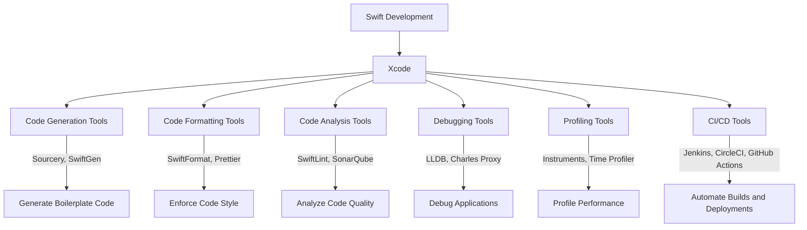

## 22.9 Swift Development Tools and IDE Extensions

In the dynamic world of Swift development, leveraging the right tools and extensions can significantly enhance productivity, code quality, and overall development experience. This section delves into the essential tools and IDE extensions that are indispensable for Swift developers, focusing on plugins and utilities that streamline code generation, formatting, and analysis.

### Introduction to Swift Development Tools

Swift, Apple's powerful and intuitive programming language, is widely used for developing iOS, macOS, watchOS, and tvOS applications. While the language itself is robust, the development process can be further optimized through the use of specialized tools and IDE extensions. These tools not only aid in writing cleaner code but also automate repetitive tasks, enforce coding standards, and provide insights into code performance and structure.

### Xcode: The Heart of Swift Development

Xcode is the primary Integrated Development Environment (IDE) for Swift development. It provides a comprehensive suite of tools for building apps across Apple platforms. Let's explore some of the key features and extensions that make Xcode an indispensable tool for Swift developers.

#### Key Features of Xcode

- **Interface Builder**: A visual tool for designing user interfaces.
- **Swift Playgrounds**: An interactive environment for experimenting with Swift code.
- **Source Editor**: A powerful code editor with syntax highlighting, code completion, and refactoring tools.
- **Instruments**: A performance analysis tool to profile and optimize applications.
- **Simulator**: Allows testing of apps on different devices and configurations.

#### Essential Xcode Extensions

1. **Alcatraz**: A package manager for Xcode that simplifies the installation of plugins, templates, and themes.
   
2. **CocoaPods**: A dependency manager for Swift and Objective-C projects. It simplifies the process of integrating third-party libraries into Xcode projects.

3. **SwiftLint**: A tool to enforce Swift style and conventions. It integrates seamlessly with Xcode to highlight style violations in real-time.

4. **XcodeGen**: A command-line tool that generates Xcode project files from a YAML configuration file. It is particularly useful for managing complex projects with multiple targets and configurations.

5. **FengNiao**: A command-line tool for cleaning up unused resources in Xcode projects. It helps reduce the size of the project by removing unnecessary files.

6. **XCGLogger**: A logging library for Xcode that provides advanced logging capabilities, including log levels, colors, and file logging.

### Code Generation Tools

Code generation tools automate the creation of boilerplate code, reducing manual effort and minimizing errors. Here are some popular tools for Swift code generation:

- **Sourcery**: A code generation tool that uses templates to generate boilerplate code. It is highly customizable and integrates well with Swift projects.

- **SwiftGen**: A tool for generating Swift code for assets, storyboards, strings, and more. It ensures type safety and reduces runtime errors by generating code from resources.

- **SwiftPlate**: A tool for generating Swift project templates. It simplifies the process of setting up new projects with predefined configurations and structures.

### Code Formatting and Analysis

Maintaining a consistent code style is crucial for collaboration and code readability. Code formatting tools help enforce coding standards and improve code quality.

#### Code Formatting Tools

- **SwiftFormat**: A code formatter for Swift that enforces a consistent coding style. It can be integrated into Xcode or run as a command-line tool.

- **Prettier**: Although primarily used for JavaScript, Prettier supports Swift through plugins. It automatically formats code according to a predefined style.

#### Code Analysis Tools

- **SonarQube**: A static code analysis tool that detects bugs, vulnerabilities, and code smells. It provides detailed reports and metrics to improve code quality.

- **SwiftLint**: In addition to style enforcement, SwiftLint performs static analysis to detect potential issues in Swift code.

### Debugging and Profiling Tools

Debugging and profiling tools are essential for identifying and resolving issues in Swift applications. They provide insights into code performance and help optimize resource usage.

#### Debugging Tools

- **LLDB**: The default debugger in Xcode, providing powerful debugging capabilities for Swift and Objective-C code.

- **Charles Proxy**: A web debugging proxy that allows developers to view and analyze network traffic. It is useful for debugging API calls and network-related issues.

#### Profiling Tools

- **Instruments**: A performance analysis tool integrated into Xcode. It provides a range of templates for profiling CPU, memory, disk, and network usage.

- **Time Profiler**: A tool within Instruments that helps identify performance bottlenecks by analyzing CPU usage.

### Continuous Integration and Deployment

Continuous Integration (CI) and Continuous Deployment (CD) are essential practices for modern software development. They automate the process of building, testing, and deploying applications, ensuring faster and more reliable releases.

#### Popular CI/CD Tools

- **Jenkins**: An open-source automation server that supports building, testing, and deploying Swift applications.

- **CircleCI**: A cloud-based CI/CD platform that integrates seamlessly with GitHub and Bitbucket. It provides fast and reliable builds for Swift projects.

- **GitHub Actions**: A CI/CD platform integrated into GitHub, allowing developers to automate workflows directly from their repositories.

### Try It Yourself: Experimenting with Xcode Extensions

To get hands-on experience with Xcode extensions, try installing and configuring some of the tools mentioned above. For example, integrate SwiftLint into your Xcode project to enforce coding standards and run SwiftFormat to automatically format your code. Experiment with different configurations and observe how these tools enhance your development workflow.

### Visualizing Tool Integration

To better understand how these tools fit into the Swift development workflow, let's visualize the integration of some key tools using a flowchart.

### Knowledge Check: Key Takeaways

- **Xcode** is the primary IDE for Swift development, offering a comprehensive suite of tools for building Apple platform applications.
- **Code generation tools** automate the creation of boilerplate code, reducing manual effort and minimizing errors.
- **Code formatting and analysis tools** help maintain a consistent code style and improve code quality.
- **Debugging and profiling tools** are essential for identifying and resolving issues in Swift applications.
- **CI/CD tools** automate the process of building, testing, and deploying applications, ensuring faster and more reliable releases.

### References and Further Reading

- [Apple Developer Documentation](https://developer.apple.com/documentation/)
- [Swift.org](https://swift.org/)
- [Xcode User Guide](https://developer.apple.com/library/archive/documentation/IDEs/Conceptual/xcode_guide/)
- [CocoaPods](https://cocoapods.org/)
- [SwiftLint GitHub Repository](https://github.com/realm/SwiftLint)

### Embrace the Journey

Remember, mastering Swift development tools and extensions is an ongoing journey. As you explore and experiment with different tools, you'll discover new ways to enhance your productivity and code quality. Stay curious, keep experimenting, and enjoy the process of becoming a more proficient Swift developer!

## Quiz Time!



### Which tool is primarily used for dependency management in Swift projects?

- [x] CocoaPods
- [ ] SwiftLint
- [ ] XcodeGen
- [ ] Alcatraz

> **Explanation:** CocoaPods is a dependency manager for Swift and Objective-C projects, simplifying the integration of third-party libraries.

### What is the primary purpose of SwiftLint?

- [x] Enforce Swift style and conventions
- [ ] Generate boilerplate code
- [ ] Profile application performance
- [ ] Manage dependencies

> **Explanation:** SwiftLint is a tool that enforces Swift style and conventions by highlighting style violations in real-time.

### Which tool is used for cleaning up unused resources in Xcode projects?

- [x] FengNiao
- [ ] SwiftGen
- [ ] SwiftFormat
- [ ] XCGLogger

> **Explanation:** FengNiao is a command-line tool for cleaning up unused resources in Xcode projects, helping reduce project size.

### What is the role of Instruments in Xcode?

- [x] Performance analysis and profiling
- [ ] Code generation
- [ ] Dependency management
- [ ] Code formatting

> **Explanation:** Instruments is a performance analysis tool integrated into Xcode, providing templates for profiling CPU, memory, disk, and network usage.

### Which tool can be used to generate Swift code for assets, storyboards, and strings?

- [x] SwiftGen
- [ ] Sourcery
- [ ] SwiftPlate
- [ ] SwiftLint

> **Explanation:** SwiftGen is a tool for generating Swift code for assets, storyboards, strings, and more, ensuring type safety and reducing runtime errors.

### Which CI/CD tool is integrated directly into GitHub?

- [x] GitHub Actions
- [ ] Jenkins
- [ ] CircleCI
- [ ] Travis CI

> **Explanation:** GitHub Actions is a CI/CD platform integrated into GitHub, allowing developers to automate workflows directly from their repositories.

### What is the primary function of XcodeGen?

- [x] Generate Xcode project files
- [ ] Enforce coding standards
- [ ] Debug network traffic
- [ ] Profile application performance

> **Explanation:** XcodeGen is a command-line tool that generates Xcode project files from a YAML configuration file, useful for managing complex projects.

### Which tool provides advanced logging capabilities in Xcode?

- [x] XCGLogger
- [ ] SwiftLint
- [ ] Prettier
- [ ] Charles Proxy

> **Explanation:** XCGLogger is a logging library for Xcode that provides advanced logging capabilities, including log levels, colors, and file logging.

### What is the primary advantage of using code generation tools in Swift development?

- [x] Automate creation of boilerplate code
- [ ] Enforce code style
- [ ] Profile application performance
- [ ] Debug network traffic

> **Explanation:** Code generation tools automate the creation of boilerplate code, reducing manual effort and minimizing errors.

### True or False: Prettier is primarily used for JavaScript but supports Swift through plugins.

- [x] True
- [ ] False

> **Explanation:** Prettier is primarily used for JavaScript but supports Swift through plugins, automatically formatting code according to a predefined style.


