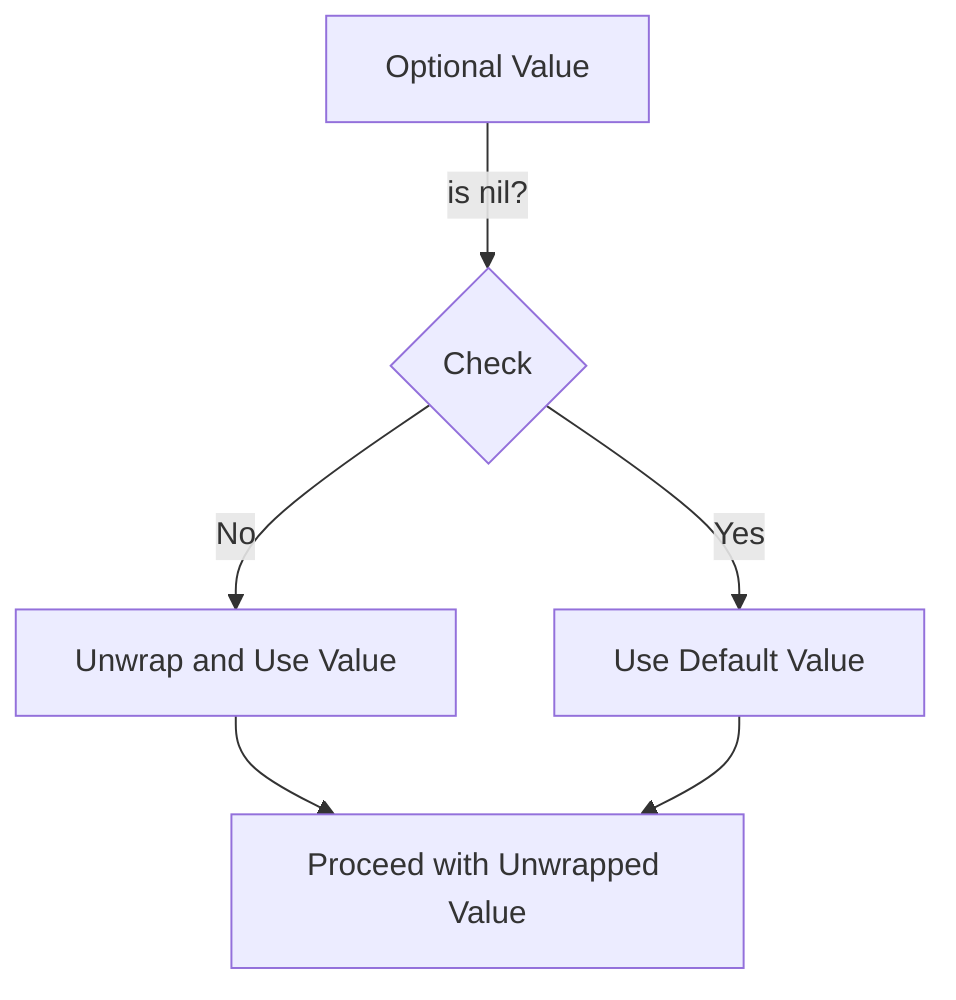

## 3.1 Optionals and Safe Unwrapping Techniques

In Swift, optionals are a powerful feature that allows developers to handle the absence of a value in a type-safe way. This section delves into understanding optionals, their usage, and various techniques for safely unwrapping them.

### Understanding Optionals

Optionals in Swift represent the possibility of a value being absent. This is crucial in scenarios where a variable might not have a value, such as when fetching data from a network or reading from a file. Swift's type system enforces handling these cases explicitly, reducing runtime errors and improving code safety.

#### Declaring Optionals

An optional is declared by appending a question mark (`?`) to the type. For example, an optional integer is declared as `Int?`.

```swift
var optionalNumber: Int?
```

Here, `optionalNumber` can hold an integer value or `nil`.

#### Why Use Optionals?

Optionals are essential for:
- **Safety**: They prevent null pointer exceptions by forcing developers to handle the absence of a value.
- **Clarity**: They make the code more readable by explicitly indicating which variables can be `nil`.

### Forced Unwrapping (`!`)

Forced unwrapping is a way to access the value of an optional directly, assuming it is not `nil`. It is done using the exclamation mark (`!`).

```swift
var optionalString: String? = "Hello, Swift!"
let unwrappedString: String = optionalString!
```

#### When to Use Forced Unwrapping

- **Certainty**: Use forced unwrapping only when you are absolutely certain that the optional contains a value.
- **Debugging**: It can be useful during debugging to quickly access optional values.

#### Pitfalls of Forced Unwrapping

- **Runtime Crashes**: If an optional is `nil` and you attempt to force unwrap it, your program will crash.
- **Code Smell**: Overusing forced unwrapping can lead to less readable and maintainable code.

### Optional Binding (`if let`, `guard let`)

Optional binding is a safer way to unwrap optionals, allowing you to check if an optional contains a value and use it within a certain scope.

#### `if let` Syntax

The `if let` construct allows you to bind an optional's value to a new variable if it is non-nil.

```swift
var optionalName: String? = "John Doe"

if let name = optionalName {
    print("Hello, \\(name)!")
} else {
    print("No name provided.")
}
```

#### `guard let` Syntax

`guard let` is used to exit a function or loop early if an optional is `nil`. It is often used in functions to validate input parameters.

```swift
func greet(person: String?) {
    guard let name = person else {
        print("No name provided.")
        return
    }
    print("Hello, \\(name)!")
}
```

#### Benefits of Optional Binding

- **Safety**: Prevents runtime crashes by ensuring optionals are non-nil before use.
- **Readability**: Makes code easier to read and understand by clearly defining the scope of the unwrapped value.

### Nil-Coalescing Operator (`??`)

The nil-coalescing operator provides a default value for an optional that is `nil`.

```swift
let optionalColor: String? = nil
let defaultColor = "Blue"
let chosenColor = optionalColor ?? defaultColor
print("The chosen color is \\(chosenColor).")
```

#### Use Cases for Nil-Coalescing

- **Default Values**: Use it to provide fallback values when an optional is `nil`.
- **Simplified Code**: Reduces the need for verbose `if` statements to check for `nil`.

### Advanced Unwrapping Techniques

#### Optional Chaining

Optional chaining allows you to safely call properties, methods, and subscripts on optional that might currently be `nil`.

```swift
class Person {
    var residence: Residence?
}

class Residence {
    var numberOfRooms = 1
}

let john = Person()
if let roomCount = john.residence?.numberOfRooms {
    print("John's residence has \\(roomCount) room(s).")
} else {
    print("Unable to retrieve the number of rooms.")
}
```

#### Implicitly Unwrapped Optionals

Implicitly unwrapped optionals are optionals that are assumed to always have a value after they are initially set, and can be used without unwrapping.

```swift
var assumedString: String! = "Hello, World!"
let definiteString: String = assumedString
```

#### Pattern Matching with `switch`

Swift's `switch` statement can be used for pattern matching with optionals.

```swift
let someValue: Int? = 42

switch someValue {
case .some(let value):
    print("Value is \\(value)")
case .none:
    print("Value is nil")
}
```

### Try It Yourself

Experiment with the following code snippets to deepen your understanding of optionals and unwrapping techniques:

1. Modify the `optionalName` variable to `nil` and observe how the `if let` and `guard let` constructs behave.
2. Change the `optionalColor` to a non-nil value and see how the nil-coalescing operator reacts.
3. Create a class with optional properties and practice optional chaining.

### Visualizing Optionals and Unwrapping

To better understand how optionals and unwrapping work, consider the following flowchart:



This diagram illustrates the decision-making process when handling optionals: checking for `nil`, providing a default, or unwrapping safely.

### References and Links

- [Swift Language Guide: Optionals](https://docs.swift.org/swift-book/LanguageGuide/TheBasics.html#ID330)
- [Apple Developer Documentation on Optionals](https://developer.apple.com/documentation/swift/optional)
- [Swift.org: Safe Unwrapping](https://swift.org/documentation/api-design-guidelines/)

### Knowledge Check

Before moving on, consider the following questions to test your understanding:

- What is the primary purpose of optionals in Swift?
- When should you avoid using forced unwrapping?
- How does optional binding improve code safety?

### Embrace the Journey

Remember, mastering optionals and safe unwrapping techniques is a crucial step in becoming proficient in Swift. As you progress, you'll find these concepts invaluable in building robust and error-free applications. Keep experimenting, stay curious, and enjoy the journey!

## Quiz Time!



### What is an optional in Swift?

- [x] A type that can hold a value or `nil`
- [ ] A type that always has a value
- [ ] A type that can only hold integers
- [ ] A type that can only hold strings

> **Explanation:** An optional in Swift is a type that can hold a value or `nil`, indicating the absence of a value.

### When is it safe to use forced unwrapping?

- [x] When you are certain the optional contains a value
- [ ] When the optional is `nil`
- [ ] When you want to avoid using `if let`
- [ ] When you want to simplify your code

> **Explanation:** Forced unwrapping is safe when you are certain the optional contains a value. Otherwise, it can lead to runtime crashes.

### What does the nil-coalescing operator (`??`) do?

- [x] Provides a default value for an optional that is `nil`
- [ ] Forces an optional to be non-nil
- [ ] Converts a non-optional to an optional
- [ ] Unwraps an optional without checking for `nil`

> **Explanation:** The nil-coalescing operator provides a default value for an optional that is `nil`, ensuring a non-optional result.

### How does `if let` improve code safety?

- [x] By safely unwrapping optionals only if they contain a value
- [ ] By forcing optionals to be non-nil
- [ ] By converting optionals to non-optionals
- [ ] By ignoring nil values

> **Explanation:** `if let` improves code safety by safely unwrapping optionals only if they contain a value, preventing runtime crashes.

### What is the purpose of optional chaining?

- [x] To safely call properties, methods, and subscripts on an optional
- [ ] To force unwrap an optional
- [ ] To convert an optional to a non-optional
- [ ] To provide a default value for an optional

> **Explanation:** Optional chaining allows you to safely call properties, methods, and subscripts on an optional, returning `nil` if the optional is `nil`.

### Which keyword is used for early exit in functions when using optional binding?

- [x] `guard`
- [ ] `if`
- [ ] `switch`
- [ ] `case`

> **Explanation:** The `guard` keyword is used for early exit in functions when using optional binding, ensuring that the function exits if the optional is `nil`.

### What is an implicitly unwrapped optional?

- [x] An optional that is assumed to always have a value after it is initially set
- [ ] An optional that can never be `nil`
- [ ] An optional that is always `nil`
- [ ] A non-optional value

> **Explanation:** An implicitly unwrapped optional is an optional that is assumed to always have a value after it is initially set, allowing it to be used without unwrapping.

### What is the result of using the nil-coalescing operator on a non-nil optional?

- [x] The value of the optional
- [ ] The default value provided
- [ ] `nil`
- [ ] An error

> **Explanation:** When the nil-coalescing operator is used on a non-nil optional, the result is the value of the optional, not the default value.

### True or False: Optional chaining can be used to call methods on a `nil` optional.

- [x] True
- [ ] False

> **Explanation:** True. Optional chaining can be used to call methods on a `nil` optional, returning `nil` if the optional is `nil`.

### Which of the following is a benefit of using optionals in Swift?

- [x] Prevents null pointer exceptions
- [ ] Forces all values to be non-nil
- [ ] Simplifies code by ignoring nil values
- [ ] Automatically converts all types to optionals

> **Explanation:** Optionals prevent null pointer exceptions by forcing developers to handle the absence of a value explicitly.




