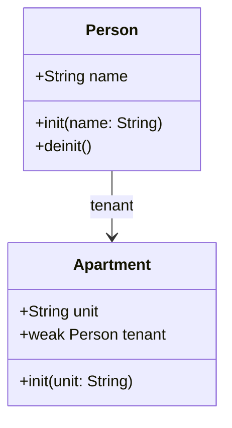

## 3.10 Memory Management and Automatic Reference Counting (ARC)

Memory management is a crucial aspect of software development, particularly in environments like iOS and macOS, where resource efficiency is paramount. Swift, as a modern programming language, employs Automatic Reference Counting (ARC) to manage memory usage efficiently. In this section, we will explore how ARC works, the concepts of strong, weak, and unowned references, and strategies for identifying and resolving memory leaks.

### Understanding ARC: The Basics

Automatic Reference Counting (ARC) is a memory management feature in Swift that automatically tracks and manages the memory usage of your app. Unlike manual memory management, ARC eliminates the need for developers to manually allocate and deallocate memory, reducing the risk of memory leaks and other related issues.

#### How ARC Works

ARC works by keeping a count of the references to each instance of a class. When you create a new instance of a class, ARC allocates a chunk of memory to store information about that instance. As you assign the instance to properties, constants, and variables, ARC increases the reference count. When the reference count drops to zero, ARC deallocates the instance and frees up the memory.

Here's a simple example to illustrate how ARC manages memory:

```swift
class Person {
    let name: String
    
    init(name: String) {
        self.name = name
        print("\\(name) is being initialized")
    }
    
    deinit {
        print("\\(name) is being deinitialized")
    }
}

var person1: Person? = Person(name: "John")
person1 = nil // This will trigger the deinitialization
```

In this example, when `person1` is set to `nil`, the reference count for the `Person` instance drops to zero, triggering the deinitialization.

### Strong References: The Default Behavior

By default, all references in Swift are strong references. A strong reference means that the reference count of an instance is incremented when a reference is assigned to it. This ensures that the instance remains in memory as long as there is at least one strong reference pointing to it.

#### Example of Strong References

```swift
class Car {
    let model: String
    
    init(model: String) {
        self.model = model
    }
}

var car1: Car? = Car(model: "Tesla")
var car2 = car1

car1 = nil
// car2 still holds a strong reference, so the Car instance is not deallocated
```

In this example, even when `car1` is set to `nil`, the `Car` instance remains in memory because `car2` still holds a strong reference.

### Weak and Unowned References: Avoiding Retain Cycles

Strong references can lead to retain cycles, where two or more instances hold strong references to each other, preventing ARC from deallocating them. To avoid retain cycles, Swift provides weak and unowned references.

#### Weak References

A weak reference does not increase the reference count of an instance. It allows the instance to be deallocated even if the weak reference still exists. Weak references are declared using the `weak` keyword and are always optional, as they can become `nil` when the instance is deallocated.

```swift
class Apartment {
    let unit: String
    weak var tenant: Person?
    
    init(unit: String) {
        self.unit = unit
    }
}

var john: Person? = Person(name: "John")
var unit4A: Apartment? = Apartment(unit: "4A")

unit4A?.tenant = john
john = nil
// The Person instance is deallocated, and tenant becomes nil
```

#### Unowned References

An unowned reference is similar to a weak reference but is non-optional. It assumes that the instance it references will never be deallocated as long as the unowned reference exists. Use unowned references when you are certain that the referenced instance will always have a longer lifetime than the reference itself.

```swift
class Customer {
    let name: String
    var card: CreditCard?
    
    init(name: String) {
        self.name = name
    }
}

class CreditCard {
    let number: String
    unowned let customer: Customer
    
    init(number: String, customer: Customer) {
        self.number = number
        self.customer = customer
    }
}

var johnDoe: Customer? = Customer(name: "John Doe")
johnDoe?.card = CreditCard(number: "1234-5678-9012-3456", customer: johnDoe!)
johnDoe = nil
// Both Customer and CreditCard instances are deallocated
```

### Identifying and Resolving Memory Leaks

Memory leaks occur when memory that is no longer needed is not released, leading to increased memory usage and potential app crashes. Here are some strategies to identify and resolve memory leaks:

#### Using Xcode Instruments

Xcode provides powerful tools like Instruments to help you identify memory leaks. The Leaks instrument can be used to track down memory that is not being properly deallocated.

1. Open your project in Xcode.
2. Choose Product > Profile.
3. Select the Leaks instrument and start profiling your app.
4. Look for any memory leaks and investigate the root cause.

#### Code Review and Refactoring

Regular code reviews and refactoring can help identify potential memory leaks. Pay attention to strong reference cycles and ensure that weak or unowned references are used appropriately.

#### Using Third-Party Tools

There are several third-party tools available that can help identify memory leaks in Swift applications. These tools can provide additional insights and help automate the detection process.

### Visualizing ARC and Memory Management

To better understand how ARC manages memory, let's visualize the relationships between objects and references using a diagram.



In this diagram, `Person` and `Apartment` are classes with a weak reference from `Apartment` to `Person`. This setup prevents a retain cycle and allows ARC to deallocate the `Person` instance when it is no longer needed.

### Best Practices for Memory Management in Swift

- **Use Strong References Judiciously**: Default to strong references, but be mindful of potential retain cycles.
- **Leverage Weak and Unowned References**: Use weak references for optional relationships and unowned references for non-optional relationships where the referenced instance has a longer lifetime.
- **Regularly Profile Your App**: Use Xcode Instruments to identify memory leaks and optimize memory usage.
- **Refactor Code Regularly**: Regular refactoring helps identify and resolve potential memory management issues.
- **Stay Informed**: Keep up with Swift's updates and best practices for memory management.

### Try It Yourself

Experiment with the code examples provided in this section. Try modifying the relationships between objects and observe how ARC manages memory. For instance, change a weak reference to a strong reference and see how it affects memory deallocation.

### Conclusion

Understanding and mastering memory management in Swift through ARC is essential for developing efficient and robust applications. By leveraging strong, weak, and unowned references appropriately, you can prevent memory leaks and ensure optimal resource usage. Remember, this is just the beginning. As you progress, you'll build more complex and interactive applications. Keep experimenting, stay curious, and enjoy the journey!

## Quiz Time!



### What is Automatic Reference Counting (ARC) in Swift?

- [x] A memory management feature that automatically tracks and manages memory usage.
- [ ] A manual memory management technique.
- [ ] A debugging tool for memory leaks.
- [ ] A design pattern for object creation.

> **Explanation:** ARC is a memory management feature in Swift that automatically tracks and manages memory usage, eliminating the need for manual memory management.

### Which type of reference does not increase the reference count of an instance?

- [ ] Strong reference
- [x] Weak reference
- [ ] Constant reference
- [ ] Temporary reference

> **Explanation:** Weak references do not increase the reference count of an instance, allowing it to be deallocated even if the weak reference still exists.

### What is a potential issue caused by strong references?

- [x] Retain cycles
- [ ] Memory underflow
- [ ] Data corruption
- [ ] Compiler errors

> **Explanation:** Strong references can lead to retain cycles, where two or more instances hold strong references to each other, preventing ARC from deallocating them.

### What keyword is used to declare a weak reference in Swift?

- [ ] unowned
- [x] weak
- [ ] optional
- [ ] nullable

> **Explanation:** The `weak` keyword is used to declare a weak reference in Swift, allowing the referenced instance to be deallocated even if the weak reference still exists.

### What is the main difference between weak and unowned references?

- [x] Weak references are optional, while unowned references are non-optional.
- [ ] Weak references increase the reference count, while unowned references do not.
- [ ] Weak references are used for non-optional relationships, while unowned references are used for optional relationships.
- [ ] Weak references are faster than unowned references.

> **Explanation:** Weak references are optional and can become `nil` when the instance is deallocated, while unowned references are non-optional and assume the instance will never be deallocated.

### How can you identify memory leaks in a Swift application?

- [x] Using Xcode Instruments
- [ ] By manually counting references
- [ ] By using the Swift compiler
- [ ] By reading the documentation

> **Explanation:** Xcode Instruments provides tools like the Leaks instrument to help identify memory leaks in Swift applications.

### What is a retain cycle?

- [x] A situation where two or more objects hold strong references to each other, preventing deallocation.
- [ ] A process of incrementing the reference count of an instance.
- [ ] A method of manually managing memory.
- [ ] A type of memory leak caused by weak references.

> **Explanation:** A retain cycle occurs when two or more objects hold strong references to each other, preventing ARC from deallocating them.

### Which reference type should be used for non-optional relationships where the referenced instance has a longer lifetime?

- [ ] Weak reference
- [x] Unowned reference
- [ ] Strong reference
- [ ] Constant reference

> **Explanation:** Unowned references are used for non-optional relationships where the referenced instance has a longer lifetime than the reference itself.

### What is the purpose of the `deinit` method in Swift?

- [x] To perform cleanup before an instance is deallocated.
- [ ] To initialize an instance.
- [ ] To increase the reference count of an instance.
- [ ] To create a new instance of a class.

> **Explanation:** The `deinit` method is used to perform any necessary cleanup before an instance is deallocated, such as releasing resources or saving data.

### True or False: Weak references can become `nil` when the referenced instance is deallocated.

- [x] True
- [ ] False

> **Explanation:** Weak references are optional and can become `nil` when the referenced instance is deallocated, allowing ARC to free up memory.




