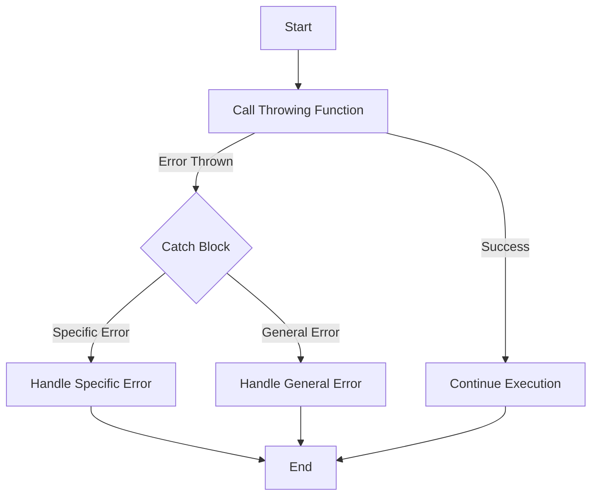

## 3.11 Error Handling with Do-Try-Catch

Error handling is a critical aspect of robust software development, ensuring that your application can gracefully manage unexpected situations and continue to operate or fail gracefully. In Swift, error handling is elegantly managed using the `do-try-catch` construct, throwing functions, and custom error types. This section will guide you through these concepts, providing you with the tools to handle errors effectively in your Swift applications.

### Throwing Functions: Indicating That Errors Can Be Thrown

In Swift, functions can be marked as "throwing" functions, which indicates that they can throw an error during execution. This is done by appending the `throws` keyword to the function signature. A throwing function must be called within a `do` block and handled using `try` and `catch`.

#### Defining a Throwing Function

To define a throwing function, use the `throws` keyword before the return type:

```swift
enum FileError: Error {
    case fileNotFound
    case unreadable
    case encodingFailed
}

func readFile(at path: String) throws -> String {
    guard path == "validPath" else {
        throw FileError.fileNotFound
    }
    // Simulate reading file content
    return "File content"
}
```

In this example, `readFile(at:)` is a throwing function that throws a `FileError` if the file cannot be found.

### Do-Try-Catch Blocks: Handling Errors Gracefully

The `do-try-catch` construct is used to handle errors thrown by functions. It allows you to attempt an operation and catch any errors that occur, providing a way to respond to different error conditions.

#### Using Do-Try-Catch

Here's how you can use `do-try-catch` to handle errors:

```swift
do {
    let content = try readFile(at: "invalidPath")
    print(content)
} catch FileError.fileNotFound {
    print("Error: File not found.")
} catch FileError.unreadable {
    print("Error: File is unreadable.")
} catch {
    print("An unexpected error occurred: \\(error).")
}
```

- **`do` Block:** Encapsulates the code that may throw an error.
- **`try` Keyword:** Indicates that the following operation may throw an error.
- **`catch` Blocks:** Handle specific errors. You can have multiple `catch` blocks for different error types or a general `catch` block for any error.

### Propagating Errors: Using `throws` in Function Definitions

Sometimes, you may want to propagate an error to the caller rather than handle it immediately. This is done by marking the function with `throws` and not using `do-try-catch` within the function itself.

#### Example of Error Propagation

```swift
func processFile(at path: String) throws {
    let content = try readFile(at: path)
    print(content)
}

do {
    try processFile(at: "invalidPath")
} catch {
    print("Failed to process file: \\(error).")
}
```

Here, `processFile(at:)` propagates any errors thrown by `readFile(at:)` to its caller.

### Custom Error Types: Defining Meaningful Error Information

Swift allows you to define custom error types, providing more context and detail about what went wrong. Custom error types are typically defined as enums conforming to the `Error` protocol.

#### Creating a Custom Error Type

```swift
enum NetworkError: Error {
    case badURL
    case requestFailed(reason: String)
    case unknown
}

func fetchData(from urlString: String) throws {
    guard urlString == "validURL" else {
        throw NetworkError.badURL
    }
    // Simulate network request
}

do {
    try fetchData(from: "invalidURL")
} catch NetworkError.badURL {
    print("The URL provided was invalid.")
} catch NetworkError.requestFailed(let reason) {
    print("Request failed: \\(reason)")
} catch {
    print("An unknown error occurred: \\(error).")
}
```

- **Enum Cases:** Define specific error conditions.
- **Associated Values:** Provide additional context for the error.

### Visualizing Error Handling Flow

Understanding the flow of error handling can be enhanced with a visual representation. Below is a flowchart illustrating the `do-try-catch` process:



This flowchart shows how execution proceeds through a `do-try-catch` block, handling errors at different levels.

### Best Practices for Error Handling in Swift

1. **Use Specific Error Types:** Define specific error types for different error conditions to provide clarity.
2. **Handle Errors Appropriately:** Use `do-try-catch` to handle errors where they occur or propagate them to be handled at a higher level.
3. **Provide Meaningful Error Messages:** Use associated values in enums to provide additional context.
4. **Avoid Silent Failures:** Always handle errors explicitly to avoid unexpected behavior.
5. **Consider User Experience:** When handling errors in UI applications, provide user-friendly messages and recovery options.

### Try It Yourself

Experiment with the code examples provided by modifying them to handle different scenarios:

- **Add a new error case** to the `FileError` enum and handle it in the `do-try-catch` block.
- **Modify the `readFile(at:)` function** to throw different errors based on the input path.
- **Create a new function** that uses `throws` and call it within a `do-try-catch` block.

### References and Further Reading

- [Swift.org Error Handling](https://docs.swift.org/swift-book/LanguageGuide/ErrorHandling.html)
- [Apple's Swift Programming Language Guide](https://developer.apple.com/documentation/swift)

### Knowledge Check

- **What is the role of the `throws` keyword in Swift?**
- **How does the `do-try-catch` construct work in error handling?**
- **Why is it beneficial to define custom error types?**

### Embrace the Journey

Remember, mastering error handling is a journey. As you become more comfortable with these concepts, you'll be able to build more resilient and user-friendly applications. Keep experimenting, stay curious, and enjoy the journey!

## Quiz Time!



### What keyword is used to indicate that a function can throw an error in Swift?

- [x] throws
- [ ] catch
- [ ] try
- [ ] error

> **Explanation:** The `throws` keyword is used in a function's declaration to indicate that it can throw an error.

### Which block is used to attempt an operation that might throw an error?

- [x] do
- [ ] try
- [ ] catch
- [ ] throw

> **Explanation:** The `do` block is used to encapsulate code that might throw an error, allowing it to be caught by `catch` blocks.

### How do you handle a specific error in a `do-try-catch` block?

- [x] Use a specific `catch` block for that error
- [ ] Use a `try` block
- [ ] Use a `throw` statement
- [ ] Use a `finally` block

> **Explanation:** Specific errors are handled by creating a `catch` block that matches the error type.

### What is the benefit of using custom error types?

- [x] They provide more meaningful error information
- [ ] They make the code longer
- [ ] They are required by Swift
- [ ] They prevent errors from occurring

> **Explanation:** Custom error types allow developers to define more meaningful and context-specific error information.

### What is the purpose of the `try` keyword?

- [x] To indicate that an operation might throw an error
- [ ] To catch an error
- [ ] To define a throwing function
- [ ] To propagate an error

> **Explanation:** The `try` keyword is used before a function call to indicate that it might throw an error.

### What happens if an error is not caught in a `do-try-catch` block?

- [x] It propagates to the calling function
- [ ] It is ignored
- [ ] The program crashes
- [ ] It is automatically caught

> **Explanation:** If an error is not caught, it propagates to the calling function, which must handle it or propagate it further.

### Which keyword is used to propagate an error to the caller?

- [x] throws
- [ ] catch
- [ ] try
- [ ] error

> **Explanation:** The `throws` keyword in a function declaration indicates that the function can propagate errors to its caller.

### Can a function both return a value and throw an error?

- [x] True
- [ ] False

> **Explanation:** A function in Swift can both return a value and throw an error, as long as it is marked with `throws`.

### What should you do to ensure user-friendly error handling in UI applications?

- [x] Provide user-friendly messages and recovery options
- [ ] Ignore errors
- [ ] Use generic error messages
- [ ] Only handle errors in the backend

> **Explanation:** Providing user-friendly messages and recovery options improves the user experience in UI applications.

### What is the role of the `catch` block in error handling?

- [x] To handle specific or general errors thrown in the `do` block
- [ ] To throw an error
- [ ] To indicate a function can throw an error
- [ ] To propagate an error

> **Explanation:** The `catch` block is used to handle errors that are thrown in the `do` block.



---


