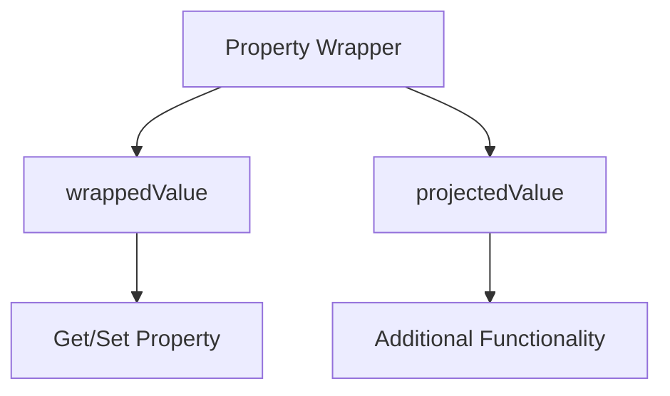

## 3.13 Property Wrappers

In Swift, property wrappers provide a powerful mechanism to encapsulate property-related logic, making your code more modular, reusable, and expressive. This section will delve into the purpose of property wrappers, explore built-in wrappers like `@State`, `@Binding`, and `@Published`, and guide you through creating custom property wrappers for your specific needs.

### Purpose of Property Wrappers

Property wrappers in Swift allow you to define a common behavior for a property that can be reused across different properties. They are essentially a way to encapsulate the logic that is typically associated with getting and setting a property, such as validation, transformation, or providing default values.

#### Key Benefits:

- **Encapsulation**: Encapsulate repetitive property logic in one place.
- **Reusability**: Reuse property logic across different properties and projects.
- **Readability**: Improve code readability by abstracting complex logic.
- **Maintainability**: Simplify maintenance by centralizing property logic.

### Built-in Wrappers

Swift provides several built-in property wrappers, especially useful in SwiftUI for state management and data binding. Let's explore some of the most common built-in wrappers.

#### @State

The `@State` property wrapper is used in SwiftUI to manage the state of a view. It allows you to create a source of truth for a piece of data that the view depends on, ensuring that the view updates whenever the state changes.

```swift
import SwiftUI

struct CounterView: View {
    @State private var count: Int = 0

    var body: some View {
        VStack {
            Text("Count: \\(count)")
            Button("Increment") {
                count += 1
            }
        }
    }
}
```

In this example, the `@State` property wrapper is used to manage the `count` variable. Whenever `count` changes, the view automatically updates to reflect the new value.

#### @Binding

The `@Binding` property wrapper is used to create a two-way connection between a parent view and a child view. It allows the child view to read and write a value that is owned by the parent view.

```swift
import SwiftUI

struct ContentView: View {
    @State private var isOn: Bool = false

    var body: some View {
        ToggleView(isOn: $isOn)
    }
}

struct ToggleView: View {
    @Binding var isOn: Bool

    var body: some View {
        Toggle("Toggle", isOn: $isOn)
    }
}
```

Here, `@Binding` is used in `ToggleView` to bind the `isOn` property to the `isOn` state in `ContentView`. This allows changes in the toggle to be reflected in `ContentView`.

#### @Published

The `@Published` property wrapper is used in conjunction with `ObservableObject` to notify views of changes to a property. It's commonly used in the MVVM pattern to update views when the model changes.

```swift
import Combine

class UserData: ObservableObject {
    @Published var username: String = ""
}

struct UserView: View {
    @ObservedObject var userData = UserData()

    var body: some View {
        TextField("Username", text: $userData.username)
    }
}
```

In this example, `@Published` is used to automatically notify any observers when `username` changes, ensuring the UI stays in sync with the data model.

### Creating Custom Property Wrappers

Creating custom property wrappers allows you to encapsulate reusable logic specific to your application's needs. Let's explore how to define a custom property wrapper.

#### Defining a Custom Property Wrapper

To create a custom property wrapper, define a struct or class with a `wrappedValue` property and a `projectedValue` if needed. Here's a simple example of a property wrapper that clamps a value within a specified range.

```swift
@propertyWrapper
struct Clamped<Value: Comparable> {
    var value: Value
    let range: ClosedRange<Value>

    var wrappedValue: Value {
        get { return value }
        set { value = min(max(range.lowerBound, newValue), range.upperBound) }
    }

    init(wrappedValue: Value, _ range: ClosedRange<Value>) {
        self.range = range
        self.value = min(max(range.lowerBound, wrappedValue), range.upperBound)
    }
}

struct Settings {
    @Clamped(0...100) var volume: Int = 50
}

var settings = Settings()
settings.volume = 150
print(settings.volume) // Outputs: 100
```

In this example, the `Clamped` property wrapper ensures that the `volume` property is always within the range 0 to 100.

#### Projected Values

Property wrappers can also provide a projected value, which is accessed using the `$` prefix. This is useful for exposing additional functionality or information.

```swift
@propertyWrapper
struct Logger<Value> {
    private var value: Value

    var wrappedValue: Value {
        get { return value }
        set {
            print("Setting value to \\(newValue)")
            value = newValue
        }
    }

    var projectedValue: Logger {
        return self
    }

    init(wrappedValue: Value) {
        self.value = wrappedValue
    }

    func log() {
        print("Current value is \\(value)")
    }
}

struct Example {
    @Logger var value: Int = 0
}

var example = Example()
example.value = 10
example.$value.log() // Outputs: Current value is 10
```

The `Logger` property wrapper logs changes to the property and provides a `log()` method via its projected value.

### Use Cases for Property Wrappers

Property wrappers can be used in a variety of scenarios to simplify and enhance your codebase. Here are some common use cases:

- **Validation**: Enforce constraints or validate data before setting a property.
- **Caching**: Implement lazy loading or caching mechanisms.
- **Transformation**: Automatically transform data when getting or setting a property.
- **Configuration**: Manage configuration settings with default values and constraints.

### Visualizing Property Wrappers

To better understand how property wrappers work, let's visualize the flow of data when using a property wrapper in Swift.



This diagram illustrates the relationship between the property wrapper, its `wrappedValue`, and `projectedValue`. The `wrappedValue` is used to get and set the property, while the `projectedValue` provides additional functionality.

### Try It Yourself

Experiment with the provided examples by modifying the property wrappers to add new features or constraints. For instance, try creating a property wrapper that logs changes only when the new value differs from the old value.

### References and Further Reading

- [Swift Documentation on Property Wrappers](https://developer.apple.com/documentation/swift/propertywrapper)
- [SwiftUI State Management](https://developer.apple.com/documentation/swiftui/state)
- [Combine Framework](https://developer.apple.com/documentation/combine)

### Knowledge Check

- What is the primary purpose of property wrappers in Swift?
- How do `@State` and `@Binding` differ in their use cases?
- What is the role of `@Published` in the Combine framework?
- How can you define a custom property wrapper in Swift?
- What are some common use cases for property wrappers?

### Embrace the Journey

Remember, mastering property wrappers is just a step in your Swift development journey. As you continue to explore and experiment, you'll discover new ways to leverage this powerful feature to write cleaner, more efficient code. Keep pushing the boundaries of what's possible with Swift, and enjoy the process of learning and growing as a developer.

## Quiz Time!



### What is the primary purpose of property wrappers in Swift?

- [x] Encapsulating property-related logic
- [ ] Improving performance
- [ ] Reducing code size
- [ ] Simplifying syntax

> **Explanation:** Property wrappers are designed to encapsulate repetitive property logic, making code more modular and reusable.

### Which SwiftUI property wrapper is used for managing state within a view?

- [x] @State
- [ ] @Binding
- [ ] @Published
- [ ] @ObservedObject

> **Explanation:** `@State` is used to manage the state of a view in SwiftUI, ensuring the view updates when the state changes.

### How does `@Binding` differ from `@State`?

- [x] `@Binding` creates a two-way connection between views
- [ ] `@Binding` manages state within a view
- [ ] `@Binding` is used for publishing changes
- [ ] `@Binding` is used for observing objects

> **Explanation:** `@Binding` creates a two-way connection between a parent and child view, allowing the child to modify the parent's state.

### What is a common use case for the `@Published` property wrapper?

- [x] Notifying views of changes to a property
- [ ] Managing view state
- [ ] Creating two-way bindings
- [ ] Lazy loading data

> **Explanation:** `@Published` is used to notify observers of changes to a property, commonly in the MVVM pattern with `ObservableObject`.

### How can you define a custom property wrapper in Swift?

- [x] By defining a struct or class with a `wrappedValue` property
- [ ] By using a protocol
- [ ] By creating an enum
- [ ] By subclassing `NSObject`

> **Explanation:** A custom property wrapper is defined by creating a struct or class with a `wrappedValue` property to manage the property's logic.

### What is the purpose of a `projectedValue` in a property wrapper?

- [x] To provide additional functionality
- [ ] To improve performance
- [ ] To reduce memory usage
- [ ] To simplify syntax

> **Explanation:** The `projectedValue` in a property wrapper is used to expose additional functionality or information beyond the `wrappedValue`.

### Which of the following is NOT a built-in property wrapper in Swift?

- [x] @Lazy
- [ ] @State
- [ ] @Binding
- [ ] @Published

> **Explanation:** `@Lazy` is not a built-in property wrapper in Swift; the others are commonly used in SwiftUI and Combine.

### What is a key benefit of using property wrappers?

- [x] Encapsulation of repetitive logic
- [ ] Increased execution speed
- [ ] Reduced memory footprint
- [ ] Simplified syntax

> **Explanation:** Property wrappers encapsulate repetitive property logic, making code more modular and maintainable.

### What is the role of `@ObservedObject` in SwiftUI?

- [x] To observe changes in an `ObservableObject`
- [ ] To manage view state
- [ ] To create two-way bindings
- [ ] To publish changes

> **Explanation:** `@ObservedObject` is used in SwiftUI to observe changes in an `ObservableObject`, updating the view when the object changes.

### True or False: Property wrappers can only be used with primitive data types.

- [ ] True
- [x] False

> **Explanation:** Property wrappers can be used with any data type, not just primitive types, allowing for versatile encapsulation of logic.






