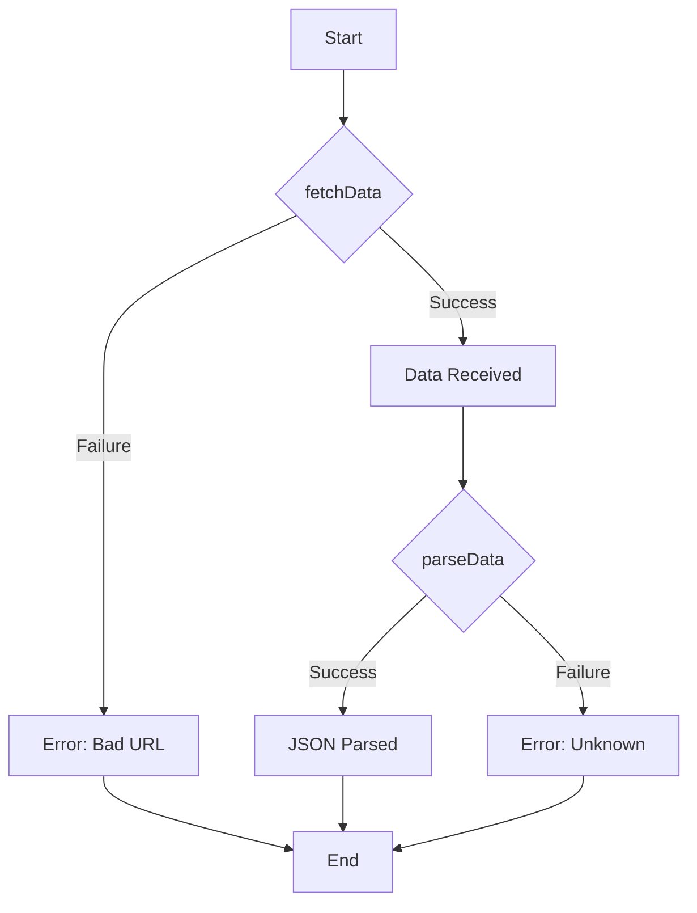

## 3.15 Result Types and Advanced Error Handling

Error handling is a crucial aspect of software development, ensuring that your applications can gracefully manage unexpected situations and provide meaningful feedback to users. Swift's error handling model is designed to be simple yet powerful, offering developers the tools to handle errors effectively. In this section, we will delve into the `Result` type, a powerful feature in Swift that allows you to handle success and failure in a unified way. We will explore how to chain `Result` operations, convert throwing functions to `Result`, and discuss best practices for using `Result` over traditional error handling techniques.

### The `Result` Enum: Handling Success and Failure in One Type

The `Result` type in Swift is an enumeration that represents either a success or a failure. It is defined as:

```swift
enum Result<Success, Failure: Error> {
    case success(Success)
    case failure(Failure)
}
```

This enum has two cases:

- `success(Success)`: Represents a successful outcome, containing a value of the type `Success`.
- `failure(Failure)`: Represents a failed outcome, containing an error of the type `Failure`.

#### Using `Result` for Error Handling

The `Result` type is particularly useful for functions that can either return a value or throw an error. By returning a `Result`, you can encapsulate both outcomes in a single return type, making your functions more predictable and easier to work with.

**Example:**

```swift
import Foundation

enum NetworkError: Error {
    case badURL
    case requestFailed
    case unknown
}

func fetchData(from urlString: String) -> Result<Data, NetworkError> {
    guard let url = URL(string: urlString) else {
        return .failure(.badURL)
    }
    
    do {
        let data = try Data(contentsOf: url)
        return .success(data)
    } catch {
        return .failure(.requestFailed)
    }
}

// Usage
let result = fetchData(from: "https://example.com/data.json")

switch result {
case .success(let data):
    print("Data received: \\(data)")
case .failure(let error):
    print("Failed with error: \\(error)")
}
```

### Chaining `Result` Operations: Streamlining Error Handling

One of the powerful features of the `Result` type is the ability to chain operations. This allows you to compose multiple operations that may fail, in a clean and readable manner.

#### Using `map` and `flatMap`

The `Result` type provides `map` and `flatMap` methods to transform the success value or chain additional operations.

- **`map`**: Transforms the success value of a `Result` while preserving the error type.
- **`flatMap`**: Transforms the success value and returns a new `Result`, allowing for further chaining of operations.

**Example:**

```swift
func parseData(_ data: Data) -> Result<String, NetworkError> {
    if let jsonString = String(data: data, encoding: .utf8) {
        return .success(jsonString)
    } else {
        return .failure(.unknown)
    }
}

let chainedResult = fetchData(from: "https://example.com/data.json")
    .flatMap(parseData)

switch chainedResult {
case .success(let jsonString):
    print("Parsed JSON: \\(jsonString)")
case .failure(let error):
    print("Failed with error: \\(error)")
}
```

In this example, `fetchData` returns a `Result` which is then passed to `parseData` using `flatMap`. This allows for a clean and concise way to handle multiple operations that can fail.

### Converting Throwing Functions: Using `Result` with `try`

Swift provides a convenient way to convert throwing functions into `Result`-based functions using the `Result` initializer. This allows you to encapsulate the error handling logic in a `Result` type, making it easier to manage and propagate errors.

#### Example: Converting a Throwing Function

Let's consider a function that throws an error when it encounters a problem:

```swift
enum FileError: Error {
    case fileNotFound
    case unreadable
}

func readFile(at path: String) throws -> String {
    guard path == "validPath" else {
        throw FileError.fileNotFound
    }
    return "File content"
}
```

To convert this function to use `Result`, you can use the `Result` initializer:

```swift
func readFileResult(at path: String) -> Result<String, FileError> {
    return Result { try readFile(at: path) }
}

let fileResult = readFileResult(at: "invalidPath")

switch fileResult {
case .success(let content):
    print("File content: \\(content)")
case .failure(let error):
    print("Failed with error: \\(error)")
}
```

### Best Practices: When to Use `Result` Over Traditional Error Handling

While Swift's traditional error handling using `throws` and `try` is powerful, there are scenarios where using `Result` can be more beneficial:

1. **Asynchronous Operations**: `Result` is particularly useful in asynchronous contexts, where you might want to pass the result of an operation to a completion handler.

2. **Multiple Error Types**: If a function can fail with multiple types of errors, `Result` can provide a unified way to handle these errors.

3. **Composing Multiple Operations**: When chaining multiple operations that can fail, `Result` provides a clean and readable way to handle errors without deeply nested `do-catch` blocks.

4. **Functional Programming**: If you prefer a more functional programming style, `Result` allows you to use methods like `map` and `flatMap` to transform and chain operations.

### Visualizing Result Type and Error Handling

To better understand how `Result` types work in Swift, let's visualize the flow of operations using a flowchart:



**Caption:** This flowchart illustrates the process of fetching and parsing data using `Result` types, demonstrating how success and failure are handled at each step.

### Knowledge Check

- **Question:** What are the main components of the `Result` type in Swift?
- **Question:** How does `flatMap` differ from `map` when working with `Result` types?

### Try It Yourself

To get hands-on experience with `Result` types, try modifying the `fetchData` function to simulate a network delay using `DispatchQueue`. Then, update the error handling to include a timeout error.

### References and Links

For further reading on Swift's error handling model, consider visiting the following resources:

- [Apple's Swift Documentation: Error Handling](https://developer.apple.com/documentation/swift/error)
- [Swift.org: The Swift Programming Language Guide](https://docs.swift.org/swift-book/LanguageGuide/ErrorHandling.html)

### Embrace the Journey

Remember, mastering error handling is a journey. As you continue to explore Swift's capabilities, you'll find that the `Result` type offers a flexible and powerful way to manage errors. Keep experimenting, stay curious, and enjoy the process of learning and growing as a Swift developer!

## Quiz Time!



### What is the primary purpose of the `Result` type in Swift?

- [x] To encapsulate both success and failure outcomes in a single type.
- [ ] To replace all error handling mechanisms in Swift.
- [ ] To handle only asynchronous operations.
- [ ] To simplify UI development.

> **Explanation:** The `Result` type is designed to encapsulate both success and failure outcomes, making error handling more predictable and manageable.

### How does the `map` function work with `Result` types?

- [x] It transforms the success value while preserving the error type.
- [ ] It transforms the error value while preserving the success type.
- [ ] It converts a `Result` into a `Bool`.
- [ ] It handles errors by retrying the operation.

> **Explanation:** The `map` function is used to transform the success value of a `Result`, keeping the error type unchanged.

### What is the advantage of using `flatMap` with `Result`?

- [x] It allows chaining operations that return `Result` types.
- [ ] It converts errors into success values.
- [ ] It simplifies converting throwing functions.
- [ ] It handles asynchronous operations automatically.

> **Explanation:** `flatMap` is useful for chaining operations that return `Result` types, allowing for a clean and readable flow of operations.

### When should you consider using `Result` over traditional error handling?

- [x] In asynchronous contexts.
- [x] When dealing with multiple error types.
- [ ] When handling simple synchronous operations.
- [ ] When writing UI code.

> **Explanation:** `Result` is beneficial in asynchronous contexts and when dealing with multiple error types, providing a unified way to handle errors.

### How can you convert a throwing function to use `Result`?

- [x] By using the `Result` initializer with a throwing closure.
- [ ] By wrapping it in a `do-catch` block.
- [ ] By using `try?` and `try!`.
- [ ] By writing a custom error handler.

> **Explanation:** The `Result` initializer can be used with a throwing closure to convert a throwing function into a `Result`-based function.

### What is a common use case for the `Result` type?

- [x] Handling network requests that can succeed or fail.
- [ ] Managing UI state transitions.
- [ ] Optimizing performance.
- [ ] Designing animations.

> **Explanation:** `Result` is commonly used to handle network requests, where operations can either succeed with data or fail with an error.

### Which method would you use to transform both success and failure values in a `Result`?

- [ ] `map`
- [ ] `flatMap`
- [x] `mapError`
- [ ] `transform`

> **Explanation:** `mapError` is used to transform the error value of a `Result`, while `map` and `flatMap` are used for the success value.

### What is the benefit of using `Result` in functional programming?

- [x] It allows for chaining operations using `map` and `flatMap`.
- [ ] It simplifies UI development.
- [ ] It automatically handles concurrency.
- [ ] It replaces all error handling mechanisms.

> **Explanation:** In functional programming, `Result` allows for chaining operations using `map` and `flatMap`, providing a clean and concise way to handle errors.

### True or False: The `Result` type can only be used with synchronous operations.

- [ ] True
- [x] False

> **Explanation:** False. The `Result` type can be used with both synchronous and asynchronous operations, making it versatile for various use cases.

### Which of the following is not a benefit of using `Result`?

- [ ] Handling multiple error types in a unified way.
- [ ] Chaining operations without deeply nested `do-catch` blocks.
- [x] Automatically retrying failed operations.
- [ ] Simplifying error handling in asynchronous contexts.

> **Explanation:** While `Result` simplifies error handling and allows for chaining operations, it does not automatically retry failed operations.




