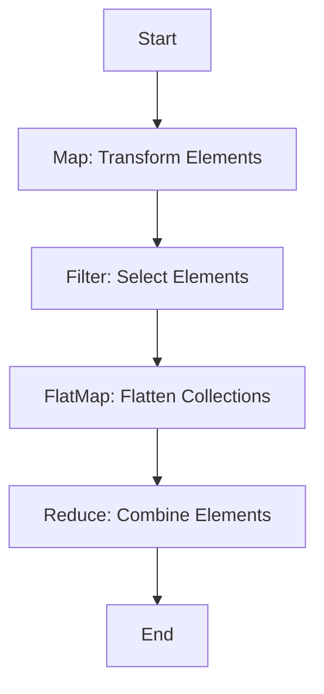

## 3.16 Functional Programming with Map, FlatMap, Filter, and Reduce

Functional programming is a powerful paradigm that focuses on using functions to transform data. In Swift, functional programming is facilitated through higher-order functions like `map`, `flatMap`, `filter`, and `reduce`. These functions allow us to work with collections in a concise and expressive way. In this section, we will explore each of these functions in detail, providing practical examples and discussing performance considerations.

### Mapping: Transforming Collections

The `map` function is used to transform each element in a collection. It applies a given closure to each element and returns a new collection containing the transformed elements.

#### How `map` Works

The `map` function iterates over each element of a collection, applies a transformation closure, and collects the results into a new array. Here's a simple example:

```swift
let numbers = [1, 2, 3, 4, 5]
let squaredNumbers = numbers.map { $0 * $0 }
print(squaredNumbers) // Output: [1, 4, 9, 16, 25]
```

In this example, we transform each number in the `numbers` array by squaring it. The transformation is defined by the closure `{ $0 * $0 }`.

#### Practical Use Cases

- **Converting Data Types**: Transform an array of strings into an array of integers.
- **Formatting Data**: Convert dates into a specific string format.
- **Extracting Properties**: Extract a specific property from a collection of objects.

#### Key Considerations

- **Type Safety**: The `map` function maintains type safety, ensuring the transformed collection is of a consistent type.
- **Immutability**: The original collection is not modified; a new collection is returned.

### Filtering: Selecting Elements Based on Conditions

The `filter` function allows us to select elements from a collection that satisfy a specific condition.

#### How `filter` Works

The `filter` function takes a closure that returns a Boolean value. It returns a new array containing only the elements for which the closure returns `true`.

```swift
let numbers = [1, 2, 3, 4, 5]
let evenNumbers = numbers.filter { $0 % 2 == 0 }
print(evenNumbers) // Output: [2, 4]
```

In this example, we filter the `numbers` array to include only even numbers.

#### Practical Use Cases

- **Filtering Data**: Select users over a certain age from a list.
- **Search Functionality**: Filter products based on search criteria.
- **Data Validation**: Remove invalid entries from a dataset.

#### Key Considerations

- **Efficiency**: Filtering can be computationally expensive for large datasets.
- **Predicate Complexity**: Ensure the filtering condition is not overly complex to maintain performance.

### FlatMapping: Flattening Nested Collections

The `flatMap` function is used to flatten nested collections and apply a transformation.

#### How `flatMap` Works

`flatMap` combines the functionality of `map` and `flatten`. It transforms each element and flattens the result into a single array.

```swift
let arrays = [[1, 2, 3], [4, 5], [6, 7, 8]]
let flatArray = arrays.flatMap { $0 }
print(flatArray) // Output: [1, 2, 3, 4, 5, 6, 7, 8]
```

In this example, `flatMap` flattens the nested arrays into a single array.

#### Practical Use Cases

- **Handling Optional Values**: Transform and flatten optional values.
- **Combining Results**: Merge results from multiple data sources.
- **Data Normalization**: Flatten nested JSON structures.

#### Key Considerations

- **Complexity**: `flatMap` can be more complex than `map` due to its dual functionality.
- **Performance**: Flattening large collections can be resource-intensive.

### Reducing: Combining Elements into a Single Value

The `reduce` function is used to combine all elements of a collection into a single value using a closure.

#### How `reduce` Works

`reduce` takes an initial value and a closure that combines the current value with each element of the collection.

```swift
let numbers = [1, 2, 3, 4, 5]
let sum = numbers.reduce(0) { $0 + $1 }
print(sum) // Output: 15
```

In this example, we calculate the sum of the `numbers` array.

#### Practical Use Cases

- **Aggregation**: Calculate the total price of items in a cart.
- **Concatenation**: Combine strings into a single sentence.
- **Statistical Calculations**: Compute averages, medians, etc.

#### Key Considerations

- **Initial Value**: Choose an appropriate initial value for the reduction.
- **Associativity**: Ensure the operation is associative for predictable results.

### Performance Considerations: Writing Efficient Code

When using these functional programming techniques, it's important to consider performance implications, especially with large datasets.

#### Tips for Efficient Functional Programming

- **Lazy Evaluation**: Use `lazy` collections to defer computation until necessary.
- **Combine Operations**: Chain operations to minimize intermediate collections.
- **Avoid Redundant Computations**: Cache results when possible to avoid repeated calculations.

#### Example of Lazy Evaluation

```swift
let numbers = Array(1...1000000)
let lazyFilteredNumbers = numbers.lazy.filter { $0 % 2 == 0 }.map { $0 * 2 }
print(lazyFilteredNumbers.count) // Output: 500000
```

In this example, the filtering and mapping operations are deferred until the result is needed, improving performance.

### Visualizing Functional Operations

To better understand how these operations work together, let's visualize the process using a flowchart:



This flowchart illustrates the sequential application of `map`, `filter`, `flatMap`, and `reduce` to process a collection.

### Try It Yourself

Experiment with the following code examples to deepen your understanding:

1. Modify the `map` example to transform numbers into their string representations.
2. Use `filter` to select numbers greater than a certain threshold.
3. Apply `flatMap` to flatten a collection of optional integers.
4. Experiment with `reduce` to concatenate an array of strings into a single sentence.

### References and Links

- [Swift Documentation on Sequence](https://developer.apple.com/documentation/swift/sequence)
- [Functional Programming in Swift](https://www.raywenderlich.com/825-functional-programming-in-swift)
- [Swift.org](https://swift.org/)

### Summary

Functional programming in Swift, using `map`, `flatMap`, `filter`, and `reduce`, provides a powerful toolkit for transforming, filtering, and aggregating data in a concise and expressive manner. By understanding these functions and their performance implications, you can write efficient and elegant Swift code.

Remember, this is just the beginning. As you progress, you'll build more complex and interactive applications. Keep experimenting, stay curious, and enjoy the journey!

## Quiz Time!



### Which function is used to transform each element in a collection?

- [x] map
- [ ] filter
- [ ] flatMap
- [ ] reduce

> **Explanation:** The `map` function is used to transform each element in a collection by applying a given closure.

### What does the `filter` function return?

- [x] A new collection with elements that satisfy a condition
- [ ] A flattened collection
- [ ] A single combined value
- [ ] A transformed collection

> **Explanation:** The `filter` function returns a new collection containing only the elements for which the closure returns `true`.

### Which function combines the functionality of map and flatten?

- [ ] map
- [ ] filter
- [x] flatMap
- [ ] reduce

> **Explanation:** The `flatMap` function combines the functionality of `map` and `flatten`, transforming and flattening collections.

### What is the primary use of the `reduce` function?

- [ ] Transforming elements
- [ ] Selecting elements
- [ ] Flattening collections
- [x] Combining elements into a single value

> **Explanation:** The `reduce` function is used to combine all elements of a collection into a single value using a closure.

### Which of the following is a performance consideration when using functional programming?

- [x] Lazy evaluation
- [ ] Type safety
- [ ] Immutability
- [ ] Predicate complexity

> **Explanation:** Lazy evaluation can improve performance by deferring computation until necessary.

### What is a typical use case for the `map` function?

- [x] Converting data types
- [ ] Filtering data
- [ ] Flattening nested collections
- [ ] Combining elements

> **Explanation:** The `map` function is often used for converting data types or transforming data.

### How can you improve performance when using `filter` on large datasets?

- [x] Ensure the filtering condition is simple
- [ ] Use a complex predicate
- [ ] Avoid lazy evaluation
- [ ] Use a high initial value

> **Explanation:** Keeping the filtering condition simple helps maintain performance.

### What does `flatMap` do with nested collections?

- [ ] Transforms elements
- [x] Flattens them
- [ ] Combines them into a single value
- [ ] Selects elements

> **Explanation:** `flatMap` flattens nested collections into a single array.

### What is an appropriate initial value for `reduce` when calculating a sum?

- [x] 0
- [ ] 1
- [ ] nil
- [ ] An empty array

> **Explanation:** An initial value of 0 is appropriate when calculating a sum.

### True or False: `map`, `filter`, `flatMap`, and `reduce` modify the original collection.

- [ ] True
- [x] False

> **Explanation:** These functions return new collections and do not modify the original collection.


