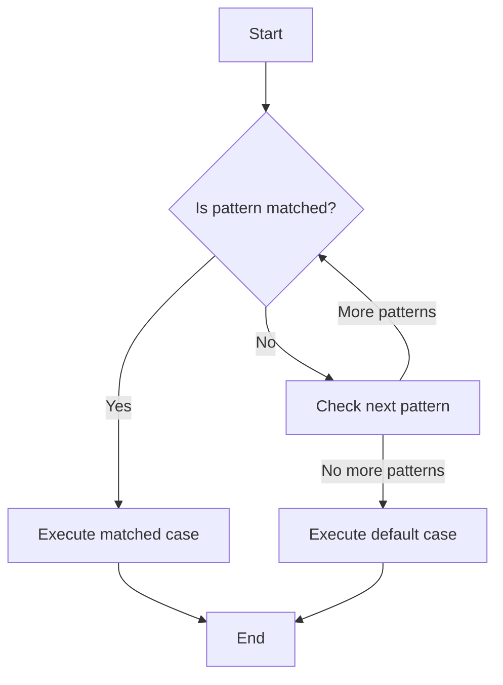

## 3.17 Advanced Pattern Matching and Enums

In Swift, pattern matching is a powerful feature that allows you to write expressive and concise code. When combined with enums, it becomes an essential tool for managing complex data structures and control flow. In this section, we will explore advanced pattern matching techniques and how they can be applied to enums to enhance your Swift programming skills.

### Understanding Pattern Matching in Swift

Pattern matching in Swift is a mechanism that allows you to check and extract values from data structures. It is commonly used with control flow statements like `switch`, `if`, and `guard`. Let's delve into the various aspects of pattern matching.

#### Destructuring Values

Destructuring is the process of breaking down complex data structures into simpler parts. In Swift, you can destructure tuples, arrays, structs, and enums. This is particularly useful when you want to extract specific values from a complex type.

Here's an example of destructuring a tuple:

```swift
let person = (name: "Alice", age: 30)

// Destructuring the tuple
let (name, age) = person
print("Name: \\(name), Age: \\(age)")
```

In this example, the `person` tuple is destructured into `name` and `age` variables, allowing you to access the individual elements directly.

#### Destructuring with Enums

Enums in Swift can have associated values, making them ideal candidates for destructuring. Let's consider an example:

```swift
enum Result {
    case success(data: String)
    case failure(error: String)
}

let result = Result.success(data: "Data loaded successfully")

switch result {
case .success(let data):
    print("Success with data: \\(data)")
case .failure(let error):
    print("Failure with error: \\(error)")
}
```

In this example, the `Result` enum has two cases, each with associated values. By using pattern matching, you can destructure the enum and access the associated values directly.

### Guard Statements

Guard statements in Swift are used for early exits in functions or methods. They provide a way to handle invalid conditions gracefully and improve code readability.

Here's an example of using a guard statement with pattern matching:

```swift
func processResult(_ result: Result) {
    guard case .success(let data) = result else {
        print("Failed to process result")
        return
    }
    
    print("Processing data: \\(data)")
}
```

In this example, the `guard` statement checks if the `result` is a `success` case. If not, it exits the function early. This approach ensures that the valid path is followed, improving code clarity.

### If-Case Statements

The `if-case` statement is a concise way to perform pattern matching within an `if` statement. It allows you to match specific patterns and execute code based on the match.

Here's an example:

```swift
let result = Result.success(data: "Data loaded successfully")

if case .success(let data) = result {
    print("Data: \\(data)")
} else {
    print("No data available")
}
```

In this example, the `if-case` statement checks if the `result` is a `success` case and extracts the associated data. This approach is useful for simple pattern matching scenarios.

### Advanced Switch Cases

The `switch` statement in Swift is a versatile tool for pattern matching. It allows you to match a wide range of patterns, including ranges, tuples, and more.

#### Matching Ranges

You can use ranges in `switch` cases to match values within a specific range. Here's an example:

```swift
let age = 25

switch age {
case 0..<18:
    print("Minor")
case 18..<65:
    print("Adult")
default:
    print("Senior")
}
```

In this example, the `switch` statement matches the `age` variable against different ranges, providing a clear and concise way to handle different age groups.

#### Matching Tuples

Tuples can be matched in `switch` cases to handle complex conditions. Here's an example:

```swift
let coordinates = (x: 10, y: 20)

switch coordinates {
case (0, 0):
    print("Origin")
case (let x, 0):
    print("On the x-axis at \\(x)")
case (0, let y):
    print("On the y-axis at \\(y)")
case (let x, let y):
    print("Point at (\\(x), \\(y))")
}
```

In this example, the `switch` statement matches the `coordinates` tuple against different patterns, allowing you to handle various cases based on the values of `x` and `y`.

### Advanced Pattern Matching Techniques

Swift's pattern matching capabilities extend beyond simple cases. Let's explore some advanced techniques that can enhance your code.

#### Optional Pattern Matching

Optionals in Swift can be matched using pattern matching. This is particularly useful when dealing with optional values.

Here's an example:

```swift
let optionalValue: Int? = 42

switch optionalValue {
case .some(let value):
    print("Value: \\(value)")
case .none:
    print("No value")
}
```

In this example, the `switch` statement matches the `optionalValue` against the `.some` and `.none` cases, allowing you to handle optional values effectively.

#### Pattern Matching with Where Clauses

The `where` clause can be used in pattern matching to add additional conditions to a pattern. This is useful for filtering values based on specific criteria.

Here's an example:

```swift
let numbers = [1, 2, 3, 4, 5]

for number in numbers {
    switch number {
    case let x where x % 2 == 0:
        print("\\(x) is even")
    default:
        print("\\(x) is odd")
    }
}
```

In this example, the `where` clause is used to check if a number is even, allowing you to filter values based on custom conditions.

### Enums and Pattern Matching

Enums in Swift are a powerful tool for modeling complex data structures. When combined with pattern matching, they provide a flexible way to handle different cases and associated values.

#### Enums with Associated Values

Enums can have associated values, allowing you to attach additional data to each case. This is useful for modeling complex data structures.

Here's an example:

```swift
enum NetworkResponse {
    case success(data: String)
    case failure(error: String)
    case loading(progress: Double)
}

let response = NetworkResponse.loading(progress: 0.5)

switch response {
case .success(let data):
    print("Success with data: \\(data)")
case .failure(let error):
    print("Failure with error: \\(error)")
case .loading(let progress):
    print("Loading with progress: \\(progress * 100)%")
}
```

In this example, the `NetworkResponse` enum has three cases, each with associated values. The `switch` statement matches the `response` against different cases, allowing you to handle each scenario appropriately.

#### Recursive Enums

Enums in Swift can be recursive, meaning they can refer to themselves. This is useful for modeling hierarchical data structures like trees.

Here's an example:

```swift
indirect enum BinaryTree {
    case empty
    case node(value: Int, left: BinaryTree, right: BinaryTree)
}

let tree = BinaryTree.node(value: 1,
                           left: .node(value: 2, left: .empty, right: .empty),
                           right: .node(value: 3, left: .empty, right: .empty))

func traverse(_ tree: BinaryTree) {
    switch tree {
    case .empty:
        return
    case .node(let value, let left, let right):
        print(value)
        traverse(left)
        traverse(right)
    }
}

traverse(tree)
```

In this example, the `BinaryTree` enum is recursive, allowing you to model a binary tree structure. The `traverse` function uses pattern matching to recursively traverse the tree and print the values.

### Swift's Unique Features in Pattern Matching

Swift's pattern matching capabilities are enhanced by its unique language features. Let's explore some of these features and how they can be used in pattern matching.

#### Pattern Matching with Generics

Swift's generics allow you to write flexible and reusable code. You can use generics in pattern matching to handle different types of data.

Here's an example:

```swift
func match<T>(_ value: T) {
    switch value {
    case is Int:
        print("Value is an Int")
    case is String:
        print("Value is a String")
    default:
        print("Value is of unknown type")
    }
}

match(42)
match("Hello")
```

In this example, the `match` function uses generics to handle different types of data. The `switch` statement matches the `value` against different types, allowing you to handle each case appropriately.

#### Pattern Matching with Protocols

Swift's protocols provide a way to define common behavior for different types. You can use protocols in pattern matching to handle different types that conform to a protocol.

Here's an example:

```swift
protocol Describable {
    var description: String { get }
}

struct Car: Describable {
    var description: String {
        return "Car"
    }
}

struct Bike: Describable {
    var description: String {
        return "Bike"
    }
}

func describe(_ item: Describable) {
    switch item {
    case is Car:
        print("Item is a Car")
    case is Bike:
        print("Item is a Bike")
    default:
        print("Item is of unknown type")
    }
}

describe(Car())
describe(Bike())
```

In this example, the `Describable` protocol defines a common behavior for `Car` and `Bike` types. The `describe` function uses pattern matching to handle different types that conform to the `Describable` protocol.

### Try It Yourself

Now that we've explored advanced pattern matching and enums in Swift, it's time to experiment with these concepts. Try modifying the code examples to see how pattern matching behaves with different data structures and conditions. Experiment with adding new cases to enums, using `where` clauses, and combining pattern matching with Swift's unique features.

### Visualizing Pattern Matching

To better understand how pattern matching works in Swift, let's visualize the process using a flowchart. This flowchart illustrates the decision-making process in a `switch` statement with pattern matching.



**Figure 1: Visualizing Pattern Matching in a Switch Statement**

In this flowchart, the decision-making process begins by checking if a pattern is matched. If a pattern is matched, the corresponding case is executed. If no patterns are matched, the default case is executed.

### Key Takeaways

- **Destructuring Values**: Use destructuring to extract data from complex types like tuples and enums.
- **Guard Statements**: Use guard statements for early exits and improved code readability.
- **If-Case Statements**: Use `if-case` statements for concise pattern matching.
- **Advanced Switch Cases**: Use `switch` statements to match ranges, tuples, and more.
- **Enums with Associated Values**: Use enums with associated values to model complex data structures.
- **Recursive Enums**: Use recursive enums to model hierarchical data structures.
- **Swift's Unique Features**: Leverage Swift's generics and protocols in pattern matching.

### References and Further Reading

- [Swift Language Guide - Patterns](https://docs.swift.org/swift-book/LanguageGuide/Patterns.html)
- [Swift Language Guide - Enumerations](https://docs.swift.org/swift-book/LanguageGuide/Enumerations.html)
- [Apple Developer Documentation - Swift](https://developer.apple.com/documentation/swift)

By mastering advanced pattern matching techniques and enums in Swift, you'll be well-equipped to write expressive and efficient code. Remember, this is just the beginning. As you progress, you'll discover even more ways to leverage these powerful features in your Swift applications. Keep experimenting, stay curious, and enjoy the journey!

## Quiz Time!



### What is the primary purpose of pattern matching in Swift?

- [x] To check and extract values from data structures
- [ ] To declare variables
- [ ] To perform arithmetic operations
- [ ] To manage memory

> **Explanation:** Pattern matching is used to check and extract values from data structures, making it a powerful feature for control flow and data manipulation.

### How can you destructure a tuple in Swift?

- [x] By using a pattern with parentheses
- [ ] By using a `for` loop
- [ ] By using a `while` loop
- [ ] By using a `guard` statement

> **Explanation:** You can destructure a tuple in Swift by using a pattern with parentheses, allowing you to extract individual elements.

### What is the purpose of a guard statement?

- [x] To provide early exits for invalid conditions
- [ ] To create a loop
- [ ] To declare a constant
- [ ] To perform arithmetic operations

> **Explanation:** A guard statement is used to provide early exits for invalid conditions, improving code readability and flow.

### How do you perform pattern matching with an `if` statement?

- [x] By using an `if-case` statement
- [ ] By using a `for` loop
- [ ] By using a `while` loop
- [ ] By using a `guard` statement

> **Explanation:** You can perform pattern matching with an `if-case` statement, allowing you to match specific patterns within an `if` statement.

### What is the advantage of using enums with associated values?

- [x] They allow you to attach additional data to each case
- [ ] They simplify arithmetic operations
- [ ] They improve memory management
- [ ] They enhance variable declaration

> **Explanation:** Enums with associated values allow you to attach additional data to each case, making them useful for modeling complex data structures.

### What is a recursive enum?

- [x] An enum that can refer to itself
- [ ] An enum with no cases
- [ ] An enum that performs arithmetic operations
- [ ] An enum used for memory management

> **Explanation:** A recursive enum is an enum that can refer to itself, allowing you to model hierarchical data structures like trees.

### How can you add additional conditions to a pattern in Swift?

- [x] By using a `where` clause
- [ ] By using a `for` loop
- [ ] By using a `while` loop
- [ ] By using a `guard` statement

> **Explanation:** You can add additional conditions to a pattern in Swift by using a `where` clause, allowing you to filter values based on specific criteria.

### How can you perform pattern matching with generics in Swift?

- [x] By using a generic function and `switch` statement
- [ ] By using a `for` loop
- [ ] By using a `while` loop
- [ ] By using a `guard` statement

> **Explanation:** You can perform pattern matching with generics in Swift by using a generic function and `switch` statement, allowing you to handle different types of data.

### What is the benefit of using protocols in pattern matching?

- [x] They define common behavior for different types
- [ ] They simplify arithmetic operations
- [ ] They improve memory management
- [ ] They enhance variable declaration

> **Explanation:** Protocols define common behavior for different types, allowing you to use pattern matching to handle different types that conform to a protocol.

### Pattern matching can be used with which of the following?

- [x] Enums, Tuples, Optionals
- [ ] Only Enums
- [ ] Only Tuples
- [ ] Only Optionals

> **Explanation:** Pattern matching can be used with enums, tuples, and optionals, making it a versatile tool for handling different data structures.




