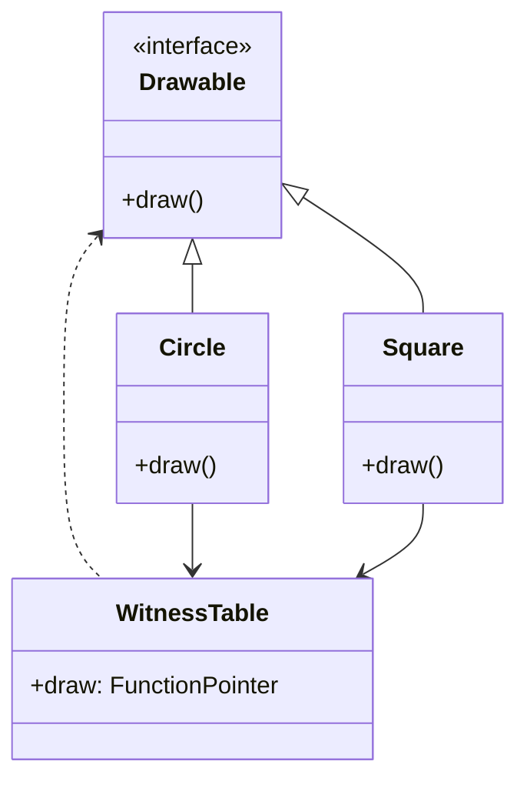

## 3.18 Protocol Witnesses and Existential Types

In Swift, protocols are a powerful feature that allows developers to define blueprints of methods, properties, and other requirements that suit a particular task or piece of functionality. Protocols can be adopted by classes, structs, and enums, providing a flexible way to implement polymorphism. This section delves into two advanced concepts related to protocols: **protocol witnesses** and **existential types**.

### Understanding Existential Types

**Existential types** in Swift are types that can hold any value that conforms to a given protocol. They are a way to represent a protocol as a type, allowing you to work with values of different types through a common interface. Existential types are declared using a protocol name as a type annotation.

#### Example of Existential Types

```swift
protocol Drawable {
    func draw()
}

struct Circle: Drawable {
    func draw() {
        print("Drawing a circle")
    }
}

struct Square: Drawable {
    func draw() {
        print("Drawing a square")
    }
}

let shapes: [Drawable] = [Circle(), Square()]

for shape in shapes {
    shape.draw() // Calls draw() on each shape
}
```

In this example, `Drawable` is an existential type that can hold any value conforming to the `Drawable` protocol, such as `Circle` or `Square`.

### Protocol Witnesses: The Backbone of Protocols

**Protocol witnesses** are the concrete implementations of the requirements specified in a protocol. When a type conforms to a protocol, Swift generates a witness table that maps each protocol requirement to the corresponding implementation in the conforming type.

#### How Protocol Witnesses Work

When you call a method on an existential type, Swift uses the witness table to look up the correct implementation. This indirection allows Swift to support dynamic dispatch, enabling polymorphic behavior.

#### Example of Protocol Witnesses

```swift
protocol Greeter {
    func greet() -> String
}

struct EnglishGreeter: Greeter {
    func greet() -> String {
        return "Hello!"
    }
}

struct SpanishGreeter: Greeter {
    func greet() -> String {
        return "¡Hola!"
    }
}

func printGreeting(greeter: Greeter) {
    print(greeter.greet())
}

let englishGreeter = EnglishGreeter()
let spanishGreeter = SpanishGreeter()

printGreeting(greeter: englishGreeter) // Prints "Hello!"
printGreeting(greeter: spanishGreeter) // Prints "¡Hola!"
```

In this example, `EnglishGreeter` and `SpanishGreeter` provide concrete implementations of the `greet()` method. Swift uses the protocol witness table to call the correct implementation based on the type of `greeter`.

### Use Cases for Existential Types and Protocol Witnesses

#### Dynamic Behavior

Existential types and protocol witnesses are particularly useful when you need to work with objects of different types through a common protocol interface. This is common in scenarios where you want to store a heterogeneous collection of objects or pass different types to a function.

#### Type Erasure

Type erasure is a technique used to hide the concrete type of a value behind a protocol interface. This is useful when you want to abstract away implementation details and focus on the protocol's behavior.

#### Example of Type Erasure

```swift
protocol AnyIterator {
    associatedtype Element
    func next() -> Element?
}

struct IntIterator: AnyIterator {
    private var current = 0
    func next() -> Int? {
        defer { current += 1 }
        return current < 10 ? current : nil
    }
}

struct StringIterator: AnyIterator {
    private var current = 0
    private let strings = ["Swift", "Kotlin", "Java"]
    func next() -> String? {
        defer { current += 1 }
        return current < strings.count ? strings[current] : nil
    }
}

let iterators: [AnyIterator] = [IntIterator(), StringIterator()]

for iterator in iterators {
    while let value = iterator.next() {
        print(value)
    }
}
```

In this example, `AnyIterator` is used to create a type-erased wrapper for iterators of different types, allowing them to be stored in a single array.

### Limitations of Existential Types

While existential types are powerful, they come with limitations. Understanding these limitations is crucial to avoid pitfalls and ensure optimal performance.

#### Performance Overhead

Existential types introduce a level of indirection that can impact performance. The use of witness tables for dynamic dispatch can be slower than static dispatch.

#### Loss of Type Information

When using existential types, you lose specific type information. This can make it challenging to perform certain operations that require knowledge of the underlying type.

#### Restricted Protocol Features

Not all protocol features are available with existential types. For example, protocols with associated types or self requirements cannot be used as existential types directly.

### Visualizing Protocol Witnesses and Existential Types

To better understand how protocol witnesses and existential types work, let's visualize the relationship between protocols, witness tables, and conforming types.



In this diagram, `Drawable` is a protocol with a `draw()` method. `Circle` and `Square` are types that conform to `Drawable`. The `WitnessTable` contains pointers to the concrete implementations of `draw()` for each conforming type.

### Best Practices for Using Existential Types and Protocol Witnesses

- **Use Existential Types Sparingly**: Prefer concrete types or generics when possible to avoid performance overhead and maintain type information.
- **Leverage Type Erasure Wisely**: Use type erasure to simplify interfaces and hide implementation details, but be mindful of the trade-offs.
- **Understand Protocol Limitations**: Be aware of the limitations of existential types, especially when working with protocols with associated types or self requirements.
- **Optimize for Performance**: Consider the performance implications of using existential types and protocol witnesses, and optimize your code accordingly.

### Try It Yourself

Let's experiment with existential types and protocol witnesses. Modify the following code to add a new shape, `Triangle`, that conforms to the `Drawable` protocol. Implement the `draw()` method to print "Drawing a triangle" and add it to the `shapes` array.

```swift
struct Triangle: Drawable {
    func draw() {
        print("Drawing a triangle")
    }
}

let shapes: [Drawable] = [Circle(), Square(), Triangle()]

for shape in shapes {
    shape.draw()
}
```

### Knowledge Check

- What are existential types, and how do they differ from concrete types?
- How do protocol witnesses enable dynamic dispatch in Swift?
- What are the trade-offs of using existential types in terms of performance and type information?
- How does type erasure simplify interfaces, and what are its limitations?

### Embrace the Journey

Remember, mastering existential types and protocol witnesses is just the beginning. As you continue to explore Swift's powerful features, you'll gain a deeper understanding of how to build efficient, scalable applications. Keep experimenting, stay curious, and enjoy the journey!

## Quiz Time!



### What is an existential type in Swift?

- [x] A type that conforms to a protocol
- [ ] A concrete type that implements a protocol
- [ ] A type that uses generics
- [ ] A type that cannot conform to any protocol

> **Explanation:** Existential types are types that conform to a protocol, allowing different types to be treated uniformly through a common interface.

### What is a protocol witness in Swift?

- [x] A concrete implementation of a protocol requirement
- [ ] A protocol with associated types
- [ ] A type that erases its concrete type
- [ ] A type that cannot conform to any protocol

> **Explanation:** Protocol witnesses are the concrete implementations of the requirements specified in a protocol, enabling dynamic dispatch.

### What is type erasure used for?

- [x] Hiding the concrete type of a value behind a protocol interface
- [ ] Improving performance by avoiding dynamic dispatch
- [ ] Allowing protocols to have associated types
- [ ] Preventing a type from conforming to multiple protocols

> **Explanation:** Type erasure is a technique used to hide the concrete type of a value behind a protocol interface, focusing on the protocol's behavior.

### What is a limitation of existential types?

- [x] Loss of specific type information
- [ ] Improved performance due to static dispatch
- [ ] Ability to use protocols with associated types
- [ ] Increased memory usage for concrete types

> **Explanation:** Existential types lose specific type information, which can make certain operations challenging.

### How do protocol witnesses enable dynamic dispatch?

- [x] By using a witness table to look up the correct implementation
- [ ] By using static dispatch to call the method directly
- [ ] By requiring protocols to have associated types
- [ ] By preventing types from conforming to multiple protocols

> **Explanation:** Protocol witnesses use a witness table to look up the correct implementation, enabling dynamic dispatch.

### What is a common use case for existential types?

- [x] Working with objects of different types through a common protocol interface
- [ ] Improving performance by avoiding dynamic dispatch
- [ ] Allowing protocols to have associated types
- [ ] Preventing a type from conforming to multiple protocols

> **Explanation:** Existential types are useful for working with objects of different types through a common protocol interface.

### What is a trade-off of using existential types?

- [x] Performance overhead due to dynamic dispatch
- [ ] Improved performance due to static dispatch
- [ ] Ability to use protocols with associated types
- [ ] Increased memory usage for concrete types

> **Explanation:** Existential types introduce performance overhead due to dynamic dispatch.

### What is a best practice when using existential types?

- [x] Use them sparingly and prefer concrete types or generics when possible
- [ ] Use them extensively to simplify code
- [ ] Avoid using protocols with associated types
- [ ] Always use type erasure to hide concrete types

> **Explanation:** It's best to use existential types sparingly and prefer concrete types or generics when possible to avoid performance overhead and maintain type information.

### Can protocols with associated types be used as existential types directly?

- [ ] Yes
- [x] No

> **Explanation:** Protocols with associated types cannot be used as existential types directly due to the lack of specific type information.

### What is the purpose of the witness table in Swift?

- [x] To map protocol requirements to their concrete implementations
- [ ] To store the concrete type of a value
- [ ] To improve performance by avoiding dynamic dispatch
- [ ] To prevent types from conforming to multiple protocols

> **Explanation:** The witness table maps protocol requirements to their concrete implementations, enabling dynamic dispatch.


