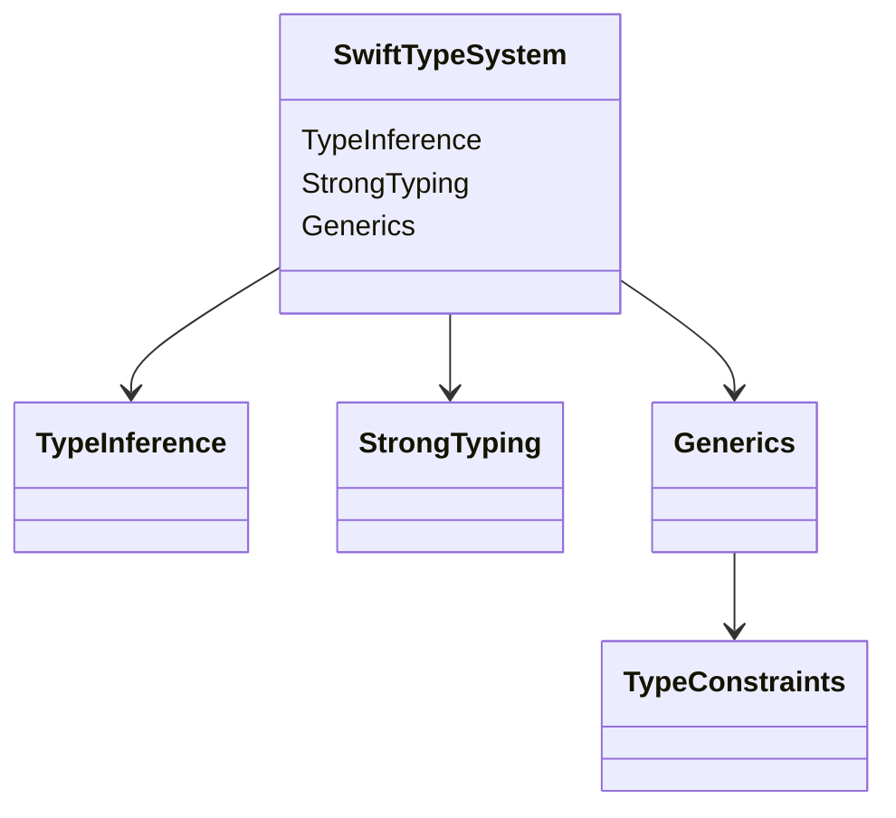

## 3.2 The Swift Type System

The Swift programming language is renowned for its powerful and expressive type system, which plays a crucial role in ensuring code safety and performance. In this section, we'll delve into the core components of the Swift type system, including type inference, strong typing, and generics. By mastering these concepts, you'll be able to write more robust and efficient Swift code, leveraging the full potential of the language's design patterns.

### Type Inference: Letting Swift Infer Types for You

Swift's type inference system allows the compiler to deduce the type of a variable or expression automatically, reducing the need for explicit type annotations. This feature not only makes code more concise but also enhances readability and maintainability.

#### How Type Inference Works

When you declare a variable or constant in Swift without specifying its type, the compiler analyzes the assigned value to infer the type. This process relies on the context and the nature of the value.

```swift
let number = 42 // Swift infers this as an Int
let pi = 3.14159 // Swift infers this as a Double
let message = "Hello, Swift!" // Swift infers this as a String
```

In the examples above, Swift automatically determines the types based on the assigned literals. This inference extends to function return types and expressions involving operators.

#### Benefits of Type Inference

1. **Conciseness**: Reduces boilerplate code, making it easier to read and write.
2. **Flexibility**: Allows developers to focus on logic rather than type declarations.
3. **Safety**: Ensures type correctness while maintaining code clarity.

#### Type Inference in Functions

Swift can also infer the return type of a function if it can be determined from the implementation. However, explicitly specifying return types is often considered a best practice for clarity.

```swift
func add(_ a: Int, _ b: Int) -> Int {
    return a + b
}

let sum = add(5, 7) // Swift infers sum as an Int
```

### Strong Typing: Catching Errors at Compile Time

Swift is a strongly typed language, meaning that type-related errors are caught at compile time rather than at runtime. This feature enhances code safety and reliability by preventing type mismatches and invalid operations.

#### Advantages of Strong Typing

1. **Error Prevention**: Detects type errors early in the development process.
2. **Code Safety**: Reduces the likelihood of runtime crashes due to type issues.
3. **Improved Tooling**: Enables powerful IDE features like code completion and refactoring.

#### Type Safety in Action

Swift's strong typing ensures that operations are only performed on compatible types. For instance, attempting to add an `Int` to a `String` will result in a compile-time error.

```swift
let count: Int = 10
let text: String = " items"
// let result = count + text // Compile-time error: Binary operator '+' cannot be applied to operands of type 'Int' and 'String'
```

#### Type Casting and Conversion

While Swift enforces strong typing, it also provides mechanisms for type casting and conversion when necessary. You can use `as`, `as?`, and `as!` for type casting, with varying levels of safety.

```swift
let anyValue: Any = "Swift"
if let stringValue = anyValue as? String {
    print("The value is a string: \\(stringValue)")
}
```

### Generics: Writing Flexible and Reusable Code

Generics enable you to write flexible and reusable code by allowing functions, types, and protocols to operate with any data type. This feature is particularly useful for creating data structures and algorithms that work with different types while maintaining type safety.

#### Understanding Generics

Generics are defined using placeholder types, which are replaced with actual types when the code is instantiated. This approach eliminates the need for duplicate code and promotes code reuse.

```swift
func swapValues<T>(_ a: inout T, _ b: inout T) {
    let temp = a
    a = b
    b = temp
}

var first = 5
var second = 10
swapValues(&first, &second) // Works with Ints

var firstName = "Alice"
var lastName = "Bob"
swapValues(&firstName, &lastName) // Works with Strings
```

In the example above, the `swapValues` function is generic, allowing it to swap values of any type.

#### Type Constraints: Restricting Generic Types with Protocols

To impose restrictions on generic types, Swift allows you to define type constraints using protocols. This ensures that the generic type conforms to certain requirements.

```swift
func findMaximum<T: Comparable>(_ a: T, _ b: T) -> T {
    return a > b ? a : b
}

let maxInt = findMaximum(3, 7) // Works with Ints
let maxString = findMaximum("apple", "banana") // Works with Strings
```

In this example, the `findMaximum` function requires its generic type `T` to conform to the `Comparable` protocol, ensuring that the `>` operator can be used.

#### Benefits of Using Generics

1. **Reusability**: Write code once and use it with different types.
2. **Type Safety**: Maintain type safety while working with generic code.
3. **Performance**: Generics are resolved at compile time, leading to optimized code.

### Visualizing Swift's Type System

To better understand how Swift's type system works, let's visualize the relationships between type inference, strong typing, and generics using a class diagram.



**Diagram Description**: This class diagram illustrates the core components of Swift's type system, highlighting the relationships between type inference, strong typing, and generics. Type constraints are shown as a subset of generics.

### Try It Yourself

To deepen your understanding of Swift's type system, try modifying the code examples provided:

- **Experiment with Type Inference**: Remove type annotations from variables and observe how Swift infers their types.
- **Explore Strong Typing**: Intentionally introduce type mismatches and see how Swift's compiler catches errors.
- **Create Generic Functions**: Write your own generic functions and apply type constraints using protocols.

### References and Further Reading

- [Swift Programming Language Guide - Types](https://docs.swift.org/swift-book/LanguageGuide/TheBasics.html#ID322)
- [Apple's Swift Documentation on Generics](https://developer.apple.com/documentation/swift/generics)
- [Swift.org - Swift Evolution](https://swift.org/evolution/)

### Knowledge Check

Before moving on, let's summarize the key takeaways:

- Swift's type inference reduces the need for explicit type annotations, enhancing code readability.
- Strong typing in Swift ensures type safety by catching errors at compile time.
- Generics enable you to write flexible and reusable code while maintaining type safety.
- Type constraints allow you to impose restrictions on generic types using protocols.

### Embrace the Journey

As you continue your journey with Swift, remember that mastering the type system is a foundational skill that will empower you to write more robust and efficient code. Keep experimenting, stay curious, and enjoy the process of learning and growing as a Swift developer!

## Quiz Time!



### What is type inference in Swift?

- [x] The ability of the compiler to deduce the type of a variable or expression automatically.
- [ ] The requirement to explicitly specify the type of every variable.
- [ ] A feature that allows runtime type checking.
- [ ] A mechanism to convert types implicitly.

> **Explanation:** Type inference allows Swift to automatically determine the type of a variable or expression based on the assigned value.

### What is a benefit of strong typing in Swift?

- [x] It catches type-related errors at compile time.
- [ ] It allows for dynamic typing at runtime.
- [ ] It eliminates the need for type annotations.
- [ ] It supports implicit type conversions.

> **Explanation:** Strong typing in Swift ensures that type-related errors are caught at compile time, enhancing code safety.

### How do generics in Swift help in writing code?

- [x] They allow functions and types to operate with any data type.
- [ ] They enable dynamic typing.
- [ ] They enforce strict type checking at runtime.
- [ ] They simplify syntax by removing type annotations.

> **Explanation:** Generics allow you to write flexible and reusable code that can work with any data type while maintaining type safety.

### What is a type constraint in Swift?

- [x] A restriction on a generic type that requires it to conform to a protocol.
- [ ] A limitation on the number of types a generic function can accept.
- [ ] A runtime check to ensure type safety.
- [ ] A feature that allows type conversion.

> **Explanation:** Type constraints restrict a generic type by requiring it to conform to a protocol, ensuring certain capabilities.

### Which keyword is used for type casting in Swift?

- [x] as
- [ ] is
- [ ] let
- [ ] var

> **Explanation:** The `as` keyword is used for type casting in Swift, allowing you to convert a value to a different type.

### What happens if you try to add an Int to a String in Swift?

- [x] A compile-time error occurs.
- [ ] The Int is automatically converted to a String.
- [ ] The operation succeeds at runtime.
- [ ] The Int is ignored.

> **Explanation:** Swift's strong typing prevents adding an `Int` to a `String`, resulting in a compile-time error.

### What is the purpose of the Comparable protocol in Swift?

- [x] To define a standard interface for comparing values.
- [ ] To allow type conversion.
- [ ] To enable type inference.
- [ ] To provide a default implementation for equality.

> **Explanation:** The `Comparable` protocol defines a standard interface for comparing values, used in type constraints for generics.

### What is the result of type inference in Swift?

- [x] Reduced need for explicit type annotations.
- [ ] Increased code verbosity.
- [ ] More runtime errors.
- [ ] Dynamic typing.

> **Explanation:** Type inference reduces the need for explicit type annotations, making code more concise and readable.

### True or False: Generics in Swift are resolved at runtime.

- [ ] True
- [x] False

> **Explanation:** Generics in Swift are resolved at compile time, leading to optimized code and maintaining type safety.

### What is the benefit of using protocols with generics?

- [x] They allow you to impose constraints on generic types.
- [ ] They enable dynamic typing.
- [ ] They simplify syntax by removing type annotations.
- [ ] They provide default implementations for all methods.

> **Explanation:** Protocols allow you to impose constraints on generic types, ensuring they conform to certain requirements.




