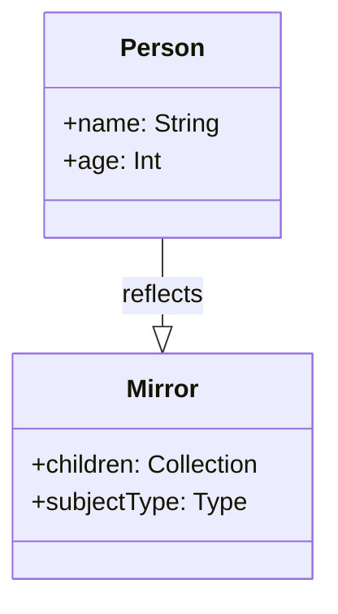

## 3.20 Metaprogramming and Reflection in Swift

Metaprogramming and reflection are powerful concepts that allow developers to write more dynamic and flexible code. In Swift, these concepts are not as extensive as in some other languages, but they still offer valuable tools for inspecting and manipulating code at runtime. In this section, we will delve into the nuances of metaprogramming and reflection, exploring their capabilities, limitations, and practical applications in Swift development.

### Understanding Reflection with `Mirror`

Reflection is the ability of a program to inspect and modify its structure and behavior at runtime. In Swift, the `Mirror` type provides a mechanism for reflection, allowing developers to examine the properties and structure of instances.

#### Using `Mirror` for Reflection

The `Mirror` type in Swift is used to reflect upon the structure of an instance. It provides a way to access the properties and types of an object at runtime. Here's a simple example:

```swift
struct Person {
    var name: String
    var age: Int
}

let john = Person(name: "John Doe", age: 30)
let mirror = Mirror(reflecting: john)

for child in mirror.children {
    if let propertyName = child.label {
        print("\\(propertyName): \\(child.value)")
    }
}
```

In this example, we create a `Person` struct and use `Mirror` to reflect on its properties. The `mirror.children` property provides a collection of the reflected instance's properties, which we iterate over to print their names and values.

#### Key Benefits of Using Reflection

- **Dynamic Inspection**: Reflection allows for the inspection of an object's properties and types at runtime, which can be invaluable for debugging and logging.
- **Generic Code**: By using reflection, you can write generic code that operates on a wide variety of types without knowing their specifics at compile time.

### Limitations of Reflection in Swift

While reflection provides powerful capabilities, it comes with certain limitations in Swift:

- **Performance Overhead**: Reflection can introduce performance overhead due to the dynamic nature of inspecting types and properties at runtime.
- **Limited Capabilities**: Swift's reflection capabilities are not as extensive as those in some other languages, such as Ruby or Python. For example, you cannot modify the structure of an object or its methods at runtime.
- **No Direct Type Casting**: Swift's type system is strict, and reflection does not allow for dynamic type casting or modification.

### Metaprogramming Techniques in Swift

Metaprogramming involves writing code that can generate or manipulate other code. In Swift, metaprogramming is limited compared to languages like Lisp or Ruby, but there are still some techniques you can use.

#### Code Generation

Code generation is a metaprogramming technique where code is generated programmatically. In Swift, this can be achieved through tools like Sourcery, which allows you to generate boilerplate code based on templates.

- **Sourcery**: Sourcery is a code generation tool that uses annotations and templates to generate Swift code. It can be used to automate repetitive tasks, such as generating model objects, protocol conformances, and more.

#### Macros and Compile-Time Code Execution

Swift does not natively support macros like C or C++. However, you can use Swift's `@dynamicMemberLookup` and `@dynamicCallable` attributes to achieve similar effects by allowing types to respond to arbitrary method calls and property accesses.

### Practical Applications of Metaprogramming and Reflection

Metaprogramming and reflection can be applied in various practical scenarios to enhance Swift development:

#### Debugging

Reflection can be used to create detailed logs and debug information by inspecting the properties and state of objects at runtime. This can help in understanding the flow of data and identifying issues.

#### Serialization

Reflection can simplify the process of serializing and deserializing objects by dynamically accessing their properties. This can be particularly useful when working with JSON or other data formats.

#### Dynamic UI Generation

By using reflection, you can dynamically generate user interfaces based on the properties and types of data models. This can be useful for creating flexible and adaptable UI components.

#### Dependency Injection

Reflection can aid in dependency injection by inspecting and resolving dependencies at runtime. This can help in decoupling components and enhancing testability.

### Try It Yourself

To get hands-on experience with reflection in Swift, try modifying the `Person` struct example to include additional properties. Use `Mirror` to reflect on the new properties and print their names and values. Experiment with different data types and see how `Mirror` handles them.

### Visualizing Reflection in Swift

To better understand how reflection works in Swift, let's visualize the process of reflecting on an instance using a class diagram.



In this diagram, the `Mirror` class reflects on the `Person` class, providing access to its properties through the `children` collection.

### References and Further Reading

- [Swift Documentation on Reflection](https://developer.apple.com/documentation/swift/mirror)
- [Sourcery: Meta-programming for Swift](https://github.com/krzysztofzablocki/Sourcery)

### Knowledge Check

Reflect on the concepts covered in this section by answering the following questions:

1. What is the primary purpose of the `Mirror` type in Swift?
2. How does reflection in Swift differ from reflection in other languages like Python or Ruby?
3. What are some practical applications of reflection in Swift development?

### Embrace the Journey

Remember, mastering metaprogramming and reflection in Swift is a journey. As you explore these concepts, you'll unlock new ways to write dynamic and flexible code. Keep experimenting, stay curious, and enjoy the process of discovery!

## Quiz Time!



### What is the primary purpose of the `Mirror` type in Swift?

- [x] To inspect the structure and properties of an instance at runtime
- [ ] To modify the methods of an instance at runtime
- [ ] To perform type casting dynamically
- [ ] To generate code at compile time

> **Explanation:** `Mirror` is used to reflect on the structure and properties of an instance, allowing inspection at runtime.

### Which of the following is a limitation of reflection in Swift?

- [x] Performance overhead
- [ ] Ability to modify object methods at runtime
- [ ] Extensive dynamic type casting
- [ ] Unlimited access to object properties

> **Explanation:** Reflection in Swift can introduce performance overhead due to its dynamic nature, and it does not allow modification of object methods or extensive type casting.

### What tool can be used for code generation in Swift?

- [x] Sourcery
- [ ] Xcode
- [ ] SwiftLint
- [ ] CocoaPods

> **Explanation:** Sourcery is a code generation tool that uses annotations and templates to generate Swift code.

### What attribute in Swift allows types to respond to arbitrary method calls?

- [x] `@dynamicCallable`
- [ ] `@dynamicMemberLookup`
- [ ] `@objc`
- [ ] `@available`

> **Explanation:** `@dynamicCallable` allows types to respond to arbitrary method calls in Swift.

### Which of the following is a practical application of reflection in Swift?

- [x] Debugging
- [x] Serialization
- [ ] Direct type casting
- [ ] Compile-time code execution

> **Explanation:** Reflection is useful for debugging and serialization, as it allows inspection of object properties and state at runtime.

### What is a common use case for metaprogramming in Swift?

- [x] Automating repetitive code tasks
- [ ] Dynamic type casting
- [ ] Modifying object methods at runtime
- [ ] Compile-time code execution

> **Explanation:** Metaprogramming, such as code generation, is often used to automate repetitive code tasks in Swift.

### Which attribute allows dynamic property access in Swift?

- [x] `@dynamicMemberLookup`
- [ ] `@dynamicCallable`
- [ ] `@objc`
- [ ] `@available`

> **Explanation:** `@dynamicMemberLookup` allows types to dynamically access properties in Swift.

### What is a limitation of metaprogramming in Swift compared to languages like Lisp?

- [x] Limited support for macros
- [ ] Lack of reflection capabilities
- [ ] Inability to inspect object properties
- [ ] No support for code generation

> **Explanation:** Swift has limited support for macros compared to languages like Lisp, which are more metaprogramming-friendly.

### True or False: Reflection in Swift can modify the structure of an object at runtime.

- [ ] True
- [x] False

> **Explanation:** Reflection in Swift cannot modify the structure of an object; it can only inspect it.

### What is one benefit of using reflection for debugging?

- [x] It allows inspection of object properties and state at runtime
- [ ] It modifies object methods to fix bugs
- [ ] It generates code to prevent errors
- [ ] It performs type casting to correct issues

> **Explanation:** Reflection allows developers to inspect object properties and state at runtime, which aids in debugging.




