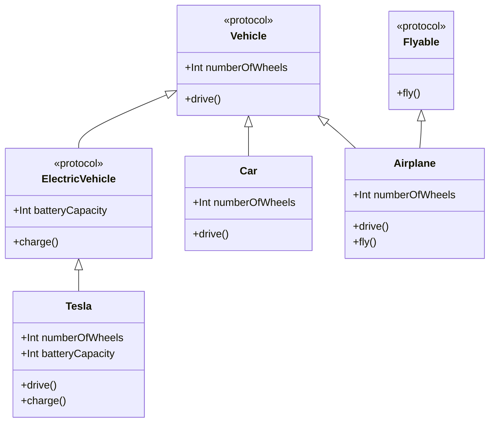

## 3.3 Protocols and Protocol Extensions

In Swift, protocols are a cornerstone of design, enabling developers to define blueprints for methods, properties, and other requirements that suit a particular task or piece of functionality. Protocols are not only a fundamental part of Swift's type system but also a powerful tool for achieving abstraction and promoting code reuse. In this section, we will delve into the intricacies of protocols and protocol extensions, highlighting their role in protocol-oriented design—a paradigm that leverages the power of composition and flexibility.

### Defining Protocols

At its core, a protocol specifies a blueprint of methods, properties, and other requirements that suit a particular task or piece of functionality. Protocols can be adopted by classes, structs, and enums, allowing for a flexible and powerful way to define shared behavior across different types.

#### Specifying Required Methods and Properties

To define a protocol, you use the `protocol` keyword followed by the protocol's name and a set of requirements. These requirements can include method signatures, property declarations, and more. Importantly, protocols do not provide implementations themselves; they only specify what must be implemented by conforming types.

```swift
protocol Vehicle {
    var numberOfWheels: Int { get }
    func drive()
}

struct Car: Vehicle {
    var numberOfWheels: Int {
        return 4
    }
    
    func drive() {
        print("Driving a car with \\(numberOfWheels) wheels.")
    }
}
```

In this example, the `Vehicle` protocol defines a property `numberOfWheels` and a method `drive()`. The `Car` struct conforms to the `Vehicle` protocol by implementing these requirements.

#### Protocol Inheritance

Swift allows protocols to inherit from other protocols, enabling the creation of more complex and specific requirements. This inheritance mechanism works similarly to class inheritance but is more flexible because it allows multiple inheritance.

```swift
protocol ElectricVehicle: Vehicle {
    var batteryCapacity: Int { get }
    func charge()
}

struct Tesla: ElectricVehicle {
    var numberOfWheels: Int {
        return 4
    }
    
    var batteryCapacity: Int {
        return 100
    }
    
    func drive() {
        print("Driving a Tesla with \\(numberOfWheels) wheels.")
    }
    
    func charge() {
        print("Charging the Tesla's battery.")
    }
}
```

Here, `ElectricVehicle` inherits from `Vehicle`, adding a new property `batteryCapacity` and a method `charge()`. The `Tesla` struct conforms to `ElectricVehicle`, implementing all required properties and methods.

### Default Implementations with Protocol Extensions

Protocol extensions in Swift allow you to provide default implementations for any of the requirements defined in a protocol. This feature is particularly powerful because it enables you to add behavior to types that conform to a protocol without requiring them to implement the behavior themselves.

#### Adding Methods via Protocol Extensions

By using protocol extensions, you can provide default method implementations, reducing boilerplate code and enhancing code reuse.

```swift
extension Vehicle {
    func drive() {
        print("Driving a vehicle.")
    }
}

struct Bicycle: Vehicle {
    var numberOfWheels: Int {
        return 2
    }
}

let bike = Bicycle()
bike.drive() // Outputs: Driving a vehicle.
```

In this example, the `drive()` method is implemented in a protocol extension, allowing any `Vehicle` conforming type to use this default implementation unless it provides its own.

#### Enhancing Protocols with Additional Functionality

Protocol extensions can also be used to add additional functionality to conforming types that go beyond the protocol's original requirements.

```swift
extension ElectricVehicle {
    func displayBatteryStatus() {
        print("Battery capacity is \\(batteryCapacity)%")
    }
}

let myTesla = Tesla()
myTesla.displayBatteryStatus() // Outputs: Battery capacity is 100%
```

Here, we add a `displayBatteryStatus()` method to `ElectricVehicle` through an extension, which can be used by any conforming type without additional implementation.

### Protocol-Oriented Design

Protocol-oriented design is a paradigm that emphasizes the use of protocols and protocol extensions to create flexible, reusable, and composable code. This approach contrasts with traditional object-oriented design, which often relies heavily on inheritance and class hierarchies.

#### Emphasizing Composition and Flexibility

By leveraging protocols, you can achieve a high degree of flexibility and composability in your code. This is because protocols allow you to define behavior that can be shared across different types without requiring a common superclass.

```swift
protocol Flyable {
    func fly()
}

struct Airplane: Vehicle, Flyable {
    var numberOfWheels: Int {
        return 3
    }
    
    func drive() {
        print("Taxiing on the runway.")
    }
    
    func fly() {
        print("Flying an airplane.")
    }
}

let plane = Airplane()
plane.drive() // Outputs: Taxiing on the runway.
plane.fly()   // Outputs: Flying an airplane.
```

In this example, `Airplane` adopts both `Vehicle` and `Flyable` protocols, demonstrating how composition allows for the combination of different behaviors.

#### Protocol-Oriented Programming in Practice

Protocol-oriented programming encourages developers to think in terms of protocols and their extensions, rather than classes and inheritance. This shift in mindset can lead to more modular and testable code.

```swift
protocol Describable {
    func describe() -> String
}

extension Describable {
    func describe() -> String {
        return "This is a describable object."
    }
}

struct Book: Describable {
    var title: String
    
    func describe() -> String {
        return "This book is titled '\\(title)'."
    }
}

let novel = Book(title: "1984")
print(novel.describe()) // Outputs: This book is titled '1984'.
```

In this example, the `Describable` protocol provides a default implementation of the `describe()` method. The `Book` struct overrides this method to provide a more specific description.

### Visualizing Protocols and Protocol Extensions

To better understand the relationships between protocols, conforming types, and protocol extensions, let's visualize these concepts using a class diagram.



This diagram illustrates how protocols can be composed and extended to create complex systems with minimal coupling.

### Swift Unique Features

Swift's protocol-oriented programming offers several unique features that enhance its utility and flexibility:

- **Protocol Composition**: Combine multiple protocols into a single requirement using the `&` operator.
- **Associated Types**: Define placeholder types within protocols that are resolved by conforming types.
- **Self Requirements**: Use `Self` to refer to the conforming type within a protocol.

#### Protocol Composition Example

```swift
protocol Swimmable {
    func swim()
}

protocol Runnable {
    func run()
}

typealias Triathlete = Swimmable & Runnable

struct Athlete: Triathlete {
    func swim() {
        print("Swimming in the pool.")
    }
    
    func run() {
        print("Running on the track.")
    }
}

let athlete = Athlete()
athlete.swim() // Outputs: Swimming in the pool.
athlete.run()  // Outputs: Running on the track.
```

This example demonstrates how protocol composition allows for the creation of complex behaviors by combining simpler protocols.

#### Associated Types and Self Requirements

Associated types and `Self` requirements provide additional flexibility in defining protocols with type-specific behavior.

```swift
protocol Container {
    associatedtype Item
    func add(_ item: Item)
    func getAllItems() -> [Item]
}

struct Box<T>: Container {
    private var items: [T] = []
    
    func add(_ item: T) {
        items.append(item)
    }
    
    func getAllItems() -> [T] {
        return items
    }
}

var intBox = Box<Int>()
intBox.add(1)
intBox.add(2)
print(intBox.getAllItems()) // Outputs: [1, 2]
```

In this example, the `Container` protocol uses an associated type `Item` to define a generic interface for storing items.

### Design Considerations

When using protocols and protocol extensions in Swift, consider the following best practices and potential pitfalls:

- **Avoid Overuse**: While protocols are powerful, overusing them can lead to complex and hard-to-maintain code.
- **Clarify Intent**: Clearly define the intent of each protocol to ensure it is used appropriately.
- **Leverage Default Implementations**: Use protocol extensions to provide common behavior, but allow conforming types to override when necessary.
- **Balance Flexibility and Complexity**: Strive for a balance between flexibility and complexity to maintain readable and maintainable code.

### Differences and Similarities with Other Patterns

Protocols in Swift are often compared to interfaces in other languages, such as Java or C#. While they serve similar purposes, Swift protocols offer additional flexibility through features like protocol extensions and associated types. Unlike interfaces, protocols can be adopted by structs and enums, not just classes, allowing for more versatile design patterns.

### Try It Yourself

Experiment with the code examples provided in this section. Try modifying the `Vehicle` protocol to include additional requirements or create new conforming types. Explore the use of protocol extensions to add default behavior and see how it impacts your code.

### Knowledge Check

Before moving on, ensure you understand the following:

- How to define a protocol and specify its requirements.
- The role of protocol inheritance in building complex protocols.
- How protocol extensions can provide default implementations and additional functionality.
- The principles of protocol-oriented design and how they differ from traditional object-oriented design.

## Quiz Time!



### What is the primary purpose of a protocol in Swift?

- [x] To define a blueprint of methods and properties for conforming types.
- [ ] To provide default implementations for methods.
- [ ] To enforce class inheritance.
- [ ] To manage memory allocation.

> **Explanation:** Protocols define a blueprint of methods and properties that conforming types must implement, promoting abstraction and code reuse.

### Which keyword is used to define a protocol in Swift?

- [ ] class
- [x] protocol
- [ ] struct
- [ ] enum

> **Explanation:** The `protocol` keyword is used to define a protocol in Swift.

### How can you provide a default implementation for a protocol method?

- [ ] By using a class method.
- [ ] By using a struct method.
- [x] By using a protocol extension.
- [ ] By using a global function.

> **Explanation:** Protocol extensions allow you to provide default implementations for protocol methods.

### What is protocol inheritance?

- [x] When a protocol inherits requirements from another protocol.
- [ ] When a class inherits from a protocol.
- [ ] When a protocol inherits from a class.
- [ ] When a struct inherits from a protocol.

> **Explanation:** Protocol inheritance occurs when a protocol inherits requirements from another protocol, allowing for more complex and specific requirements.

### What is the `&` operator used for in Swift protocols?

- [ ] To define a protocol.
- [x] To compose multiple protocols into a single requirement.
- [ ] To provide default implementations.
- [ ] To declare associated types.

> **Explanation:** The `&` operator is used to compose multiple protocols into a single requirement, allowing for complex behavior definitions.

### What is an associated type in a Swift protocol?

- [x] A placeholder type within a protocol that is resolved by conforming types.
- [ ] A type that is always optional.
- [ ] A type that is only used in classes.
- [ ] A type that cannot be overridden.

> **Explanation:** An associated type is a placeholder type within a protocol that is resolved by conforming types, providing flexibility in defining generic interfaces.

### How does protocol-oriented design differ from object-oriented design?

- [x] It emphasizes composition and flexibility over inheritance.
- [ ] It relies heavily on class hierarchies.
- [ ] It does not use protocols.
- [ ] It only uses structs and enums.

> **Explanation:** Protocol-oriented design emphasizes composition and flexibility, allowing for more modular and testable code compared to traditional object-oriented design.

### Can structs and enums adopt protocols in Swift?

- [x] Yes
- [ ] No

> **Explanation:** In Swift, structs and enums can adopt protocols, allowing for versatile design patterns beyond class-based inheritance.

### What is the purpose of the `Self` keyword in a protocol?

- [x] To refer to the conforming type within the protocol.
- [ ] To refer to the superclass.
- [ ] To refer to the protocol itself.
- [ ] To refer to the protocol's associated types.

> **Explanation:** The `Self` keyword is used to refer to the conforming type within a protocol, allowing for type-specific behavior definitions.

### True or False: Protocol extensions can add new methods to conforming types.

- [x] True
- [ ] False

> **Explanation:** Protocol extensions can add new methods to conforming types, enhancing their functionality without requiring additional implementation.



Remember, mastering protocols and protocol extensions is a journey. As you continue to explore these concepts, you'll discover new ways to create flexible, reusable, and efficient code. Keep experimenting and enjoy the process of learning and growing as a Swift developer!


