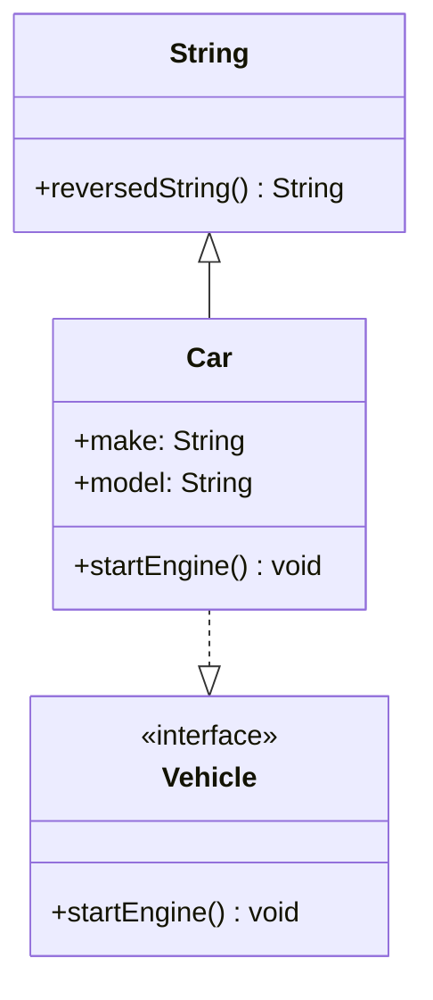

## 3.4 Extensions in Swift

Extensions in Swift are a powerful feature that allows developers to add new functionality to existing classes, structures, enumerations, and protocols. This capability is particularly useful for enhancing types you don’t own, such as those from the Swift Standard Library or third-party frameworks. In this section, we will explore how to effectively use extensions to augment types, adopt protocols, and organize code in a clean and modular way.

### Adding Functionality: Extending Types You Don't Own

Extensions enable you to add new methods, computed properties, initializers, subscripts, and nested types to existing types. This is especially beneficial when working with types that you do not have control over, such as those from the Swift Standard Library or external libraries.

#### Example: Extending the `String` Type

Let's start by extending the `String` type to include a method that reverses the characters in a string.

```swift
extension String {
    func reversedString() -> String {
        return String(self.reversed())
    }
}

// Usage
let original = "Swift"
let reversed = original.reversedString()
print(reversed) // Output: tfiwS
```

In this example, we added a `reversedString()` method to the `String` type. This method returns a new string with the characters in reverse order. Notice how we used `self` to refer to the instance of `String` on which the method is called.

#### Limitations: What Cannot Be Done with Extensions

While extensions are powerful, they have some limitations. Understanding these limitations is crucial to using extensions effectively:

- **Stored Properties**: Extensions cannot add stored properties to a type. This is because extensions do not have the capability to modify the memory layout of an existing type.
- **Override Methods**: Extensions cannot override existing methods. This limitation ensures that the original behavior of a type remains intact.
- **Designated Initializers**: Extensions cannot add designated initializers to classes. However, they can add convenience initializers.

### Protocol Conformance: Adopting Protocols in Extensions

Extensions can be used to make an existing type conform to a protocol. This is a powerful way to add functionality to a type without modifying its original implementation.

#### Example: Adding Protocol Conformance

Consider a scenario where we have a `Vehicle` protocol and a `Car` struct. We can use an extension to make `Car` conform to `Vehicle`.

```swift
protocol Vehicle {
    func startEngine()
}

struct Car {
    var make: String
    var model: String
}

extension Car: Vehicle {
    func startEngine() {
        print("Starting the engine of the \\(make) \\(model).")
    }
}

// Usage
let myCar = Car(make: "Tesla", model: "Model S")
myCar.startEngine() // Output: Starting the engine of the Tesla Model S.
```

In this example, we used an extension to conform `Car` to the `Vehicle` protocol by implementing the `startEngine()` method. This approach keeps the protocol implementation separate from the primary definition of the `Car` struct, promoting clean and organized code.

### Organizing Code: Using Extensions to Separate Functionality

Extensions can also be used to organize code by separating different functionalities into distinct sections. This practice enhances code readability and maintainability.

#### Example: Organizing Code with Extensions

Let's consider a `User` struct that has multiple responsibilities, such as managing user information and handling authentication. We can use extensions to separate these responsibilities.

```swift
struct User {
    var username: String
    var password: String
}

// Extension for user information
extension User {
    func displayName() -> String {
        return "User: \\(username)"
    }
}

// Extension for authentication
extension User {
    func authenticate(password: String) -> Bool {
        return self.password == password
    }
}

// Usage
let user = User(username: "john_doe", password: "securePassword")
print(user.displayName()) // Output: User: john_doe
print(user.authenticate(password: "securePassword")) // Output: true
```

In this example, we used two extensions to separate the user information and authentication functionalities. This separation makes it easier to manage and understand the code, especially as the project grows.

### Visualizing Extensions in Swift

To better understand how extensions work in Swift, let's visualize their interaction with types and protocols using a class diagram.



This diagram illustrates how the `String` and `Car` types are extended with new methods, and how `Car` conforms to the `Vehicle` protocol through an extension.

### Best Practices for Using Extensions

To maximize the benefits of extensions, consider the following best practices:

- **Single Responsibility**: Use extensions to separate different responsibilities of a type. This aligns with the Single Responsibility Principle, making your code more modular and easier to maintain.
- **Protocol Conformance**: Implement protocol conformance in extensions to keep the main type definition clean and focused.
- **Naming Conventions**: Use clear and descriptive names for methods and computed properties added via extensions. This improves code readability and helps other developers understand the added functionality.
- **Avoid Overuse**: While extensions are powerful, overusing them can lead to fragmented code. Use them judiciously to enhance code organization without sacrificing cohesion.

### Try It Yourself

Now that we've covered the basics of extensions, try experimenting with them in your own projects. Here are a few ideas to get you started:

- **Extend the `Array` Type**: Add a method to calculate the average of numeric elements.
- **Protocol Conformance**: Use extensions to make a custom type conform to multiple protocols.
- **Code Organization**: Refactor a complex type by separating its functionalities into extensions.

### References and Further Reading

For more information on Swift extensions and best practices, consider exploring the following resources:

- [Swift.org: The Swift Programming Language Guide](https://docs.swift.org/swift-book/LanguageGuide/Extensions.html)
- [Apple Developer Documentation: Extensions](https://developer.apple.com/documentation/swift/extensions)
- [Ray Wenderlich: Swift Extensions Tutorial](https://www.raywenderlich.com/)

### Knowledge Check

Let's reinforce what we've learned about extensions in Swift with a few questions and exercises.

1. **Question**: What are the limitations of using extensions in Swift?
2. **Exercise**: Create an extension for the `Int` type that adds a method to check if a number is prime.
3. **Question**: How can extensions be used to adopt protocols in Swift?

### Embrace the Journey

Remember, mastering extensions in Swift is a journey. As you continue to explore this feature, you'll discover new ways to enhance your code and improve its organization. Keep experimenting, stay curious, and enjoy the process of becoming a more proficient Swift developer!

## Quiz Time!



### What is a key limitation of Swift extensions?

- [x] They cannot add stored properties.
- [ ] They can override existing methods.
- [ ] They can add designated initializers.
- [ ] They can modify the memory layout of a type.

> **Explanation:** Swift extensions cannot add stored properties because they do not have the capability to alter the memory layout of a type.

### How can extensions be used to adopt protocols?

- [x] By implementing protocol methods in an extension.
- [ ] By modifying the original type definition.
- [ ] By adding stored properties.
- [ ] By overriding existing methods.

> **Explanation:** Extensions can be used to adopt protocols by implementing the required protocol methods within the extension.

### What is a best practice when using extensions?

- [x] Use extensions to separate different responsibilities of a type.
- [ ] Use extensions to add stored properties.
- [ ] Use extensions to override methods.
- [ ] Use extensions to modify existing initializers.

> **Explanation:** A best practice is to use extensions to separate different responsibilities, aligning with the Single Responsibility Principle.

### Which of the following can be added to a type using an extension?

- [x] Computed properties
- [ ] Stored properties
- [ ] Designated initializers
- [ ] Overridden methods

> **Explanation:** Extensions can add computed properties, methods, and protocol conformance, but not stored properties or overridden methods.

### What is a benefit of using extensions for protocol conformance?

- [x] It keeps the main type definition clean and focused.
- [ ] It allows adding stored properties.
- [ ] It enables overriding methods.
- [ ] It changes the memory layout of the type.

> **Explanation:** Using extensions for protocol conformance keeps the main type definition clean and focused, enhancing code organization.

### Can extensions modify the original behavior of a type?

- [ ] Yes, extensions can override methods.
- [x] No, extensions cannot override methods.
- [ ] Yes, extensions can change stored properties.
- [ ] No, extensions can only add new stored properties.

> **Explanation:** Extensions cannot modify the original behavior of a type because they cannot override existing methods.

### How do extensions enhance code organization?

- [x] By separating different functionalities into distinct sections.
- [ ] By adding stored properties to types.
- [ ] By overriding existing methods.
- [ ] By changing the memory layout of a type.

> **Explanation:** Extensions enhance code organization by allowing developers to separate different functionalities into distinct sections.

### What is a common use case for extensions?

- [x] Adding functionality to types you don't own.
- [ ] Modifying the memory layout of a type.
- [ ] Adding stored properties.
- [ ] Overriding existing methods.

> **Explanation:** A common use case for extensions is adding functionality to types you don't own, such as those from the Swift Standard Library.

### Can extensions add convenience initializers to classes?

- [x] Yes
- [ ] No

> **Explanation:** Extensions can add convenience initializers to classes, but not designated initializers.

### Extensions can be used to add which of the following to a type?

- [x] Methods and computed properties
- [ ] Stored properties and overridden methods

> **Explanation:** Extensions can be used to add methods and computed properties, but not stored properties or overridden methods.




