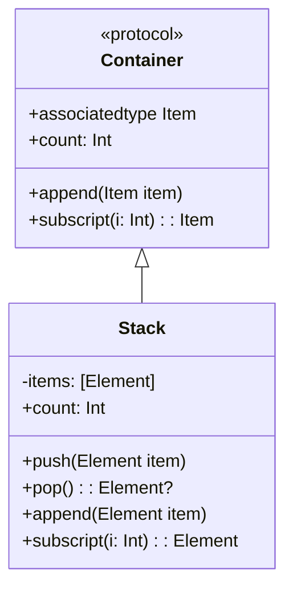

## 3.5 Generics and Associated Types

In Swift, generics and associated types are powerful tools that enable developers to write flexible, reusable, and type-safe code. These features allow you to create functions and types that can work with any data type, subject to constraints you define. In this section, we will delve into the concepts of generics and associated types, explore their benefits, and learn how to apply constraints to ensure type safety and functionality.

### Introduction to Generics

Generics allow you to write code that works with any type, providing a way to parameterize code with placeholders. This is particularly useful when you want to write functions or types that can operate on a variety of data types without sacrificing type safety.

#### Generic Functions

A generic function is a function that can work with any type. You define a generic function by specifying one or more type parameters in angle brackets after the function name. Here's a simple example:

```swift
// A generic function that swaps two values
func swapValues<T>(_ a: inout T, _ b: inout T) {
    let temp = a
    a = b
    b = temp
}

var x = 5
var y = 10
swapValues(&x, &y)
print("x: \\(x), y: \\(y)") // Output: x: 10, y: 5
```

In this example, `T` is a placeholder type that can be replaced with any actual type when the function is called. The `swapValues` function can swap two values of any type, as long as they are of the same type.

#### Generic Types

Generic types are types that can work with any data type. You define a generic type by specifying one or more type parameters in angle brackets after the type name. Here's an example of a generic stack:

```swift
// A generic stack implementation
struct Stack<Element> {
    private var items: [Element] = []

    mutating func push(_ item: Element) {
        items.append(item)
    }

    mutating func pop() -> Element? {
        return items.popLast()
    }
}

var intStack = Stack<Int>()
intStack.push(1)
intStack.push(2)
print(intStack.pop() ?? "Empty") // Output: 2

var stringStack = Stack<String>()
stringStack.push("Hello")
stringStack.push("World")
print(stringStack.pop() ?? "Empty") // Output: World
```

In this example, `Element` is a placeholder type that can be replaced with any actual type when the stack is used. This allows you to create stacks of integers, strings, or any other type.

### Associated Types in Protocols

Associated types are a powerful feature of Swift protocols that allow you to define placeholder types within protocols. This enables protocols to work with generic types without specifying the exact types up front.

#### Defining Associated Types

You define an associated type in a protocol using the `associatedtype` keyword. Here's an example:

```swift
// A protocol with an associated type
protocol Container {
    associatedtype Item

    mutating func append(_ item: Item)
    var count: Int { get }
    subscript(i: Int) -> Item { get }
}

// A generic stack conforming to the Container protocol
struct Stack<Element>: Container {
    var items: [Element] = []

    mutating func push(_ item: Element) {
        items.append(item)
    }

    mutating func pop() -> Element? {
        return items.popLast()
    }

    // Conformance to Container protocol
    mutating func append(_ item: Element) {
        self.push(item)
    }

    var count: Int {
        return items.count
    }

    subscript(i: Int) -> Element {
        return items[i]
    }
}
```

In this example, the `Container` protocol defines an associated type called `Item`. The `Stack` type conforms to the `Container` protocol by specifying that its `Item` type is the same as its `Element` type parameter.

### Benefits of Generics

Generics offer several benefits that make them a valuable tool in Swift development:

- **Code Reuse**: Generics allow you to write functions and types that can be reused with different data types, reducing code duplication and improving maintainability.
- **Type Safety**: Generics enable you to write type-safe code that catches type errors at compile time, reducing runtime errors and improving code reliability.
- **Flexibility**: Generics provide the flexibility to write code that can work with a wide range of data types, making your code more adaptable to changing requirements.

### Constraints on Generic Types

While generics provide flexibility, there are times when you need to impose constraints on the types that can be used with a generic function or type. Swift allows you to specify constraints using `where` clauses.

#### Using `where` Clauses

A `where` clause allows you to specify conditions that a type must satisfy to be used with a generic function or type. Here's an example:

```swift
// A generic function with a constraint
func findIndex<T: Equatable>(of valueToFind: T, in array: [T]) -> Int? {
    for (index, value) in array.enumerated() {
        if value == valueToFind {
            return index
        }
    }
    return nil
}

let numbers = [1, 2, 3, 4, 5]
if let index = findIndex(of: 3, in: numbers) {
    print("Index of 3: \\(index)") // Output: Index of 3: 2
}

let strings = ["apple", "banana", "cherry"]
if let index = findIndex(of: "banana", in: strings) {
    print("Index of banana: \\(index)") // Output: Index of banana: 1
}
```

In this example, the `findIndex` function has a constraint that requires the type `T` to conform to the `Equatable` protocol. This ensures that the function can compare elements using the `==` operator.

### Visualizing Generics and Associated Types

To better understand how generics and associated types work, let's visualize the relationship between a generic type, a protocol with an associated type, and their conforming types.



In this diagram, the `Container` protocol defines an associated type `Item` and methods that operate on this type. The `Stack` class implements the `Container` protocol, specifying that its `Item` type is the same as its `Element` type parameter.

### Try It Yourself

To deepen your understanding of generics and associated types, try modifying the examples provided:

1. **Extend the Stack**: Add a method to the `Stack` type that returns the top element without removing it.
2. **Create a Queue**: Implement a generic queue type that conforms to the `Container` protocol.
3. **Add Constraints**: Modify the `Stack` type to only accept elements that conform to a custom protocol you define.

### References and Links

For further reading and exploration of Swift generics and associated types, consider the following resources:

- [Swift Language Guide: Generics](https://docs.swift.org/swift-book/LanguageGuide/Generics.html)
- [Swift Programming Language: Protocols](https://docs.swift.org/swift-book/LanguageGuide/Protocols.html)
- [Swift Evolution Proposals](https://github.com/apple/swift-evolution)

### Knowledge Check

Let's review some key takeaways from this section:

- Generics allow you to write flexible, reusable, and type-safe code.
- Associated types enable protocols to work with generic types.
- Constraints using `where` clauses ensure type safety and functionality.

### Embrace the Journey

Remember, mastering generics and associated types is just the beginning. As you progress, you'll build more complex and interactive Swift applications. Keep experimenting, stay curious, and enjoy the journey!

## Quiz Time!



### What is the primary benefit of using generics in Swift?

- [x] Code reuse and type safety
- [ ] Faster code execution
- [ ] Easier debugging
- [ ] Improved user interface design

> **Explanation:** Generics allow for code reuse and ensure type safety, making your code more flexible and reliable.

### Which keyword is used to define an associated type in a protocol?

- [ ] generic
- [x] associatedtype
- [ ] typealias
- [ ] protocoltype

> **Explanation:** The `associatedtype` keyword is used to define a placeholder type within a protocol.

### How do you specify a constraint on a generic type in Swift?

- [ ] Using the `if` statement
- [x] Using a `where` clause
- [ ] Using a `switch` statement
- [ ] Using a `guard` statement

> **Explanation:** Constraints on generic types are specified using `where` clauses.

### What does the `Equatable` protocol provide?

- [x] The ability to compare instances for equality
- [ ] The ability to clone instances
- [ ] The ability to serialize instances
- [ ] The ability to perform arithmetic operations

> **Explanation:** The `Equatable` protocol allows for the comparison of instances using the `==` operator.

### Which of the following is a valid use of generics?

- [x] Writing a function that works with any data type
- [ ] Writing a function that only works with integers
- [ ] Writing a function that only works with strings
- [ ] Writing a function that only works with arrays

> **Explanation:** Generics allow you to write functions that can work with any data type.

### What is the purpose of a `where` clause in a generic function?

- [x] To specify conditions that a type must satisfy
- [ ] To define a default value for a type
- [ ] To declare a new variable
- [ ] To import a module

> **Explanation:** A `where` clause specifies conditions that a type must satisfy to be used with a generic function.

### Which of the following is true about associated types?

- [x] They allow protocols to work with generic types
- [ ] They are only used with classes
- [ ] They are a form of inheritance
- [ ] They are only used with enums

> **Explanation:** Associated types allow protocols to define placeholder types, enabling them to work with generics.

### What is the output of the following code?

```swift
var x = 5
var y = 10
swapValues(&x, &y)
print("x: \(x), y: \(y)")
```

- [x] x: 10, y: 5
- [ ] x: 5, y: 10
- [ ] x: 10, y: 10
- [ ] x: 5, y: 5

> **Explanation:** The `swapValues` function swaps the values of `x` and `y`, resulting in `x: 10, y: 5`.

### True or False: Generics can only be used with functions in Swift.

- [ ] True
- [x] False

> **Explanation:** Generics can be used with both functions and types, such as structs and classes, in Swift.

### True or False: Associated types are only used in protocols that have generic constraints.

- [ ] True
- [x] False

> **Explanation:** Associated types are used in protocols to define placeholder types, regardless of whether the protocol has generic constraints.




