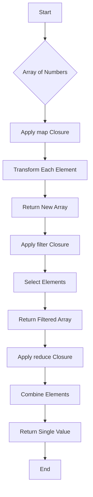

## 3.6 Closures and Higher-Order Functions

In the world of Swift programming, closures and higher-order functions are powerful tools that can significantly enhance your ability to write clean, efficient, and expressive code. By mastering these concepts, you can leverage the full potential of functional programming within Swift, leading to more robust and scalable applications. In this section, we will dive deep into closures and higher-order functions, exploring their syntax, capabilities, and practical applications.

### Closure Syntax: Defining Anonymous Functions

Closures in Swift are self-contained blocks of functionality that can be passed around and used in your code. They are similar to functions but with a more lightweight syntax. Closures can capture and store references to variables and constants from the surrounding context, allowing them to maintain state even after the context in which they were created has been destroyed.

#### Basic Closure Syntax

The basic syntax for a closure in Swift is as follows:

```swift
{ (parameters) -> returnType in
    // Closure body
}
```

Let's look at a simple example of a closure that adds two numbers:

```swift
let addClosure = { (a: Int, b: Int) -> Int in
    return a + b
}

let result = addClosure(3, 5)
print(result) // Output: 8
```

In this example, `addClosure` is a closure that takes two integers as parameters and returns their sum. The `in` keyword separates the closure's parameters and return type from the body.

#### Inferring Types and Simplifying Syntax

Swift allows you to simplify closure syntax by inferring parameter and return types from context, omitting the `return` keyword, and using shorthand argument names. Here's how you can simplify the previous example:

```swift
let addClosure: (Int, Int) -> Int = { $0 + $1 }

let result = addClosure(3, 5)
print(result) // Output: 8
```

In this version, the parameter and return types are inferred, and `$0` and `$1` are shorthand for the first and second parameters, respectively.

### Capturing Values: Understanding Closure Capture Lists

Closures in Swift can capture and store references to variables and constants from their surrounding context. This ability is known as capturing values, and it allows closures to maintain state and access external variables even after those variables have gone out of scope.

#### Capturing Variables

Consider the following example where a closure captures a variable from its surrounding context:

```swift
func makeIncrementer(incrementAmount: Int) -> () -> Int {
    var total = 0
    let incrementer: () -> Int = {
        total += incrementAmount
        return total
    }
    return incrementer
}

let incrementByTwo = makeIncrementer(incrementAmount: 2)
print(incrementByTwo()) // Output: 2
print(incrementByTwo()) // Output: 4
```

In this example, the `incrementer` closure captures the `total` variable and the `incrementAmount` parameter. Each time the closure is called, it updates and returns the `total` value.

#### Capture Lists

Swift provides capture lists to control how values are captured by a closure. Capture lists allow you to specify whether a value should be captured strongly or weakly, which is particularly useful for avoiding retain cycles in closures that capture `self`.

```swift
class SomeClass {
    var value = 10
    func doSomething() {
        let closure = { [weak self] in
            guard let self = self else { return }
            print(self.value)
        }
        closure()
    }
}

let instance = SomeClass()
instance.doSomething() // Output: 10
```

In this example, the closure captures `self` weakly to avoid a retain cycle, ensuring that `self` can be deallocated if no other strong references exist.

### Using Closures in Standard Library Functions: `map`, `filter`, `reduce`

Swift's standard library provides several higher-order functions that take closures as arguments. These functions, such as `map`, `filter`, and `reduce`, allow you to perform powerful operations on collections in a concise and expressive manner.

#### `map`

The `map` function applies a closure to each element in a collection, transforming the elements and returning a new collection with the transformed values.

```swift
let numbers = [1, 2, 3, 4, 5]
let squaredNumbers = numbers.map { $0 * $0 }
print(squaredNumbers) // Output: [1, 4, 9, 16, 25]
```

In this example, `map` is used to square each element in the `numbers` array, resulting in a new array of squared numbers.

#### `filter`

The `filter` function applies a closure to each element in a collection, returning a new collection containing only the elements for which the closure returns `true`.

```swift
let numbers = [1, 2, 3, 4, 5]
let evenNumbers = numbers.filter { $0 % 2 == 0 }
print(evenNumbers) // Output: [2, 4]
```

Here, `filter` is used to select only the even numbers from the `numbers` array.

#### `reduce`

The `reduce` function combines all elements in a collection into a single value using a closure that specifies how to combine the elements.

```swift
let numbers = [1, 2, 3, 4, 5]
let sum = numbers.reduce(0) { $0 + $1 }
print(sum) // Output: 15
```

In this example, `reduce` is used to calculate the sum of all elements in the `numbers` array, starting with an initial value of `0`.

### Trailing Closure Syntax: Improving Readability

Swift provides a trailing closure syntax that allows you to write cleaner and more readable code when a closure is the last argument in a function call. This syntax is particularly useful when working with higher-order functions.

#### Trailing Closure Example

Consider the following example using trailing closure syntax with the `map` function:

```swift
let numbers = [1, 2, 3, 4, 5]
let tripledNumbers = numbers.map { number in
    number * 3
}
print(tripledNumbers) // Output: [3, 6, 9, 12, 15]
```

In this example, the closure is written outside the parentheses of the `map` function call, improving readability.

### Visualizing Closures and Higher-Order Functions

To better understand the flow of data and operations in closures and higher-order functions, let's visualize the process using a flowchart.



This flowchart illustrates the sequence of operations when using `map`, `filter`, and `reduce` on an array of numbers.

### Try It Yourself

Now that we've covered the basics of closures and higher-order functions, try experimenting with the following exercises to reinforce your understanding:

1. Modify the `addClosure` to subtract, multiply, and divide two numbers.
2. Create a closure that captures an external variable and modifies it each time the closure is called.
3. Use `map`, `filter`, and `reduce` to perform complex transformations on a collection of custom objects.

### References and Links

For further reading on closures and higher-order functions in Swift, consider the following resources:

- [Apple's Swift Programming Language Guide](https://developer.apple.com/documentation/swift/swift_standard_library)
- [Swift by Sundell: Closures](https://www.swiftbysundell.com/articles/closures-in-swift/)
- [Ray Wenderlich: Higher-Order Functions in Swift](https://www.raywenderlich.com/148448/functional-programming-swift-getting-started)

### Knowledge Check

Before we wrap up, let's summarize the key takeaways from this section:

- Closures are self-contained blocks of functionality that can capture values from their surrounding context.
- Higher-order functions like `map`, `filter`, and `reduce` enable powerful operations on collections using closures.
- Trailing closure syntax improves code readability when using closures as function arguments.

Remember, mastering closures and higher-order functions is just the beginning of your journey towards becoming a proficient Swift developer. Keep experimenting, stay curious, and enjoy the process!

## Quiz Time!



### What is a closure in Swift?

- [x] A self-contained block of functionality that can be passed around and used in code.
- [ ] A function that takes no parameters and returns no value.
- [ ] A type of loop in Swift.
- [ ] A class that encapsulates related methods.

> **Explanation:** A closure is a self-contained block of functionality that can be passed around and used in your code, similar to a function.

### How can you simplify closure syntax in Swift?

- [x] By inferring parameter and return types from context.
- [x] By omitting the `return` keyword when possible.
- [ ] By using a `for` loop instead.
- [ ] By declaring the closure as a class.

> **Explanation:** Swift allows you to simplify closure syntax by inferring types and omitting the `return` keyword when the closure consists of a single expression.

### What is the purpose of a capture list in a closure?

- [x] To specify how values are captured by a closure.
- [ ] To declare the return type of a closure.
- [ ] To define the parameters of a closure.
- [ ] To initialize a closure.

> **Explanation:** A capture list is used to specify how values are captured by a closure, allowing you to control whether they are captured strongly or weakly.

### Which higher-order function applies a closure to each element in a collection and returns a new collection with transformed values?

- [x] `map`
- [ ] `filter`
- [ ] `reduce`
- [ ] `compactMap`

> **Explanation:** The `map` function applies a closure to each element in a collection, transforming the elements and returning a new collection with the transformed values.

### What does the `filter` function do?

- [x] Returns a new collection containing only the elements for which the closure returns `true`.
- [ ] Combines all elements in a collection into a single value.
- [ ] Applies a closure to each element in a collection.
- [ ] Sorts the elements of a collection.

> **Explanation:** The `filter` function applies a closure to each element in a collection, returning a new collection containing only the elements for which the closure returns `true`.

### How does the `reduce` function work?

- [x] It combines all elements in a collection into a single value using a closure.
- [ ] It filters elements from a collection based on a closure.
- [ ] It maps elements of a collection to new values.
- [ ] It sorts a collection.

> **Explanation:** The `reduce` function combines all elements in a collection into a single value using a closure that specifies how to combine the elements.

### What is trailing closure syntax used for?

- [x] To improve readability when a closure is the last argument in a function call.
- [ ] To declare a closure at the start of a function.
- [ ] To create a closure with no parameters.
- [ ] To define a closure without a return type.

> **Explanation:** Trailing closure syntax allows you to write cleaner and more readable code when a closure is the last argument in a function call.

### What is the output of the following code?
```swift
let numbers = [1, 2, 3]
let result = numbers.map { $0 * 2 }
print(result)
```

- [x] [2, 4, 6]
- [ ] [1, 2, 3]
- [ ] [3, 6, 9]
- [ ] [0, 2, 4]

> **Explanation:** The `map` function applies the closure to each element, doubling each number, resulting in `[2, 4, 6]`.

### True or False: Closures can capture and store references to variables and constants from the surrounding context.

- [x] True
- [ ] False

> **Explanation:** True. Closures can capture and store references to variables and constants from their surrounding context, allowing them to maintain state even after the context has been destroyed.

### Which of the following is NOT a higher-order function in Swift?

- [ ] `map`
- [ ] `filter`
- [ ] `reduce`
- [x] `loop`

> **Explanation:** `loop` is not a higher-order function in Swift. `map`, `filter`, and `reduce` are all higher-order functions that operate on collections.


