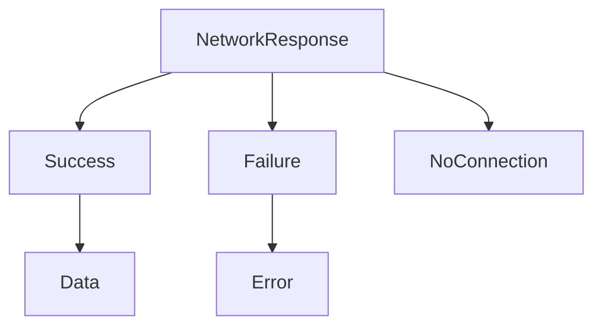

## 3.7 Enumerations with Associated Values

In Swift, enumerations are a powerful feature that allows you to define a common type for a group of related values and work with those values in a type-safe way. Enumerations in Swift are more flexible than their counterparts in other languages, as they can store associated values of any type alongside their cases. This feature makes them incredibly versatile and useful in a variety of scenarios, from modeling data to implementing complex logic.

### Basic Enumerations

Before diving into enumerations with associated values, it's essential to understand the basic concept of enumerations in Swift. Enumerations define a finite set of related values, which can be used to model a specific domain or category of data.

```swift
enum CompassPoint {
    case north
    case south
    case east
    case west
}
```

In this example, `CompassPoint` is an enumeration with four possible values: `.north`, `.south`, `.east`, and `.west`. You can use these values to represent directions in a type-safe manner.

### Associated Values

Swift's enumerations can store additional information for each case. This is achieved through associated values, which allow each enumeration case to have a different set of values associated with it. This feature is particularly useful when you need to store additional data alongside the enumeration case.

#### Example: Modeling a Network Response

Consider a scenario where you want to model the response from a network request. You can use an enumeration with associated values to handle different response types and their associated data.

```swift
enum NetworkResponse {
    case success(data: Data)
    case failure(error: Error)
    case noConnection
}
```

In this example, `NetworkResponse` has three cases: `.success`, `.failure`, and `.noConnection`. The `.success` case has an associated value of type `Data`, representing the data received from the network. The `.failure` case has an associated value of type `Error`, representing an error that occurred during the request.

#### Using Enumerations with Associated Values

To use an enumeration with associated values, you can create an instance of the enumeration and provide the associated values for the chosen case.

```swift
let response = NetworkResponse.success(data: someData)
```

You can then use a `switch` statement to handle each case and extract the associated values.

```swift
switch response {
case .success(let data):
    print("Received data: \\(data)")
case .failure(let error):
    print("Error occurred: \\(error)")
case .noConnection:
    print("No internet connection.")
}
```

### Recursive Enumerations

Recursive enumerations are a powerful feature in Swift that allows an enumeration to reference itself as an associated value. This is particularly useful for modeling data structures like trees or linked lists.

#### Example: Modeling a Binary Tree

Consider a binary tree, where each node can have a left and right child. You can use a recursive enumeration to model this structure.

```swift
indirect enum BinaryTree<T> {
    case empty
    case node(value: T, left: BinaryTree<T>, right: BinaryTree<T>)
}
```

In this example, `BinaryTree` is a recursive enumeration with two cases: `.empty` and `.node`. The `.node` case has associated values for the node's value and its left and right children, which are also of type `BinaryTree`.

#### Creating and Traversing a Binary Tree

You can create a binary tree by chaining nodes together.

```swift
let leftChild = BinaryTree.node(value: 2, left: .empty, right: .empty)
let rightChild = BinaryTree.node(value: 3, left: .empty, right: .empty)
let root = BinaryTree.node(value: 1, left: leftChild, right: rightChild)
```

To traverse the tree, you can use a recursive function.

```swift
func traverse(_ tree: BinaryTree<Int>) {
    switch tree {
    case .empty:
        return
    case .node(let value, let left, let right):
        print(value)
        traverse(left)
        traverse(right)
    }
}

traverse(root)
```

### Pattern Matching

Pattern matching is a powerful feature in Swift that allows you to work with complex data structures in a concise and expressive way. When used with enumerations, pattern matching enables you to extract associated values and handle different cases effectively.

#### Using Pattern Matching with Enumerations

Consider the earlier example of `NetworkResponse`. You can use pattern matching to handle each case and extract associated values.

```swift
switch response {
case .success(let data):
    print("Data received: \\(data)")
case .failure(let error):
    print("Error: \\(error.localizedDescription)")
case .noConnection:
    print("No connection available.")
}
```

#### Advanced Pattern Matching Techniques

Swift's pattern matching capabilities extend beyond simple `switch` statements. You can use pattern matching in `if` and `guard` statements, as well as in `for` loops.

```swift
if case .success(let data) = response {
    print("Data received: \\(data)")
}

guard case .failure(let error) = response else {
    return
}
print("Error: \\(error.localizedDescription)")
```

### Visualizing Enumerations with Associated Values

To better understand how enumerations with associated values work, consider the following diagram illustrating the `NetworkResponse` enumeration:



This diagram shows the `NetworkResponse` enumeration with its three cases and their associated values.

### Try It Yourself

To deepen your understanding of enumerations with associated values, try modifying the examples above. For instance, add a new case to the `NetworkResponse` enumeration to handle a timeout scenario, and update the `switch` statement accordingly. Experiment with recursive enumerations by creating a more complex data structure, such as a linked list.

### References and Links

For more information on Swift enumerations and pattern matching, check out the following resources:

- [Swift Documentation on Enumerations](https://developer.apple.com/documentation/swift/enumerations)
- [Swift Language Guide: Enumerations](https://docs.swift.org/swift-book/LanguageGuide/Enumerations.html)
- [Swift Evolution Proposal SE-0155: Recursive Enumerations](https://github.com/apple/swift-evolution/blob/main/proposals/0155-recursive-enumerations.md)

### Knowledge Check

To reinforce your understanding of enumerations with associated values, consider the following questions:

1. What are the benefits of using associated values in Swift enumerations?
2. How do recursive enumerations differ from regular enumerations?
3. What are some common use cases for pattern matching with enumerations?

### Embrace the Journey

Remember, mastering Swift's enumerations with associated values is just one step in your journey to becoming a proficient Swift developer. Keep exploring and experimenting with the language's features, and don't hesitate to seek out additional resources and community support. Stay curious, and enjoy the process of learning and growing as a developer!

## Quiz Time!



### What is an enumeration in Swift?

- [x] A type that defines a group of related values.
- [ ] A function that performs a specific task.
- [ ] A class that encapsulates data and behavior.
- [ ] A protocol that defines a blueprint for methods.

> **Explanation:** An enumeration in Swift is a type that defines a group of related values, allowing you to work with those values in a type-safe way.

### What is the purpose of associated values in enumerations?

- [x] To store additional information alongside each case.
- [ ] To define a default value for each case.
- [ ] To enforce type constraints on enumeration cases.
- [ ] To enable enumerations to inherit from other types.

> **Explanation:** Associated values allow each case of an enumeration to store additional information, making enumerations more flexible and useful for modeling complex data.

### How do you extract associated values from an enumeration case?

- [x] By using a `switch` statement with pattern matching.
- [ ] By calling a method on the enumeration instance.
- [ ] By using a `for` loop to iterate over the cases.
- [ ] By accessing a property on the enumeration instance.

> **Explanation:** You can extract associated values from an enumeration case using a `switch` statement with pattern matching, which allows you to handle each case and its associated values.

### What is a recursive enumeration?

- [x] An enumeration that can reference itself as an associated value.
- [ ] An enumeration that can inherit from other enumerations.
- [ ] An enumeration that can store multiple values for each case.
- [ ] An enumeration that can be used in recursive functions.

> **Explanation:** A recursive enumeration is an enumeration that can reference itself as an associated value, making it useful for modeling recursive data structures like trees.

### Which keyword is used to define a recursive enumeration in Swift?

- [x] `indirect`
- [ ] `recursive`
- [ ] `self`
- [ ] `enum`

> **Explanation:** The `indirect` keyword is used to define a recursive enumeration in Swift, allowing an enumeration case to reference itself.

### What is pattern matching in Swift?

- [x] A feature that allows you to work with complex data structures in a concise and expressive way.
- [ ] A technique for optimizing the performance of Swift code.
- [ ] A method for handling errors in Swift applications.
- [ ] A process for converting Swift code to machine code.

> **Explanation:** Pattern matching is a feature in Swift that allows you to work with complex data structures, such as enumerations, in a concise and expressive way, often using `switch` statements.

### How can you use pattern matching outside of `switch` statements?

- [x] In `if` and `guard` statements, as well as in `for` loops.
- [ ] Only in `switch` statements.
- [ ] In function declarations and method signatures.
- [ ] In class and struct initializers.

> **Explanation:** Pattern matching can be used in `if` and `guard` statements, as well as in `for` loops, allowing you to handle different cases and extract associated values in various contexts.

### What is the advantage of using enumerations with associated values?

- [x] They allow you to model complex data and logic in a type-safe way.
- [ ] They simplify the syntax of Swift code.
- [ ] They improve the performance of Swift applications.
- [ ] They enable enumerations to inherit from other types.

> **Explanation:** Enumerations with associated values allow you to model complex data and logic in a type-safe way, making them a powerful tool for developers.

### True or False: Enumerations in Swift can only store integer values.

- [ ] True
- [x] False

> **Explanation:** False. Enumerations in Swift can store values of any type, including strings, integers, and custom types, making them highly flexible and versatile.

### True or False: The `indirect` keyword is optional when defining recursive enumerations.

- [ ] True
- [x] False

> **Explanation:** False. The `indirect` keyword is required when defining recursive enumerations to indicate that the enumeration can reference itself.




