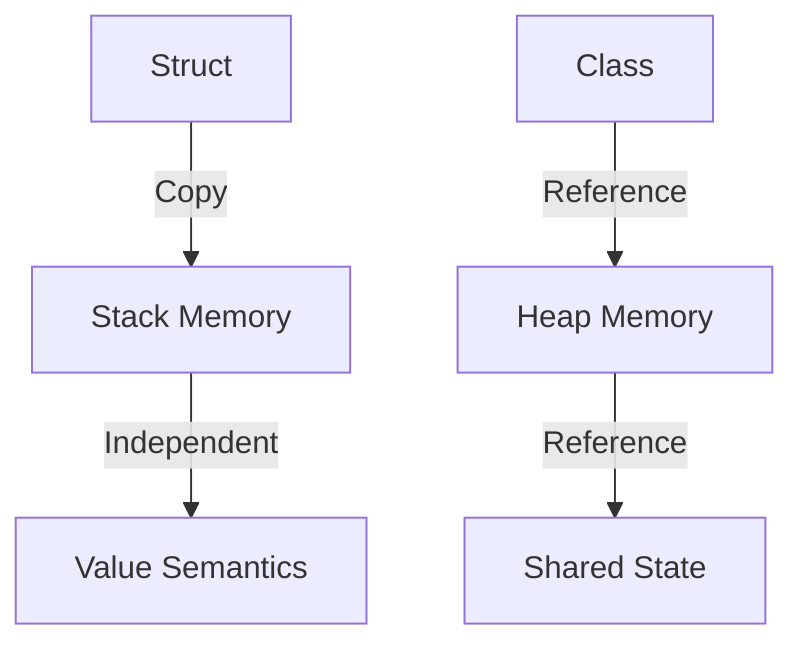

## 3.8 Structs vs. Classes: Choosing the Right Tool

As Swift developers, we often find ourselves at a crossroads when deciding between using structs and classes. Both are fundamental building blocks in Swift, but they serve different purposes and have distinct characteristics. Understanding these differences is crucial for making informed decisions that impact the design, performance, and maintainability of your code.

### Value Semantics in Structs

Structs in Swift are value types, which means they use **value semantics**. When you assign a struct to a new variable or pass it to a function, Swift creates a copy of the struct. This behavior ensures that changes to one instance do not affect others, leading to more predictable and safer code.

#### Key Characteristics of Structs

1. **Immutability by Default**: Structs are often used with immutable data. This means once a struct is initialized, its properties should not change, which aligns with functional programming principles.
2. **Copy on Write**: Swift optimizes structs with a "copy on write" mechanism. This means that the actual copying of data only occurs when modifications are made, making structs efficient in terms of performance.
3. **No Inheritance**: Structs do not support inheritance, which simplifies the object model and avoids complexities associated with class hierarchies.
4. **Automatic Memberwise Initializers**: Structs automatically receive a memberwise initializer, making them easier to instantiate without writing custom initializers.

#### Code Example: Structs

```swift
struct Point {
    var x: Double
    var y: Double
}

var point1 = Point(x: 0.0, y: 0.0)
var point2 = point1 // Creates a copy of point1

point2.x = 10.0 // Modifying point2 does not affect point1

print(point1.x) // Outputs: 0.0
print(point2.x) // Outputs: 10.0
```

In this example, `point2` is a copy of `point1`, and changes to `point2` do not affect `point1`.

### Reference Semantics in Classes

Classes are reference types, meaning they use **reference semantics**. When you assign a class instance to a variable or pass it to a function, you are working with a reference to the same instance. This allows for shared state, which can be both powerful and dangerous if not managed correctly.

#### Key Characteristics of Classes

1. **Reference Sharing**: Multiple variables can reference the same instance, allowing for shared state and dynamic behavior changes.
2. **Inheritance**: Classes support inheritance, enabling the creation of complex hierarchies and polymorphic behavior.
3. **Deinitializers**: Classes can define deinitializers to perform cleanup before an instance is deallocated.
4. **Identity**: Each class instance has a unique identity, which can be checked using the identity operators (`===` and `!==`).

#### Code Example: Classes

```swift
class Circle {
    var radius: Double
    
    init(radius: Double) {
        self.radius = radius
    }
}

let circle1 = Circle(radius: 5.0)
let circle2 = circle1 // References the same Circle instance

circle2.radius = 10.0 // Modifying circle2 affects circle1

print(circle1.radius) // Outputs: 10.0
print(circle2.radius) // Outputs: 10.0
```

Here, `circle2` and `circle1` refer to the same instance, so changes to one affect the other.

### Performance Considerations

When choosing between structs and classes, performance is an important factor. Structs are generally more efficient than classes because they are stack-allocated and benefit from Swift's optimizations like copy on write. Classes, on the other hand, are heap-allocated, which can introduce overhead due to reference counting and potential fragmentation.

#### Memory Usage

- **Structs**: Typically use less memory as they are stored on the stack. This makes them suitable for lightweight data structures.
- **Classes**: Stored on the heap, which can result in higher memory usage due to the overhead of reference counting.

#### Speed

- **Structs**: Faster for operations that involve copying or passing data, as they do not require reference counting.
- **Classes**: May incur additional overhead due to reference counting, especially in multithreaded environments.

### Use Cases: Guidelines for Selecting Structs or Classes

When deciding whether to use a struct or a class, consider the following guidelines:

#### When to Use Structs

1. **Immutable Data**: If the data is not expected to change after initialization, structs are a natural choice.
2. **Value Semantics**: When you want to ensure that data is copied rather than shared, use structs to avoid unintended side effects.
3. **Performance**: For lightweight data structures that require frequent copying, structs offer better performance.
4. **Functional Programming**: Structs align well with functional programming principles due to their immutability and value semantics.

#### When to Use Classes

1. **Shared State**: If you need to share state across different parts of your application, classes are more suitable.
2. **Inheritance**: When you need to leverage polymorphism and inheritance, classes provide the necessary features.
3. **Identity**: Use classes when the identity of an instance is important, such as in cases where you need to compare references.
4. **Complex Lifecycles**: For objects that require cleanup or complex initialization, classes offer more flexibility with deinitializers and custom initializers.

### Visualizing Structs and Classes

To better understand the differences between structs and classes, let's visualize their memory allocation and behavior:



In this diagram, structs are shown as being allocated on the stack with independent copies, while classes are allocated on the heap with shared state through references.

### Try It Yourself

To deepen your understanding, try modifying the code examples:

1. **Struct Experiment**: Add a method to the `Point` struct that modifies its properties. Observe how this affects the copied instances.
2. **Class Experiment**: Create a subclass of `Circle` that adds new behavior. Examine how inheritance affects the instance's behavior.

### References and Links

For further reading on structs and classes in Swift, consider the following resources:

- [Apple's Swift Documentation on Structures and Classes](https://developer.apple.com/documentation/swift/structures_and_classes)
- [Swift.org's Language Guide](https://swift.org/documentation/)

### Knowledge Check

Let's reinforce what we've learned:

- What are the key differences between structs and classes in Swift?
- How do value semantics in structs lead to more predictable code?
- Why might you choose a class over a struct for certain use cases?

### Embrace the Journey

Remember, choosing between structs and classes is just one aspect of mastering Swift. As you continue your journey, you'll encounter more complex design patterns and architectural decisions. Keep experimenting, stay curious, and enjoy the process of becoming a proficient Swift developer!

## Quiz Time!



### What is a key characteristic of structs in Swift?

- [x] Value semantics
- [ ] Reference semantics
- [ ] Inheritance
- [ ] Identity

> **Explanation:** Structs in Swift use value semantics, meaning they are copied when assigned to a new variable or passed to a function.

### Which of the following is true about classes in Swift?

- [x] They support inheritance.
- [ ] They are immutable by default.
- [ ] They are always faster than structs.
- [ ] They cannot have deinitializers.

> **Explanation:** Classes support inheritance, allowing for complex hierarchies and polymorphism, unlike structs.

### What is the primary memory allocation difference between structs and classes?

- [x] Structs are stack-allocated, classes are heap-allocated.
- [ ] Structs are heap-allocated, classes are stack-allocated.
- [ ] Both are stack-allocated.
- [ ] Both are heap-allocated.

> **Explanation:** Structs are typically allocated on the stack, while classes are allocated on the heap.

### When should you prefer using a struct over a class?

- [x] When you want predictable behavior with copying.
- [ ] When you need shared state.
- [ ] When you require inheritance.
- [ ] When you need complex lifecycles.

> **Explanation:** Structs are preferred for predictable behavior with copying due to their value semantics.

### Which of the following is a performance consideration when choosing between structs and classes?

- [x] Memory usage
- [ ] Syntax complexity
- [ ] Code readability
- [ ] Compiler speed

> **Explanation:** Memory usage is a key performance consideration, as structs are stack-allocated and classes are heap-allocated.

### Which feature is unique to classes in Swift?

- [x] Deinitializers
- [ ] Automatic memberwise initializers
- [ ] Value semantics
- [ ] Copy on write

> **Explanation:** Classes can define deinitializers, which are not available in structs.

### Why might you choose a class for shared state?

- [x] Because classes use reference semantics.
- [ ] Because classes are immutable.
- [ ] Because classes are faster.
- [ ] Because classes are simpler.

> **Explanation:** Classes use reference semantics, allowing for shared state across references.

### What is the impact of value semantics in structs?

- [x] Changes to one instance do not affect others.
- [ ] Changes to one instance affect all copies.
- [ ] Instances cannot be modified.
- [ ] Instances are always immutable.

> **Explanation:** Value semantics mean that each copy of a struct is independent, so changes to one do not affect others.

### How does Swift optimize structs?

- [x] Copy on write
- [ ] Reference counting
- [ ] Garbage collection
- [ ] Inheritance

> **Explanation:** Swift uses a "copy on write" mechanism to optimize structs, delaying copying until modifications occur.

### Structs are suitable for which type of programming?

- [x] Functional programming
- [ ] Object-oriented programming
- [ ] Procedural programming
- [ ] Reactive programming

> **Explanation:** Structs align well with functional programming principles due to their immutability and value semantics.


