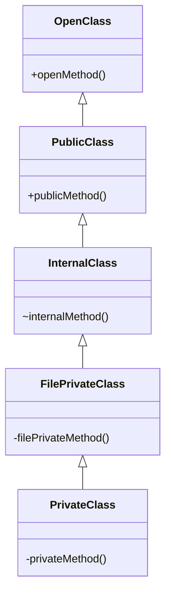

## 3.9 Access Control and Module Systems

In Swift, access control and module systems play a crucial role in defining the visibility and accessibility of code components. By managing access levels and organizing code into modules, developers can enhance encapsulation, maintainability, and scalability of Swift applications. This section delves into the intricacies of Swift's access control levels, the concept of modules, and best practices for managing access in a way that aligns with robust software design principles.

### Understanding Access Control in Swift

Access control in Swift is a mechanism to restrict access to parts of your code from code in other source files and modules. This helps in encapsulating the implementation details and exposing only what's necessary. Swift offers five access levels:

1. **Open**: The most permissive access level. Classes and class members can be accessed and subclassed outside the defining module.
2. **Public**: Allows access from any source file in the defining module or any module that imports the defining module. However, public classes and class members cannot be subclassed outside the defining module.
3. **Internal**: The default access level, allowing use within any source file from the defining module but not from outside the module.
4. **Fileprivate**: Restricts the use of an entity to its own defining source file.
5. **Private**: Restricts the use of an entity to the enclosing declaration and to extensions of that declaration in the same file.

#### Code Example: Access Levels

Let's illustrate these access levels with a simple example:

```swift
// Module A

open class OpenClass {
    open func openMethod() {
        print("Open method")
    }
}

public class PublicClass {
    public func publicMethod() {
        print("Public method")
    }
}

internal class InternalClass {
    func internalMethod() {
        print("Internal method")
    }
}

fileprivate class FilePrivateClass {
    func filePrivateMethod() {
        print("File-private method")
    }
}

private class PrivateClass {
    func privateMethod() {
        print("Private method")
    }
}
```

In this example, `OpenClass` and its method `openMethod` can be accessed and subclassed outside Module A. `PublicClass` and `publicMethod` can be accessed but not subclassed outside Module A. `InternalClass` is accessible only within Module A. `FilePrivateClass` and `PrivateClass` are confined to their source file.

### Modules: Organizing Code into Frameworks and Libraries

Modules in Swift are used to organize code into frameworks and libraries, promoting code reuse and separation of concerns. A module is a single unit of code distribution—a framework or application that is built and shipped as a single unit and can be imported by another module with Swift's `import` keyword.

#### Creating a Module

To create a module, you typically define a framework in Xcode. Here's a high-level overview of the steps:

1. **Create a New Framework**: In Xcode, create a new project and select "Framework" as the project type.
2. **Define Public API**: Use access control to define which parts of your framework are exposed to other modules.
3. **Build and Distribute**: Build your framework and distribute it as a binary or source code.

#### Code Example: Using a Module

Suppose we have a module named `MathUtilities` with a public function:

```swift
// MathUtilities Module

public func add(_ a: Int, _ b: Int) -> Int {
    return a + b
}
```

You can use this module in another Swift file as follows:

```swift
import MathUtilities

let result = add(3, 5)
print("The result is \\(result)")
```

### Encapsulation: Hiding Implementation Details

Encapsulation is a fundamental principle in object-oriented programming that involves hiding the internal state and requiring all interaction to be performed through an object's methods. Swift's access control levels support encapsulation by allowing developers to hide implementation details and expose only the necessary interface.

#### Best Practices for Encapsulation

- **Expose Minimal Interface**: Only expose the methods and properties that are necessary for the functionality of your module.
- **Use Private and Fileprivate Wisely**: Limit the visibility of helper methods and properties that are not intended to be used outside their defining context.
- **Leverage Internal for Module-Only Access**: Use internal access for components that are used across different files within the same module but should not be exposed to other modules.

### Best Practices for Managing Access in Swift

Managing access control effectively is key to maintaining a clean and maintainable codebase. Here are some best practices:

- **Start with the Most Restrictive Access**: Begin with `private` or `fileprivate` and gradually increase the access level as needed.
- **Use `open` Sparingly**: Reserve `open` for classes and methods that are explicitly designed for subclassing and extension outside the module.
- **Document Access Levels**: Clearly document the intended use and access level of your classes, methods, and properties.
- **Regularly Review Access Levels**: As your codebase evolves, periodically review access levels to ensure they still align with your design goals.

### Visualizing Access Control and Module Systems

To better understand the relationships between access levels and modules, let's visualize them using a class diagram:



This diagram illustrates the hierarchy and access levels of different classes, showcasing how access control restricts or allows visibility and interaction.

### Try It Yourself

Experiment with access control levels by creating a new Swift project. Try defining classes and methods with different access levels and observe how they interact across different files and modules. Modify the access levels and see how it affects the visibility and accessibility of your code components.

### References and Further Reading

- [Swift.org - The Swift Programming Language](https://swift.org/documentation/)
- [Apple Developer Documentation - Access Control](https://developer.apple.com/documentation/swift/access-control)
- [Swift by Sundell - Access Control in Swift](https://www.swiftbysundell.com/articles/access-control-in-swift/)

### Knowledge Check

- What are the five access levels in Swift, and how do they differ?
- How can modules help in organizing code for better maintainability?
- Why is encapsulation important in software design, and how does Swift facilitate it?

### Embrace the Journey

Remember, mastering access control and module systems is a journey. As you progress, you'll find that these concepts are foundational to building robust and maintainable Swift applications. Keep experimenting, stay curious, and enjoy the process of refining your code organization skills!

## Quiz Time!



### What is the most permissive access level in Swift?

- [x] open
- [ ] public
- [ ] internal
- [ ] private

> **Explanation:** The `open` access level is the most permissive, allowing access and subclassing outside the defining module.

### Which access level is the default in Swift?

- [ ] open
- [ ] public
- [x] internal
- [ ] private

> **Explanation:** The `internal` access level is the default in Swift, allowing access within the same module.

### What is the purpose of modules in Swift?

- [x] To organize code into frameworks and libraries
- [ ] To enforce strict access control
- [ ] To compile code faster
- [ ] To provide syntax highlighting

> **Explanation:** Modules in Swift are used to organize code into frameworks and libraries, promoting code reuse and separation of concerns.

### How does encapsulation benefit software design?

- [x] By hiding implementation details and exposing only necessary interfaces
- [ ] By increasing code complexity
- [ ] By reducing code readability
- [ ] By making code harder to maintain

> **Explanation:** Encapsulation hides implementation details and exposes only necessary interfaces, enhancing maintainability and reducing complexity.

### Which access level should be used for methods not intended for use outside their defining context?

- [ ] open
- [ ] public
- [ ] internal
- [x] private

> **Explanation:** The `private` access level restricts the use of an entity to the enclosing declaration, ideal for methods not intended for external use.

### What is a key benefit of using the `fileprivate` access level?

- [x] It restricts access to the defining source file
- [ ] It allows access across different modules
- [ ] It makes code globally accessible
- [ ] It improves code readability

> **Explanation:** The `fileprivate` access level restricts access to the defining source file, useful for file-specific implementations.

### Why should `open` be used sparingly in Swift?

- [x] Because it allows subclassing and extension outside the module
- [ ] Because it is less secure
- [ ] Because it is deprecated
- [ ] Because it is not supported in iOS

> **Explanation:** `open` should be used sparingly as it allows subclassing and extension outside the module, which can lead to unintended usage.

### What is the role of access control in encapsulation?

- [x] To hide implementation details and control visibility
- [ ] To increase code execution speed
- [ ] To simplify syntax
- [ ] To enhance graphical interfaces

> **Explanation:** Access control hides implementation details and controls visibility, supporting encapsulation and maintainability.

### How can you expose a minimal interface in Swift?

- [x] By using the most restrictive access level necessary
- [ ] By making all methods public
- [ ] By using global variables
- [ ] By avoiding the use of classes

> **Explanation:** Exposing a minimal interface involves using the most restrictive access level necessary, limiting visibility to essential components.

### True or False: `internal` access level allows access from any source file in the defining module.

- [x] True
- [ ] False

> **Explanation:** True. The `internal` access level allows access from any source file within the defining module.



---


