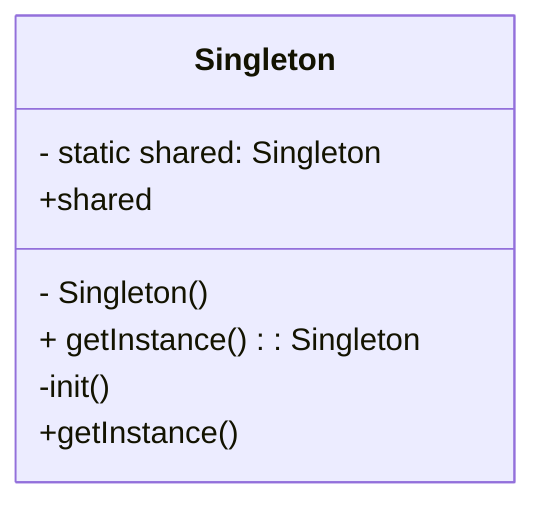

## 4.1 Singleton Design Pattern

The Singleton Design Pattern is a creational pattern that ensures a class has only one instance and provides a global point of access to that instance. This pattern is particularly useful when exactly one object is needed to coordinate actions across a system. In Swift, implementing a Singleton is straightforward, but it requires careful consideration to avoid common pitfalls such as global state issues or thread safety concerns.

### Intent

The primary intent of the Singleton Design Pattern is to:

- Ensure that a class has only one instance.
- Provide a global point of access to that instance.

### Implementing Singleton in Swift

Swift provides a clean and efficient way to implement the Singleton pattern using static constants and private initializers. Let's explore the steps involved in creating a Singleton in Swift.

#### Using Static Constants and Private Initializers

The most common way to implement a Singleton in Swift is by using a static constant and a private initializer. This approach leverages Swift's type system to ensure that only one instance of the class is created.

```swift
class Singleton {
    // Static constant for the single instance
    static let shared = Singleton()
    
    // Private initializer to prevent external instantiation
    private init() {
        // Initialization code here
    }
}

// Usage
let singletonInstance = Singleton.shared
```

**Key Points:**

- **Static Constant**: The `shared` property is a static constant, ensuring that it is initialized only once and is accessible globally.
- **Private Initializer**: The initializer is marked as private, preventing any external code from creating additional instances of the class.

#### Ensuring Thread Safety with Swift's Guarantees

Swift's static constants are inherently thread-safe. The language guarantees that a static constant is initialized only once, even in a multithreaded environment. This makes the Singleton pattern in Swift naturally thread-safe without requiring additional synchronization mechanisms like locks.

#### Avoiding Global State Issues

While Singletons provide a convenient way to share a single instance across an application, they can lead to global state issues if not used carefully. Here are some best practices to avoid such problems:

- **Limit the Use of Singletons**: Use Singletons sparingly and only when a single instance is truly necessary.
- **Avoid Storing State**: Try not to store mutable state in a Singleton. Instead, use it to provide stateless services or configurations.
- **Testability Concerns**: Singletons can make unit testing challenging. Consider using dependency injection to provide test doubles during testing.

### Use Cases and Examples

Singletons are commonly used in scenarios where a single instance is required to manage shared resources or configurations. Here are some typical use cases:

#### Shared Configurations

A Singleton can be used to manage application-wide configurations or settings. This ensures that all parts of the application have consistent access to the same configuration data.

```swift
class ConfigurationManager {
    static let shared = ConfigurationManager()
    
    private init() {}
    
    var apiEndpoint: String = "https://api.example.com"
    var timeoutInterval: TimeInterval = 60.0
}

// Usage
let config = ConfigurationManager.shared
print(config.apiEndpoint)
```

#### Logging Services

A logging service is another common use case for a Singleton. A single logging instance can be used throughout the application to record logs consistently.

```swift
class Logger {
    static let shared = Logger()
    
    private init() {}
    
    func log(message: String) {
        print("Log: \\(message)")
    }
}

// Usage
Logger.shared.log(message: "Application started")
```

#### Network Managers

Network managers often use the Singleton pattern to manage network requests and responses. This ensures that all network operations are handled consistently through a single interface.

```swift
class NetworkManager {
    static let shared = NetworkManager()
    
    private init() {}
    
    func fetchData(from url: URL, completion: @escaping (Data?, Error?) -> Void) {
        // Network request implementation
    }
}

// Usage
let url = URL(string: "https://api.example.com/data")!
NetworkManager.shared.fetchData(from: url) { data, error in
    // Handle response
}
```

### Visualizing the Singleton Pattern

To better understand the Singleton pattern, let's visualize its structure and interactions using a class diagram.



**Diagram Description:**

- The `Singleton` class contains a static `shared` property that holds the single instance.
- The constructor `init()` is private, preventing external instantiation.
- The `getInstance()` method provides access to the `shared` instance.

### Design Considerations

When implementing the Singleton pattern, consider the following:

- **When to Use**: Use the Singleton pattern when a single instance of a class is needed to coordinate actions across a system.
- **Thread Safety**: Swift's static constants provide inherent thread safety, but be cautious with mutable state.
- **Testability**: Singletons can complicate unit testing. Consider using dependency injection to provide mock instances during tests.
- **Global State**: Avoid using Singletons to store global state that can lead to tight coupling and maintenance challenges.

### Swift Unique Features

Swift offers unique features that enhance the implementation of the Singleton pattern:

- **Static Constants**: Swift's static constants are lazily initialized and thread-safe, making them ideal for Singleton instances.
- **Access Control**: Swift's access control mechanisms, such as `private` and `fileprivate`, help encapsulate Singleton initialization logic.
- **Protocol-Oriented Programming**: Consider using protocols to define Singleton interfaces, allowing for greater flexibility and testability.

### Differences and Similarities

The Singleton pattern is often compared with other design patterns, such as:

- **Factory Pattern**: While the Singleton pattern ensures a single instance, the Factory pattern focuses on creating instances. They can be used together, where a Factory returns a Singleton instance.
- **Monostate Pattern**: The Monostate pattern allows multiple instances but shares state across them, whereas the Singleton pattern restricts to a single instance.

### Try It Yourself

To deepen your understanding of the Singleton pattern, try modifying the code examples:

- **Experiment with State**: Add state to the Singleton and observe the effects on thread safety and global state issues.
- **Implement a Protocol**: Define a protocol for the Singleton and create a mock implementation for testing purposes.
- **Create a Custom Logger**: Extend the Logger example to include different log levels (e.g., info, warning, error).

### Knowledge Check

Reflect on the following questions to reinforce your understanding:

- What are the key characteristics of the Singleton pattern?
- How does Swift's static constant feature enhance Singleton implementation?
- What are some common pitfalls of using Singletons, and how can they be mitigated?

### Embrace the Journey

Remember, mastering the Singleton pattern is just the beginning of your journey in design patterns. As you progress, you'll build more robust and scalable applications. Keep experimenting, stay curious, and enjoy the journey!

## Quiz Time!



### What is the primary intent of the Singleton Design Pattern?

- [x] Ensure a class has only one instance and provide a global point of access.
- [ ] Create multiple instances of a class.
- [ ] Enhance the performance of a class.
- [ ] Simplify the class interface.

> **Explanation:** The Singleton Design Pattern ensures that a class has only one instance and provides a global point of access to it.

### How does Swift ensure thread safety for Singleton instances?

- [x] Swift's static constants are lazily initialized and inherently thread-safe.
- [ ] By using locks and synchronization mechanisms.
- [ ] By creating multiple instances and managing them.
- [ ] By using global variables.

> **Explanation:** Swift's static constants are lazily initialized and thread-safe, making them ideal for Singleton instances.

### What is a common use case for the Singleton pattern?

- [x] Managing shared configurations or settings.
- [ ] Creating multiple instances of a data model.
- [ ] Enhancing the performance of algorithms.
- [ ] Simplifying user interface design.

> **Explanation:** A common use case for the Singleton pattern is managing shared configurations or settings.

### What is a potential downside of using Singletons?

- [x] They can lead to global state issues and tight coupling.
- [ ] They enhance code readability.
- [ ] They improve performance.
- [ ] They simplify testing.

> **Explanation:** Singletons can lead to global state issues and tight coupling, making the code harder to maintain and test.

### What is a best practice when using Singletons?

- [x] Avoid storing mutable state in Singletons.
- [ ] Use Singletons for every class in the application.
- [ ] Store all application data in Singletons.
- [ ] Use Singletons to enhance user interface design.

> **Explanation:** Avoid storing mutable state in Singletons to prevent global state issues and ensure better maintainability.

### How can Singletons complicate unit testing?

- [x] They can make it difficult to isolate tests due to shared state.
- [ ] They simplify the creation of test cases.
- [ ] They enhance test performance.
- [ ] They provide built-in testing mechanisms.

> **Explanation:** Singletons can complicate unit testing by making it difficult to isolate tests due to shared state.

### What is a key feature of Swift that benefits Singleton implementation?

- [x] Static constants are lazily initialized and thread-safe.
- [ ] Swift allows global variables for Singleton instances.
- [ ] Swift provides built-in Singleton classes.
- [ ] Swift requires manual synchronization for Singletons.

> **Explanation:** Swift's static constants are lazily initialized and thread-safe, making them ideal for Singleton implementation.

### How can you make a Singleton more testable?

- [x] Use dependency injection to provide mock instances during tests.
- [ ] Use global variables for Singleton instances.
- [ ] Avoid using protocols with Singletons.
- [ ] Store all state in the Singleton.

> **Explanation:** Using dependency injection allows you to provide mock instances during tests, enhancing testability.

### What is the difference between Singleton and Monostate patterns?

- [x] Singleton restricts to a single instance, while Monostate shares state across instances.
- [ ] Singleton creates multiple instances, while Monostate creates one.
- [ ] Singleton enhances performance, while Monostate simplifies interfaces.
- [ ] Singleton and Monostate are the same pattern.

> **Explanation:** Singleton restricts to a single instance, while Monostate allows multiple instances but shares state across them.

### True or False: Singletons are always the best solution for managing shared resources.

- [ ] True
- [x] False

> **Explanation:** Singletons are not always the best solution for managing shared resources. They should be used judiciously to avoid global state issues and ensure maintainability.




