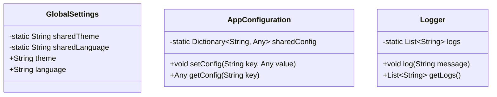

## 4.10 Monostate Pattern

The Monostate Pattern is a creational design pattern that provides a unique approach to ensuring that all instances of a class share the same state. While it offers a singleton-like behavior, it allows multiple instances to exist, all accessing a shared state. This pattern is particularly useful in scenarios where global configurations or settings need to be accessed from multiple points in an application.

### Intent

The primary intent of the Monostate Pattern is to ensure that all instances of a class share the same state. This is achieved through the use of static properties within a class, allowing multiple instances to access and modify shared data. Unlike the Singleton Pattern, which restricts the instantiation of a class to a single object, the Monostate Pattern permits multiple instances, all of which operate on the same state.

### Implementing Monostate in Swift

To implement the Monostate Pattern in Swift, you can utilize static properties within a class. These properties are shared across all instances, enabling them to access and modify the same state. Let's explore a step-by-step implementation of the Monostate Pattern in Swift.

#### Step-by-Step Implementation

1. **Define a Class with Static Properties**

   Begin by defining a class that contains static properties. These properties will hold the shared state that all instances will access.

   ```swift
   class GlobalSettings {
       private static var sharedTheme: String = "Light"
       private static var sharedLanguage: String = "English"
       
       var theme: String {
           get { return GlobalSettings.sharedTheme }
           set { GlobalSettings.sharedTheme = newValue }
       }
       
       var language: String {
           get { return GlobalSettings.sharedLanguage }
           set { GlobalSettings.sharedLanguage = newValue }
       }
   }
   ```

   In this example, `GlobalSettings` is a class with static properties `sharedTheme` and `sharedLanguage`. These properties store the shared state.

2. **Accessing and Modifying Shared State**

   Create instances of the class and demonstrate how they access and modify the shared state.

   ```swift
   let settings1 = GlobalSettings()
   let settings2 = GlobalSettings()

   print("Initial Theme: \\(settings1.theme)") // Output: Light
   print("Initial Language: \\(settings2.language)") // Output: English

   settings1.theme = "Dark"
   settings2.language = "Spanish"

   print("Updated Theme: \\(settings2.theme)") // Output: Dark
   print("Updated Language: \\(settings1.language)") // Output: Spanish
   ```

   As seen in the example, changing the `theme` or `language` through one instance reflects in all instances, showcasing the shared state.

3. **Advantages of Monostate Pattern**

   - **Multiple Instances**: Unlike the Singleton Pattern, the Monostate Pattern allows for multiple instances, providing flexibility in scenarios where instance-specific behavior is needed alongside shared state.
   - **Ease of Testing**: Testing individual instances is simpler compared to testing a Singleton, as each instance can be independently verified while still maintaining shared state.
   - **Separation of Concerns**: The pattern separates the concern of shared state management from instance-specific behavior, leading to cleaner and more maintainable code.

4. **Considerations**

   - **Thread Safety**: Ensure that access to static properties is thread-safe, especially in multi-threaded environments. Use synchronization mechanisms like locks or queues if necessary.
   - **State Management**: Be cautious of unintended side effects when multiple instances modify the shared state simultaneously.

### Differences from Singleton

The Monostate Pattern is often compared to the Singleton Pattern, but there are key differences:

- **Multiple Instances**: The Monostate Pattern allows for multiple instances, each with its own identity, while the Singleton Pattern restricts the class to a single instance.
- **Shared State**: Both patterns share state, but the Monostate achieves this through static properties, whereas the Singleton uses a single shared instance.
- **Flexibility**: The Monostate Pattern offers more flexibility in scenarios where instance-specific behavior is required alongside shared state.

### Use Cases and Examples

The Monostate Pattern is ideal for scenarios where global configurations or settings need to be accessed from multiple points in an application. Let's explore some practical use cases and examples.

#### Use Case 1: Global Configuration

In applications where global settings such as themes, languages, or user preferences need to be accessed and modified from various parts of the application, the Monostate Pattern provides a convenient solution.

```swift
class AppConfiguration {
    private static var sharedConfig: [String: Any] = ["theme": "Light", "language": "English"]
    
    func setConfig(key: String, value: Any) {
        AppConfiguration.sharedConfig[key] = value
    }
    
    func getConfig(key: String) -> Any? {
        return AppConfiguration.sharedConfig[key]
    }
}

let config1 = AppConfiguration()
let config2 = AppConfiguration()

config1.setConfig(key: "theme", value: "Dark")
print(config2.getConfig(key: "theme") as? String ?? "Unknown") // Output: Dark
```

#### Use Case 2: Logging Mechanism

A logging mechanism that needs to be accessed from different parts of an application can benefit from the Monostate Pattern. Each instance can log messages, and the logs are stored in a shared state.

```swift
class Logger {
    private static var logs: [String] = []
    
    func log(message: String) {
        Logger.logs.append(message)
    }
    
    func getLogs() -> [String] {
        return Logger.logs
    }
}

let logger1 = Logger()
let logger2 = Logger()

logger1.log(message: "Initialization complete.")
logger2.log(message: "User logged in.")

print(logger1.getLogs()) // Output: ["Initialization complete.", "User logged in."]
```

### Visualizing the Monostate Pattern

To better understand the Monostate Pattern, let's visualize the structure using a class diagram.



In the diagram, each class has static properties that are shared across all instances, demonstrating the Monostate Pattern's structure.

### Swift Unique Features

Swift offers unique features that enhance the implementation of the Monostate Pattern:

- **Static Properties**: Swift's static properties provide a straightforward way to implement shared state across instances.
- **Access Control**: Use Swift's access control features to encapsulate and protect the shared state, ensuring it is only modified through controlled methods.
- **Value Types**: Leverage Swift's value types, such as structs, to manage instance-specific data while maintaining shared state through static properties.

### Design Considerations

When implementing the Monostate Pattern in Swift, consider the following:

- **Thread Safety**: Ensure thread-safe access to static properties in concurrent environments.
- **State Consistency**: Maintain consistency of the shared state across all instances, especially when multiple threads are involved.
- **Use Cases**: Evaluate whether the Monostate Pattern is the best fit for your use case, considering alternatives like the Singleton Pattern if appropriate.

### Differences and Similarities

While the Monostate and Singleton Patterns share similarities, such as managing shared state, they differ in their approach and flexibility. The Monostate Pattern's ability to have multiple instances makes it suitable for scenarios where instance-specific behavior is needed alongside shared state.

### Try It Yourself

To deepen your understanding of the Monostate Pattern, try modifying the code examples provided. Experiment with adding new properties or methods to the classes, and observe how changes to the shared state affect all instances.

### Knowledge Check

- What are the primary differences between the Monostate and Singleton Patterns?
- How does the Monostate Pattern ensure that all instances share the same state?
- What are some practical use cases for the Monostate Pattern in Swift?

### Embrace the Journey

Remember, mastering design patterns is a journey. The Monostate Pattern is just one of many tools in your Swift development toolkit. As you continue to explore and experiment, you'll gain a deeper understanding of how to build robust and scalable applications. Keep experimenting, stay curious, and enjoy the process!

## Quiz Time!



### What is the primary intent of the Monostate Pattern?

- [x] To ensure that all instances share the same state
- [ ] To restrict a class to a single instance
- [ ] To provide a unique instance for each thread
- [ ] To allow instances to have independent states

> **Explanation:** The Monostate Pattern ensures that all instances of a class share the same state by using static properties.

### How does the Monostate Pattern differ from the Singleton Pattern?

- [x] It allows multiple instances to exist
- [ ] It restricts the class to a single instance
- [ ] It uses instance properties instead of static properties
- [ ] It provides a unique instance for each thread

> **Explanation:** Unlike the Singleton Pattern, the Monostate Pattern allows multiple instances to exist, all sharing the same state through static properties.

### Which Swift feature is primarily used to implement the Monostate Pattern?

- [x] Static properties
- [ ] Instance properties
- [ ] Protocols
- [ ] Extensions

> **Explanation:** Static properties are used to implement the Monostate Pattern, allowing shared state across all instances.

### What is a potential advantage of the Monostate Pattern over the Singleton Pattern?

- [x] Easier testing of individual instances
- [ ] Ensures only one instance exists
- [ ] Provides thread-local storage
- [ ] Allows for different states in each instance

> **Explanation:** The Monostate Pattern allows for easier testing of individual instances while maintaining shared state, unlike the Singleton Pattern.

### In the Monostate Pattern, how is shared state managed?

- [x] Through static properties in the class
- [ ] Through instance properties in each object
- [ ] Through global variables
- [ ] Through protocol conformance

> **Explanation:** Shared state is managed through static properties in the class, accessible by all instances.

### What is a common use case for the Monostate Pattern?

- [x] Global configuration settings
- [ ] Unique database connections
- [ ] Thread-local storage
- [ ] Independent user sessions

> **Explanation:** The Monostate Pattern is commonly used for global configuration settings that need to be accessed from multiple points in an application.

### How can thread safety be ensured when using the Monostate Pattern?

- [x] Using synchronization mechanisms like locks or queues
- [ ] Using instance properties for each object
- [ ] Avoiding static properties
- [ ] Using global variables

> **Explanation:** Thread safety can be ensured by using synchronization mechanisms like locks or queues when accessing static properties.

### What is a potential drawback of the Monostate Pattern?

- [x] Unintended side effects from shared state
- [ ] Complexity in managing a single instance
- [ ] Difficulty in testing individual instances
- [ ] Inability to share state

> **Explanation:** A potential drawback is unintended side effects from shared state, as changes by one instance affect all others.

### Can the Monostate Pattern be used in multi-threaded environments?

- [x] Yes, with proper thread safety measures
- [ ] No, it is not suitable for multi-threaded environments
- [ ] Yes, without any additional measures
- [ ] No, it requires a single-threaded environment

> **Explanation:** The Monostate Pattern can be used in multi-threaded environments with proper thread safety measures.

### True or False: The Monostate Pattern is a type of Singleton Pattern.

- [ ] True
- [x] False

> **Explanation:** False. The Monostate Pattern is not a type of Singleton Pattern; it allows multiple instances with shared state, unlike the Singleton which restricts to a single instance.




