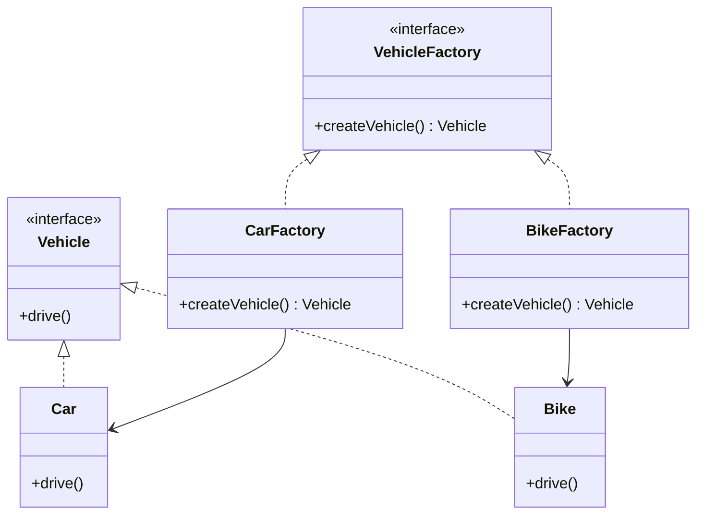

## 4.2 Factory Method Design Pattern

### Introduction

The Factory Method Design Pattern is a creational pattern that provides an interface for creating objects in a superclass, but allows subclasses to alter the type of objects that will be created. This pattern is particularly useful when a class cannot anticipate the class of objects it must create or when a class wants its subclasses to specify the objects it creates.

### Intent

The primary intent of the Factory Method Design Pattern is to define an interface for creating an object, but let subclasses decide which class to instantiate. This pattern promotes loose coupling by eliminating the need to bind application-specific classes into the code. The Factory Method lets a class defer instantiation to subclasses.

### Key Participants

- **Product**: The interface or abstract class that defines the type of object the factory method creates.
- **ConcreteProduct**: The specific class that implements the Product interface.
- **Creator**: The abstract class or interface that declares the factory method, which returns an object of type Product.
- **ConcreteCreator**: The class that implements the factory method to return an instance of a ConcreteProduct.

### Applicability

Use the Factory Method Design Pattern when:
- A class cannot anticipate the class of objects it must create.
- A class wants its subclasses to specify the objects it creates.
- You want to localize the knowledge of which class gets created.
- You want to provide a library of products and expose just their interfaces, not their implementations.

### Implementing Factory Method in Swift

In Swift, the Factory Method can be implemented using protocols and extensions to define creators, and employing generics for flexibility. Let's explore how to achieve this with a practical example.

#### Using Protocols and Extensions

Swift's protocol-oriented programming makes it easy to define a Factory Method. We can create a protocol that declares the factory method and then provide concrete implementations.

```swift
// Product Protocol
protocol Vehicle {
    func drive()
}

// Concrete Products
class Car: Vehicle {
    func drive() {
        print("Driving a car")
    }
}

class Bike: Vehicle {
    func drive() {
        print("Riding a bike")
    }
}

// Creator Protocol
protocol VehicleFactory {
    func createVehicle() -> Vehicle
}

// Concrete Creators
class CarFactory: VehicleFactory {
    func createVehicle() -> Vehicle {
        return Car()
    }
}

class BikeFactory: VehicleFactory {
    func createVehicle() -> Vehicle {
        return Bike()
    }
}

// Client Code
let carFactory: VehicleFactory = CarFactory()
let car = carFactory.createVehicle()
car.drive()

let bikeFactory: VehicleFactory = BikeFactory()
let bike = bikeFactory.createVehicle()
bike.drive()
```

In this example, the `Vehicle` protocol acts as the Product, while `Car` and `Bike` are ConcreteProducts. The `VehicleFactory` protocol is the Creator, and `CarFactory` and `BikeFactory` are ConcreteCreators.

#### Employing Generics for Flexibility

Generics can enhance the flexibility of the Factory Method by allowing the factory to produce a variety of products without knowing their specific types.

```swift
// Generic Creator
protocol GenericFactory {
    associatedtype Product
    func create() -> Product
}

// Concrete Products
struct Chocolate {
    let name: String
}

struct Candy {
    let flavor: String
}

// Concrete Factories
struct ChocolateFactory: GenericFactory {
    func create() -> Chocolate {
        return Chocolate(name: "Dark Chocolate")
    }
}

struct CandyFactory: GenericFactory {
    func create() -> Candy {
        return Candy(flavor: "Mint")
    }
}

// Client Code
let chocolateFactory = ChocolateFactory()
let chocolate = chocolateFactory.create()
print("Created a \\(chocolate.name)")

let candyFactory = CandyFactory()
let candy = candyFactory.create()
print("Created a candy with \\(candy.flavor) flavor")
```

Here, `GenericFactory` is a protocol with an associated type `Product`. The `ChocolateFactory` and `CandyFactory` are concrete implementations that specify the type of product they create.

### Use Cases and Examples

The Factory Method is versatile and can be applied in various scenarios:

#### Parsing Different Data Formats

Imagine an application that needs to parse different data formats such as JSON, XML, and CSV. The Factory Method can be used to create parsers for each format.

```swift
// Parser Protocol
protocol DataParser {
    func parse(data: String)
}

// Concrete Parsers
class JSONParser: DataParser {
    func parse(data: String) {
        print("Parsing JSON data: \\(data)")
    }
}

class XMLParser: DataParser {
    func parse(data: String) {
        print("Parsing XML data: \\(data)")
    }
}

class CSVParser: DataParser {
    func parse(data: String) {
        print("Parsing CSV data: \\(data)")
    }
}

// Parser Factory
protocol ParserFactory {
    func createParser() -> DataParser
}

// Concrete Parser Factories
class JSONParserFactory: ParserFactory {
    func createParser() -> DataParser {
        return JSONParser()
    }
}

class XMLParserFactory: ParserFactory {
    func createParser() -> DataParser {
        return XMLParser()
    }
}

class CSVParserFactory: ParserFactory {
    func createParser() -> DataParser {
        return CSVParser()
    }
}

// Client Code
let jsonParserFactory = JSONParserFactory()
let jsonParser = jsonParserFactory.createParser()
jsonParser.parse(data: "{\"key\": \"value\"}")

let xmlParserFactory = XMLParserFactory()
let xmlParser = xmlParserFactory.createParser()
xmlParser.parse(data: "<key>value</key>")

let csvParserFactory = CSVParserFactory()
let csvParser = csvParserFactory.createParser()
csvParser.parse(data: "key,value")
```

#### Creating UI Components

The Factory Method can also be used to create UI components that vary based on platform or configuration.

```swift
// UI Component Protocol
protocol Button {
    func render()
}

// Concrete UI Components
class iOSButton: Button {
    func render() {
        print("Rendering iOS button")
    }
}

class macOSButton: Button {
    func render() {
        print("Rendering macOS button")
    }
}

// Button Factory
protocol ButtonFactory {
    func createButton() -> Button
}

// Concrete Button Factories
class iOSButtonFactory: ButtonFactory {
    func createButton() -> Button {
        return iOSButton()
    }
}

class macOSButtonFactory: ButtonFactory {
    func createButton() -> Button {
        return macOSButton()
    }
}

// Client Code
let iosButtonFactory = iOSButtonFactory()
let iosButton = iosButtonFactory.createButton()
iosButton.render()

let macosButtonFactory = macOSButtonFactory()
let macosButton = macosButtonFactory.createButton()
macosButton.render()
```

### Visualizing the Factory Method Pattern

To better understand how the Factory Method pattern works, let's visualize it using a class diagram.



This diagram illustrates the relationships between the classes involved in the Factory Method pattern. The `Vehicle` interface is implemented by `Car` and `Bike`, while the `VehicleFactory` interface is implemented by `CarFactory` and `BikeFactory`.

### Design Considerations

When implementing the Factory Method pattern, consider the following:
- **Flexibility vs. Complexity**: While the Factory Method provides flexibility in object creation, it can introduce complexity by requiring additional classes and interfaces.
- **Single Responsibility Principle**: The Factory Method adheres to the Single Responsibility Principle by separating the object creation logic from the business logic.
- **Open/Closed Principle**: This pattern supports the Open/Closed Principle, allowing new products to be introduced without modifying existing code.

### Swift Unique Features

Swift's protocol-oriented programming and generics make it particularly suited for implementing the Factory Method pattern. Protocols allow for defining flexible interfaces, while generics enable type-safe and reusable code. Additionally, Swift's type inference and optional chaining can further simplify the implementation.

### Differences and Similarities

The Factory Method is often compared to the Abstract Factory pattern. While both patterns deal with object creation, the Factory Method focuses on creating a single product, whereas the Abstract Factory is concerned with creating families of related products. The Factory Method uses inheritance to decide the object to instantiate, while the Abstract Factory uses delegation.

### Try It Yourself

Experiment with the code examples provided by modifying them to fit different scenarios. Try creating a new product type and a corresponding factory. Observe how the Factory Method pattern allows you to introduce new products without altering existing code.

### Knowledge Check

Before we wrap up, let's reinforce your learning with some questions and exercises.

1. **What is the main intent of the Factory Method Design Pattern?**
2. **How does the Factory Method pattern promote loose coupling?**
3. **Implement a Factory Method pattern to create different types of notifications (e.g., email, SMS, push).**
4. **What are the key differences between Factory Method and Abstract Factory patterns?**

### Summary

In this section, we explored the Factory Method Design Pattern, a powerful tool for creating objects in a flexible and scalable manner. By leveraging Swift's protocols and generics, we can implement this pattern efficiently. Remember, the Factory Method is just one of many design patterns that can enhance your Swift development skills. Keep experimenting, stay curious, and enjoy the journey!

## Quiz Time!



### What is the primary intent of the Factory Method Design Pattern?

- [x] To define an interface for creating an object but let subclasses decide which class to instantiate.
- [ ] To create a family of related objects without specifying their concrete classes.
- [ ] To ensure a class has only one instance and provide a global point of access to it.
- [ ] To provide a way to access the elements of an aggregate object sequentially without exposing its underlying representation.

> **Explanation:** The Factory Method Design Pattern's primary intent is to define an interface for creating an object but let subclasses decide which class to instantiate.

### How does the Factory Method pattern promote loose coupling?

- [x] By eliminating the need to bind application-specific classes into the code.
- [ ] By ensuring that a class has only one instance.
- [ ] By providing a way to access the elements of an aggregate object sequentially.
- [ ] By creating a family of related objects without specifying their concrete classes.

> **Explanation:** The Factory Method pattern promotes loose coupling by eliminating the need to bind application-specific classes into the code, allowing subclasses to decide which class to instantiate.

### Which Swift feature is particularly useful for implementing the Factory Method pattern?

- [x] Protocols
- [ ] Enums
- [ ] Structs
- [ ] Extensions

> **Explanation:** Swift's protocols are particularly useful for implementing the Factory Method pattern as they allow for defining flexible interfaces.

### What is a key difference between Factory Method and Abstract Factory patterns?

- [x] Factory Method focuses on creating a single product, while Abstract Factory is concerned with creating families of related products.
- [ ] Factory Method uses delegation, while Abstract Factory uses inheritance.
- [ ] Factory Method ensures a class has only one instance, while Abstract Factory does not.
- [ ] Factory Method is used for accessing elements of an aggregate object sequentially, while Abstract Factory is not.

> **Explanation:** A key difference is that Factory Method focuses on creating a single product, while Abstract Factory is concerned with creating families of related products.

### In the context of the Factory Method, what role does the 'Creator' play?

- [x] It declares the factory method, which returns an object of type Product.
- [ ] It implements the Product interface.
- [ ] It specifies the objects that the factory method creates.
- [ ] It provides a global point of access to a single instance.

> **Explanation:** The 'Creator' declares the factory method, which returns an object of type Product, allowing subclasses to specify the objects it creates.

### Which of the following is a ConcreteProduct in the Factory Method pattern?

- [x] Car
- [ ] VehicleFactory
- [ ] Vehicle
- [ ] CarFactory

> **Explanation:** In the Factory Method pattern, 'Car' is a ConcreteProduct as it implements the Product interface.

### What is the benefit of using generics in the Factory Method pattern?

- [x] Generics enhance flexibility by allowing the factory to produce a variety of products without knowing their specific types.
- [ ] Generics ensure a class has only one instance.
- [ ] Generics provide a way to access the elements of an aggregate object sequentially.
- [ ] Generics create a family of related objects without specifying their concrete classes.

> **Explanation:** Generics enhance flexibility by allowing the factory to produce a variety of products without knowing their specific types, making the code more reusable and type-safe.

### Which of the following is NOT a key participant in the Factory Method pattern?

- [x] Singleton
- [ ] Product
- [ ] ConcreteProduct
- [ ] Creator

> **Explanation:** 'Singleton' is not a key participant in the Factory Method pattern. The key participants are Product, ConcreteProduct, Creator, and ConcreteCreator.

### True or False: The Factory Method pattern uses inheritance to decide the object to instantiate.

- [x] True
- [ ] False

> **Explanation:** True. The Factory Method pattern uses inheritance to decide the object to instantiate, allowing subclasses to specify the objects it creates.

### What is a common use case for the Factory Method pattern?

- [x] Parsing different data formats
- [ ] Accessing elements of an aggregate object sequentially
- [ ] Ensuring a class has only one instance
- [ ] Creating a family of related objects without specifying their concrete classes

> **Explanation:** A common use case for the Factory Method pattern is parsing different data formats, where different parsers can be created for JSON, XML, and CSV data.



---


