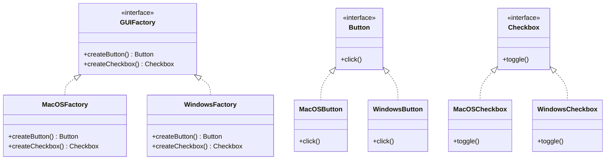

## 4.3 Abstract Factory Design Pattern

The Abstract Factory Design Pattern is a creational pattern that provides an interface for creating families of related or dependent objects without specifying their concrete classes. This pattern is particularly useful when a system must be independent of how its objects are created, composed, and represented. In Swift, the Abstract Factory pattern can be implemented using protocols and classes to create a flexible and scalable architecture.

### Intent

The primary intent of the Abstract Factory Design Pattern is to encapsulate a group of individual factories that have a common theme. This pattern allows you to create families of related objects without being tightly coupled to the specific classes of the objects. By using this pattern, you can ensure that the client code works with interfaces, making it easier to extend and maintain.

### Key Participants

1. **Abstract Factory**: Declares a set of methods for creating each of the abstract products.
2. **Concrete Factory**: Implements the methods defined in the Abstract Factory to create concrete products.
3. **Abstract Product**: Declares an interface for a type of product object.
4. **Concrete Product**: Defines a product object to be created by the corresponding concrete factory and implements the Abstract Product interface.
5. **Client**: Uses only the interfaces declared by the Abstract Factory and Abstract Product classes.

### Implementing Abstract Factory in Swift

#### Step 1: Defining Protocols for Product Families

In Swift, we use protocols to define the interfaces for product families. Each product family will have its own protocol.

```swift
protocol Button {
    func click()
}

protocol Checkbox {
    func toggle()
}
```

Here, we define two protocols, `Button` and `Checkbox`, representing two types of UI components. These protocols declare the methods that all concrete products must implement.

#### Step 2: Creating Concrete Products

Next, we create concrete classes that conform to these protocols. These classes represent the actual products that can be created by the factories.

```swift
class MacOSButton: Button {
    func click() {
        print("MacOS Button clicked")
    }
}

class WindowsButton: Button {
    func click() {
        print("Windows Button clicked")
    }
}

class MacOSCheckbox: Checkbox {
    func toggle() {
        print("MacOS Checkbox toggled")
    }
}

class WindowsCheckbox: Checkbox {
    func toggle() {
        print("Windows Checkbox toggled")
    }
}
```

In this example, we have two sets of concrete products: `MacOSButton` and `WindowsButton` for buttons, and `MacOSCheckbox` and `WindowsCheckbox` for checkboxes.

#### Step 3: Defining the Abstract Factory Protocol

Now, we define an abstract factory protocol that declares methods for creating each type of product.

```swift
protocol GUIFactory {
    func createButton() -> Button
    func createCheckbox() -> Checkbox
}
```

The `GUIFactory` protocol declares methods for creating buttons and checkboxes.

#### Step 4: Implementing Concrete Factories

Concrete factories implement the abstract factory protocol and are responsible for creating the concrete products.

```swift
class MacOSFactory: GUIFactory {
    func createButton() -> Button {
        return MacOSButton()
    }
    
    func createCheckbox() -> Checkbox {
        return MacOSCheckbox()
    }
}

class WindowsFactory: GUIFactory {
    func createButton() -> Button {
        return WindowsButton()
    }
    
    func createCheckbox() -> Checkbox {
        return WindowsCheckbox()
    }
}
```

The `MacOSFactory` and `WindowsFactory` classes implement the `GUIFactory` protocol, creating MacOS and Windows-specific UI components, respectively.

#### Step 5: Using the Abstract Factory

The client code works with factories and products only through their abstract interfaces. This ensures that the client code remains independent of the concrete classes used to create objects.

```swift
class Application {
    private var factory: GUIFactory
    
    init(factory: GUIFactory) {
        self.factory = factory
    }
    
    func createUI() {
        let button = factory.createButton()
        let checkbox = factory.createCheckbox()
        
        button.click()
        checkbox.toggle()
    }
}

// Usage
let macApp = Application(factory: MacOSFactory())
macApp.createUI()

let windowsApp = Application(factory: WindowsFactory())
windowsApp.createUI()
```

In this example, the `Application` class uses the `GUIFactory` interface to create UI components. The specific factory (MacOS or Windows) is injected into the application, allowing it to create the appropriate UI components without knowing their concrete classes.

### Visualizing the Abstract Factory Pattern

To better understand the relationships between the components of the Abstract Factory pattern, let's visualize it using a class diagram.



### Use Cases and Examples

The Abstract Factory pattern is particularly useful in scenarios where a system needs to be independent of how its objects are created and represented. Some common use cases include:

- **Theme-based UI Elements**: When developing applications that support multiple themes (e.g., light and dark modes), the Abstract Factory can be used to create theme-specific UI components.
- **Cross-Platform Support**: Applications that need to run on multiple platforms (e.g., iOS and Android) can use the Abstract Factory to create platform-specific components.

### Design Considerations

- **When to Use**: Use the Abstract Factory pattern when you need to create families of related or dependent objects without specifying their concrete classes. It is particularly useful when a system must be independent of how its objects are created.
- **Considerations**: The Abstract Factory pattern can increase the complexity of the code by introducing additional interfaces and classes. Ensure that the benefits of using the pattern outweigh the added complexity.
- **Pitfalls**: Avoid using the Abstract Factory pattern if the number of product types is small and unlikely to change, as it may introduce unnecessary complexity.

### Swift Unique Features

Swift's protocol-oriented programming paradigm makes it an excellent language for implementing the Abstract Factory pattern. By using protocols, we can define clear interfaces for product families and factories, ensuring that the client code remains decoupled from the concrete implementations.

- **Protocols**: Use protocols to define the interfaces for products and factories, ensuring flexibility and scalability.
- **Generics**: Consider using generics to further enhance the flexibility of your factories and products.
- **Value Types**: Leverage Swift's value types (e.g., structs and enums) where appropriate to reduce memory overhead and improve performance.

### Differences and Similarities

The Abstract Factory pattern is often compared to the Factory Method pattern. While both patterns are used to create objects, there are key differences:

- **Abstract Factory**: Provides an interface for creating families of related objects without specifying their concrete classes. It involves multiple factory methods for creating different types of objects.
- **Factory Method**: Defines a method for creating an object, but lets subclasses alter the type of objects that will be created. It typically involves a single method for creating objects.

### Try It Yourself

To deepen your understanding of the Abstract Factory pattern, try modifying the code examples provided:

- **Add a New Product**: Introduce a new product type (e.g., `Slider`) and update the factories to support it.
- **Create a New Factory**: Implement a new factory for a different platform (e.g., Linux) and create the corresponding concrete products.
- **Experiment with Generics**: Refactor the factories and products to use generics, enhancing flexibility and type safety.

### Knowledge Check

Before moving on, let's summarize the key takeaways:

- The Abstract Factory pattern provides an interface for creating families of related objects without specifying their concrete classes.
- It is useful in scenarios where a system must be independent of how its objects are created and represented.
- Swift's protocol-oriented programming paradigm is well-suited for implementing the Abstract Factory pattern.

### Embrace the Journey

Remember, mastering design patterns is a journey. As you continue to explore and implement patterns in Swift, you'll gain a deeper understanding of how to build robust, scalable, and maintainable applications. Keep experimenting, stay curious, and enjoy the process!

## Quiz Time!



### What is the primary intent of the Abstract Factory Design Pattern?

- [x] To provide an interface for creating families of related objects without specifying their concrete classes.
- [ ] To define a method for creating an object, but let subclasses alter the type of objects that will be created.
- [ ] To encapsulate a single factory method for creating objects.
- [ ] To create a singleton instance of a class.

> **Explanation:** The Abstract Factory pattern provides an interface for creating families of related objects without specifying their concrete classes.

### Which of the following is a key participant in the Abstract Factory pattern?

- [x] Abstract Factory
- [ ] Singleton
- [x] Concrete Factory
- [ ] Adapter

> **Explanation:** The Abstract Factory pattern includes participants such as Abstract Factory, Concrete Factory, Abstract Product, and Concrete Product.

### How does the Abstract Factory pattern differ from the Factory Method pattern?

- [x] Abstract Factory involves multiple factory methods for creating different types of objects.
- [ ] Factory Method provides an interface for creating families of related objects.
- [ ] Abstract Factory typically involves a single method for creating objects.
- [x] Factory Method lets subclasses alter the type of objects that will be created.

> **Explanation:** The Abstract Factory pattern provides an interface for creating families of related objects, while the Factory Method pattern lets subclasses alter the type of objects created.

### In Swift, what is used to define the interfaces for product families in the Abstract Factory pattern?

- [x] Protocols
- [ ] Classes
- [ ] Structs
- [ ] Enums

> **Explanation:** In Swift, protocols are used to define the interfaces for product families in the Abstract Factory pattern.

### What is a common use case for the Abstract Factory pattern?

- [x] Theme-based UI elements
- [ ] Singleton instance creation
- [x] Cross-platform support
- [ ] Data persistence

> **Explanation:** The Abstract Factory pattern is commonly used for theme-based UI elements and cross-platform support.

### What is the role of the Concrete Factory in the Abstract Factory pattern?

- [x] To implement the methods defined in the Abstract Factory to create concrete products.
- [ ] To declare a set of methods for creating each of the abstract products.
- [ ] To use the interfaces declared by the Abstract Factory and Abstract Product classes.
- [ ] To define a product object to be created by the corresponding concrete factory.

> **Explanation:** The Concrete Factory implements the methods defined in the Abstract Factory to create concrete products.

### Which Swift feature enhances the flexibility of the Abstract Factory pattern?

- [x] Protocols
- [ ] Inheritance
- [x] Generics
- [ ] Optionals

> **Explanation:** Protocols and generics enhance the flexibility of the Abstract Factory pattern in Swift.

### What should be considered when deciding to use the Abstract Factory pattern?

- [x] The added complexity of additional interfaces and classes.
- [ ] The need for a single factory method.
- [ ] The requirement for a singleton instance.
- [ ] The ability to alter the type of objects created by subclasses.

> **Explanation:** The Abstract Factory pattern can increase complexity, so it's important to consider whether the benefits outweigh the added complexity.

### Which of the following is NOT a key participant in the Abstract Factory pattern?

- [ ] Abstract Factory
- [ ] Concrete Factory
- [x] Singleton
- [ ] Abstract Product

> **Explanation:** Singleton is not a key participant in the Abstract Factory pattern.

### True or False: The Abstract Factory pattern is useful when a system must be dependent on how its objects are created.

- [ ] True
- [x] False

> **Explanation:** The Abstract Factory pattern is useful when a system must be independent of how its objects are created.


