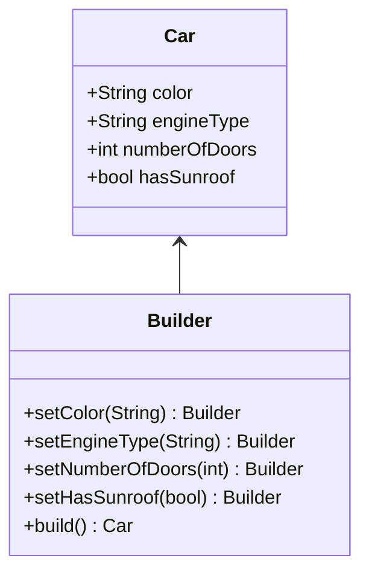

## 4.4 Builder Design Pattern

The Builder Design Pattern is a creational pattern that provides a way to construct complex objects step by step. Unlike other creational patterns, the Builder Pattern allows you to produce different types and representations of an object using the same construction process. This pattern is particularly useful when you need to create an object with numerous optional parameters or when the construction process is complex.

### Intent

The primary intent of the Builder Design Pattern is to separate the construction of a complex object from its representation, allowing the same construction process to create different representations. This separation enables greater flexibility and control over the object creation process.

### Key Concepts

- **Separation of Concerns**: The pattern divides the construction process into distinct steps, each responsible for a specific part of the object.
- **Fluent Interfaces**: A technique used to enhance readability by allowing method chaining.
- **Immutable Objects**: Often used with the Builder Pattern to create immutable objects by setting all properties during construction.

### Implementing Builder in Swift

In Swift, the Builder Pattern can be implemented using classes or structs with chaining methods. This approach allows developers to build objects step by step, providing a clear and concise way to construct complex objects.

#### Using Classes and Method Chaining

Let's consider an example where we want to build a `Car` object. The `Car` has several optional features like `color`, `engineType`, `numberOfDoors`, and `hasSunroof`. Here's how we can implement the Builder Pattern using a class:

```swift
class Car {
    private var color: String?
    private var engineType: String?
    private var numberOfDoors: Int?
    private var hasSunroof: Bool?

    private init() {}

    class Builder {
        private var car = Car()

        func setColor(_ color: String) -> Builder {
            car.color = color
            return self
        }

        func setEngineType(_ engineType: String) -> Builder {
            car.engineType = engineType
            return self
        }

        func setNumberOfDoors(_ numberOfDoors: Int) -> Builder {
            car.numberOfDoors = numberOfDoors
            return self
        }

        func setHasSunroof(_ hasSunroof: Bool) -> Builder {
            car.hasSunroof = hasSunroof
            return self
        }

        func build() -> Car {
            return car
        }
    }
}

// Usage
let car = Car.Builder()
    .setColor("Red")
    .setEngineType("V8")
    .setNumberOfDoors(4)
    .setHasSunroof(true)
    .build()
```

In this example, the `Builder` class provides methods to set each property of the `Car`. It returns `self` to allow method chaining, creating a fluent interface.

#### Using Structs and Immutable Builders

Swift's structs are value types, making them a natural fit for creating immutable objects. Here's how you can implement the Builder Pattern using structs:

```swift
struct Car {
    let color: String
    let engineType: String
    let numberOfDoors: Int
    let hasSunroof: Bool

    class Builder {
        private var color: String = "Black"
        private var engineType: String = "V4"
        private var numberOfDoors: Int = 4
        private var hasSunroof: Bool = false

        func setColor(_ color: String) -> Builder {
            self.color = color
            return self
        }

        func setEngineType(_ engineType: String) -> Builder {
            self.engineType = engineType
            return self
        }

        func setNumberOfDoors(_ numberOfDoors: Int) -> Builder {
            self.numberOfDoors = numberOfDoors
            return self
        }

        func setHasSunroof(_ hasSunroof: Bool) -> Builder {
            self.hasSunroof = hasSunroof
            return self
        }

        func build() -> Car {
            return Car(color: color, engineType: engineType, numberOfDoors: numberOfDoors, hasSunroof: hasSunroof)
        }
    }
}

// Usage
let car = Car.Builder()
    .setColor("Blue")
    .setEngineType("Electric")
    .setNumberOfDoors(2)
    .setHasSunroof(true)
    .build()
```

In this implementation, the `Car` struct is immutable, and the `Builder` class is used to configure the properties before creating the `Car` object.

### Fluent Interfaces

Fluent interfaces are a key aspect of the Builder Pattern, allowing for more readable and expressive code. By returning `self` from each method, you can chain method calls together, creating a flow that resembles natural language.

#### Example: Configuring a Network Request

Consider a scenario where you need to configure a network request with various optional parameters. The Builder Pattern can simplify this process:

```swift
class NetworkRequest {
    private var url: String
    private var method: String
    private var headers: [String: String] = [:]
    private var body: Data?

    private init(url: String, method: String) {
        self.url = url
        self.method = method
    }

    class Builder {
        private var url: String
        private var method: String
        private var headers: [String: String] = [:]
        private var body: Data?

        init(url: String, method: String) {
            self.url = url
            self.method = method
        }

        func addHeader(key: String, value: String) -> Builder {
            headers[key] = value
            return self
        }

        func setBody(_ body: Data) -> Builder {
            self.body = body
            return self
        }

        func build() -> NetworkRequest {
            let request = NetworkRequest(url: url, method: method)
            request.headers = headers
            request.body = body
            return request
        }
    }
}

// Usage
let request = NetworkRequest.Builder(url: "https://api.example.com", method: "GET")
    .addHeader(key: "Authorization", value: "Bearer token")
    .addHeader(key: "Content-Type", value: "application/json")
    .setBody(Data())
    .build()
```

### Use Cases and Examples

The Builder Pattern is particularly useful in scenarios where you need to construct complex objects with many optional parameters. Here are some common use cases:

- **Configuring Network Requests**: As shown in the example above, the pattern can be used to configure network requests with various headers and body content.
- **Constructing Complex Views**: In UI development, the Builder Pattern can be used to construct complex views with multiple optional components.
- **Creating Immutable Objects**: When you need to create immutable objects with numerous optional parameters, the Builder Pattern provides a clean and flexible solution.

### Design Considerations

When using the Builder Pattern, consider the following:

- **Complexity vs. Simplicity**: The Builder Pattern is most beneficial when the object construction is complex. For simple objects, the pattern may introduce unnecessary complexity.
- **Immutability**: Consider using immutable objects with the Builder Pattern to enhance safety and predictability.
- **Fluent Interfaces**: Use fluent interfaces to improve code readability and expressiveness.

### Swift Unique Features

Swift offers several unique features that can be leveraged when implementing the Builder Pattern:

- **Value Types**: Swift's structs are value types, making them ideal for creating immutable objects with the Builder Pattern.
- **Protocol Extensions**: You can use protocol extensions to add default implementations to your builders, enhancing flexibility and reusability.
- **Generics**: Swift's powerful generics system can be used to create type-safe builders.

### Differences and Similarities

The Builder Pattern is often compared to other creational patterns like the Factory Method and Abstract Factory. Here are some key differences and similarities:

- **Builder vs. Factory Method**: The Factory Method is used to create objects without specifying the exact class, while the Builder Pattern focuses on constructing complex objects step by step.
- **Builder vs. Abstract Factory**: The Abstract Factory is used to create families of related objects, whereas the Builder Pattern is used to construct a single complex object.

### Visualizing the Builder Pattern

To better understand the Builder Pattern, let's visualize the relationship between the components using a class diagram:



In this diagram, the `Builder` class is responsible for constructing the `Car` object step by step. Each method in the `Builder` class returns `self`, allowing for method chaining.

### Try It Yourself

Now that we've covered the Builder Pattern, try modifying the code examples to suit your own use cases. Experiment with adding new properties to the `Car` or `NetworkRequest` classes and see how the Builder Pattern can simplify the construction process.

### Knowledge Check

To reinforce your understanding of the Builder Pattern, consider the following questions:

- What are the primary benefits of using the Builder Pattern?
- How does the Builder Pattern enhance code readability and maintainability?
- In what scenarios is the Builder Pattern most beneficial?

### Embrace the Journey

Remember, mastering design patterns is a journey, not a destination. As you continue to explore and experiment with the Builder Pattern, you'll gain a deeper understanding of its benefits and limitations. Keep experimenting, stay curious, and enjoy the journey!

## Quiz Time!



### What is the primary intent of the Builder Design Pattern?

- [x] To separate the construction of a complex object from its representation.
- [ ] To provide an interface for creating families of related objects.
- [ ] To define an interface for creating an object, but let subclasses alter the type of objects that will be created.
- [ ] To ensure a class has only one instance and provide a global point of access to it.

> **Explanation:** The Builder Design Pattern aims to separate the construction of a complex object from its representation, allowing the same construction process to create different representations.

### Which Swift feature is particularly useful for implementing the Builder Pattern with immutable objects?

- [x] Value Types
- [ ] Reference Types
- [ ] Protocols
- [ ] Extensions

> **Explanation:** Swift's structs are value types, which are ideal for creating immutable objects using the Builder Pattern.

### What technique is used in the Builder Pattern to enhance code readability?

- [x] Fluent Interfaces
- [ ] Singleton Pattern
- [ ] Protocol-Oriented Programming
- [ ] Dependency Injection

> **Explanation:** Fluent interfaces enhance code readability by allowing method chaining, which makes the code more expressive and easier to read.

### In the provided `Car` example, what does the `build()` method return?

- [x] A `Car` object
- [ ] A `Builder` object
- [ ] A `String` object
- [ ] An `Int` object

> **Explanation:** The `build()` method in the `Builder` class returns a `Car` object after setting all the desired properties.

### How does the Builder Pattern differ from the Factory Method Pattern?

- [x] The Builder Pattern constructs complex objects step by step, while the Factory Method creates objects without specifying the exact class.
- [ ] The Builder Pattern creates families of related objects, while the Factory Method constructs complex objects step by step.
- [ ] The Builder Pattern is used for creating simple objects, while the Factory Method is used for complex objects.
- [ ] The Builder Pattern is a structural pattern, while the Factory Method is a creational pattern.

> **Explanation:** The Builder Pattern focuses on constructing complex objects step by step, whereas the Factory Method creates objects without specifying the exact class.

### What is a common use case for the Builder Pattern in Swift?

- [x] Configuring network requests
- [ ] Implementing Singleton objects
- [ ] Managing memory with ARC
- [ ] Creating protocol extensions

> **Explanation:** The Builder Pattern is commonly used for configuring network requests with various optional parameters.

### Which method in the `Builder` class allows for method chaining?

- [x] Returning `self` from each method
- [ ] Using static methods
- [ ] Using class methods
- [ ] Returning `nil` from each method

> **Explanation:** Returning `self` from each method in the `Builder` class allows for method chaining, creating a fluent interface.

### What is a potential downside of using the Builder Pattern?

- [x] It may introduce unnecessary complexity for simple objects.
- [ ] It cannot be used with immutable objects.
- [ ] It requires the use of reference types.
- [ ] It is not compatible with Swift's type system.

> **Explanation:** The Builder Pattern may introduce unnecessary complexity when used for simple objects, where a straightforward constructor would suffice.

### True or False: The Builder Pattern is often used to create immutable objects in Swift.

- [x] True
- [ ] False

> **Explanation:** True. The Builder Pattern is often used to create immutable objects by setting all properties during construction.

### Which of the following is a key participant in the Builder Pattern?

- [x] Director
- [ ] Observer
- [ ] Adapter
- [ ] Proxy

> **Explanation:** The Director is a key participant in the Builder Pattern, responsible for managing the construction process.


