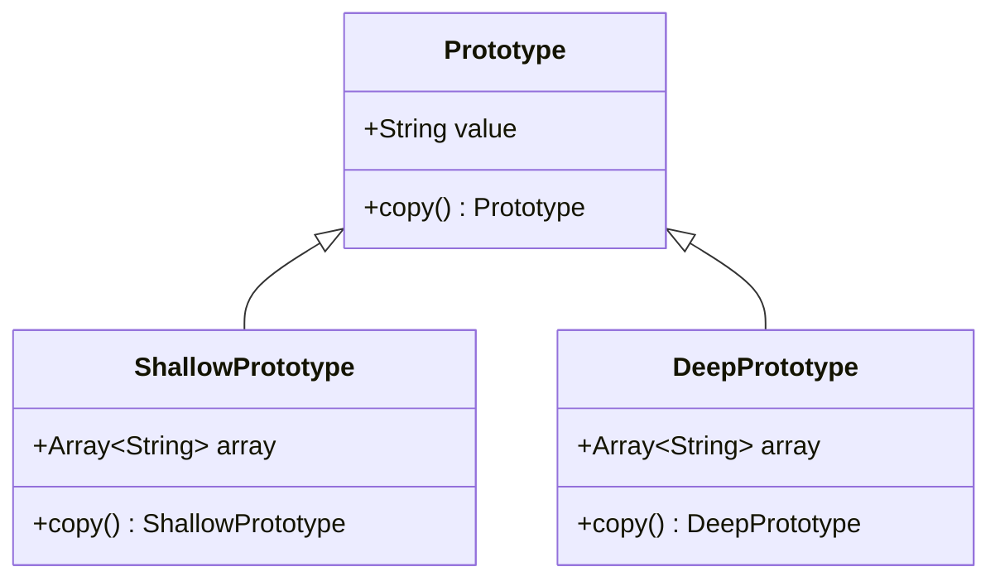

## 4.5 Prototype Design Pattern

The Prototype Design Pattern is a creational pattern that allows you to create new objects by copying an existing object, known as the prototype. This pattern is particularly useful when the cost of creating a new instance of an object is more expensive than copying an existing one. In Swift, implementing the Prototype pattern can be achieved by conforming to the `NSCopying` protocol and implementing the `copy()` method.

### Intent

The intent of the Prototype Design Pattern is to specify the kinds of objects to create using a prototypical instance and create new objects by copying this prototype. This pattern is beneficial when the initialization of an object is resource-intensive, and you want to avoid the overhead of creating objects from scratch.

### Key Participants

- **Prototype**: Declares an interface for cloning itself.
- **ConcretePrototype**: Implements the operation for cloning itself.
- **Client**: Creates a new object by asking a prototype to clone itself.

### Implementing Prototype in Swift

In Swift, the Prototype pattern is often implemented using the `NSCopying` protocol, which requires the implementation of the `copy(with:)` method. This method is responsible for returning a copy of the object.

#### Conforming to the `NSCopying` Protocol

To conform to `NSCopying`, your class must implement the `copy(with:)` method. This method is responsible for creating and returning a copy of the object.

```swift
import Foundation

class Prototype: NSObject, NSCopying {
    var value: String
    
    init(value: String) {
        self.value = value
    }
    
    func copy(with zone: NSZone? = nil) -> Any {
        return Prototype(value: self.value)
    }
}
```

In this example, the `Prototype` class conforms to `NSCopying` and implements the `copy(with:)` method. The method returns a new instance of `Prototype` with the same value as the original.

#### Implementing `copy()` Methods

The `copy()` method is used to duplicate objects. When implementing this method, you must decide whether to perform a shallow copy or a deep copy.

- **Shallow Copy**: Copies the object's structure, not the objects it references.
- **Deep Copy**: Copies both the object and the objects it references.

### Deep vs. Shallow Copy

Understanding the difference between deep and shallow copying is crucial when implementing the Prototype pattern. A shallow copy duplicates the object's structure but not the objects it references, while a deep copy duplicates everything.

#### Shallow Copy Example

```swift
class ShallowPrototype: NSObject, NSCopying {
    var array: [String]
    
    init(array: [String]) {
        self.array = array
    }
    
    func copy(with zone: NSZone? = nil) -> Any {
        return ShallowPrototype(array: self.array)
    }
}

let original = ShallowPrototype(array: ["one", "two", "three"])
let shallowCopy = original.copy() as! ShallowPrototype
shallowCopy.array.append("four")

print(original.array) // Output: ["one", "two", "three", "four"]
```

In this example, both `original` and `shallowCopy` share the same array instance. Modifying one affects the other.

#### Deep Copy Example

```swift
class DeepPrototype: NSObject, NSCopying {
    var array: [String]
    
    init(array: [String]) {
        self.array = array
    }
    
    func copy(with zone: NSZone? = nil) -> Any {
        return DeepPrototype(array: self.array.map { $0 })
    }
}

let originalDeep = DeepPrototype(array: ["one", "two", "three"])
let deepCopy = originalDeep.copy() as! DeepPrototype
deepCopy.array.append("four")

print(originalDeep.array) // Output: ["one", "two", "three"]
```

Here, `deepCopy` has its own copy of the array, so changes to it do not affect `originalDeep`.

### Use Cases and Examples

The Prototype pattern is useful in scenarios where:

- Creating a new instance of a class is more resource-intensive than copying an existing one.
- You need to create multiple objects with the same initial state.
- You want to avoid the overhead of initializing an object from scratch.

#### Duplicating Complex Objects with Known State

Consider a scenario where you have a complex object with multiple properties and you need to create multiple instances with the same initial state. The Prototype pattern allows you to clone the object efficiently.

```swift
class ComplexObject: NSObject, NSCopying {
    var property1: String
    var property2: Int
    var property3: [String]
    
    init(property1: String, property2: Int, property3: [String]) {
        self.property1 = property1
        self.property2 = property2
        self.property3 = property3
    }
    
    func copy(with zone: NSZone? = nil) -> Any {
        return ComplexObject(property1: self.property1, property2: self.property2, property3: self.property3.map { $0 })
    }
}

let prototype = ComplexObject(property1: "Prototype", property2: 42, property3: ["a", "b", "c"])
let clone1 = prototype.copy() as! ComplexObject
let clone2 = prototype.copy() as! ComplexObject

print(clone1.property1) // Output: Prototype
print(clone2.property3) // Output: ["a", "b", "c"]
```

### Diagrams

To better understand the Prototype Design Pattern, let's visualize the process of cloning objects using a class diagram.



This diagram illustrates the relationship between the `Prototype`, `ShallowPrototype`, and `DeepPrototype` classes. Each class implements the `copy()` method to create a new instance.

### Design Considerations

When using the Prototype pattern, consider the following:

- **Performance**: Copying an object can be more efficient than creating a new one, especially for complex objects.
- **Memory Usage**: Be mindful of memory usage when creating deep copies, as this can lead to increased memory consumption.
- **Object Identity**: Cloned objects have different identities from the original, which can affect equality checks and hash codes.

### Swift Unique Features

Swift provides several features that can enhance the implementation of the Prototype pattern:

- **Value Types**: Swift's value types, such as structs and enums, automatically provide copy semantics, making them suitable for shallow copying.
- **Copy-on-Write**: Swift's copy-on-write optimization can improve performance by delaying the actual copy until necessary.
- **Protocol Extensions**: Use protocol extensions to provide default implementations of the `copy()` method for common use cases.

### Differences and Similarities

The Prototype pattern is often confused with the Factory Method pattern. While both are creational patterns, the Prototype pattern focuses on cloning existing objects, whereas the Factory Method pattern involves creating new instances through a factory interface.

### Try It Yourself

To deepen your understanding of the Prototype pattern, try modifying the code examples to:

- Implement a custom class with multiple properties and methods, then create both shallow and deep copies.
- Experiment with different data structures, such as dictionaries or custom objects, to see how they affect copying behavior.
- Explore Swift's copy-on-write behavior by using value types in your prototypes.

### Knowledge Check

Before moving on, ensure you understand the following:

- How to implement the Prototype pattern in Swift using `NSCopying`.
- The difference between deep and shallow copies.
- When to use the Prototype pattern in your applications.

## Quiz Time!



### What is the primary intent of the Prototype Design Pattern?

- [x] To create new objects by copying an existing prototype.
- [ ] To define an interface for creating objects in a superclass.
- [ ] To ensure a class has only one instance.
- [ ] To provide a surrogate or placeholder for another object.

> **Explanation:** The Prototype Design Pattern's primary intent is to create new objects by copying an existing prototype.

### Which protocol is commonly used in Swift to implement the Prototype pattern?

- [x] NSCopying
- [ ] Codable
- [ ] Equatable
- [ ] Comparable

> **Explanation:** The NSCopying protocol is used in Swift to implement the Prototype pattern by providing a method for copying objects.

### What is the difference between a shallow copy and a deep copy?

- [x] A shallow copy duplicates the object's structure, not the objects it references, while a deep copy duplicates everything.
- [ ] A deep copy duplicates the object's structure, not the objects it references, while a shallow copy duplicates everything.
- [ ] Both shallow and deep copies duplicate everything.
- [ ] Neither shallow nor deep copies duplicate anything.

> **Explanation:** A shallow copy duplicates the object's structure but not the objects it references, whereas a deep copy duplicates the entire object graph.

### In the Prototype pattern, what role does the `copy(with:)` method play?

- [x] It creates and returns a copy of the object.
- [ ] It initializes a new object from scratch.
- [ ] It provides a default implementation for object creation.
- [ ] It manages memory for the object.

> **Explanation:** The `copy(with:)` method is responsible for creating and returning a copy of the object in the Prototype pattern.

### What is a key consideration when using the Prototype pattern?

- [x] Memory usage can increase with deep copies.
- [ ] It reduces the need for object creation.
- [ ] It simplifies the object creation process.
- [ ] It ensures object uniqueness.

> **Explanation:** Memory usage can increase with deep copies, which is a key consideration when using the Prototype pattern.

### How does Swift's copy-on-write optimization affect the Prototype pattern?

- [x] It delays the actual copy until necessary, improving performance.
- [ ] It prevents copying altogether.
- [ ] It forces a deep copy every time.
- [ ] It has no effect on the Prototype pattern.

> **Explanation:** Swift's copy-on-write optimization delays the actual copy until necessary, which can improve performance in the Prototype pattern.

### What is a common use case for the Prototype pattern?

- [x] Duplicating complex objects with known state.
- [ ] Creating a single instance of a class.
- [ ] Providing an interface for creating families of related objects.
- [ ] Defining a family of algorithms.

> **Explanation:** A common use case for the Prototype pattern is duplicating complex objects with a known state.

### How does the Prototype pattern differ from the Factory Method pattern?

- [x] The Prototype pattern focuses on cloning existing objects, while the Factory Method pattern involves creating new instances through a factory interface.
- [ ] Both patterns focus on cloning existing objects.
- [ ] The Factory Method pattern focuses on cloning existing objects, while the Prototype pattern involves creating new instances through a factory interface.
- [ ] Both patterns involve creating new instances through a factory interface.

> **Explanation:** The Prototype pattern focuses on cloning existing objects, whereas the Factory Method pattern involves creating new instances through a factory interface.

### Which of the following is a benefit of using the Prototype pattern?

- [x] It can be more efficient than creating new instances from scratch.
- [ ] It guarantees object uniqueness.
- [ ] It simplifies the object creation process.
- [ ] It reduces memory usage.

> **Explanation:** The Prototype pattern can be more efficient than creating new instances from scratch, especially for complex objects.

### True or False: The Prototype pattern is only useful for classes and cannot be applied to structs in Swift.

- [ ] True
- [x] False

> **Explanation:** False. The Prototype pattern can be applied to structs in Swift, as they naturally support copying through value semantics.



Remember, mastering the Prototype Design Pattern in Swift is just one step in your journey to becoming a proficient Swift developer. Keep experimenting, stay curious, and enjoy the process of learning and applying design patterns to build robust and efficient applications!
