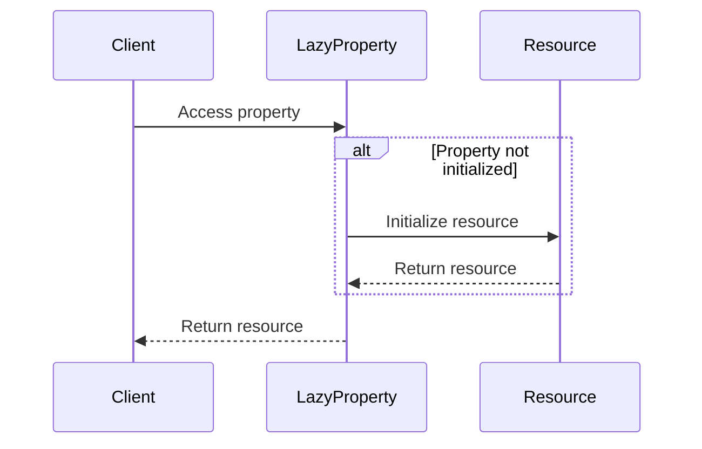

## 4.6 Lazy Initialization Pattern

In the world of software development, efficient resource management is crucial for building responsive and performant applications. The Lazy Initialization Pattern is a powerful technique that helps developers achieve this by deferring the creation of an object until it is actually needed. This pattern is particularly useful in scenarios where initializing an object is resource-intensive or when the object may not be used at all.

### Intent

The primary intent of the Lazy Initialization Pattern is to delay the creation of an object until it is necessary. This can lead to significant performance improvements, especially in applications where resource consumption needs to be optimized.

### Implementing Lazy Initialization in Swift

Swift provides a straightforward way to implement lazy initialization using the `lazy` keyword. Let's explore how to use this feature effectively and ensure that our lazy properties are thread-safe.

#### Using the `lazy` Keyword for Properties

In Swift, the `lazy` keyword allows you to declare a property that is not initialized until it is accessed for the first time. This can be particularly useful for properties that are computationally expensive to initialize or that rely on external resources.

```swift
class ImageLoader {
    // A lazy property that loads an image from a URL
    lazy var image: UIImage = {
        print("Loading image...")
        return loadImageFromURL()
    }()
    
    private func loadImageFromURL() -> UIImage {
        // Simulate a network call to load an image
        // In a real application, this would involve asynchronous network operations
        return UIImage(named: "placeholder")!
    }
}

let loader = ImageLoader()
// The image is not loaded until we access the 'image' property
let loadedImage = loader.image
```

In this example, the `image` property is declared as `lazy`, meaning it will not be initialized until it is accessed. The closure provided for the `image` property is executed only once, and the result is stored for subsequent accesses.

#### Ensuring Thread-Safe Initialization

While the `lazy` keyword simplifies lazy initialization, it is important to consider thread safety, especially in multi-threaded environments. Swift's `lazy` properties are not inherently thread-safe, so additional measures may be needed.

One approach to ensure thread safety is to use synchronization mechanisms, such as locks, to control access to the lazy property.

```swift
class ThreadSafeImageLoader {
    private var _image: UIImage?
    private let lock = NSLock()
    
    var image: UIImage {
        lock.lock()
        defer { lock.unlock() }
        
        if _image == nil {
            print("Loading image in a thread-safe manner...")
            _image = loadImageFromURL()
        }
        return _image!
    }
    
    private func loadImageFromURL() -> UIImage {
        // Simulate a network call to load an image
        return UIImage(named: "placeholder")!
    }
}

let threadSafeLoader = ThreadSafeImageLoader()
// The image is loaded in a thread-safe manner
let safeImage = threadSafeLoader.image
```

In this example, we use an `NSLock` to ensure that the initialization of the `image` property is thread-safe. The lock ensures that only one thread can initialize the property at a time.

### Use Cases and Examples

Lazy initialization is a versatile pattern with numerous applications. Let's explore some common use cases where this pattern can be particularly beneficial.

#### Loading Heavy Resources

In applications that deal with large datasets or heavy resources, such as images or files, lazy initialization can significantly reduce memory consumption and improve startup times.

Consider an application that displays a gallery of images. Instead of loading all images into memory at once, we can use lazy initialization to load each image only when it is needed.

```swift
class ImageGallery {
    private var imageURLs: [URL]
    
    lazy var images: [UIImage] = {
        return imageURLs.map { url in
            // Load image from URL
            return loadImage(from: url)
        }
    }()
    
    init(imageURLs: [URL]) {
        self.imageURLs = imageURLs
    }
    
    private func loadImage(from url: URL) -> UIImage {
        // Simulate loading image from URL
        return UIImage(named: "placeholder")!
    }
}

let gallery = ImageGallery(imageURLs: [/* URLs */])
// Images are loaded lazily when 'images' is accessed
let loadedImages = gallery.images
```

#### Deferring Network Calls

Network calls can be expensive and should be deferred until absolutely necessary. Lazy initialization can be used to delay network requests until the data is needed.

```swift
class DataFetcher {
    private var dataURL: URL
    
    lazy var data: Data = {
        print("Fetching data from network...")
        return fetchDataFromNetwork()
    }()
    
    init(dataURL: URL) {
        self.dataURL = dataURL
    }
    
    private func fetchDataFromNetwork() -> Data {
        // Simulate a network call
        return Data()
    }
}

let fetcher = DataFetcher(dataURL: URL(string: "https://example.com/data")!)
// Data is fetched lazily when 'data' is accessed
let fetchedData = fetcher.data
```

### Visualizing Lazy Initialization

To better understand the flow of lazy initialization, let's visualize the process using a sequence diagram.



In this diagram, the client accesses the lazy property. If the property is not initialized, the lazy property initializes the resource and returns it to the client. If the property is already initialized, it simply returns the resource.

### Swift Unique Features

Swift's unique features, such as closures and value types, make lazy initialization both powerful and flexible. By leveraging these features, developers can create efficient and maintainable code.

#### Closures for Initialization

Swift's closures provide a concise way to define the initialization logic for lazy properties. This allows developers to encapsulate complex initialization code within a closure, enhancing code readability and maintainability.

```swift
class Configuration {
    lazy var settings: [String: Any] = {
        print("Loading configuration settings...")
        return loadSettings()
    }()
    
    private func loadSettings() -> [String: Any] {
        // Simulate loading settings
        return ["theme": "dark", "fontSize": 12]
    }
}

let config = Configuration()
// Settings are loaded lazily
let appSettings = config.settings
```

#### Value Types and Lazy Initialization

Swift's emphasis on value types, such as structs, can also benefit from lazy initialization. By using lazy properties within structs, you can defer the initialization of expensive resources while maintaining the benefits of value semantics.

```swift
struct Document {
    var title: String
    lazy var content: String = {
        print("Loading document content...")
        return loadContent()
    }()
    
    private func loadContent() -> String {
        // Simulate loading content
        return "Document Content"
    }
}

var doc = Document(title: "My Document")
// Content is loaded lazily
let docContent = doc.content
```

### Design Considerations

When implementing lazy initialization, there are several design considerations to keep in mind:

- **Thread Safety**: Ensure that lazy properties are accessed in a thread-safe manner, especially in multi-threaded applications.
- **Memory Usage**: While lazy initialization can reduce initial memory usage, be mindful of the memory footprint once the property is initialized.
- **Performance**: Consider the trade-offs between deferred initialization and the potential delay in accessing the property for the first time.

### Differences and Similarities

Lazy initialization is often compared to other creational patterns, such as the Singleton pattern. While both patterns aim to control the creation of objects, they differ in their intent and application.

- **Lazy Initialization**: Focuses on delaying the creation of an object until it is needed.
- **Singleton Pattern**: Ensures that a class has only one instance and provides a global point of access to it.

### Try It Yourself

To deepen your understanding of lazy initialization, try modifying the code examples provided. Experiment with different scenarios, such as:

- Implementing lazy initialization for a property that loads data from a file.
- Ensuring thread safety using different synchronization mechanisms.
- Comparing the performance of lazy initialization with eager initialization.

### Knowledge Check

Reflect on the following questions to reinforce your understanding of lazy initialization:

- When should you use lazy initialization in your applications?
- How can you ensure that lazy properties are thread-safe?
- What are the potential trade-offs of using lazy initialization?

### Embrace the Journey

Remember, mastering design patterns like lazy initialization is an ongoing journey. As you continue to explore and experiment, you'll discover new ways to optimize your applications and enhance their performance. Stay curious, keep learning, and enjoy the process!

## Quiz Time!



### What is the primary intent of the Lazy Initialization Pattern?

- [x] To delay the creation of an object until it is needed.
- [ ] To ensure a class has only one instance.
- [ ] To create a family of related objects.
- [ ] To define a skeleton of an algorithm.

> **Explanation:** The Lazy Initialization Pattern aims to defer the creation of an object until it is actually required, optimizing resource usage.

### Which keyword in Swift is used for lazy initialization?

- [x] lazy
- [ ] optional
- [ ] deferred
- [ ] weak

> **Explanation:** The `lazy` keyword in Swift is used to declare properties that are initialized only when they are accessed for the first time.

### How can you ensure thread safety for lazy properties in Swift?

- [x] Use synchronization mechanisms like locks.
- [ ] Use the `weak` keyword.
- [ ] Initialize the property in the main thread only.
- [ ] Avoid using lazy properties in multi-threaded environments.

> **Explanation:** Synchronization mechanisms, such as locks, can be used to ensure that lazy properties are accessed in a thread-safe manner.

### What is a common use case for lazy initialization?

- [x] Loading heavy resources.
- [ ] Implementing a singleton.
- [ ] Creating a family of related objects.
- [ ] Defining a skeleton of an algorithm.

> **Explanation:** Lazy initialization is commonly used to defer the loading of heavy resources, such as images or data, until they are needed.

### What is the potential trade-off of using lazy initialization?

- [x] Initial access to the property may be delayed.
- [ ] Increased memory usage.
- [ ] Increased complexity in object creation.
- [ ] Reduced code readability.

> **Explanation:** While lazy initialization can reduce initial memory usage, the first access to the property may experience a delay due to deferred initialization.

### Which Swift feature enhances lazy initialization by encapsulating complex initialization logic?

- [x] Closures
- [ ] Protocols
- [ ] Generics
- [ ] Optionals

> **Explanation:** Swift's closures provide a concise way to define complex initialization logic for lazy properties, enhancing code readability and maintainability.

### What is the difference between lazy initialization and the singleton pattern?

- [x] Lazy initialization delays object creation; singleton ensures a single instance.
- [ ] Both patterns delay object creation.
- [ ] Singleton delays object creation; lazy initialization ensures a single instance.
- [ ] Both patterns ensure a single instance.

> **Explanation:** Lazy initialization focuses on delaying object creation, while the singleton pattern ensures that a class has only one instance.

### How does lazy initialization affect memory usage?

- [x] It reduces initial memory usage.
- [ ] It increases initial memory usage.
- [ ] It has no impact on memory usage.
- [ ] It always increases memory usage.

> **Explanation:** Lazy initialization can reduce initial memory usage by deferring the creation of objects until they are needed.

### Can lazy initialization be used with value types in Swift?

- [x] True
- [ ] False

> **Explanation:** Lazy initialization can be used with value types, such as structs, in Swift to defer the initialization of expensive resources.

### What should you consider when using lazy initialization in multi-threaded environments?

- [x] Thread safety
- [ ] Code readability
- [ ] Singleton enforcement
- [ ] Protocol conformance

> **Explanation:** In multi-threaded environments, it's important to ensure that lazy properties are accessed in a thread-safe manner.


