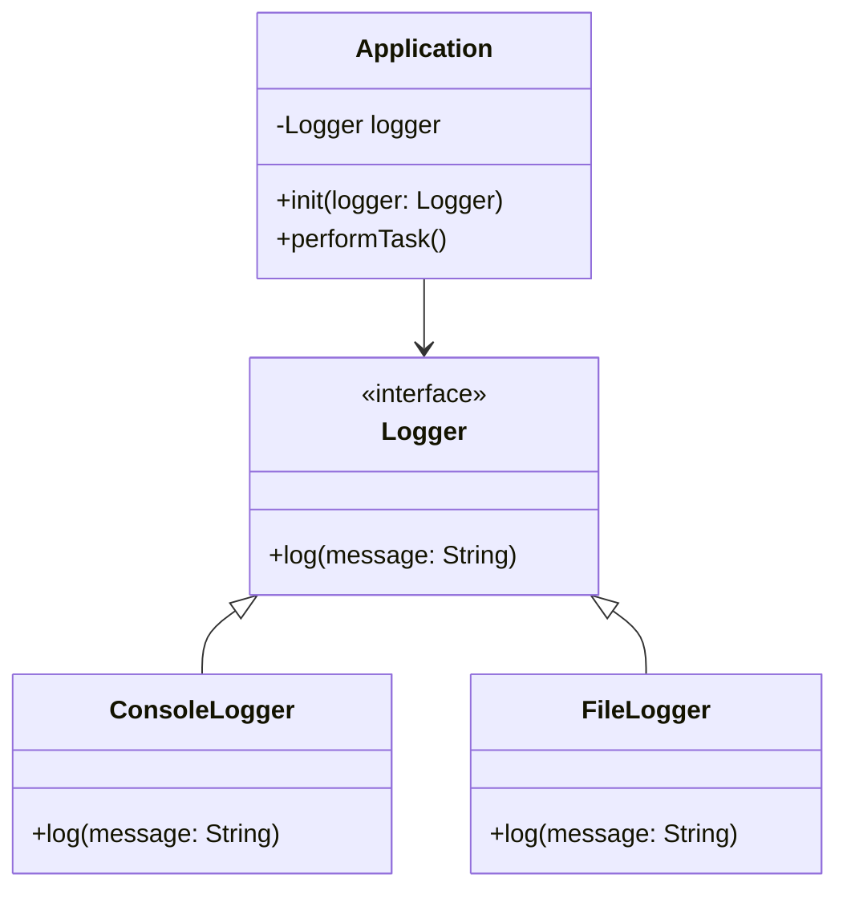

## 4.7.1 Constructor Injection

Constructor Injection is a fundamental technique in the Dependency Injection pattern, which is crucial for building robust, scalable, and maintainable applications. In this section, we will delve into the concept of Constructor Injection in Swift, exploring its benefits, implementation strategies, and best practices. We'll also provide code examples, visual diagrams, and exercises to reinforce your understanding.

### Understanding Constructor Injection

Constructor Injection is a method of injecting dependencies into a class through its initializer. This approach ensures that all required dependencies are provided at the time of object creation, promoting immutability and making the class easier to test and maintain.

#### Key Concepts

- **Dependency Injection (DI):** A design pattern that allows a class to receive its dependencies from an external source rather than creating them internally.
- **Constructor Injection:** A form of DI where dependencies are passed to a class through its constructor (initializer in Swift).

#### Benefits of Constructor Injection

- **Immutability:** By injecting dependencies through the initializer, you can make the class properties immutable, enhancing the stability and predictability of your code.
- **Testability:** Constructor Injection makes it easy to substitute dependencies with mock objects during testing, facilitating unit testing and TDD (Test-Driven Development).
- **Decoupling:** It reduces the coupling between classes, allowing for more flexible and reusable code.
- **Clarity:** Dependencies are explicitly stated in the initializer, making it clear what a class needs to function.

### Implementing Constructor Injection in Swift

Let's explore how to implement Constructor Injection in Swift with a practical example.

#### Example: Building a Logger Service

Imagine you are developing an application that requires logging capabilities. You decide to create a `Logger` class that logs messages to different outputs, such as a file or a console. By using Constructor Injection, you can easily switch between different logging strategies.

```swift
// Define a protocol for logging
protocol Logger {
    func log(message: String)
}

// Implement a ConsoleLogger
class ConsoleLogger: Logger {
    func log(message: String) {
        print("Console Log: \\(message)")
    }
}

// Implement a FileLogger
class FileLogger: Logger {
    func log(message: String) {
        // Code to write the message to a file
        print("File Log: \\(message)")
    }
}

// Application class that depends on a Logger
class Application {
    private let logger: Logger
    
    // Constructor Injection
    init(logger: Logger) {
        self.logger = logger
    }
    
    func performTask() {
        logger.log(message: "Task performed")
    }
}

// Usage
let consoleLogger = ConsoleLogger()
let app = Application(logger: consoleLogger)
app.performTask()
```

In this example, the `Application` class receives a `Logger` instance through its initializer. This setup allows you to easily swap out the `ConsoleLogger` for a `FileLogger` or any other logger that conforms to the `Logger` protocol.

#### Visualizing Constructor Injection

To better understand how Constructor Injection works, let's visualize the relationship between the `Application` and `Logger` classes.



In this diagram, the `Application` class depends on the `Logger` interface, and `ConsoleLogger` and `FileLogger` are concrete implementations of this interface. The dependency is injected into the `Application` class through its initializer.

### Best Practices for Constructor Injection

- **Use Protocols:** Define dependencies as protocols to allow for flexibility and ease of testing.
- **Limit Dependencies:** Keep the number of dependencies to a minimum to avoid complex initializers.
- **Ensure Immutability:** Make injected dependencies immutable to prevent changes during the object's lifecycle.
- **Document Dependencies:** Clearly document the dependencies required by a class in its initializer.

### Swift Unique Features for Constructor Injection

Swift offers several unique features that enhance the implementation of Constructor Injection:

- **Protocol Extensions:** Use protocol extensions to provide default implementations for methods, reducing boilerplate code.
- **Generics:** Leverage generics to create flexible and reusable components that can work with different types.
- **Optionals:** Use optionals to handle dependencies that may not always be available, providing default values or handling errors gracefully.

#### Example: Using Protocol Extensions and Generics

Let's extend our logging example by using protocol extensions and generics to create a more flexible logging system.

```swift
protocol Logger {
    func log(message: String)
}

extension Logger {
    func logInfo(_ message: String) {
        log(message: "INFO: \\(message)")
    }
    
    func logError(_ message: String) {
        log(message: "ERROR: \\(message)")
    }
}

class ConsoleLogger: Logger {
    func log(message: String) {
        print(message)
    }
}

class Application<T: Logger> {
    private let logger: T
    
    init(logger: T) {
        self.logger = logger
    }
    
    func performTask() {
        logger.logInfo("Task started")
        // Perform some task
        logger.logInfo("Task completed")
    }
}

let consoleLogger = ConsoleLogger()
let app = Application(logger: consoleLogger)
app.performTask()
```

In this example, we use protocol extensions to add default logging methods (`logInfo` and `logError`) to the `Logger` protocol. The `Application` class is now generic, allowing it to work with any type that conforms to the `Logger` protocol.

### Common Pitfalls and How to Avoid Them

- **Over-Injection:** Avoid injecting too many dependencies into a class, which can lead to complex and hard-to-maintain code.
- **Circular Dependencies:** Be cautious of circular dependencies, where two or more classes depend on each other, causing a deadlock.
- **Hardcoding Dependencies:** Avoid hardcoding dependencies within the class, which defeats the purpose of using Constructor Injection.

### Try It Yourself

Experiment with the code examples provided by modifying the logging strategies or adding new logging implementations. Try creating a `NetworkLogger` that logs messages over the network, and inject it into the `Application` class. Observe how easily you can switch between different logging strategies without modifying the `Application` class.

### Knowledge Check

To reinforce your understanding of Constructor Injection, consider the following questions:

- What are the main benefits of using Constructor Injection?
- How does Constructor Injection improve testability?
- Why is it important to use protocols when implementing Constructor Injection?
- What are some common pitfalls to avoid when using Constructor Injection?

### Conclusion

Constructor Injection is a powerful technique in Swift for managing dependencies and promoting clean, maintainable code. By injecting dependencies through initializers, you ensure that all necessary components are available at the time of object creation, facilitating immutability, testability, and decoupling. As you continue to explore Swift and design patterns, remember to apply these principles to build robust and scalable applications.

## Quiz Time!



### What is Constructor Injection?

- [x] A method of injecting dependencies through a class's initializer.
- [ ] A design pattern for creating objects.
- [ ] A way to manage memory in Swift.
- [ ] A technique for optimizing performance.

> **Explanation:** Constructor Injection is a method of injecting dependencies through a class's initializer.

### How does Constructor Injection promote immutability?

- [x] By ensuring dependencies are provided at object creation.
- [ ] By allowing dependencies to be changed at runtime.
- [ ] By using mutable properties.
- [ ] By hardcoding dependencies inside the class.

> **Explanation:** Constructor Injection promotes immutability by ensuring that all dependencies are provided at the time of object creation, allowing properties to be immutable.

### Why is Constructor Injection beneficial for testing?

- [x] It allows for easy substitution of dependencies with mocks.
- [ ] It makes the code more complex.
- [ ] It requires more boilerplate code.
- [ ] It limits the flexibility of the code.

> **Explanation:** Constructor Injection is beneficial for testing because it allows for easy substitution of dependencies with mock objects, facilitating unit testing.

### What should be used to define dependencies in Constructor Injection?

- [x] Protocols
- [ ] Concrete classes
- [ ] Global variables
- [ ] Singleton instances

> **Explanation:** Protocols should be used to define dependencies in Constructor Injection to allow for flexibility and ease of testing.

### Which of the following is a common pitfall of Constructor Injection?

- [x] Over-injection of dependencies
- [ ] Under-injection of dependencies
- [ ] Using too few protocols
- [ ] Hardcoding dependencies

> **Explanation:** Over-injection of dependencies is a common pitfall, leading to complex and hard-to-maintain code.

### How can Swift's protocol extensions be used in Constructor Injection?

- [x] To provide default implementations for protocol methods.
- [ ] To create new protocols.
- [ ] To enforce immutability.
- [ ] To manage memory.

> **Explanation:** Protocol extensions can be used to provide default implementations for protocol methods, reducing boilerplate code.

### What is a potential issue with circular dependencies?

- [x] They can cause a deadlock.
- [ ] They improve code readability.
- [ ] They enhance performance.
- [ ] They simplify dependency management.

> **Explanation:** Circular dependencies can cause a deadlock, where two or more classes depend on each other, preventing the application from functioning correctly.

### What is the purpose of using generics in Constructor Injection?

- [x] To create flexible and reusable components.
- [ ] To increase code complexity.
- [ ] To reduce performance.
- [ ] To enforce strict type checking.

> **Explanation:** Generics are used to create flexible and reusable components that can work with different types, enhancing the versatility of Constructor Injection.

### Can Constructor Injection be used with optional dependencies?

- [x] Yes, by using optionals to handle dependencies that may not always be available.
- [ ] No, all dependencies must be non-optional.
- [ ] Yes, but it requires significant code changes.
- [ ] No, it is not supported in Swift.

> **Explanation:** Constructor Injection can be used with optional dependencies by using optionals to handle cases where a dependency may not always be available.

### Constructor Injection is a technique primarily used for:

- [x] Managing dependencies in a class.
- [ ] Optimizing network performance.
- [ ] Enhancing UI responsiveness.
- [ ] Managing memory allocation.

> **Explanation:** Constructor Injection is a technique primarily used for managing dependencies in a class, ensuring they are provided at the time of object creation.



Remember, mastering Constructor Injection is just one step in your journey to becoming a proficient Swift developer. Keep experimenting, stay curious, and enjoy the process of learning and building amazing applications!


