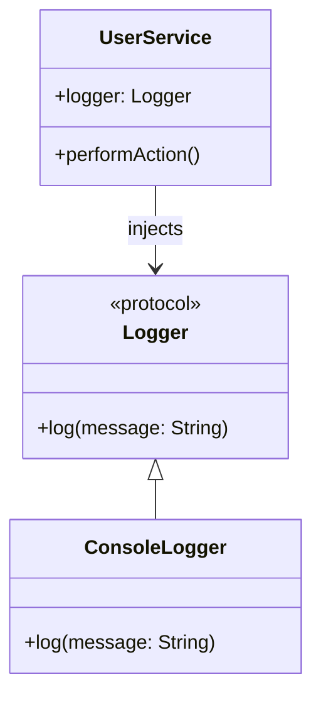

## 4.7.2 Property Injection

In the realm of software design, managing dependencies effectively is crucial for building scalable, maintainable, and testable applications. One of the techniques to achieve this is through Dependency Injection (DI), which allows for the decoupling of objects and their dependencies. Among the various forms of DI, **Property Injection** stands out as a flexible and dynamic approach, particularly in Swift development.

### Understanding Property Injection

**Property Injection** is a form of Dependency Injection where dependencies are set via properties after an object has been instantiated. This contrasts with Constructor Injection, where dependencies are provided at the time of object creation. Property Injection is particularly useful when dependencies are optional or configurable at runtime.

#### Key Characteristics of Property Injection

- **Flexibility**: Allows dependencies to be changed or set after object creation.
- **Optional Dependencies**: Ideal for optional or configurable dependencies that may not be known at initialization.
- **Testability**: Enhances testability by allowing mock dependencies to be injected easily.

### When to Use Property Injection

Property Injection is suitable in scenarios where:

- Dependencies are optional and not required at object initialization.
- You need to change dependencies dynamically during the object's lifecycle.
- The object has a long lifecycle, and its dependencies may need to be updated or replaced.

### Implementing Property Injection in Swift

To implement Property Injection in Swift, follow these steps:

1. **Define the Dependency Protocol**: Start by defining a protocol that represents the dependency.

2. **Create the Dependent Class**: Define the class that requires the dependency and declare a property for the dependency.

3. **Inject the Dependency**: Set the dependency via the property after the object is created.

#### Example: Implementing Property Injection

Let's consider a simple example where we have a `Logger` protocol and a `UserService` class that depends on a `Logger`.

```swift
// Step 1: Define the Dependency Protocol
protocol Logger {
    func log(message: String)
}

// Step 2: Implement the Dependency
class ConsoleLogger: Logger {
    func log(message: String) {
        print("Log: \\(message)")
    }
}

// Step 3: Create the Dependent Class
class UserService {
    var logger: Logger? // Dependency to be injected

    func performAction() {
        logger?.log(message: "Action performed")
    }
}

// Step 4: Inject the Dependency
let userService = UserService()
userService.logger = ConsoleLogger()

// Use the service
userService.performAction() // Output: Log: Action performed
```

In this example, the `UserService` class has a `logger` property that conforms to the `Logger` protocol. The `ConsoleLogger` is injected into the `UserService` after it has been instantiated.

### Design Considerations

While Property Injection offers flexibility, it also introduces certain considerations:

- **Initialization Order**: Ensure that dependencies are set before they are used to avoid runtime errors.
- **Nullability**: Handle cases where dependencies might not be set (e.g., using optional chaining or default implementations).
- **Encapsulation**: Be cautious about exposing internal properties for injection, as it might break encapsulation.

### Swift Unique Features

Swift provides unique features that can enhance Property Injection:

- **Protocol Extensions**: Use protocol extensions to provide default implementations for optional methods.
- **Property Wrappers**: Leverage property wrappers to manage dependency injection and validation logic.
- **Lazy Initialization**: Utilize lazy properties for dependencies that are expensive to create or may not be used immediately.

#### Example: Using Lazy Initialization

```swift
class UserService {
    lazy var logger: Logger = ConsoleLogger() // Lazy initialization

    func performAction() {
        logger.log(message: "Action performed")
    }
}

let userService = UserService()
// Logger is initialized only when performAction is called
userService.performAction() // Output: Log: Action performed
```

### Differences and Similarities with Other DI Methods

**Property Injection vs. Constructor Injection**:

- **Constructor Injection**: Dependencies are provided at object creation. It ensures that dependencies are available when the object is created, promoting immutability.
- **Property Injection**: Dependencies are set after object creation, offering flexibility but requiring careful handling of uninitialized dependencies.

**Property Injection vs. Method Injection**:

- **Method Injection**: Dependencies are passed through methods. It is suitable for temporary dependencies needed only during method execution.
- **Property Injection**: Dependencies are set as properties, making them available throughout the object's lifecycle.

### Visualizing Property Injection

To better understand Property Injection, let's visualize the process using a class diagram.



In this diagram, the `UserService` class depends on the `Logger` protocol, and the `ConsoleLogger` implements this protocol. The dependency is injected into `UserService` after its creation.

### Try It Yourself

To get hands-on experience with Property Injection, try modifying the code example:

- **Experiment with Different Loggers**: Implement another `Logger` class, such as `FileLogger`, and inject it into `UserService`.
- **Handle Optional Dependencies**: Modify the `UserService` to handle cases where the `logger` might not be set.

### Knowledge Check

To reinforce your understanding, consider the following questions:

- What are the advantages of using Property Injection over Constructor Injection?
- How can you ensure that dependencies are set before they are used?
- What are the potential pitfalls of using Property Injection?

### Conclusion

Property Injection is a powerful technique in Swift for managing dependencies, offering flexibility and enhancing testability. By understanding its characteristics and implementation, you can leverage Property Injection to build robust, maintainable applications. Remember, this is just the beginning. As you progress, you'll discover more advanced patterns and techniques. Keep experimenting, stay curious, and enjoy the journey!

## Quiz Time!



### What is Property Injection in Swift?

- [x] Setting dependencies via properties after initialization
- [ ] Providing dependencies at object creation
- [ ] Injecting dependencies through methods
- [ ] Using global variables for dependencies

> **Explanation:** Property Injection involves setting dependencies via properties after the object has been initialized.

### When is Property Injection most useful?

- [x] When dependencies are optional or configurable
- [ ] When dependencies are required at initialization
- [ ] When dependencies are temporary
- [ ] When dependencies are immutable

> **Explanation:** Property Injection is particularly useful when dependencies are optional or need to be configured at runtime.

### What is a key advantage of Property Injection over Constructor Injection?

- [x] Flexibility to change dependencies after object creation
- [ ] Ensures dependencies are available at object creation
- [ ] Promotes immutability
- [ ] Reduces code complexity

> **Explanation:** Property Injection allows for changing or setting dependencies after the object has been created, providing flexibility.

### Which Swift feature can enhance Property Injection?

- [x] Protocol Extensions
- [ ] Inheritance
- [ ] Static Methods
- [ ] Global Variables

> **Explanation:** Protocol Extensions can provide default implementations for optional methods, enhancing Property Injection.

### How can you handle uninitialized dependencies in Property Injection?

- [x] Use optional chaining or default implementations
- [ ] Ignore them
- [ ] Use global variables
- [ ] Force unwrap them

> **Explanation:** Optional chaining or default implementations can safely handle cases where dependencies might not be set.

### What is a potential pitfall of Property Injection?

- [x] Dependencies might not be set before use
- [ ] Dependencies are immutable
- [ ] Dependencies are hardcoded
- [ ] Dependencies are global

> **Explanation:** A common pitfall is using dependencies before they are set, which can lead to runtime errors.

### What is the difference between Property Injection and Method Injection?

- [x] Property Injection sets dependencies as properties, Method Injection uses methods
- [ ] Property Injection uses methods, Method Injection sets dependencies as properties
- [ ] Both use global variables
- [ ] Both are the same

> **Explanation:** Property Injection involves setting dependencies as properties, while Method Injection involves passing dependencies through methods.

### How can lazy initialization be used in Property Injection?

- [x] To defer the creation of a dependency until it is first used
- [ ] To create dependencies at object initialization
- [ ] To avoid using protocols
- [ ] To use global variables

> **Explanation:** Lazy initialization defers the creation of a dependency until it is first accessed, which can be useful in Property Injection.

### What is a similarity between Property Injection and Constructor Injection?

- [x] Both are forms of Dependency Injection
- [ ] Both require dependencies at object creation
- [ ] Both use global variables
- [ ] Both are immutable

> **Explanation:** Both Property Injection and Constructor Injection are forms of Dependency Injection, though they differ in how dependencies are provided.

### True or False: Property Injection is suitable for dependencies that are required at object initialization.

- [ ] True
- [x] False

> **Explanation:** Property Injection is not suitable for dependencies that must be available at object initialization; Constructor Injection is more appropriate in such cases.




