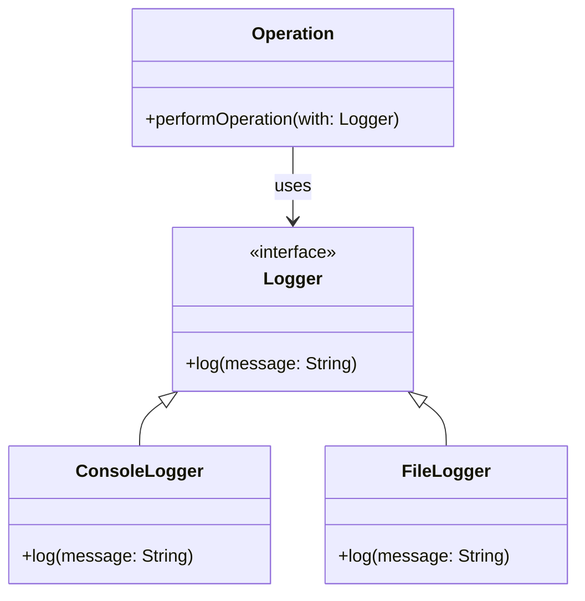

## 4.7.3 Method Injection

In the realm of software design, particularly in Swift, **Method Injection** is a powerful technique that allows developers to supply dependencies directly to methods when they are needed. This approach offers significant flexibility and enhances the testability of your code. In this section, we will delve into the concept of method injection, explore its use cases, and demonstrate how to implement it effectively in Swift.

### Understanding Method Injection

**Method Injection** is a form of dependency injection where dependencies are provided to a method at runtime. Unlike constructor injection, where dependencies are supplied when an object is created, method injection allows for more granular control over dependencies, enabling different dependencies to be used for each method call. This can be particularly useful in scenarios where the dependency varies based on the context or specific use case.

#### Key Concepts

- **Dynamic Dependency Provision**: Method injection allows dependencies to be injected dynamically, which is beneficial when the dependency may change based on the method's context.
- **Enhanced Testability**: By injecting dependencies directly into methods, you can easily swap out implementations for testing purposes, leading to more modular and testable code.
- **Granular Control**: Provides the ability to control dependencies at a more granular level, which can lead to more flexible and adaptable code.

### Use Cases for Method Injection

Method injection is particularly useful in the following scenarios:

- **Testing**: When writing unit tests, method injection allows you to easily substitute mock objects or stubs for real dependencies, facilitating isolated and independent testing of methods.
- **Context-Specific Dependencies**: In cases where a method's behavior needs to change based on the specific dependency provided, method injection offers the flexibility to supply different implementations as needed.
- **Reducing Coupling**: By injecting dependencies at the method level, you can reduce the overall coupling between components, leading to a more modular and maintainable codebase.

### Implementing Method Injection in Swift

Let's explore how to implement method injection in Swift with clear, well-commented code examples.

#### Example: Logger Service

Consider a scenario where we have a `Logger` service that can log messages to different outputs, such as a console or a file. We want to inject the logger dependency into a method that performs some operations and logs messages.

```swift
// Define a protocol for the Logger
protocol Logger {
    func log(message: String)
}

// Implement a ConsoleLogger that logs to the console
class ConsoleLogger: Logger {
    func log(message: String) {
        print("Console: \\(message)")
    }
}

// Implement a FileLogger that logs to a file
class FileLogger: Logger {
    func log(message: String) {
        // Code to write the message to a file
        print("File: \\(message)")
    }
}

// Class that performs operations and logs messages
class Operation {
    func performOperation(with logger: Logger) {
        // Perform some operation
        let result = "Operation completed"
        
        // Log the result using the injected logger
        logger.log(message: result)
    }
}

// Usage
let operation = Operation()
let consoleLogger = ConsoleLogger()
let fileLogger = FileLogger()

// Inject the ConsoleLogger dependency
operation.performOperation(with: consoleLogger)

// Inject the FileLogger dependency
operation.performOperation(with: fileLogger)
```

In this example, the `performOperation(with:)` method accepts a `Logger` dependency, allowing us to inject different logger implementations dynamically. This flexibility is particularly useful for testing, as we can easily inject a mock logger to verify the logging behavior.

### Visualizing Method Injection

To better understand the flow of method injection, let's visualize the process using a class diagram.



This diagram illustrates the relationship between the `Operation` class and the `Logger` interface, highlighting how method injection enables the `Operation` class to use different logger implementations.

### Design Considerations

When implementing method injection, consider the following:

- **Appropriate Use**: Method injection is most effective when dependencies are context-specific and may vary between method calls. Avoid overusing it in scenarios where constructor or property injection would be more appropriate.
- **Interface Segregation**: Ensure that the injected dependencies adhere to the interface segregation principle, providing only the necessary functionality for the method.
- **Testing**: Leverage method injection to enhance testability by injecting mock dependencies during testing.

### Swift Unique Features

Swift provides several features that complement method injection:

- **Protocols**: Use protocols to define the interface for the dependencies, enabling different implementations to be injected.
- **Type Safety**: Swift's strong type system ensures that injected dependencies conform to the expected protocols, reducing runtime errors.
- **Closures**: Consider using closures for lightweight dependency injection, particularly for simple functions or callbacks.

### Differences and Similarities

Method injection is often compared to other forms of dependency injection, such as constructor and property injection. Here are some key differences:

- **Constructor Injection**: Dependencies are provided at object creation. Suitable for mandatory dependencies that do not change.
- **Property Injection**: Dependencies are set as properties. Useful for optional dependencies that may change over the object's lifetime.
- **Method Injection**: Dependencies are supplied to methods as needed. Ideal for context-specific dependencies that vary per method call.

### Try It Yourself

To solidify your understanding of method injection, try modifying the code example to include additional logger implementations, such as a `NetworkLogger` that sends logs to a remote server. Experiment with injecting different loggers and observe how the behavior of the `performOperation(with:)` method changes.

### Knowledge Check

Before we conclude, let's reinforce your understanding with a few questions:

- What are the key benefits of method injection?
- How does method injection enhance testability?
- When should you prefer method injection over other forms of dependency injection?

### Embrace the Journey

Remember, mastering design patterns like method injection is a journey. As you continue to explore and implement these patterns, you'll develop more robust, flexible, and maintainable Swift applications. Keep experimenting, stay curious, and enjoy the process!

## Quiz Time!



### What is the primary benefit of method injection?

- [x] Allows dynamic dependency provision
- [ ] Reduces code complexity
- [ ] Increases coupling
- [ ] Eliminates the need for interfaces

> **Explanation:** Method injection allows dependencies to be injected dynamically, which is beneficial when the dependency may change based on the method's context.

### How does method injection improve testability?

- [x] By allowing easy substitution of mock dependencies
- [ ] By reducing the number of tests needed
- [ ] By eliminating the need for testing
- [ ] By making code more complex

> **Explanation:** Method injection allows for easy substitution of mock objects or stubs for real dependencies, facilitating isolated and independent testing of methods.

### When is method injection most appropriate?

- [x] When dependencies vary per method call
- [ ] When dependencies are constant
- [ ] When dependencies should be hidden
- [ ] When dependencies are not needed

> **Explanation:** Method injection is most effective when dependencies are context-specific and may vary between method calls.

### What is a key difference between method injection and constructor injection?

- [x] Method injection provides dependencies at runtime
- [ ] Method injection is used for mandatory dependencies
- [ ] Method injection is less flexible
- [ ] Method injection is used for object creation

> **Explanation:** Method injection provides dependencies at runtime, allowing for more granular control over dependencies.

### Which Swift feature complements method injection?

- [x] Protocols
- [ ] Enums
- [ ] Arrays
- [ ] Dictionaries

> **Explanation:** Protocols in Swift define the interface for dependencies, enabling different implementations to be injected.

### What should be considered when implementing method injection?

- [x] Interface segregation
- [ ] Code duplication
- [ ] Reducing method parameters
- [ ] Avoiding protocols

> **Explanation:** Ensure that the injected dependencies adhere to the interface segregation principle, providing only the necessary functionality for the method.

### Which of the following is a use case for method injection?

- [x] Context-specific dependencies
- [ ] Reducing method complexity
- [ ] Eliminating interfaces
- [ ] Hiding dependencies

> **Explanation:** Method injection is useful in cases where a method's behavior needs to change based on the specific dependency provided.

### What is a potential pitfall of method injection?

- [x] Overuse in inappropriate scenarios
- [ ] Reducing code readability
- [ ] Increasing method complexity
- [ ] Eliminating testability

> **Explanation:** Avoid overusing method injection in scenarios where constructor or property injection would be more appropriate.

### True or False: Method injection can reduce overall coupling between components.

- [x] True
- [ ] False

> **Explanation:** By injecting dependencies at the method level, method injection can reduce overall coupling between components, leading to a more modular and maintainable codebase.

### How can method injection be visualized in Swift?

- [x] Using class diagrams
- [ ] Using flowcharts
- [ ] Using pie charts
- [ ] Using bar graphs

> **Explanation:** Class diagrams can illustrate the relationship between classes and interfaces, highlighting how method injection enables the use of different implementations.




