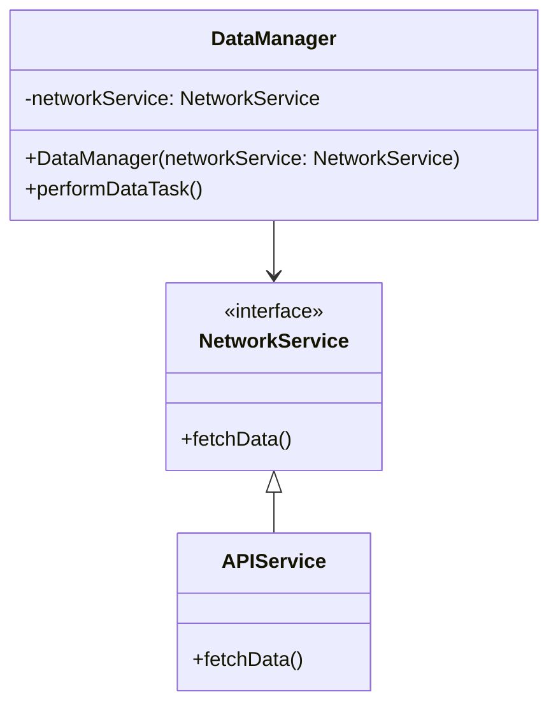

## 4.7 Dependency Injection Pattern

### Intent

The Dependency Injection (DI) pattern is a technique where an object receives other objects it depends on, rather than creating them itself. This pattern promotes loose coupling between components, making your Swift applications more modular, testable, and maintainable.

### Introduction to Dependency Injection

Dependency Injection is a fundamental design pattern that plays a crucial role in software development. At its core, DI is about separating the creation of a client's dependencies from the client's behavior, allowing for more flexible and reusable code. By injecting dependencies, we can easily swap implementations, mock objects for testing, and manage complex application configurations.

### Why Use Dependency Injection?

- **Loose Coupling**: By decoupling dependencies, you can change one part of the system without affecting others.
- **Testability**: Dependencies can be easily mocked or stubbed, facilitating unit testing.
- **Maintainability**: Clear separation of concerns makes the codebase easier to manage and extend.
- **Flexibility**: Swap out implementations without altering the dependent objects.

### Implementing Dependency Injection in Swift

In Swift, we can implement Dependency Injection using three primary methods: Constructor Injection, Property Injection, and Method Injection. Let's explore each of these techniques with practical examples.

#### Constructor Injection

Constructor Injection involves passing dependencies through an object's initializer. This method ensures that all necessary dependencies are provided at the time of object creation.

**Example:**

```swift
// Define a protocol for a service
protocol NetworkService {
    func fetchData()
}

// Implement the protocol
class APIService: NetworkService {
    func fetchData() {
        print("Fetching data from API")
    }
}

// Define a class that depends on the NetworkService
class DataManager {
    private let networkService: NetworkService

    // Constructor Injection
    init(networkService: NetworkService) {
        self.networkService = networkService
    }

    func performDataTask() {
        networkService.fetchData()
    }
}

// Usage
let apiService = APIService()
let dataManager = DataManager(networkService: apiService)
dataManager.performDataTask()
```

In this example, `DataManager` depends on the `NetworkService` protocol. By injecting `APIService` through the initializer, we achieve loose coupling and can easily swap `APIService` with another implementation if needed.

#### Property Injection

Property Injection involves setting dependencies through properties. This method is useful when dependencies can change during an object's lifecycle.

**Example:**

```swift
// Define a protocol for a service
protocol Logger {
    func log(message: String)
}

// Implement the protocol
class ConsoleLogger: Logger {
    func log(message: String) {
        print("Log: \\(message)")
    }
}

// Define a class that depends on the Logger
class UserManager {
    var logger: Logger?

    func createUser(name: String) {
        // Perform user creation logic
        logger?.log(message: "User \\(name) created")
    }
}

// Usage
let userManager = UserManager()
userManager.logger = ConsoleLogger()
userManager.createUser(name: "Alice")
```

In this example, `UserManager` uses a `Logger` dependency. The logger is set through a property, allowing it to be changed at runtime.

#### Method Injection

Method Injection involves passing dependencies directly to methods. This technique is useful when a dependency is only needed for a specific operation.

**Example:**

```swift
// Define a protocol for a service
protocol PaymentProcessor {
    func processPayment(amount: Double)
}

// Implement the protocol
class StripePaymentProcessor: PaymentProcessor {
    func processPayment(amount: Double) {
        print("Processing payment of $\\(amount) through Stripe")
    }
}

// Define a class that uses the PaymentProcessor
class CheckoutManager {
    func completePurchase(amount: Double, paymentProcessor: PaymentProcessor) {
        paymentProcessor.processPayment(amount: amount)
    }
}

// Usage
let stripeProcessor = StripePaymentProcessor()
let checkoutManager = CheckoutManager()
checkoutManager.completePurchase(amount: 100.0, paymentProcessor: stripeProcessor)
```

In this example, `CheckoutManager` uses a `PaymentProcessor` for processing payments. The dependency is passed directly to the `completePurchase` method.

### Visualizing Dependency Injection

To better understand the flow of Dependency Injection, let's visualize the interaction between components using a class diagram.



**Diagram Description**: This diagram illustrates the relationship between `DataManager`, `NetworkService`, and `APIService`. `DataManager` depends on the `NetworkService` interface, which is implemented by `APIService`.

### Key Participants

- **Client**: The object that requires dependencies (e.g., `DataManager`, `UserManager`, `CheckoutManager`).
- **Service**: The dependency that provides functionality (e.g., `NetworkService`, `Logger`, `PaymentProcessor`).
- **Injector**: The mechanism or code responsible for providing dependencies to the client.

### Applicability

Use Dependency Injection when:

- You need to decouple components to improve testability and maintainability.
- Your application requires different implementations of a service.
- You want to manage complex dependencies and configurations.

### Design Considerations

- **Complexity**: While DI simplifies testing and maintenance, it can introduce complexity in managing dependencies.
- **Performance**: Be mindful of the performance impact, especially in property injection where dependencies can change frequently.
- **Lifecycle Management**: Ensure proper lifecycle management of injected dependencies to avoid memory leaks.

### Swift Unique Features

Swift offers several features that enhance Dependency Injection:

- **Protocols and Protocol Extensions**: Use protocols to define dependencies and leverage protocol extensions to provide default implementations.
- **Generics**: Utilize generics to create flexible and reusable components.
- **Property Wrappers**: Implement property wrappers to manage dependency lifecycles and configurations.

### Differences and Similarities

Dependency Injection is often confused with other design patterns like Service Locator. While both manage dependencies, DI explicitly provides dependencies, whereas Service Locator hides them within a centralized registry.

### Try It Yourself

Experiment with the provided examples by:

- Creating a new service implementation and injecting it into the client.
- Modifying the `DataManager` to use property injection instead of constructor injection.
- Implementing a new method in `CheckoutManager` that uses method injection for a different service.

### Knowledge Check

- What are the three types of Dependency Injection?
- How does Dependency Injection improve testability?
- Can you identify a scenario where method injection is preferable over constructor injection?

### Embrace the Journey

Remember, mastering Dependency Injection is a journey. As you progress, you'll discover new ways to apply this pattern to create more robust and flexible Swift applications. Keep experimenting, stay curious, and enjoy the journey!

### References and Links

- [Apple's Swift Documentation](https://developer.apple.com/documentation/swift)
- [Martin Fowler's Inversion of Control Containers and the Dependency Injection pattern](https://martinfowler.com/articles/injection.html)

## Quiz Time!



### What is Dependency Injection?

- [x] A pattern where an object receives other objects it depends on.
- [ ] A pattern where an object creates its dependencies.
- [ ] A pattern where dependencies are hidden within a registry.
- [ ] A pattern that eliminates the need for dependencies.

> **Explanation:** Dependency Injection involves providing dependencies to an object rather than having the object create them itself.

### Which type of Dependency Injection involves passing dependencies through an object's initializer?

- [x] Constructor Injection
- [ ] Property Injection
- [ ] Method Injection
- [ ] Interface Injection

> **Explanation:** Constructor Injection passes dependencies through an object's initializer, ensuring they are available upon creation.

### Which type of Dependency Injection is useful when dependencies can change during an object's lifecycle?

- [ ] Constructor Injection
- [x] Property Injection
- [ ] Method Injection
- [ ] Interface Injection

> **Explanation:** Property Injection allows dependencies to be set or changed at runtime through properties.

### What is a key benefit of Dependency Injection?

- [x] Improved testability
- [ ] Increased coupling
- [ ] Reduced code readability
- [ ] Elimination of all dependencies

> **Explanation:** Dependency Injection improves testability by allowing dependencies to be easily mocked or stubbed.

### In Swift, which feature can be used to define dependencies?

- [x] Protocols
- [ ] Enums
- [ ] Arrays
- [ ] Tuples

> **Explanation:** Protocols are used in Swift to define dependencies, allowing for flexible and interchangeable implementations.

### Which of the following is NOT a method of Dependency Injection?

- [ ] Constructor Injection
- [ ] Property Injection
- [ ] Method Injection
- [x] Singleton Injection

> **Explanation:** Singleton Injection is not a recognized method of Dependency Injection.

### What is the role of the Injector in Dependency Injection?

- [x] It provides dependencies to the client.
- [ ] It creates dependencies within the client.
- [ ] It hides dependencies within a registry.
- [ ] It eliminates the need for dependencies.

> **Explanation:** The Injector is responsible for providing dependencies to the client.

### What is a potential drawback of Dependency Injection?

- [x] Increased complexity
- [ ] Reduced flexibility
- [ ] Decreased testability
- [ ] Increased coupling

> **Explanation:** While DI offers many benefits, it can introduce complexity in managing dependencies.

### True or False: Dependency Injection can be used to manage complex application configurations.

- [x] True
- [ ] False

> **Explanation:** Dependency Injection is effective in managing complex dependencies and configurations, enhancing flexibility.

### Which Swift feature can enhance Dependency Injection by providing default implementations?

- [x] Protocol Extensions
- [ ] Structs
- [ ] Enums
- [ ] Arrays

> **Explanation:** Protocol Extensions in Swift can provide default implementations, enhancing Dependency Injection.




