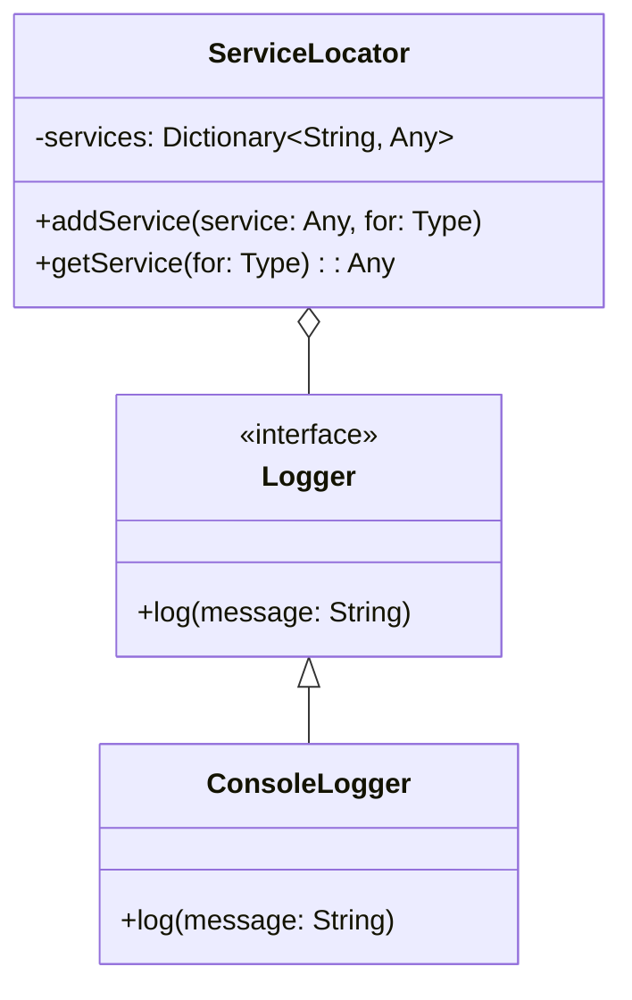

## 4.8 Service Locator Pattern

### Intent

The Service Locator Pattern is a design pattern that provides a global access point for obtaining services or dependencies. It centralizes the management of service instances, allowing different parts of an application to access them without needing to know their concrete implementations.

### Overview

The Service Locator Pattern is particularly useful in complex systems where multiple components require access to shared services. By using a service locator, you can reduce the coupling between components and services, making your codebase more modular and flexible.

### Implementing Service Locator in Swift

#### Creating a Central Registry for Services

The core idea of the Service Locator Pattern is to maintain a central registry where services are registered and can be retrieved as needed. In Swift, this can be achieved by creating a singleton class that holds references to service instances.

```swift
// ServiceLocator.swift
final class ServiceLocator {
    static let shared = ServiceLocator()
    
    private var services: [String: Any] = [:]
    
    private init() {}
    
    func addService<T>(_ service: T, for type: T.Type) {
        let key = String(describing: type)
        services[key] = service
    }
    
    func getService<T>(for type: T.Type) -> T? {
        let key = String(describing: type)
        return services[key] as? T
    }
}
```

In this implementation, `ServiceLocator` is a singleton, ensuring that only one instance of the service registry exists. The `addService` method allows you to register a service, while the `getService` method retrieves a service by its type.

#### Using Protocols for Service Definitions

To decouple the service locator from specific implementations, define services using protocols. This approach allows you to switch out implementations without modifying the code that uses the service.

```swift
// Logger.swift
protocol Logger {
    func log(message: String)
}

class ConsoleLogger: Logger {
    func log(message: String) {
        print("Log: \\(message)")
    }
}

// Registering and Retrieving Services
let logger = ConsoleLogger()
ServiceLocator.shared.addService(logger, for: Logger.self)

if let loggerService = ServiceLocator.shared.getService(for: Logger.self) {
    loggerService.log(message: "This is a test log message.")
}
```

In this example, a `Logger` protocol defines the logging interface, and `ConsoleLogger` is a concrete implementation. The service locator registers the `ConsoleLogger` instance and retrieves it as a `Logger`.

### Criticism and Alternatives

#### Potential for Hidden Dependencies

One of the major criticisms of the Service Locator Pattern is that it can lead to hidden dependencies. When components retrieve services from a global registry, it becomes less clear what dependencies they require, which can make the code harder to understand and maintain.

#### Prefer Dependency Injection When Possible

Dependency Injection (DI) is often preferred over the Service Locator Pattern because it makes dependencies explicit. With DI, dependencies are provided to a component at the time of its creation, usually through constructor injection, property injection, or method injection. This approach enhances testability and maintainability.

### Use Cases and Examples

#### Legacy Systems

In legacy systems where refactoring for dependency injection is not feasible, the Service Locator Pattern can provide a practical solution for managing dependencies. It allows for gradual decoupling and refactoring over time.

#### Plugins Architecture

In a plugins architecture, where components need to discover and use services dynamically, a service locator can provide the necessary flexibility. It allows plugins to register and access services without tightly coupling them to the main application.

### Swift Unique Features

Swift's type system and protocol-oriented programming capabilities make it well-suited for implementing the Service Locator Pattern. By leveraging protocols, you can create flexible and reusable service definitions that can be easily swapped out or extended.

### Design Considerations

- **When to Use**: Consider using the Service Locator Pattern when you need a flexible way to manage dependencies in a large or complex system, especially when refactoring for dependency injection is not feasible.
- **Pitfalls**: Be cautious of hidden dependencies and ensure that the use of the service locator does not obscure the architecture of your application.

### Differences and Similarities

The Service Locator Pattern is often compared to Dependency Injection. While both patterns aim to decouple components from their dependencies, they differ in their approach. The Service Locator Pattern centralizes dependency management, while Dependency Injection distributes it, making dependencies explicit in the component's interface.

### Visualizing the Service Locator Pattern



**Diagram Description**: This class diagram illustrates the Service Locator Pattern in Swift. The `ServiceLocator` class maintains a dictionary of services. The `Logger` protocol defines the logging interface, and `ConsoleLogger` is a concrete implementation of the `Logger`.

### Try It Yourself

Experiment with the Service Locator Pattern by modifying the code examples. Try registering different services and retrieving them using the service locator. Consider implementing additional protocols and concrete classes to see how the pattern scales with complexity.

### Knowledge Check

- What are the main benefits of using the Service Locator Pattern?
- How does the Service Locator Pattern differ from Dependency Injection?
- What are some potential pitfalls of using the Service Locator Pattern?

### Embrace the Journey

Remember, mastering design patterns is a journey. As you explore the Service Locator Pattern, consider how it can be applied to your projects. Stay curious, experiment with different implementations, and enjoy the process of learning and growing as a developer.

## Quiz Time!



### What is the primary intent of the Service Locator Pattern?

- [x] Provide a global access point for obtaining services or dependencies.
- [ ] Enhance the performance of service retrieval.
- [ ] Simplify the user interface design.
- [ ] Optimize memory usage.

> **Explanation:** The primary intent of the Service Locator Pattern is to provide a global access point for obtaining services or dependencies, centralizing the management of these services.

### Which of the following is a criticism of the Service Locator Pattern?

- [x] Potential for hidden dependencies.
- [ ] Increased performance overhead.
- [ ] Lack of flexibility in service management.
- [ ] Difficulty in implementing protocols.

> **Explanation:** The Service Locator Pattern is criticized for potentially leading to hidden dependencies, as it can obscure the dependencies required by components.

### How does Dependency Injection differ from the Service Locator Pattern?

- [x] Dependency Injection makes dependencies explicit, while Service Locator centralizes them.
- [ ] Dependency Injection is more complex to implement.
- [ ] Service Locator requires more memory.
- [ ] Dependency Injection is only used in Swift.

> **Explanation:** Dependency Injection makes dependencies explicit by providing them at the time of component creation, while the Service Locator Pattern centralizes dependency management.

### In which scenario is the Service Locator Pattern particularly useful?

- [x] Legacy systems where refactoring for dependency injection is not feasible.
- [ ] Small, simple applications with few dependencies.
- [ ] Applications with no external dependencies.
- [ ] Real-time systems with strict performance requirements.

> **Explanation:** The Service Locator Pattern is useful in legacy systems where refactoring for dependency injection is not feasible, allowing for gradual decoupling.

### What is a common alternative to the Service Locator Pattern?

- [x] Dependency Injection
- [ ] Singleton Pattern
- [ ] Factory Method Pattern
- [ ] Observer Pattern

> **Explanation:** Dependency Injection is a common alternative to the Service Locator Pattern, as it provides a different approach to managing dependencies.

### Which Swift feature enhances the implementation of the Service Locator Pattern?

- [x] Protocol-oriented programming
- [ ] Automatic Reference Counting (ARC)
- [ ] SwiftUI
- [ ] Grand Central Dispatch (GCD)

> **Explanation:** Swift's protocol-oriented programming capabilities enhance the implementation of the Service Locator Pattern by allowing for flexible and reusable service definitions.

### What is a potential pitfall of using the Service Locator Pattern?

- [x] Obscuring the architecture of the application
- [ ] Increasing the application's memory footprint
- [ ] Complicating the user interface design
- [ ] Reducing the performance of the application

> **Explanation:** A potential pitfall of using the Service Locator Pattern is obscuring the architecture of the application, as it can make dependencies less explicit.

### Which design pattern is often compared to the Service Locator Pattern?

- [x] Dependency Injection
- [ ] Singleton Pattern
- [ ] Adapter Pattern
- [ ] Strategy Pattern

> **Explanation:** The Service Locator Pattern is often compared to Dependency Injection, as both aim to decouple components from their dependencies.

### True or False: The Service Locator Pattern is always the best choice for managing dependencies.

- [ ] True
- [x] False

> **Explanation:** False. While the Service Locator Pattern is useful in certain scenarios, it is not always the best choice. Dependency Injection is often preferred for making dependencies explicit and enhancing testability.

### What is a key benefit of using protocols in the Service Locator Pattern?

- [x] Decoupling service definitions from implementations
- [ ] Improving the performance of service retrieval
- [ ] Simplifying the user interface design
- [ ] Reducing the application's memory usage

> **Explanation:** Using protocols in the Service Locator Pattern helps decouple service definitions from implementations, allowing for greater flexibility and easier swapping of service implementations.




