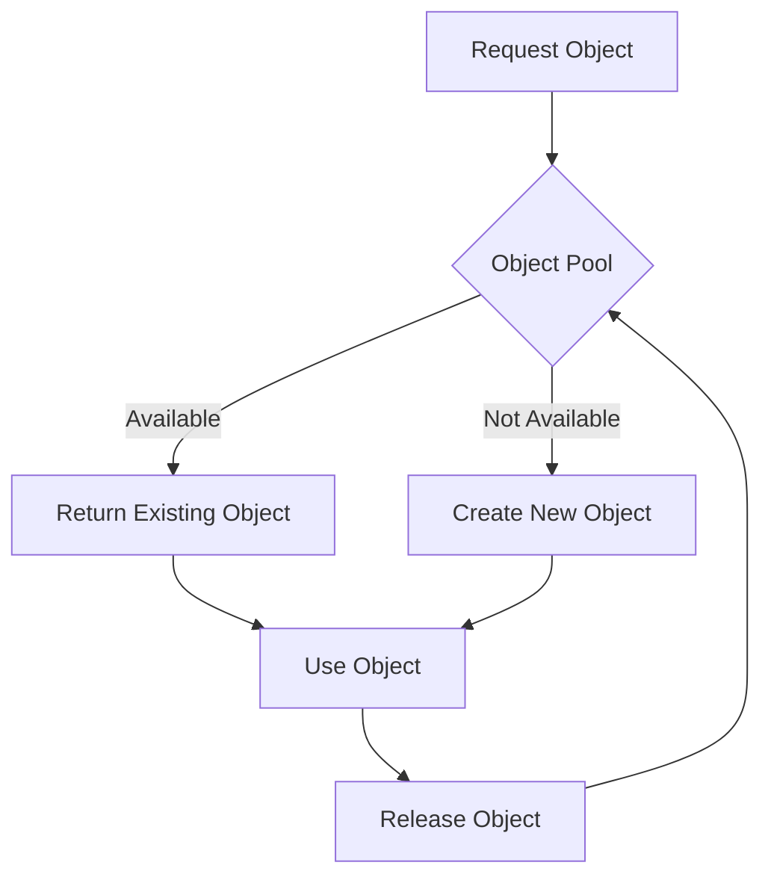

## 4.9 Object Pool Pattern

The Object Pool Pattern is a creational design pattern that aims to manage the reuse of objects that are expensive to create. By maintaining a pool of reusable objects, it helps in controlling the creation and destruction of objects, thereby optimizing resource usage and improving performance.

### Intent

The primary intent of the Object Pool Pattern is to:

- **Manage Object Reuse**: Efficiently manage the reuse of objects that are costly to instantiate.
- **Control Resource Allocation**: Limit the number of instances created, reducing overhead and improving application performance.
- **Optimize Memory Usage**: Reuse objects to minimize memory allocation and deallocation.

### Implementing Object Pool in Swift

Implementing the Object Pool Pattern in Swift involves several key steps:

1. **Define a Poolable Protocol**: Establish a protocol that defines the behavior of objects that can be pooled.
2. **Create an Object Pool Class**: Develop a class responsible for managing the pool of objects.
3. **Implement Object Reuse Logic**: Ensure objects are properly initialized and reset when reused.
4. **Handle Concurrency**: Safely manage access to the pool in a multi-threaded environment.

#### Step 1: Define a Poolable Protocol

Start by defining a protocol that outlines the necessary methods for objects that will be part of the pool.

```swift
protocol Poolable {
    func reset()
}
```

The `reset` method is crucial as it ensures that an object can be returned to its initial state before being reused.

#### Step 2: Create an Object Pool Class

Next, create a class that manages the pool of objects. This class should handle the creation, reuse, and destruction of objects.

```swift
class ObjectPool<T: Poolable> {
    private var availableObjects: [T] = []
    private var maxPoolSize: Int

    init(maxPoolSize: Int) {
        self.maxPoolSize = maxPoolSize
    }

    func acquireObject() -> T? {
        if let object = availableObjects.popLast() {
            return object
        } else {
            return createObject()
        }
    }

    func releaseObject(_ object: T) {
        if availableObjects.count < maxPoolSize {
            object.reset()
            availableObjects.append(object)
        }
    }

    private func createObject() -> T? {
        // Logic to create a new object
        return nil
    }
}
```

- **`acquireObject`**: Retrieves an object from the pool or creates a new one if the pool is empty.
- **`releaseObject`**: Returns an object to the pool after resetting it.
- **`createObject`**: Placeholder for logic to instantiate a new object.

#### Step 3: Implement Object Reuse Logic

Ensure that objects are properly reset before being reused. This is critical to maintain the integrity of the objects.

```swift
class ReusableObject: Poolable {
    var data: String?

    func reset() {
        data = nil
    }
}
```

Here, `ReusableObject` implements the `Poolable` protocol, ensuring it can be reset before reuse.

#### Step 4: Handle Concurrency

Use synchronization mechanisms to manage access to the pool in a multi-threaded environment.

```swift
class ThreadSafeObjectPool<T: Poolable> {
    private var availableObjects: [T] = []
    private let lock = NSLock()
    private var maxPoolSize: Int

    init(maxPoolSize: Int) {
        self.maxPoolSize = maxPoolSize
    }

    func acquireObject() -> T? {
        lock.lock()
        defer { lock.unlock() }
        
        if let object = availableObjects.popLast() {
            return object
        } else {
            return createObject()
        }
    }

    func releaseObject(_ object: T) {
        lock.lock()
        defer { lock.unlock() }
        
        if availableObjects.count < maxPoolSize {
            object.reset()
            availableObjects.append(object)
        }
    }

    private func createObject() -> T? {
        // Logic to create a new object
        return nil
    }
}
```

By using `NSLock`, we ensure that the pool is thread-safe, preventing race conditions and ensuring data integrity.

### Use Cases and Examples

The Object Pool Pattern is particularly useful in scenarios where object creation is resource-intensive. Common use cases include:

- **Database Connections**: Managing a pool of database connections to reduce the overhead of establishing new connections.
- **View Controllers**: Reusing view controllers in iOS applications to optimize memory usage and improve performance.

#### Example: Database Connection Pool

Let's consider a simple example of a database connection pool.

```swift
class DatabaseConnection: Poolable {
    func reset() {
        // Reset connection state
    }

    func connect() {
        // Establish a connection
    }
}

let connectionPool = ObjectPool<DatabaseConnection>(maxPoolSize: 10)

if let connection = connectionPool.acquireObject() {
    connection.connect()
    // Use the connection
    connectionPool.releaseObject(connection)
}
```

In this example, `DatabaseConnection` objects are managed by an `ObjectPool`, allowing for efficient reuse and management of connections.

### Design Considerations

When implementing the Object Pool Pattern, consider the following:

- **Initialization Cost**: Ensure the cost of initializing objects justifies the use of a pool.
- **Pool Size**: Determine an appropriate pool size based on expected usage and resource constraints.
- **Concurrency**: Implement thread safety to handle concurrent access to the pool.
- **Object Lifecycle**: Define clear rules for object initialization, reuse, and destruction.

### Swift Unique Features

Swift provides several features that can enhance the implementation of the Object Pool Pattern:

- **Protocols**: Use protocols to define the behavior of poolable objects, ensuring flexibility and reusability.
- **Generics**: Leverage generics to create a versatile object pool that can manage different types of objects.
- **Concurrency**: Utilize Swift's concurrency features, such as `DispatchQueue` or `NSLock`, to manage access to the pool in multi-threaded environments.

### Differences and Similarities

The Object Pool Pattern is often compared to other creational patterns, such as the Singleton Pattern. While both manage object creation, the Object Pool Pattern focuses on reusing multiple instances, whereas the Singleton Pattern restricts instantiation to a single instance.

### Visualizing the Object Pool Pattern

Here's a diagram illustrating the workflow of the Object Pool Pattern:



**Diagram Explanation**: This diagram shows the process of acquiring an object from the pool. If an object is available, it is returned; otherwise, a new object is created. After use, the object is released back into the pool.

### Try It Yourself

Experiment with the provided code examples by:

- **Modifying Pool Size**: Change the maximum pool size and observe how it affects performance.
- **Customizing Object Logic**: Implement custom logic in the `createObject` method to suit specific use cases.
- **Testing Concurrency**: Simulate concurrent access to the pool and ensure thread safety.

### Knowledge Check

To reinforce your understanding, consider the following questions:

1. What is the primary intent of the Object Pool Pattern?
2. How does the Object Pool Pattern optimize resource usage?
3. Describe a scenario where the Object Pool Pattern would be beneficial.
4. What role does the `reset` method play in the Object Pool Pattern?
5. How can concurrency be managed in an object pool?

### Embrace the Journey

Remember, mastering design patterns is a journey. As you continue to explore and implement patterns like the Object Pool Pattern, you'll gain valuable insights into building efficient, scalable applications. Keep experimenting, stay curious, and enjoy the process!

## Quiz Time!



### What is the primary intent of the Object Pool Pattern?

- [x] Manage the reuse of objects that are expensive to create.
- [ ] Ensure only one instance of an object exists.
- [ ] Facilitate communication between objects.
- [ ] Separate the construction of a complex object from its representation.

> **Explanation:** The Object Pool Pattern is designed to manage the reuse of objects that are costly to create, optimizing resource usage.

### Which method is crucial for resetting objects in the Object Pool Pattern?

- [x] reset()
- [ ] init()
- [ ] destroy()
- [ ] configure()

> **Explanation:** The `reset()` method is crucial as it ensures an object can be returned to its initial state before being reused.

### How can concurrency be managed in an object pool?

- [x] Using NSLock or other synchronization mechanisms.
- [ ] By creating a new object for each request.
- [ ] By limiting the pool size to one.
- [ ] By using a global variable.

> **Explanation:** Concurrency can be managed using synchronization mechanisms like `NSLock` to ensure thread safety.

### What is a common use case for the Object Pool Pattern?

- [x] Reusing database connections.
- [ ] Creating a single instance of a logger.
- [ ] Implementing a command queue.
- [ ] Managing a collection of observers.

> **Explanation:** Reusing database connections is a common use case for the Object Pool Pattern, as it reduces the overhead of establishing new connections.

### What is the role of the `createObject` method in the Object Pool Pattern?

- [x] To instantiate a new object when none are available in the pool.
- [ ] To destroy an object when it is no longer needed.
- [ ] To reset an object before reuse.
- [ ] To configure the pool size.

> **Explanation:** The `createObject` method is responsible for instantiating a new object when the pool is empty.

### What is a key benefit of using the Object Pool Pattern?

- [x] Reducing memory allocation and deallocation.
- [ ] Ensuring only one instance of an object exists.
- [ ] Simplifying the interface of a subsystem.
- [ ] Facilitating communication between objects.

> **Explanation:** The Object Pool Pattern reduces memory allocation and deallocation by reusing objects.

### How does the Object Pool Pattern differ from the Singleton Pattern?

- [x] It manages multiple instances, while Singleton restricts to one.
- [ ] It ensures only one instance of an object exists.
- [ ] It facilitates communication between objects.
- [ ] It separates the construction of a complex object from its representation.

> **Explanation:** The Object Pool Pattern manages multiple instances for reuse, whereas the Singleton Pattern restricts instantiation to a single instance.

### What Swift feature enhances the implementation of the Object Pool Pattern?

- [x] Protocols and Generics
- [ ] Optionals
- [ ] Enums
- [ ] Closures

> **Explanation:** Protocols and Generics enhance the implementation by providing flexibility and reusability.

### Which synchronization mechanism can be used to ensure thread safety in Swift?

- [x] NSLock
- [ ] DispatchQueue.global()
- [ ] NotificationCenter
- [ ] UserDefaults

> **Explanation:** `NSLock` is a synchronization mechanism that can be used to ensure thread safety in Swift.

### True or False: The Object Pool Pattern is only useful for database connections.

- [ ] True
- [x] False

> **Explanation:** False. The Object Pool Pattern is useful for any scenario where object creation is resource-intensive, not just database connections.


