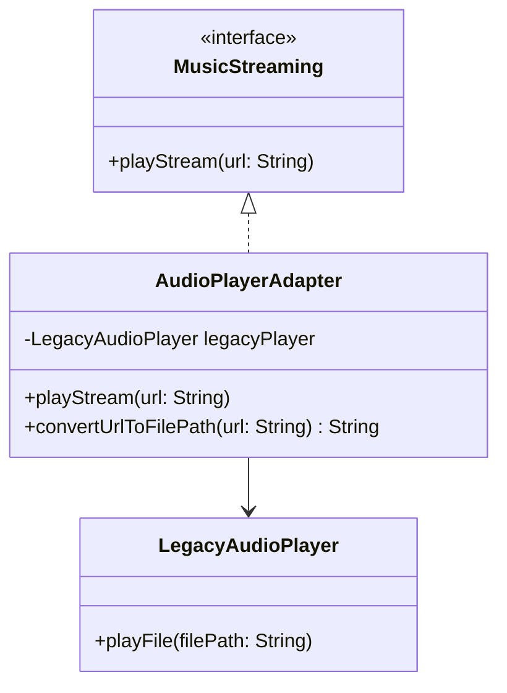

## 5.1 Adapter Design Pattern

The Adapter Design Pattern is a structural pattern that allows objects with incompatible interfaces to work together. It acts as a bridge between two incompatible interfaces, allowing them to communicate and function cohesively. In Swift, this pattern is particularly useful for integrating third-party libraries or legacy code into your applications without altering existing codebases.

### Intent

The primary intent of the Adapter Pattern is to convert the interface of a class into another interface that clients expect. This allows classes to work together that otherwise couldn't due to incompatible interfaces.

### Key Participants

- **Target**: The interface that the client expects.
- **Adapter**: The class that bridges the gap between the Target and the Adaptee.
- **Adaptee**: The existing interface that needs adapting.
- **Client**: The class that interacts with the Target interface.

### Applicability

Use the Adapter Pattern when:

- You want to use an existing class, and its interface does not match the one you need.
- You need to create a reusable class that cooperates with unrelated or unforeseen classes, that is, classes that don't necessarily have compatible interfaces.
- You need to integrate third-party libraries or legacy code into your application.

### Implementing Adapter in Swift

In Swift, you can implement the Adapter Pattern using classes or structs. You can also leverage Swift's powerful protocol and extension features to create adapters that conform to expected interfaces.

#### Creating Adapter Structs or Classes

Let's consider a scenario where you have a legacy audio player class that plays music files, but your new application expects an interface for streaming music. We will create an adapter to bridge this gap.

```swift
// Target protocol that the client expects
protocol MusicStreaming {
    func playStream(url: String)
}

// Adaptee class with a different interface
class LegacyAudioPlayer {
    func playFile(filePath: String) {
        print("Playing audio from file: \\(filePath)")
    }
}

// Adapter class that bridges the LegacyAudioPlayer with the MusicStreaming protocol
class AudioPlayerAdapter: MusicStreaming {
    private var legacyPlayer: LegacyAudioPlayer
    
    init(legacyPlayer: LegacyAudioPlayer) {
        self.legacyPlayer = legacyPlayer
    }
    
    func playStream(url: String) {
        // Convert the URL to a file path and use the legacy player
        let filePath = convertUrlToFilePath(url: url)
        legacyPlayer.playFile(filePath: filePath)
    }
    
    private func convertUrlToFilePath(url: String) -> String {
        // A mock conversion logic
        return "/local/path/to/audio/file"
    }
}

// Client code
let legacyPlayer = LegacyAudioPlayer()
let adapter = AudioPlayerAdapter(legacyPlayer: legacyPlayer)
adapter.playStream(url: "http://example.com/music")
```

In this example, the `AudioPlayerAdapter` class implements the `MusicStreaming` protocol, allowing the client to interact with it as if it were a streaming service. The adapter internally uses the `LegacyAudioPlayer` to perform the actual audio playback.

#### Using Extensions to Conform to Protocols

Swift's extensions provide a powerful way to adapt existing classes to new interfaces without modifying the original class. This is particularly useful when dealing with third-party libraries.

```swift
// Existing third-party class
class ThirdPartyVideoPlayer {
    func playVideo(file: String) {
        print("Playing video from file: \\(file)")
    }
}

// Target protocol
protocol VideoStreaming {
    func playStream(url: String)
}

// Extension to adapt ThirdPartyVideoPlayer to VideoStreaming protocol
extension ThirdPartyVideoPlayer: VideoStreaming {
    func playStream(url: String) {
        let filePath = convertUrlToFilePath(url: url)
        playVideo(file: filePath)
    }
    
    private func convertUrlToFilePath(url: String) -> String {
        // A mock conversion logic
        return "/local/path/to/video/file"
    }
}

// Client code
let videoPlayer = ThirdPartyVideoPlayer()
videoPlayer.playStream(url: "http://example.com/video")
```

In this example, we used an extension to make `ThirdPartyVideoPlayer` conform to the `VideoStreaming` protocol. This allows the client to use the third-party player as if it were a streaming service.

### Diagrams

To better understand the Adapter Pattern, let's visualize the relationship between the components using a class diagram.



**Diagram Description:** This class diagram illustrates how the `AudioPlayerAdapter` implements the `MusicStreaming` interface and delegates the call to the `LegacyAudioPlayer`. The adapter converts the streaming URL to a file path, enabling the legacy player to function as intended.

### Use Cases and Examples

The Adapter Pattern is particularly useful in the following scenarios:

- **Integrating Third-Party Libraries**: When a third-party library provides functionality that doesn't match your application's expected interfaces, adapters can bridge the gap without modifying the library code.
- **Legacy Code Compatibility**: When working with legacy systems, adapters can help integrate outdated interfaces with modern codebases, allowing for gradual refactoring and modernization.
- **Cross-Platform Development**: Adapters can be used to create platform-specific implementations of a common interface, allowing shared codebases to interact with platform-specific APIs seamlessly.

### Design Considerations

- **When to Use**: Use the Adapter Pattern when you need to integrate classes with incompatible interfaces without modifying their source code. It is especially useful when dealing with third-party libraries or legacy systems.
- **Pitfalls to Avoid**: Avoid using adapters to cover up poor design choices. If the need for adapters becomes excessive, consider refactoring the underlying code to improve compatibility.
- **Performance Considerations**: Adapters introduce an additional layer of abstraction, which can impact performance. Ensure that the benefits of using adapters outweigh any potential performance costs.

### Swift Unique Features

Swift's protocol-oriented programming and extensions make it uniquely suited for implementing the Adapter Pattern. By leveraging protocols, you can define clear interfaces and use extensions to adapt existing classes without modifying their source code. This approach promotes code reuse and flexibility.

### Differences and Similarities

The Adapter Pattern is often confused with the **Facade Pattern**, which also provides a simplified interface to a complex system. However, the key difference is that the Adapter Pattern is used to make two incompatible interfaces work together, while the Facade Pattern is used to provide a simplified interface to a complex subsystem.

### Try It Yourself

To deepen your understanding of the Adapter Pattern, try modifying the code examples to adapt different interfaces. For instance, create an adapter for a hypothetical `LegacyVideoPlayer` class that expects a different method signature for playing videos. Experiment with using Swift's extensions to adapt third-party libraries in your projects.

### Knowledge Check

Before we conclude, let's reinforce what we've learned. Consider the following questions:

- What is the primary intent of the Adapter Pattern?
- How does the Adapter Pattern differ from the Facade Pattern?
- When should you use an adapter in your Swift applications?

### Summary

The Adapter Design Pattern is a powerful tool in Swift for integrating classes with incompatible interfaces. By leveraging Swift's protocol-oriented programming and extensions, you can create flexible and reusable adapters that bridge the gap between legacy systems, third-party libraries, and modern codebases. Remember, this is just the beginning. As you progress, you'll build more complex and interactive applications. Keep experimenting, stay curious, and enjoy the journey!

## Quiz Time!



### What is the primary intent of the Adapter Pattern?

- [x] To convert the interface of a class into another interface clients expect.
- [ ] To provide a simplified interface to a complex subsystem.
- [ ] To allow a class to have multiple interfaces.
- [ ] To encapsulate a group of individual factories.

> **Explanation:** The Adapter Pattern's primary intent is to convert the interface of a class into another interface that clients expect, enabling classes with incompatible interfaces to work together.

### Which Swift feature is particularly useful for implementing the Adapter Pattern?

- [x] Protocols and extensions
- [ ] Generics and associated types
- [ ] Optionals and safe unwrapping
- [ ] Memory management and ARC

> **Explanation:** Swift's protocols and extensions are particularly useful for implementing the Adapter Pattern, as they allow you to define clear interfaces and adapt existing classes without modifying their source code.

### In which scenario is the Adapter Pattern NOT typically used?

- [ ] Integrating third-party libraries
- [ ] Legacy code compatibility
- [x] Simplifying complex subsystems
- [ ] Cross-platform development

> **Explanation:** The Adapter Pattern is not typically used for simplifying complex subsystems; this is the role of the Facade Pattern.

### What is a key difference between the Adapter and Facade Patterns?

- [x] Adapter makes incompatible interfaces work together; Facade provides a simplified interface.
- [ ] Adapter provides a simplified interface; Facade makes incompatible interfaces work together.
- [ ] Both patterns serve the same purpose.
- [ ] Adapter is used for legacy code; Facade is used for new code.

> **Explanation:** The key difference is that the Adapter Pattern makes incompatible interfaces work together, while the Facade Pattern provides a simplified interface to a complex subsystem.

### How can you create an adapter in Swift without modifying the original class?

- [x] Use extensions to conform to protocols
- [ ] Use inheritance to extend the class
- [ ] Use generics to create a new class
- [ ] Use optionals to handle different interfaces

> **Explanation:** In Swift, you can use extensions to make an existing class conform to a new protocol, effectively creating an adapter without modifying the original class.

### What is a potential pitfall of overusing the Adapter Pattern?

- [x] It can cover up poor design choices.
- [ ] It simplifies code too much.
- [ ] It increases code readability.
- [ ] It enhances performance.

> **Explanation:** Overusing the Adapter Pattern can cover up poor design choices, leading to a complex and hard-to-maintain codebase.

### Which of the following is a benefit of using the Adapter Pattern?

- [x] It allows integration of classes with incompatible interfaces.
- [ ] It simplifies the interface of a complex subsystem.
- [ ] It reduces the need for third-party libraries.
- [ ] It eliminates the need for legacy code.

> **Explanation:** The Adapter Pattern allows integration of classes with incompatible interfaces, making it easier to work with third-party libraries and legacy code.

### What role does the Adapter play in the Adapter Pattern?

- [x] It bridges the gap between the Target and the Adaptee.
- [ ] It acts as the client interface.
- [ ] It simplifies the Adaptee's interface.
- [ ] It encapsulates the Adaptee's functionality.

> **Explanation:** The Adapter bridges the gap between the Target and the Adaptee, enabling them to work together despite having incompatible interfaces.

### True or False: The Adapter Pattern can be used to adapt third-party libraries in Swift.

- [x] True
- [ ] False

> **Explanation:** True. The Adapter Pattern can be used to adapt third-party libraries in Swift, allowing them to conform to the expected interfaces of your application.

### True or False: The Adapter Pattern is only useful in object-oriented programming.

- [ ] True
- [x] False

> **Explanation:** False. The Adapter Pattern is useful in various programming paradigms, including object-oriented and protocol-oriented programming, as it helps integrate incompatible interfaces.




