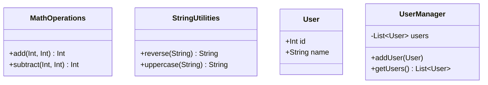

## 5.10 Module Pattern

In the world of software development, organizing code efficiently is crucial for maintaining scalability, readability, and reusability. The Module Pattern is a structural design pattern that helps encapsulate related code into a single unit, often referred to as a module. This pattern is particularly useful in Swift, where it leverages the language's module system and access control features to create clean and maintainable codebases.

### Intent

The primary intent of the Module Pattern is to encapsulate related functionalities into a cohesive unit, thereby promoting separation of concerns and reducing code dependencies. By doing so, developers can create reusable libraries and maintain a clean code organization, which is essential for large-scale applications.

### Implementing Modules in Swift

Swift provides a robust module system that allows developers to organize their code into frameworks or packages. This system is complemented by Swift's access control features, which enable developers to define the visibility of their code components. Let's explore how to implement modules in Swift effectively.

#### Using Swift's Module System

Swift modules are essentially namespaces that encapsulate code. A module can be a framework, a package, or an app target. Each module has its own namespace, which prevents naming conflicts and allows for better code organization.

```swift
// Example of a Swift module

// File: MathOperations.swift
public struct MathOperations {
    public static func add(_ a: Int, _ b: Int) -> Int {
        return a + b
    }
    
    public static func subtract(_ a: Int, _ b: Int) -> Int {
        return a - b
    }
}
```

In this example, `MathOperations` is a module that provides mathematical operations. By marking the struct and its methods as `public`, we make them accessible to other modules.

#### Access Control in Swift

Swift's access control model allows developers to restrict access to parts of their code. The access levels are:

- `open`: Accessible and overridable outside the module.
- `public`: Accessible outside the module but not overridable.
- `internal`: Default access level, accessible within the module.
- `fileprivate`: Accessible only within the file.
- `private`: Accessible only within the enclosing declaration.

By using these access levels, developers can control the visibility of their code components, ensuring that only necessary parts are exposed to other modules.

```swift
// Example of access control

public class Calculator {
    private var result: Int = 0
    
    public func add(_ value: Int) {
        result += value
    }
    
    public func getResult() -> Int {
        return result
    }
}
```

In this example, the `result` variable is private, meaning it can only be accessed within the `Calculator` class. The methods `add` and `getResult` are public, allowing them to be accessed by other modules.

#### Organizing Code into Frameworks or Packages

Swift Package Manager (SPM) is a tool for managing the distribution of Swift code. It allows developers to create packages, which are collections of Swift source files and resources.

To create a Swift package, use the following command:

```bash
swift package init --type library
```

This command initializes a new Swift package with a library target. The package structure includes a `Sources` directory where the source files are stored.

```swift
// Example of a Swift package manifest file

// File: Package.swift
// swift-tools-version:5.5

import PackageDescription

let package = Package(
    name: "MathLibrary",
    products: [
        .library(
            name: "MathLibrary",
            targets: ["MathLibrary"]),
    ],
    targets: [
        .target(
            name: "MathLibrary",
            dependencies: []),
        .testTarget(
            name: "MathLibraryTests",
            dependencies: ["MathLibrary"]),
    ]
)
```

In this manifest file, we define a package named `MathLibrary` with a library product and a test target.

### Use Cases and Examples

The Module Pattern is widely used in various scenarios, such as creating reusable libraries and organizing code for large applications. Let's explore some practical use cases.

#### Reusable Libraries

Reusable libraries are collections of code that provide specific functionalities, which can be used across multiple projects. By encapsulating these functionalities into modules, developers can easily share and maintain them.

```swift
// Example of a reusable library

// File: StringUtilities.swift
public struct StringUtilities {
    public static func reverse(_ string: String) -> String {
        return String(string.reversed())
    }
    
    public static func uppercase(_ string: String) -> String {
        return string.uppercased()
    }
}
```

In this example, `StringUtilities` is a module that provides string manipulation functions. This module can be imported and used in different projects.

#### Clean Code Organization

For large applications, organizing code into modules helps maintain a clean and manageable codebase. Each module can represent a specific feature or component of the application.

```swift
// Example of organizing code into modules

// Module: UserManagement
public struct User {
    public let id: Int
    public let name: String
}

public class UserManager {
    private var users: [User] = []
    
    public func addUser(_ user: User) {
        users.append(user)
    }
    
    public func getUsers() -> [User] {
        return users
    }
}
```

In this example, the `UserManagement` module encapsulates user-related functionalities, such as managing user data. This separation of concerns makes the codebase easier to navigate and maintain.

### Visualizing the Module Pattern

To better understand the Module Pattern, let's visualize how modules interact with each other using a class diagram.



In this diagram, we see four modules: `MathOperations`, `StringUtilities`, `User`, and `UserManager`. Each module encapsulates related functionalities and interacts with others through public interfaces.

### Design Considerations

When implementing the Module Pattern in Swift, consider the following:

- **Granularity**: Decide the level of granularity for your modules. Too granular modules can lead to unnecessary complexity, while too coarse modules can lead to tight coupling.
- **Access Control**: Use Swift's access control features to expose only necessary parts of your modules.
- **Testing**: Ensure each module is independently testable. Use Swift's testing frameworks to write unit tests for your modules.
- **Documentation**: Document your modules thoroughly to make them easier to understand and use by other developers.

### Swift Unique Features

Swift's module system and access control features make it uniquely suited for implementing the Module Pattern. By leveraging these features, developers can create robust and maintainable codebases.

- **Swift Package Manager**: Use SPM to manage dependencies and organize code into packages.
- **Access Control**: Use access levels to control the visibility of your code components.
- **Extensions**: Use Swift's extensions to add functionalities to existing modules without modifying their source code.

### Differences and Similarities

The Module Pattern is often compared to other structural patterns, such as the Facade and Adapter patterns. While all these patterns aim to organize code, they serve different purposes:

- **Module Pattern**: Encapsulates related code into a single unit, promoting separation of concerns.
- **Facade Pattern**: Provides a simplified interface to a complex subsystem.
- **Adapter Pattern**: Allows incompatible interfaces to work together.

Understanding these differences helps developers choose the right pattern for their specific needs.

### Try It Yourself

To solidify your understanding of the Module Pattern, try modifying the code examples provided. For instance, add a new method to the `MathOperations` module or create a new module for handling date operations. Experiment with access control levels to see how they affect the visibility of your code components.

### Knowledge Check

Before moving on, let's summarize the key takeaways:

- The Module Pattern encapsulates related code into a single unit, promoting separation of concerns.
- Swift's module system and access control features are essential for implementing the Module Pattern.
- Use Swift Package Manager to organize code into packages and manage dependencies.
- Consider the granularity and access control of your modules to maintain a clean and maintainable codebase.

Remember, mastering the Module Pattern is just one step in your journey to becoming a proficient Swift developer. Keep experimenting, stay curious, and enjoy the process of learning and building robust applications.

## Quiz Time!



### What is the primary intent of the Module Pattern?

- [x] To encapsulate related code into a single unit
- [ ] To provide a simplified interface to a complex subsystem
- [ ] To allow incompatible interfaces to work together
- [ ] To create a singleton instance

> **Explanation:** The Module Pattern's primary intent is to encapsulate related code into a single unit, promoting separation of concerns.

### Which of the following is NOT an access control level in Swift?

- [ ] open
- [ ] public
- [x] protected
- [ ] private

> **Explanation:** Swift does not have a `protected` access level. The access levels are `open`, `public`, `internal`, `fileprivate`, and `private`.

### What tool does Swift provide for managing the distribution of code?

- [ ] CocoaPods
- [x] Swift Package Manager
- [ ] Carthage
- [ ] Gradle

> **Explanation:** Swift Package Manager (SPM) is the tool provided by Swift for managing the distribution of Swift code.

### How does the Module Pattern help in large applications?

- [x] By organizing code into modules for better maintainability
- [ ] By reducing the need for testing
- [ ] By increasing the complexity of the code
- [ ] By making all code public

> **Explanation:** The Module Pattern helps in large applications by organizing code into modules, which makes the codebase more maintainable.

### Which Swift feature allows adding functionalities to existing modules without modifying their source code?

- [ ] Inheritance
- [ ] Protocols
- [x] Extensions
- [ ] Generics

> **Explanation:** Swift's extensions allow developers to add functionalities to existing modules without modifying their source code.

### What is the default access level in Swift?

- [ ] open
- [ ] public
- [x] internal
- [ ] private

> **Explanation:** The default access level in Swift is `internal`, which means the code is accessible within the module.

### Which pattern provides a simplified interface to a complex subsystem?

- [ ] Module Pattern
- [x] Facade Pattern
- [ ] Adapter Pattern
- [ ] Singleton Pattern

> **Explanation:** The Facade Pattern provides a simplified interface to a complex subsystem.

### What command is used to initialize a new Swift package with a library target?

- [ ] swift init --type library
- [x] swift package init --type library
- [ ] swift create package --library
- [ ] swift new package --type library

> **Explanation:** The command `swift package init --type library` is used to initialize a new Swift package with a library target.

### True or False: The Module Pattern is often compared to the Singleton Pattern.

- [ ] True
- [x] False

> **Explanation:** The Module Pattern is often compared to structural patterns like the Facade and Adapter patterns, not the Singleton Pattern.

### What should be considered when implementing the Module Pattern?

- [x] Granularity of modules
- [x] Access control
- [ ] Ignoring testing
- [ ] Making all code public

> **Explanation:** When implementing the Module Pattern, consider the granularity of modules and access control. Testing should not be ignored, and not all code should be made public.


