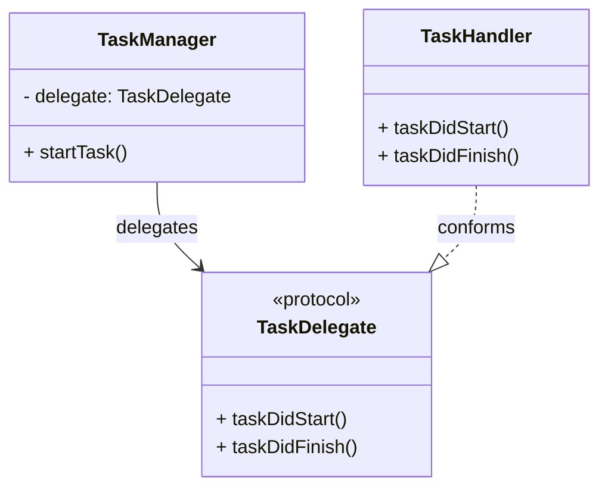

## 5.11 Delegation Pattern

The Delegation Pattern is a fundamental design pattern in Swift that enables one object to delegate responsibilities to another object. This pattern is widely used in iOS development to allow objects to communicate and customize behaviors without tightly coupling them. Let's dive deep into understanding and implementing the Delegation Pattern in Swift.

### Intent

The primary intent of the Delegation Pattern is to allow an object to send messages to a delegate to customize its behavior. This pattern promotes loose coupling and enhances flexibility and reusability in your codebase.

### Implementing Delegation in Swift

Implementing the Delegation Pattern in Swift involves defining a protocol to specify the methods that the delegate will implement and assigning a delegate property to the delegating object. Let's go through these steps in detail.

#### Defining Delegate Protocols

In Swift, a protocol defines a blueprint of methods, properties, and other requirements that suit a particular task or piece of functionality. To implement delegation, we first define a protocol that outlines the methods the delegate should implement.

```swift
// Define a protocol for the delegate
protocol TaskDelegate: AnyObject {
    func taskDidStart()
    func taskDidFinish()
}
```

In this example, `TaskDelegate` is a protocol that requires any conforming delegate to implement `taskDidStart()` and `taskDidFinish()` methods. Using `AnyObject` ensures that only class types can conform to this protocol, which is important for weak references.

#### Assigning Delegate Properties

The next step is to create a delegating class that holds a reference to the delegate and calls its methods at appropriate times.

```swift
class TaskManager {
    weak var delegate: TaskDelegate?
    
    func startTask() {
        // Notify the delegate that the task has started
        delegate?.taskDidStart()
        
        // Simulate task completion
        DispatchQueue.global().asyncAfter(deadline: .now() + 2.0) {
            // Notify the delegate that the task has finished
            DispatchQueue.main.async {
                self.delegate?.taskDidFinish()
            }
        }
    }
}
```

Here, `TaskManager` has a `delegate` property of type `TaskDelegate?`. The `delegate` is marked as `weak` to prevent strong reference cycles, which can lead to memory leaks.

#### Implementing the Delegate

Finally, let's implement a class that conforms to the `TaskDelegate` protocol and acts as the delegate.

```swift
class TaskHandler: TaskDelegate {
    func taskDidStart() {
        print("Task has started.")
    }
    
    func taskDidFinish() {
        print("Task has finished.")
    }
}

// Usage
let taskManager = TaskManager()
let taskHandler = TaskHandler()

taskManager.delegate = taskHandler
taskManager.startTask()
```

In this example, `TaskHandler` conforms to `TaskDelegate` and implements the required methods. We then create instances of `TaskManager` and `TaskHandler`, assign `taskHandler` as the delegate of `taskManager`, and start the task.

### Use Cases and Examples

The Delegation Pattern is prevalent in iOS development, especially in UIKit. A classic example is the `UITableViewDelegate`, which allows customization of table view behaviors.

#### UITableViewDelegate Example

The `UITableViewDelegate` protocol provides methods for managing selections, configuring section headers and footers, deleting and reordering cells, and performing other actions in a table view.

```swift
import UIKit

class MyTableViewController: UITableViewController, UITableViewDelegate, UITableViewDataSource {
    
    let data = ["Item 1", "Item 2", "Item 3"]
    
    override func viewDidLoad() {
        super.viewDidLoad()
        tableView.delegate = self
        tableView.dataSource = self
    }
    
    // UITableViewDataSource methods
    override func tableView(_ tableView: UITableView, numberOfRowsInSection section: Int) -> Int {
        return data.count
    }
    
    override func tableView(_ tableView: UITableView, cellForRowAt indexPath: IndexPath) -> UITableViewCell {
        let cell = tableView.dequeueReusableCell(withIdentifier: "Cell", for: indexPath)
        cell.textLabel?.text = data[indexPath.row]
        return cell
    }
    
    // UITableViewDelegate methods
    override func tableView(_ tableView: UITableView, didSelectRowAt indexPath: IndexPath) {
        print("Selected: \\(data[indexPath.row])")
    }
}
```

In this example, `MyTableViewController` conforms to both `UITableViewDelegate` and `UITableViewDataSource`. The table view's `delegate` and `dataSource` properties are set to `self`, allowing `MyTableViewController` to manage table view interactions and data presentation.

### Visualizing the Delegation Pattern

To better understand the flow of the Delegation Pattern, let's visualize it using a class diagram.



**Diagram Description**: This class diagram illustrates the relationship between `TaskManager`, `TaskDelegate`, and `TaskHandler`. `TaskManager` holds a reference to a `TaskDelegate`, and `TaskHandler` conforms to the `TaskDelegate` protocol.

### Key Participants

- **Delegating Object**: The object that delegates responsibility to another object. In our examples, `TaskManager` and `UITableView` act as delegating objects.
- **Delegate**: The object that receives delegated responsibilities. `TaskHandler` and `MyTableViewController` serve as delegates in our examples.
- **Protocol**: Defines the methods that the delegate must implement. `TaskDelegate` and `UITableViewDelegate` are examples of such protocols.

### Applicability

Use the Delegation Pattern when:

- You want to allow customization or extension of a class's behavior without subclassing.
- You need to establish a one-to-one relationship between objects, where one object acts on behalf of another.
- You want to separate concerns and promote modularity in your codebase.

### Design Considerations

When implementing the Delegation Pattern, consider the following:

- **Memory Management**: Always use weak references for delegate properties to avoid retain cycles and memory leaks.
- **Protocol Design**: Design protocols to be as specific and focused as possible. Avoid bloated protocols with too many responsibilities.
- **Error Handling**: Consider providing default implementations for optional methods to handle cases where the delegate does not implement them.

### Swift Unique Features

Swift's protocol-oriented programming paradigm enhances the Delegation Pattern. Protocol extensions allow you to provide default implementations for protocol methods, reducing the need for boilerplate code.

```swift
protocol TaskDelegate: AnyObject {
    func taskDidStart()
    func taskDidFinish()
}

extension TaskDelegate {
    func taskDidStart() {
        print("Default task start behavior.")
    }
    
    func taskDidFinish() {
        print("Default task finish behavior.")
    }
}
```

In this example, default implementations for `taskDidStart()` and `taskDidFinish()` are provided. Delegates can override these methods if needed.

### Differences and Similarities

The Delegation Pattern is often compared with the Observer Pattern. While both patterns involve communication between objects, the Delegation Pattern establishes a one-to-one relationship, whereas the Observer Pattern supports a one-to-many relationship.

### Try It Yourself

Experiment with the Delegation Pattern by modifying the code examples provided. Try creating a new delegate protocol with additional methods, or implement a custom delegate for a different UIKit component.

### Knowledge Check

- What is the primary intent of the Delegation Pattern?
- How do you prevent memory leaks when using delegate properties?
- What is the difference between the Delegation Pattern and the Observer Pattern?

### Embrace the Journey

Remember, mastering the Delegation Pattern is a stepping stone to building more robust and flexible applications. Keep experimenting, stay curious, and enjoy the journey!

## Quiz Time!



### What is the primary intent of the Delegation Pattern?

- [x] To allow an object to send messages to a delegate to customize behavior.
- [ ] To establish a one-to-many relationship between objects.
- [ ] To encapsulate a request as an object.
- [ ] To provide a way to access the elements of an aggregate object sequentially.

> **Explanation:** The Delegation Pattern allows an object to delegate responsibilities to another object, enabling customization of behavior.

### How do you prevent memory leaks when using delegate properties in Swift?

- [x] Use weak references for delegate properties.
- [ ] Use strong references for delegate properties.
- [ ] Use unowned references for delegate properties.
- [ ] Avoid using references altogether.

> **Explanation:** Weak references are used to prevent strong reference cycles, which can lead to memory leaks.

### Which of the following is a key participant in the Delegation Pattern?

- [x] Delegate
- [ ] Singleton
- [ ] Observer
- [ ] Factory

> **Explanation:** The Delegate is the object that receives delegated responsibilities in the Delegation Pattern.

### What is the difference between the Delegation Pattern and the Observer Pattern?

- [x] Delegation establishes a one-to-one relationship, while Observer supports one-to-many.
- [ ] Delegation supports one-to-many relationships, while Observer is one-to-one.
- [ ] Both patterns establish one-to-many relationships.
- [ ] Both patterns establish one-to-one relationships.

> **Explanation:** The Delegation Pattern establishes a one-to-one relationship, whereas the Observer Pattern supports a one-to-many relationship.

### What is a common use case for the Delegation Pattern in iOS development?

- [x] Customizing behaviors in UIKit components like UITableView.
- [ ] Managing dependencies in a dependency injection framework.
- [ ] Implementing a singleton object.
- [ ] Encapsulating algorithms in a strategy pattern.

> **Explanation:** The Delegation Pattern is commonly used in iOS development to customize behaviors in UIKit components like UITableView.

### What is the role of a protocol in the Delegation Pattern?

- [x] To define the methods that the delegate must implement.
- [ ] To encapsulate a request as an object.
- [ ] To provide a way to access the elements of an aggregate object sequentially.
- [ ] To establish a one-to-many relationship between objects.

> **Explanation:** A protocol defines the methods that the delegate must implement, serving as a contract between the delegating object and the delegate.

### How can you provide default implementations for protocol methods in Swift?

- [x] Use protocol extensions.
- [ ] Use subclassing.
- [ ] Use generics.
- [ ] Use closures.

> **Explanation:** Protocol extensions in Swift allow you to provide default implementations for protocol methods.

### Which keyword is used to define a protocol that can only be adopted by class types?

- [x] AnyObject
- [ ] Any
- [ ] class
- [ ] struct

> **Explanation:** The `AnyObject` keyword is used to define a protocol that can only be adopted by class types, ensuring that the delegate can be weakly referenced.

### True or False: The Delegation Pattern is only used in iOS development.

- [ ] True
- [x] False

> **Explanation:** The Delegation Pattern is not limited to iOS development; it is a general design pattern used in various programming environments to promote loose coupling and flexibility.

### What is a potential pitfall when using the Delegation Pattern?

- [x] Retain cycles leading to memory leaks.
- [ ] Lack of flexibility in behavior customization.
- [ ] Difficulty in understanding the code structure.
- [ ] Increased complexity in the codebase.

> **Explanation:** Retain cycles can occur if delegate properties are not weakly referenced, leading to memory leaks.



By mastering the Delegation Pattern, you enhance your ability to build modular and flexible Swift applications. Keep exploring and applying these concepts to become a proficient Swift developer!


