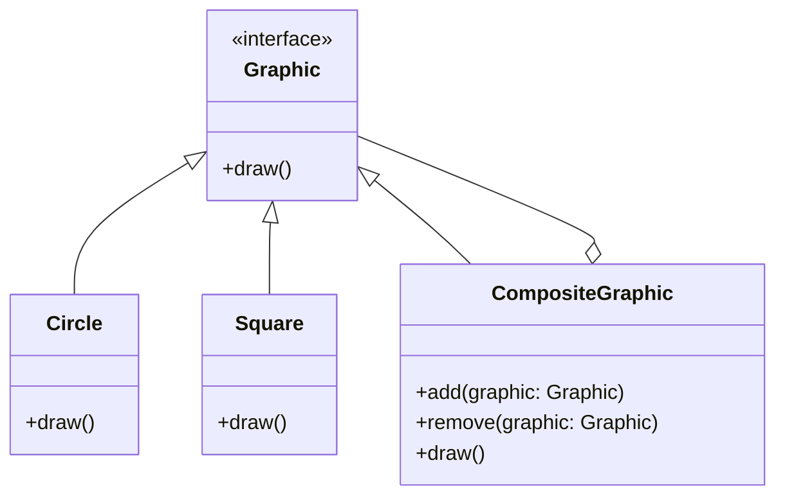
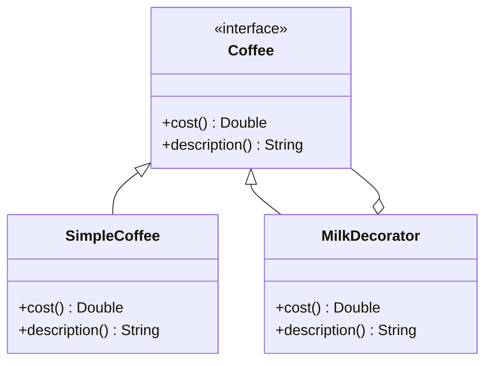
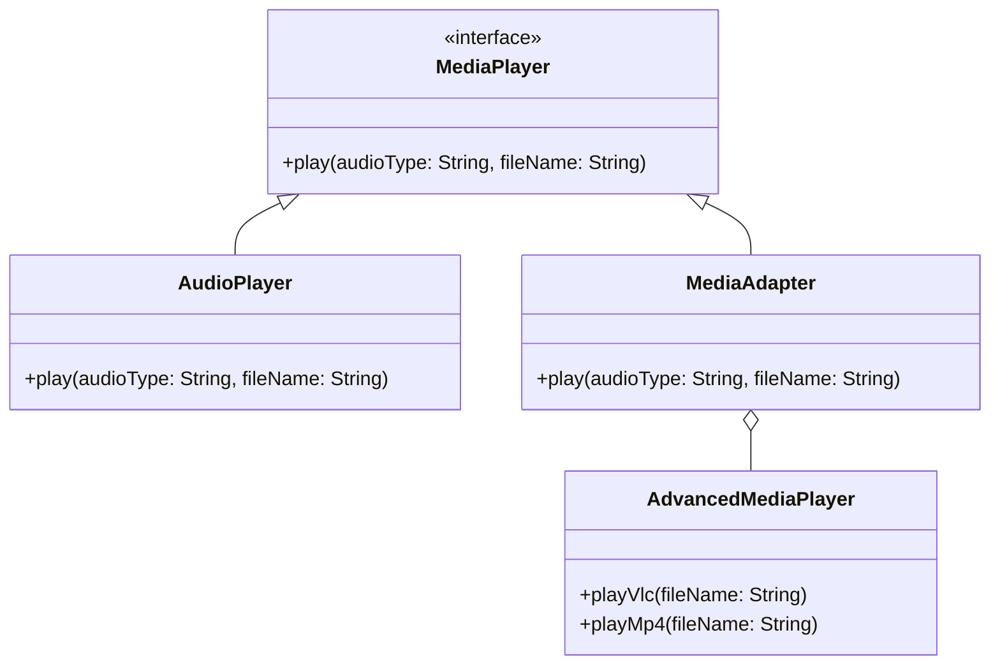

## 5.12 Composite vs. Decorator vs. Adapter: A Comparison

In the world of software design, structural design patterns play a crucial role in defining the composition of classes and objects. Among these, the Composite, Decorator, and Adapter patterns are often used to address specific architectural challenges. Understanding these patterns is essential for building scalable, maintainable, and efficient applications in Swift. Let's delve into each pattern, explore their differences, and learn how to apply them effectively in Swift development.

### Composite Design Pattern

#### Intent
The Composite pattern is used to compose objects into tree structures to represent part-whole hierarchies. This pattern allows clients to treat individual objects and compositions of objects uniformly.

#### Key Participants
- **Component**: Declares the interface for objects in the composition.
- **Leaf**: Represents leaf objects in the composition. A leaf has no children.
- **Composite**: Defines behavior for components having children and stores child components.

#### Applicability
Use the Composite pattern when:
- You want to represent part-whole hierarchies of objects.
- You want clients to be able to ignore the difference between compositions of objects and individual objects.

#### Sample Code Snippet

```swift
protocol Graphic {
    func draw()
}

class Circle: Graphic {
    func draw() {
        print("Drawing a Circle")
    }
}

class Square: Graphic {
    func draw() {
        print("Drawing a Square")
    }
}

class CompositeGraphic: Graphic {
    private var children = [Graphic]()
    
    func add(graphic: Graphic) {
        children.append(graphic)
    }
    
    func remove(graphic: Graphic) {
        // Remove logic
    }
    
    func draw() {
        for child in children {
            child.draw()
        }
    }
}

// Usage
let circle = Circle()
let square = Square()
let compositeGraphic = CompositeGraphic()
compositeGraphic.add(graphic: circle)
compositeGraphic.add(graphic: square)
compositeGraphic.draw()
```

#### Diagrams



### Decorator Design Pattern

#### Intent
The Decorator pattern attaches additional responsibilities to an object dynamically. Decorators provide a flexible alternative to subclassing for extending functionality.

#### Key Participants
- **Component**: Defines the interface for objects that can have responsibilities added to them dynamically.
- **ConcreteComponent**: Defines an object to which additional responsibilities can be attached.
- **Decorator**: Maintains a reference to a Component object and defines an interface that conforms to Component's interface.
- **ConcreteDecorator**: Adds responsibilities to the component.

#### Applicability
Use the Decorator pattern when:
- You want to add responsibilities to individual objects dynamically and transparently.
- You want to avoid creating a large number of subclasses to support every possible combination of responsibilities.

#### Sample Code Snippet

```swift
protocol Coffee {
    func cost() -> Double
    func description() -> String
}

class SimpleCoffee: Coffee {
    func cost() -> Double {
        return 5.0
    }
    
    func description() -> String {
        return "Simple Coffee"
    }
}

class MilkDecorator: Coffee {
    private let decoratedCoffee: Coffee
    
    init(decoratedCoffee: Coffee) {
        self.decoratedCoffee = decoratedCoffee
    }
    
    func cost() -> Double {
        return decoratedCoffee.cost() + 1.5
    }
    
    func description() -> String {
        return decoratedCoffee.description() + ", Milk"
    }
}

// Usage
let simpleCoffee = SimpleCoffee()
let milkCoffee = MilkDecorator(decoratedCoffee: simpleCoffee)
print("\\(milkCoffee.description()) costs \\(milkCoffee.cost())")
```

#### Diagrams



### Adapter Design Pattern

#### Intent
The Adapter pattern converts the interface of a class into another interface clients expect. It allows classes to work together that couldn't otherwise because of incompatible interfaces.

#### Key Participants
- **Target**: Defines the domain-specific interface that Client uses.
- **Adapter**: Adapts the interface of Adaptee to the Target interface.
- **Adaptee**: Defines an existing interface that needs adapting.
- **Client**: Collaborates with objects conforming to the Target interface.

#### Applicability
Use the Adapter pattern when:
- You want to use an existing class, and its interface does not match the one you need.
- You want to create a reusable class that cooperates with unrelated or unforeseen classes.

#### Sample Code Snippet

```swift
protocol MediaPlayer {
    func play(audioType: String, fileName: String)
}

class AudioPlayer: MediaPlayer {
    func play(audioType: String, fileName: String) {
        print("Playing \\(audioType) file. Name: \\(fileName)")
    }
}

class AdvancedMediaPlayer {
    func playVlc(fileName: String) {
        print("Playing vlc file. Name: \\(fileName)")
    }
    
    func playMp4(fileName: String) {
        print("Playing mp4 file. Name: \\(fileName)")
    }
}

class MediaAdapter: MediaPlayer {
    private var advancedMediaPlayer: AdvancedMediaPlayer
    
    init(audioType: String) {
        advancedMediaPlayer = AdvancedMediaPlayer()
    }
    
    func play(audioType: String, fileName: String) {
        if audioType == "vlc" {
            advancedMediaPlayer.playVlc(fileName: fileName)
        } else if audioType == "mp4" {
            advancedMediaPlayer.playMp4(fileName: fileName)
        }
    }
}

// Usage
let audioPlayer = AudioPlayer()
audioPlayer.play(audioType: "mp3", fileName: "song.mp3")

let mediaAdapter = MediaAdapter(audioType: "mp4")
mediaAdapter.play(audioType: "mp4", fileName: "movie.mp4")
```

#### Diagrams



### Understanding Differences

#### Use Cases and Structural Differences

- **Composite**: Ideal for representing hierarchies where individual objects and compositions are treated uniformly. It simplifies client code as they can treat individual and composite objects the same way.

- **Decorator**: Best when you need to add responsibilities to objects dynamically without affecting other objects. It provides a flexible alternative to subclassing for extending functionality.

- **Adapter**: Suitable when you need to integrate classes with incompatible interfaces. It acts as a bridge between two incompatible interfaces, allowing them to work together.

#### Choosing the Right Pattern for the Problem

- **Composite**: Choose this when dealing with tree structures, such as UI components or file systems, where you need to treat leaf and composite nodes uniformly.

- **Decorator**: Opt for this when you need to add behavior or responsibilities to individual objects without affecting others, such as adding scrollbars to windows or adding new features to a coffee object.

- **Adapter**: Use this when you need to work with legacy code or third-party libraries that have incompatible interfaces. It allows you to adapt these interfaces to your current needs without modifying the existing code.

### Swift Unique Features

Swift provides unique features that enhance the implementation of these patterns. For instance, Swift's protocol-oriented programming allows for more flexible and reusable design patterns. Protocol extensions can be used to add default behavior to protocols, making it easier to implement patterns like Decorator.

### Differences and Similarities

While all three patterns are structural, they serve different purposes and have distinct implementations. Understanding when and how to use each pattern is crucial for effective software design. The Composite pattern focuses on part-whole hierarchies, the Decorator pattern on adding responsibilities, and the Adapter pattern on interface compatibility.

### Try It Yourself

Experiment with these patterns by creating a simple Swift application. Try modifying the code examples provided to add new features or adapt different interfaces. For instance, extend the Composite pattern to include more complex shapes, or add new decorators to the coffee example to see how easily you can extend functionality.

## Quiz Time!



### What is the primary intent of the Composite pattern?

- [x] To compose objects into tree structures to represent part-whole hierarchies.
- [ ] To add responsibilities to objects dynamically.
- [ ] To convert one interface into another.
- [ ] To manage object creation.

> **Explanation:** The Composite pattern is used to create tree structures to represent part-whole hierarchies, allowing clients to treat individual and composite objects uniformly.

### Which pattern is best for adding responsibilities to objects dynamically?

- [ ] Composite
- [x] Decorator
- [ ] Adapter
- [ ] Singleton

> **Explanation:** The Decorator pattern is specifically designed to add responsibilities to objects dynamically without affecting other objects.

### What is the role of the Adapter pattern?

- [ ] To manage object creation.
- [ ] To add responsibilities to objects.
- [x] To convert one interface into another.
- [ ] To represent part-whole hierarchies.

> **Explanation:** The Adapter pattern is used to convert the interface of a class into another interface that clients expect, allowing incompatible interfaces to work together.

### In which pattern is the concept of "leaf" and "composite" used?

- [x] Composite
- [ ] Decorator
- [ ] Adapter
- [ ] Factory

> **Explanation:** The Composite pattern uses the concepts of "leaf" and "composite" to represent individual and composite objects in a tree structure.

### Which pattern allows for flexible alternatives to subclassing?

- [ ] Composite
- [x] Decorator
- [ ] Adapter
- [ ] Prototype

> **Explanation:** The Decorator pattern provides a flexible alternative to subclassing for extending functionality by adding responsibilities to objects dynamically.

### When should you use the Adapter pattern?

- [ ] When you need to add responsibilities to objects.
- [x] When you need to integrate classes with incompatible interfaces.
- [ ] When you need to manage object creation.
- [ ] When you need to represent part-whole hierarchies.

> **Explanation:** The Adapter pattern is used when you need to integrate classes with incompatible interfaces, allowing them to work together.

### Which pattern is ideal for representing hierarchical structures?

- [x] Composite
- [ ] Decorator
- [ ] Adapter
- [ ] Singleton

> **Explanation:** The Composite pattern is ideal for representing hierarchical structures where individual and composite objects are treated uniformly.

### What is a key feature of the Decorator pattern?

- [ ] It converts one interface into another.
- [x] It adds responsibilities to objects dynamically.
- [ ] It composes objects into tree structures.
- [ ] It manages object creation.

> **Explanation:** The key feature of the Decorator pattern is its ability to add responsibilities to objects dynamically without affecting other objects.

### Which pattern would you use to adapt a third-party library to your application's interface?

- [ ] Composite
- [ ] Decorator
- [x] Adapter
- [ ] Singleton

> **Explanation:** The Adapter pattern is used to adapt a third-party library to your application's interface, allowing you to use the library without modifying its code.

### True or False: The Composite pattern is used to add responsibilities to objects dynamically.

- [ ] True
- [x] False

> **Explanation:** False. The Composite pattern is used to represent part-whole hierarchies, not to add responsibilities to objects dynamically.



Remember, understanding these patterns and their applications is just the beginning. As you continue to develop your Swift skills, keep exploring and experimenting with different design patterns to find the best solutions for your software architecture challenges. Happy coding!


