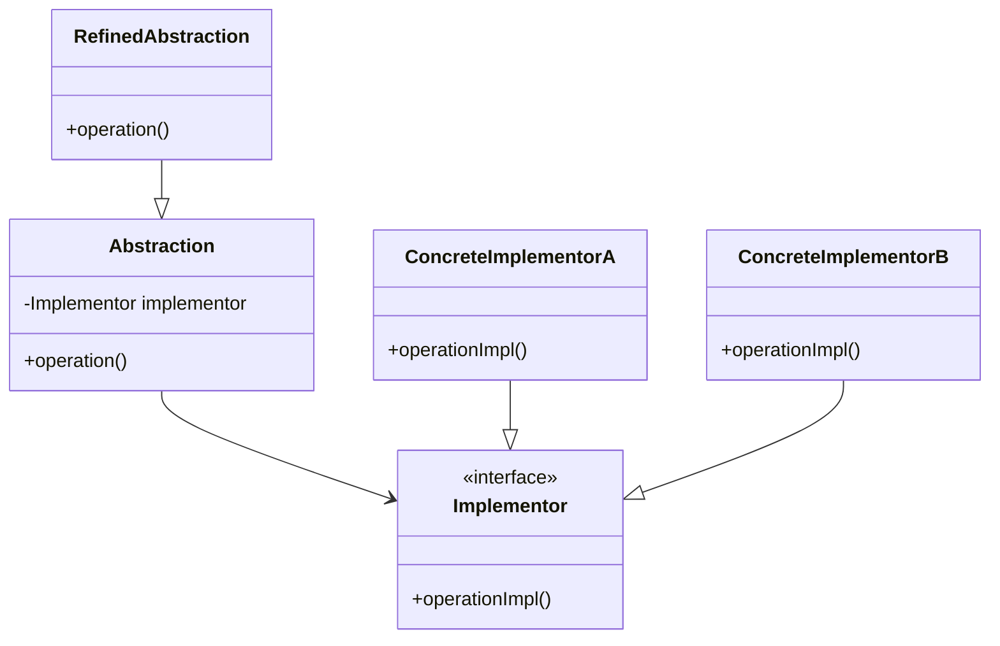

## 5.2 Bridge Design Pattern

In the world of software design, flexibility and scalability are paramount. The Bridge Design Pattern is a powerful structural pattern that addresses these needs by decoupling an abstraction from its implementation. This separation allows the two to evolve independently, providing a robust framework for managing complexity in Swift applications. Let's delve into the intricacies of the Bridge Design Pattern and explore how it can be effectively implemented in Swift.

### Intent of the Bridge Design Pattern

The primary intent of the Bridge Design Pattern is to decouple an abstraction from its implementation so that the two can vary independently. This pattern is particularly useful when you want to avoid a permanent binding between an abstraction and its implementation, which can lead to a rigid and inflexible design.

### Key Participants

1. **Abstraction**: Defines the abstraction's interface and maintains a reference to an object of type Implementor.
2. **Refined Abstraction**: Extends the interface defined by Abstraction.
3. **Implementor**: Defines the interface for implementation classes.
4. **Concrete Implementor**: Implements the Implementor interface and defines its concrete implementation.

### Visualizing the Bridge Design Pattern

To better understand the Bridge Design Pattern, let's visualize its structure using a class diagram.



### Implementing Bridge in Swift

In Swift, the Bridge Design Pattern can be effectively implemented using protocols and composition. Let's explore how to define the abstraction and implementation protocols and use composition to bridge between them.

#### Step 1: Define the Abstraction Protocol

Begin by defining a protocol for the abstraction. This protocol will declare the operations that can be performed on the abstraction.

```swift
protocol Abstraction {
    func operation()
}
```

#### Step 2: Define the Implementor Protocol

Next, define a protocol for the implementor. This protocol will declare the operations that can be performed by the implementation.

```swift
protocol Implementor {
    func operationImpl()
}
```

#### Step 3: Create Concrete Implementors

Create classes or structs that conform to the Implementor protocol. These classes will provide concrete implementations of the operations defined in the Implementor protocol.

```swift
class ConcreteImplementorA: Implementor {
    func operationImpl() {
        print("ConcreteImplementorA operation")
    }
}

class ConcreteImplementorB: Implementor {
    func operationImpl() {
        print("ConcreteImplementorB operation")
    }
}
```

#### Step 4: Implement the Abstraction

Create a class that conforms to the Abstraction protocol. This class will maintain a reference to an Implementor and delegate the operation to it.

```swift
class RefinedAbstraction: Abstraction {
    private var implementor: Implementor
    
    init(implementor: Implementor) {
        self.implementor = implementor
    }
    
    func operation() {
        implementor.operationImpl()
    }
}
```

### Use Cases and Examples

The Bridge Design Pattern is particularly useful in scenarios where you need to support multiple platforms or change implementations at runtime. Let's explore some practical examples.

#### Example 1: Supporting Multiple Platforms

Consider a scenario where you are developing a graphics library that needs to support different rendering APIs, such as OpenGL and DirectX. By using the Bridge Design Pattern, you can decouple the abstraction (graphics operations) from the implementation (rendering API), allowing you to switch between different APIs without modifying the client code.

```swift
// Define the abstraction and implementor protocols
protocol Renderer {
    func renderCircle(radius: Double)
}

class Circle {
    private var renderer: Renderer
    private var radius: Double
    
    init(renderer: Renderer, radius: Double) {
        self.renderer = renderer
        self.radius = radius
    }
    
    func draw() {
        renderer.renderCircle(radius: radius)
    }
}

// Implement concrete renderers
class OpenGLRenderer: Renderer {
    func renderCircle(radius: Double) {
        print("OpenGL rendering circle with radius \\(radius)")
    }
}

class DirectXRenderer: Renderer {
    func renderCircle(radius: Double) {
        print("DirectX rendering circle with radius \\(radius)")
    }
}

// Usage
let openGLRenderer = OpenGLRenderer()
let circle = Circle(renderer: openGLRenderer, radius: 5.0)
circle.draw()

let directXRenderer = DirectXRenderer()
let anotherCircle = Circle(renderer: directXRenderer, radius: 10.0)
anotherCircle.draw()
```

#### Example 2: Changing Implementations at Runtime

The Bridge Design Pattern also allows you to change implementations at runtime, providing flexibility in how an abstraction is used.

```swift
// Define the abstraction and implementor protocols
protocol NotificationSender {
    func send(message: String)
}

class Notification {
    private var sender: NotificationSender
    
    init(sender: NotificationSender) {
        self.sender = sender
    }
    
    func send(message: String) {
        sender.send(message: message)
    }
}

// Implement concrete senders
class EmailSender: NotificationSender {
    func send(message: String) {
        print("Sending email with message: \\(message)")
    }
}

class SMSSender: NotificationSender {
    func send(message: String) {
        print("Sending SMS with message: \\(message)")
    }
}

// Usage
var emailSender = EmailSender()
var notification = Notification(sender: emailSender)
notification.send(message: "Hello via Email!")

var smsSender = SMSSender()
notification = Notification(sender: smsSender)
notification.send(message: "Hello via SMS!")
```

### Design Considerations

When implementing the Bridge Design Pattern in Swift, consider the following:

- **When to Use**: Use the Bridge Design Pattern when you want to decouple an abstraction from its implementation, allowing them to vary independently. This is particularly useful when you have multiple implementations of an abstraction that need to be interchangeable.
- **Complexity**: While the Bridge Design Pattern provides flexibility, it can also introduce complexity. Ensure that the benefits of decoupling outweigh the added complexity.
- **Performance**: Consider the performance implications of using the Bridge Design Pattern, especially if the abstraction and implementation communicate frequently.

### Swift Unique Features

Swift offers several unique features that can enhance the implementation of the Bridge Design Pattern:

- **Protocols and Protocol Extensions**: Swift's protocols and protocol extensions provide a powerful way to define abstractions and implementations, allowing you to leverage the full power of Swift's type system.
- **Value Types and Reference Types**: Swift's support for both value types (structs) and reference types (classes) allows you to choose the most appropriate type for your use case, providing flexibility in how you implement the Bridge Design Pattern.
- **Generics**: Swift's generics allow you to create flexible and reusable abstractions and implementations, further enhancing the power of the Bridge Design Pattern.

### Differences and Similarities

The Bridge Design Pattern is often confused with the Adapter Design Pattern. While both patterns involve abstraction and implementation, they serve different purposes:

- **Bridge Pattern**: Decouples an abstraction from its implementation, allowing them to vary independently.
- **Adapter Pattern**: Converts the interface of a class into another interface that clients expect, allowing classes to work together that couldn't otherwise because of incompatible interfaces.

### Try It Yourself

To deepen your understanding of the Bridge Design Pattern, try modifying the code examples provided:

- **Experiment with Different Implementations**: Create additional concrete implementors and switch between them at runtime.
- **Extend the Abstraction**: Add new methods to the abstraction protocol and implement them in the concrete implementors.
- **Combine with Other Patterns**: Explore how the Bridge Design Pattern can be combined with other patterns, such as the Factory Method or Strategy Pattern, to create more complex and flexible designs.

### Knowledge Check

- **What is the primary intent of the Bridge Design Pattern?**
- **How does the Bridge Design Pattern differ from the Adapter Design Pattern?**
- **What are some use cases where the Bridge Design Pattern is particularly useful?**

Remember, mastering design patterns is a journey. As you explore the Bridge Design Pattern, keep experimenting, stay curious, and enjoy the process of building more flexible and scalable Swift applications.

## Quiz Time!



### What is the primary intent of the Bridge Design Pattern?

- [x] To decouple an abstraction from its implementation
- [ ] To convert the interface of a class into another interface
- [ ] To provide a way to create families of related objects
- [ ] To define a family of algorithms

> **Explanation:** The Bridge Design Pattern is intended to decouple an abstraction from its implementation so that the two can vary independently.

### Which of the following is a key participant in the Bridge Design Pattern?

- [x] Abstraction
- [ ] Singleton
- [ ] Observer
- [ ] Factory

> **Explanation:** The Abstraction is a key participant in the Bridge Design Pattern, defining the interface for the abstraction.

### How does the Bridge Design Pattern differ from the Adapter Design Pattern?

- [x] Bridge decouples abstraction from implementation; Adapter converts interfaces.
- [ ] Bridge converts interfaces; Adapter decouples abstraction from implementation.
- [ ] Both patterns serve the same purpose.
- [ ] Neither pattern involves abstraction and implementation.

> **Explanation:** The Bridge Pattern decouples an abstraction from its implementation, while the Adapter Pattern converts the interface of a class into another interface.

### In Swift, what is used to define the abstraction and implementation in the Bridge Design Pattern?

- [x] Protocols
- [ ] Classes only
- [ ] Enums
- [ ] Structs only

> **Explanation:** Protocols in Swift are used to define the abstraction and implementation in the Bridge Design Pattern.

### What is a benefit of using the Bridge Design Pattern?

- [x] It allows abstraction and implementation to vary independently.
- [ ] It simplifies the code by merging abstraction and implementation.
- [ ] It ensures a single implementation for an abstraction.
- [ ] It eliminates the need for protocols.

> **Explanation:** The Bridge Design Pattern allows abstraction and implementation to vary independently, providing flexibility.

### Which Swift feature enhances the Bridge Design Pattern by allowing flexible abstractions?

- [x] Generics
- [ ] Enums
- [ ] Tuples
- [ ] Optionals

> **Explanation:** Swift's generics allow for flexible and reusable abstractions, enhancing the Bridge Design Pattern.

### What is a common use case for the Bridge Design Pattern?

- [x] Supporting multiple platforms
- [ ] Ensuring thread safety
- [ ] Managing memory
- [ ] Handling errors

> **Explanation:** The Bridge Design Pattern is commonly used to support multiple platforms by decoupling abstraction from implementation.

### What is a potential downside of using the Bridge Design Pattern?

- [x] Increased complexity
- [ ] Reduced flexibility
- [ ] Incompatibility with protocols
- [ ] Limited to reference types

> **Explanation:** While the Bridge Design Pattern provides flexibility, it can also introduce complexity.

### Can the Bridge Design Pattern be combined with other design patterns?

- [x] True
- [ ] False

> **Explanation:** The Bridge Design Pattern can be combined with other design patterns, such as Factory Method or Strategy Pattern, to create more complex designs.

### What Swift feature allows for both value and reference types in the Bridge Design Pattern?

- [x] Value Types and Reference Types
- [ ] Optionals
- [ ] Extensions
- [ ] Closures

> **Explanation:** Swift's support for both value types (structs) and reference types (classes) allows for flexibility in implementing the Bridge Design Pattern.




