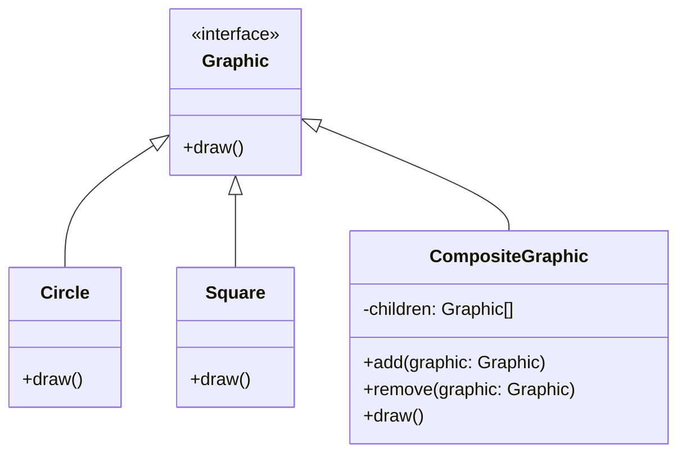

## 5.3 Composite Design Pattern

The Composite Design Pattern is a structural pattern that allows you to compose objects into tree structures to represent part-whole hierarchies. This pattern lets clients treat individual objects and compositions of objects uniformly. In Swift, the Composite pattern is particularly useful for building complex user interfaces and managing hierarchical data structures such as file systems.

### Intent

The primary intent of the Composite Design Pattern is to allow clients to interact with individual objects and compositions of objects in a consistent manner. This is achieved by defining a common interface for all objects in the composition, whether they are leaf nodes or composite nodes.

### Implementing Composite in Swift

To implement the Composite Design Pattern in Swift, you typically follow these steps:

1. **Define a Component Protocol or Base Class**: This defines the interface for all objects in the composition. It includes methods for adding, removing, and accessing child components.

2. **Implement Leaf Classes**: These classes represent the leaf objects in the composition, which do not have any children.

3. **Implement Composite Classes**: These classes represent composite objects that can have children. They implement the methods for managing child components.

#### Step 1: Creating the Component Protocol

Let's start by defining a protocol that represents the component in our hierarchy. This protocol will declare the common interface for both leaf and composite objects.

```swift
protocol Graphic {
    func draw()
}
```

In this example, `Graphic` is a protocol with a single method `draw()`. This method will be implemented by both leaf and composite objects.

#### Step 2: Implementing Leaf Classes

Leaf classes represent the end objects in the hierarchy. They implement the component interface but do not have any children.

```swift
class Circle: Graphic {
    func draw() {
        print("Drawing a Circle")
    }
}

class Square: Graphic {
    func draw() {
        print("Drawing a Square")
    }
}
```

Here, `Circle` and `Square` are leaf classes that implement the `Graphic` protocol. They provide their own implementation of the `draw()` method.

#### Step 3: Implementing Composite Classes

Composite classes can have children and implement the component interface. They manage child components and delegate tasks to them.

```swift
class CompositeGraphic: Graphic {
    private var children: [Graphic] = []

    func add(graphic: Graphic) {
        children.append(graphic)
    }

    func remove(graphic: Graphic) {
        if let index = children.firstIndex(where: { $0 as AnyObject === graphic as AnyObject }) {
            children.remove(at: index)
        }
    }

    func draw() {
        for child in children {
            child.draw()
        }
    }
}
```

The `CompositeGraphic` class maintains a list of child components and implements methods to add, remove, and draw them. The `draw()` method iterates through each child and calls its `draw()` method.

### Use Cases and Examples

The Composite Design Pattern is widely used in scenarios where you need to represent hierarchies of objects. Here are some common use cases:

- **File Systems**: File systems are a classic example of the Composite pattern. Folders can contain files and other folders, creating a tree structure.

- **UI Components Hierarchy**: User interfaces often consist of nested components, such as panels containing buttons and text fields. The Composite pattern allows you to manage these components uniformly.

#### Example: Building a UI Component Hierarchy

Let's consider a scenario where we are building a simple UI component hierarchy. We have a `View` protocol that represents any UI component, and we want to create composite views that can contain other views.

```swift
protocol View {
    func render()
}

class Button: View {
    func render() {
        print("Rendering a Button")
    }
}

class TextField: View {
    func render() {
        print("Rendering a TextField")
    }
}

class CompositeView: View {
    private var children: [View] = []

    func add(view: View) {
        children.append(view)
    }

    func remove(view: View) {
        if let index = children.firstIndex(where: { $0 as AnyObject === view as AnyObject }) {
            children.remove(at: index)
        }
    }

    func render() {
        for child in children {
            child.render()
        }
    }
}
```

In this example, `Button` and `TextField` are leaf classes that implement the `View` protocol. `CompositeView` is a composite class that can contain other views and render them.

### Visualizing the Composite Pattern

To better understand the Composite Design Pattern, let's visualize the structure using a class diagram.



This diagram illustrates the relationship between the `Graphic` interface, the leaf classes (`Circle` and `Square`), and the composite class (`CompositeGraphic`).

### Design Considerations

When using the Composite Design Pattern, consider the following:

- **Uniformity**: Ensure that the component interface is implemented consistently across all objects in the hierarchy.

- **Efficiency**: Be mindful of the performance implications of managing a large number of child components.

- **Flexibility**: The Composite pattern provides flexibility in managing hierarchies, but it can introduce complexity if not used judiciously.

### Swift Unique Features

Swift offers several unique features that can enhance the implementation of the Composite Design Pattern:

- **Protocol Extensions**: Use protocol extensions to provide default implementations for the component interface, reducing code duplication.

- **Value Types**: Consider using value types (structs) for leaf objects to take advantage of Swift's value semantics and reduce memory overhead.

- **Generics**: Use generics to create flexible and reusable composite classes.

#### Example: Using Protocol Extensions

```swift
protocol Renderable {
    func render()
}

extension Renderable {
    func render() {
        print("Rendering a generic component")
    }
}

struct Label: Renderable {
    // Uses the default implementation from the protocol extension
}

struct Image: Renderable {
    func render() {
        print("Rendering an Image")
    }
}
```

In this example, `Label` uses the default implementation provided by the protocol extension, while `Image` provides its own implementation.

### Differences and Similarities

The Composite Design Pattern is often compared to other structural patterns such as Decorator and Adapter. Here are some key differences and similarities:

- **Decorator Pattern**: The Decorator pattern is used to add responsibilities to individual objects dynamically. In contrast, the Composite pattern is used to manage hierarchies of objects.

- **Adapter Pattern**: The Adapter pattern is used to convert the interface of a class into another interface that clients expect. The Composite pattern focuses on uniformity in managing part-whole hierarchies.

- **Similarity**: Both Composite and Decorator patterns involve recursive structures, but they serve different purposes.

### Try It Yourself

Now that we've explored the Composite Design Pattern, try implementing it in your own projects. Here are a few suggestions:

- **Experiment with Different Components**: Create different types of components and see how they interact within a composite structure.

- **Modify the Composite Class**: Add additional methods to the composite class, such as counting the number of leaf nodes or finding specific components.

- **Use Swift Features**: Experiment with Swift's unique features, such as generics and protocol extensions, to enhance your implementation.

### Knowledge Check

Before we conclude, let's summarize the key takeaways:

- The Composite Design Pattern allows you to compose objects into tree structures to represent part-whole hierarchies.

- It provides a uniform interface for interacting with individual and composite objects.

- Swift's unique features, such as protocol extensions and value types, can enhance your implementation.

- The Composite pattern is commonly used in file systems and UI component hierarchies.

### Embrace the Journey

Remember, mastering design patterns is a journey. As you continue to explore and experiment with the Composite Design Pattern, you'll gain a deeper understanding of how to manage complex hierarchies in your Swift applications. Keep experimenting, stay curious, and enjoy the journey!

## Quiz Time!



### What is the primary intent of the Composite Design Pattern?

- [x] To compose objects into tree structures to represent part-whole hierarchies.
- [ ] To add responsibilities to individual objects dynamically.
- [ ] To convert the interface of a class into another interface that clients expect.
- [ ] To provide a way to create objects without specifying their concrete classes.

> **Explanation:** The Composite Design Pattern's primary intent is to compose objects into tree structures to represent part-whole hierarchies.

### Which of the following is a key feature of the Composite Design Pattern?

- [x] It allows clients to treat individual objects and compositions of objects uniformly.
- [ ] It focuses on adding responsibilities to individual objects dynamically.
- [ ] It is used to convert the interface of a class into another interface.
- [ ] It provides a way to create families of related objects.

> **Explanation:** The Composite Design Pattern allows clients to treat individual objects and compositions of objects uniformly.

### What is a common use case for the Composite Design Pattern?

- [x] File systems
- [ ] Singleton pattern
- [ ] Factory pattern
- [ ] Observer pattern

> **Explanation:** File systems are a common use case for the Composite Design Pattern, as they naturally form a tree structure.

### What is the role of a leaf class in the Composite Design Pattern?

- [x] To represent end objects in the hierarchy that do not have any children.
- [ ] To manage child components and delegate tasks to them.
- [ ] To provide a common interface for all objects in the composition.
- [ ] To convert the interface of a class into another interface.

> **Explanation:** Leaf classes represent end objects in the hierarchy that do not have any children.

### What Swift feature can be used to provide default implementations for the component interface in the Composite Design Pattern?

- [x] Protocol extensions
- [ ] Generics
- [ ] Value types
- [ ] Closures

> **Explanation:** Protocol extensions in Swift can be used to provide default implementations for the component interface.

### How does the Composite Design Pattern differ from the Decorator Pattern?

- [x] The Composite pattern manages hierarchies of objects, while the Decorator pattern adds responsibilities to individual objects.
- [ ] The Composite pattern converts the interface of a class into another interface.
- [ ] The Composite pattern provides a way to create families of related objects.
- [ ] The Composite pattern allows clients to treat individual objects and compositions of objects uniformly.

> **Explanation:** The Composite pattern manages hierarchies of objects, while the Decorator pattern adds responsibilities to individual objects.

### What is a key consideration when using the Composite Design Pattern?

- [x] Ensure that the component interface is implemented consistently across all objects.
- [ ] Focus on adding responsibilities to individual objects dynamically.
- [ ] Convert the interface of a class into another interface.
- [ ] Create families of related objects without specifying their concrete classes.

> **Explanation:** A key consideration is to ensure that the component interface is implemented consistently across all objects.

### Which Swift feature can enhance the implementation of the Composite Design Pattern by reducing memory overhead?

- [x] Value types
- [ ] Protocol extensions
- [ ] Generics
- [ ] Closures

> **Explanation:** Using value types (structs) can reduce memory overhead in the implementation of the Composite Design Pattern.

### True or False: The Composite Design Pattern is commonly used for managing UI component hierarchies.

- [x] True
- [ ] False

> **Explanation:** True. The Composite Design Pattern is commonly used for managing UI component hierarchies.

### Which method is commonly implemented in both leaf and composite classes in the Composite Design Pattern?

- [x] draw()
- [ ] add()
- [ ] remove()
- [ ] convert()

> **Explanation:** The `draw()` method is commonly implemented in both leaf and composite classes in the Composite Design Pattern.


