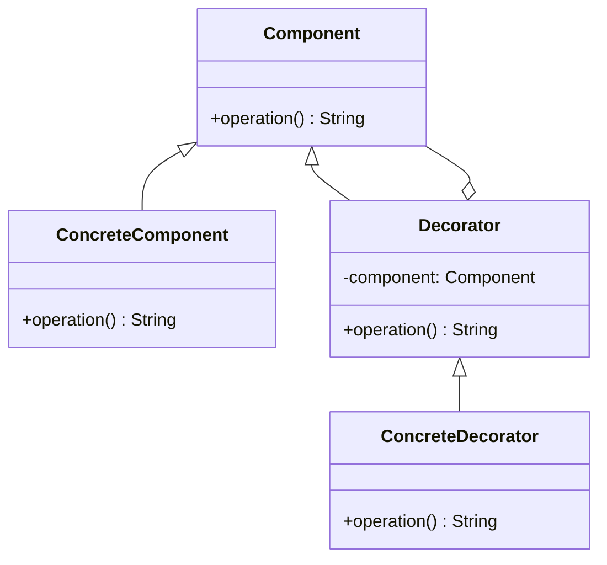
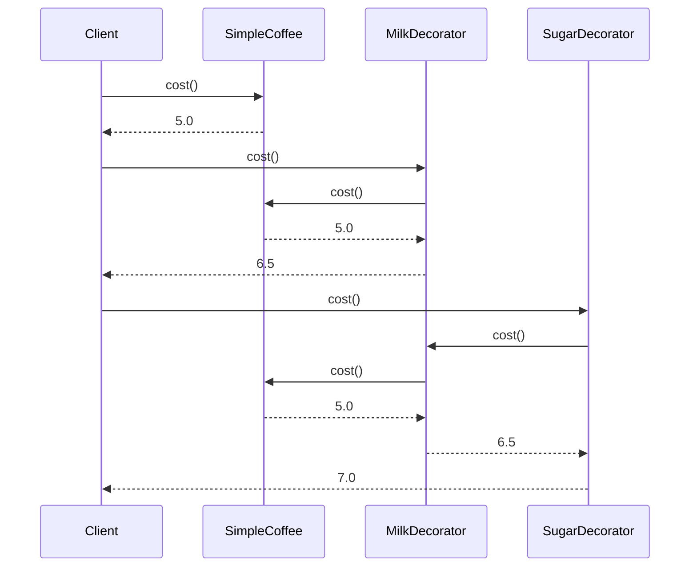

## 5.4 Decorator Design Pattern

The Decorator Design Pattern is a structural pattern that allows behavior to be added to individual objects, either statically or dynamically, without affecting the behavior of other objects from the same class. In Swift, this pattern is particularly useful for adding responsibilities to objects at runtime, which is a common requirement in iOS and macOS app development. 

### Intent

The primary intent of the Decorator Design Pattern is to attach additional responsibilities to an object dynamically. This pattern provides a flexible alternative to subclassing for extending functionality. By using the Decorator pattern, you can create a set of decorator classes that are used to wrap concrete components.

### Key Participants

1. **Component**: Defines the interface for objects that can have responsibilities added to them dynamically.
2. **ConcreteComponent**: The class to which additional responsibilities can be added.
3. **Decorator**: Maintains a reference to a Component object and defines an interface that conforms to the Component's interface.
4. **ConcreteDecorator**: Adds responsibilities to the component.

### Diagram

Below is a class diagram illustrating the Decorator Design Pattern.



### Implementing Decorator in Swift

To implement the Decorator pattern in Swift, we leverage protocols to define the component interface and create wrapper classes that conform to this interface. This approach ensures flexibility and adherence to Swift's protocol-oriented programming paradigm.

#### Step-by-Step Implementation

1. **Define the Component Protocol**

   The first step is to define a protocol that represents the component interface. This protocol will declare the methods that can be dynamically extended.

   ```swift
   protocol Coffee {
       func cost() -> Double
       func description() -> String
   }
   ```

2. **Create a Concrete Component**

   Next, create a concrete class that implements the component protocol. This class represents the object to which additional responsibilities can be added.

   ```swift
   class SimpleCoffee: Coffee {
       func cost() -> Double {
           return 5.0
       }

       func description() -> String {
           return "Simple Coffee"
       }
   }
   ```

3. **Implement the Decorator Base Class**

   Create a base decorator class that also conforms to the component protocol. This class will hold a reference to a component object.

   ```swift
   class CoffeeDecorator: Coffee {
       private let decoratedCoffee: Coffee

       init(decoratedCoffee: Coffee) {
           self.decoratedCoffee = decoratedCoffee
       }

       func cost() -> Double {
           return decoratedCoffee.cost()
       }

       func description() -> String {
           return decoratedCoffee.description()
       }
   }
   ```

4. **Create Concrete Decorators**

   Finally, implement concrete decorators that extend the functionality of the component by overriding the methods of the decorator base class.

   ```swift
   class MilkDecorator: CoffeeDecorator {
       override func cost() -> Double {
           return super.cost() + 1.5
       }

       override func description() -> String {
           return super.description() + ", Milk"
       }
   }

   class SugarDecorator: CoffeeDecorator {
       override func cost() -> Double {
           return super.cost() + 0.5
       }

       override func description() -> String {
           return super.description() + ", Sugar"
       }
   }
   ```

### Use Cases and Examples

The Decorator pattern is ideal for scenarios where you need to add responsibilities to objects without altering their structure. Here are some examples of how this pattern can be applied:

- **Extending Functionality**: In a text editor, decorators can be used to add functionalities such as spell checking, grammar checking, and formatting to a basic text component.
- **Adding Behaviors at Runtime**: In a graphics application, decorators can dynamically add features like borders, shadows, or color filters to graphical components.

#### Example: Coffee Shop

Let's consider a coffee shop scenario where we want to dynamically add ingredients to a coffee order.

```swift
let myCoffee: Coffee = SimpleCoffee()
print("Cost: \\(myCoffee.cost()), Description: \\(myCoffee.description())")

let milkCoffee: Coffee = MilkDecorator(decoratedCoffee: myCoffee)
print("Cost: \\(milkCoffee.cost()), Description: \\(milkCoffee.description())")

let milkSugarCoffee: Coffee = SugarDecorator(decoratedCoffee: milkCoffee)
print("Cost: \\(milkSugarCoffee.cost()), Description: \\(milkSugarCoffee.description())")
```

**Output:**

```
Cost: 5.0, Description: Simple Coffee
Cost: 6.5, Description: Simple Coffee, Milk
Cost: 7.0, Description: Simple Coffee, Milk, Sugar
```

### Design Considerations

- **When to Use**: Use the Decorator pattern when you need to add responsibilities to individual objects dynamically and transparently.
- **Avoid Overuse**: Overusing decorators can lead to a complex and difficult-to-understand codebase. It is crucial to balance the use of decorators with other design patterns.
- **Performance**: Be mindful of the performance overhead introduced by multiple layers of decorators.

### Swift Unique Features

Swift's protocol-oriented programming offers a unique advantage when implementing the Decorator pattern. By using protocols, we can create flexible and reusable decorators that can be easily composed and extended.

#### Protocol Extensions

Swift allows us to use protocol extensions to provide default implementations for protocol methods. This feature can be leveraged to simplify the implementation of decorators.

```swift
extension Coffee {
    func description() -> String {
        return "Unknown Coffee"
    }
}
```

### Differences and Similarities

The Decorator pattern is often confused with the Adapter and Proxy patterns. Here's how they differ:

- **Decorator vs. Adapter**: The Adapter pattern changes the interface of an existing object, while the Decorator pattern enhances the behavior of an object without changing its interface.
- **Decorator vs. Proxy**: The Proxy pattern controls access to an object, whereas the Decorator pattern adds responsibilities to an object.

### Try It Yourself

To deepen your understanding of the Decorator pattern, try modifying the code examples provided:

- Add a new decorator, such as `WhippedCreamDecorator`, and integrate it into the coffee shop example.
- Experiment with different combinations of decorators to see how they affect the cost and description of the coffee.

### Visualizing the Decorator Pattern

Here's a sequence diagram to visualize how the Decorator pattern works in the coffee shop example:



### Knowledge Check

- **What is the primary intent of the Decorator pattern?**
- **How does the Decorator pattern differ from the Adapter pattern?**
- **Why is protocol-oriented programming beneficial for implementing the Decorator pattern in Swift?**

### Embrace the Journey

Remember, mastering the Decorator pattern is just one step in your journey to becoming a proficient Swift developer. As you explore more design patterns, you'll gain a deeper understanding of how to build scalable and maintainable applications. Keep experimenting, stay curious, and enjoy the journey!

## Quiz Time!



### What is the primary intent of the Decorator pattern?

- [x] To attach additional responsibilities to an object dynamically.
- [ ] To change the interface of an existing object.
- [ ] To control access to an object.
- [ ] To create a new object from a set of existing objects.

> **Explanation:** The Decorator pattern allows behavior to be added to individual objects dynamically without affecting other objects from the same class.

### Which of the following is a key participant in the Decorator pattern?

- [x] Component
- [ ] Adapter
- [ ] Proxy
- [ ] Facade

> **Explanation:** The key participants in the Decorator pattern include Component, ConcreteComponent, Decorator, and ConcreteDecorator.

### How does the Decorator pattern differ from the Adapter pattern?

- [x] The Decorator pattern enhances behavior without changing the interface, while the Adapter pattern changes the interface.
- [ ] The Decorator pattern changes the interface, while the Adapter pattern enhances behavior.
- [ ] Both patterns change the interface.
- [ ] Both patterns enhance behavior.

> **Explanation:** The Adapter pattern changes the interface of an existing object, whereas the Decorator pattern enhances the behavior without changing the interface.

### In Swift, what is a common technique used to implement the Decorator pattern?

- [x] Using protocols and wrapper classes.
- [ ] Using inheritance exclusively.
- [ ] Using global functions.
- [ ] Using static methods.

> **Explanation:** In Swift, the Decorator pattern is often implemented using protocols and wrapper classes to ensure flexibility and reusability.

### What is a potential downside of overusing decorators?

- [x] It can lead to a complex and difficult-to-understand codebase.
- [ ] It can simplify the codebase too much.
- [ ] It can eliminate the need for other design patterns.
- [ ] It can increase the performance of the application.

> **Explanation:** Overusing decorators can lead to code complexity and make the codebase difficult to understand and maintain.

### Why is protocol-oriented programming beneficial for implementing the Decorator pattern in Swift?

- [x] It allows for flexible and reusable decorators.
- [ ] It eliminates the need for classes.
- [ ] It enforces strict typing.
- [ ] It simplifies memory management.

> **Explanation:** Protocol-oriented programming in Swift allows for flexible and reusable decorators by leveraging protocols to define component interfaces.

### Which of the following is an example of a concrete decorator in the coffee shop example?

- [x] MilkDecorator
- [ ] SimpleCoffee
- [ ] Coffee
- [ ] Decorator

> **Explanation:** MilkDecorator is a concrete decorator that extends the functionality of the SimpleCoffee component by adding milk.

### What is the role of the Decorator class in the Decorator pattern?

- [x] It maintains a reference to a Component object and defines an interface that conforms to the Component's interface.
- [ ] It changes the interface of the Component.
- [ ] It provides a default implementation of the Component's methods.
- [ ] It controls access to the Component.

> **Explanation:** The Decorator class maintains a reference to a Component object and defines an interface that conforms to the Component's interface, allowing for dynamic behavior extension.

### True or False: The Decorator pattern can be used to add behaviors at runtime.

- [x] True
- [ ] False

> **Explanation:** True. The Decorator pattern is designed to add responsibilities to objects dynamically, making it ideal for adding behaviors at runtime.

### Which Swift feature can be leveraged to simplify the implementation of decorators?

- [x] Protocol extensions
- [ ] Static methods
- [ ] Global variables
- [ ] Inheritance

> **Explanation:** Protocol extensions in Swift can be leveraged to provide default implementations for protocol methods, simplifying the implementation of decorators.




