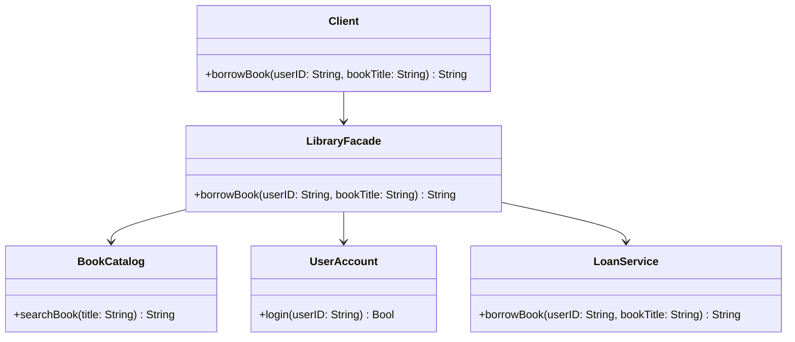

## 5.5 Facade Design Pattern

In the world of software development, complexity is often an unavoidable reality. As systems grow, they tend to become more intricate, with numerous components interacting with each other in complex ways. The **Facade Design Pattern** offers a solution to this problem by providing a simplified interface to a complex subsystem. In this section, we will delve into the Facade Design Pattern, focusing on its implementation in Swift, its use cases, and how it can enhance your development process.

### Intent

The primary intent of the Facade Design Pattern is to provide a unified and simplified interface to a set of interfaces in a subsystem. This pattern aims to reduce the complexity of interacting with multiple classes by offering a single point of access.

### Key Participants

1. **Facade**: The class that provides a simplified interface to the complex subsystem.
2. **Subsystem Classes**: The classes that perform the work behind the scenes. These classes are not directly accessed by the client.
3. **Client**: The entity that uses the Facade to interact with the subsystem.

### Applicability

The Facade Pattern is particularly useful in the following scenarios:
- When you want to provide a simple interface to a complex subsystem.
- When there are many dependencies between clients and the implementation classes of an abstraction.
- To layer your subsystems, using a facade to define an entry point to each subsystem level.

### Implementing Facade in Swift

Let's explore how to implement the Facade Design Pattern in Swift by designing a facade class that simplifies subsystem interactions and hides complexity from the client.

#### Designing the Facade Class

Consider a scenario where we have a complex system for managing an online library. This system involves multiple components such as `BookCatalog`, `UserAccount`, and `LoanService`. The Facade Pattern can be used to create a `LibraryFacade` that provides a simplified interface for common operations like borrowing a book.

```swift
// Subsystem Classes

class BookCatalog {
    func searchBook(title: String) -> String {
        // Simulate searching for a book
        return "Book found: \\(title)"
    }
}

class UserAccount {
    func login(userID: String) -> Bool {
        // Simulate user login
        return true
    }
}

class LoanService {
    func borrowBook(userID: String, bookTitle: String) -> String {
        // Simulate borrowing a book
        return "Book \\(bookTitle) borrowed successfully by user \\(userID)"
    }
}

// Facade Class

class LibraryFacade {
    private let bookCatalog = BookCatalog()
    private let userAccount = UserAccount()
    private let loanService = LoanService()

    func borrowBook(userID: String, bookTitle: String) -> String {
        guard userAccount.login(userID: userID) else {
            return "Login failed for user \\(userID)"
        }
        
        let searchResult = bookCatalog.searchBook(title: bookTitle)
        if searchResult.contains("found") {
            return loanService.borrowBook(userID: userID, bookTitle: bookTitle)
        } else {
            return "Book not available"
        }
    }
}

// Client Code

let libraryFacade = LibraryFacade()
let result = libraryFacade.borrowBook(userID: "12345", bookTitle: "Swift Programming")
print(result)
```

In this example, the `LibraryFacade` class acts as a facade by providing a simple method `borrowBook` that internally coordinates the actions of the subsystem classes. The client interacts with `LibraryFacade`, unaware of the complexity behind the scenes.

#### Design Considerations

When implementing the Facade Pattern, consider the following:
- **Simplicity**: Ensure the facade provides a simplified interface to the client.
- **Decoupling**: The facade should decouple clients from the subsystem, reducing dependencies.
- **Flexibility**: While the facade simplifies interactions, it should not limit the functionality of the subsystem.

### Use Cases and Examples

The Facade Pattern is widely used in scenarios where a simplified interface is needed to interact with complex systems. Here are some common use cases:

#### Library APIs

Library APIs often involve complex operations that require multiple steps and interactions with various components. By using a facade, you can provide a simple interface for common tasks, making it easier for developers to use the library.

#### Simplifying Complex Operations

In applications where complex operations involve multiple steps, a facade can encapsulate these steps into a single method call, improving code readability and maintainability.

#### Example: Home Automation System

Consider a home automation system where multiple devices such as lights, thermostats, and security systems need to be controlled. A `HomeAutomationFacade` can provide a simple interface for common tasks like "turning on the lights" or "setting the thermostat."

```swift
// Subsystem Classes

class Light {
    func turnOn() {
        print("Lights turned on")
    }
    
    func turnOff() {
        print("Lights turned off")
    }
}

class Thermostat {
    func setTemperature(_ temperature: Double) {
        print("Temperature set to \\(temperature)°C")
    }
}

class SecuritySystem {
    func activate() {
        print("Security system activated")
    }
    
    func deactivate() {
        print("Security system deactivated")
    }
}

// Facade Class

class HomeAutomationFacade {
    private let light = Light()
    private let thermostat = Thermostat()
    private let securitySystem = SecuritySystem()
    
    func leaveHome() {
        light.turnOff()
        thermostat.setTemperature(18)
        securitySystem.activate()
        print("Home is secure. Goodbye!")
    }
    
    func arriveHome() {
        light.turnOn()
        thermostat.setTemperature(22)
        securitySystem.deactivate()
        print("Welcome home!")
    }
}

// Client Code

let homeFacade = HomeAutomationFacade()
homeFacade.leaveHome()
homeFacade.arriveHome()
```

In this example, the `HomeAutomationFacade` provides a simple interface for common actions like leaving or arriving home, coordinating the actions of multiple subsystem classes.

### Swift Unique Features

Swift offers several unique features that can enhance the implementation of the Facade Pattern:

- **Protocols and Extensions**: Use protocols and extensions to define and extend the behavior of the facade and subsystem classes, promoting code reuse and flexibility.
- **Optionals and Error Handling**: Swift's optionals and error handling mechanisms can be used to handle potential failures in subsystem interactions gracefully.
- **Value Types**: Utilize Swift's value types (structs and enums) to create lightweight and efficient subsystem components.

### Differences and Similarities with Other Patterns

The Facade Pattern is often confused with other structural patterns like the Adapter and Proxy patterns. Here are some distinctions:

- **Facade vs. Adapter**: While both patterns provide a simplified interface, the Adapter Pattern is used to make two incompatible interfaces compatible, whereas the Facade Pattern simplifies interactions with a complex subsystem.
- **Facade vs. Proxy**: The Proxy Pattern provides a surrogate or placeholder for another object to control access, whereas the Facade Pattern provides a simplified interface to a subsystem.

### Visualizing the Facade Pattern

To better understand the Facade Pattern, let's visualize the interaction between the client, facade, and subsystem classes using a class diagram.



In this diagram, the `Client` interacts with the `LibraryFacade`, which in turn interacts with the subsystem classes `BookCatalog`, `UserAccount`, and `LoanService`.

### Try It Yourself

Now that we've explored the Facade Pattern, try modifying the code examples to suit your needs. Here are some suggestions:
- Add a new subsystem class to the library example, such as `NotificationService`, and update the facade to send notifications when a book is borrowed.
- Extend the home automation example to include additional devices like a `GarageDoor` or `SprinklerSystem`.

### Knowledge Check

Before we conclude, let's reinforce our understanding with some questions and exercises:
- What are the key benefits of using the Facade Pattern?
- How does the Facade Pattern improve code readability and maintainability?
- Implement a facade for a different subsystem, such as a payment processing system.

### Embrace the Journey

Remember, mastering design patterns like the Facade Pattern is an ongoing journey. As you continue to explore and apply these patterns, you'll gain deeper insights into building robust and maintainable software. Keep experimenting, stay curious, and enjoy the journey!

## Quiz Time!



### What is the primary intent of the Facade Design Pattern?

- [x] To provide a unified and simplified interface to a set of interfaces in a subsystem.
- [ ] To adapt one interface to another.
- [ ] To control access to another object.
- [ ] To define a family of algorithms.

> **Explanation:** The Facade Design Pattern aims to provide a simple interface to a complex subsystem, making it easier for clients to interact with it.

### Which of the following is a key participant in the Facade Pattern?

- [x] Facade
- [ ] Adapter
- [ ] Observer
- [ ] Singleton

> **Explanation:** The Facade is the main participant that provides a simplified interface to the subsystem classes.

### How does the Facade Pattern differ from the Adapter Pattern?

- [x] The Facade Pattern simplifies interactions with a complex subsystem, while the Adapter Pattern makes two incompatible interfaces compatible.
- [ ] The Facade Pattern makes two incompatible interfaces compatible, while the Adapter Pattern simplifies interactions with a complex subsystem.
- [ ] Both patterns serve the same purpose.
- [ ] The Facade Pattern controls access to another object, while the Adapter Pattern provides a simplified interface.

> **Explanation:** The Facade Pattern is about simplifying interactions, whereas the Adapter Pattern is about compatibility between interfaces.

### In the library example, which class acts as the Facade?

- [x] LibraryFacade
- [ ] BookCatalog
- [ ] UserAccount
- [ ] LoanService

> **Explanation:** The `LibraryFacade` class provides a simplified interface for borrowing books, acting as the Facade.

### What is a common use case for the Facade Pattern?

- [x] Simplifying complex operations in a subsystem.
- [ ] Making incompatible interfaces compatible.
- [ ] Providing a surrogate for another object.
- [ ] Defining a family of algorithms.

> **Explanation:** The Facade Pattern is used to simplify complex operations by providing a unified interface.

### Which Swift feature can enhance the implementation of the Facade Pattern?

- [x] Protocols and Extensions
- [ ] Singletons
- [ ] Observers
- [ ] Factories

> **Explanation:** Protocols and extensions in Swift can be used to define and extend the behavior of the facade and subsystem classes.

### What is the role of the client in the Facade Pattern?

- [x] To interact with the Facade, which simplifies the interactions with the subsystem.
- [ ] To directly interact with the subsystem classes.
- [ ] To control access to the Facade.
- [ ] To adapt one interface to another.

> **Explanation:** The client interacts with the Facade, which in turn manages interactions with the subsystem classes.

### What is a potential drawback of using the Facade Pattern?

- [x] The Facade might limit the functionality of the subsystem.
- [ ] The Facade increases complexity.
- [ ] The Facade makes interfaces incompatible.
- [ ] The Facade controls access to another object.

> **Explanation:** While simplifying interfaces, the Facade might limit access to some specific functionalities of the subsystem.

### True or False: The Facade Pattern can be used to layer subsystems.

- [x] True
- [ ] False

> **Explanation:** The Facade Pattern can define an entry point to each subsystem level, effectively layering subsystems.

### What should you consider when designing a Facade?

- [x] Simplicity, Decoupling, and Flexibility
- [ ] Complexity, Coupling, and Rigidity
- [ ] Compatibility, Observability, and Adaptability
- [ ] Security, Performance, and Scalability

> **Explanation:** When designing a Facade, focus on providing a simple interface, decoupling clients from the subsystem, and maintaining flexibility.




